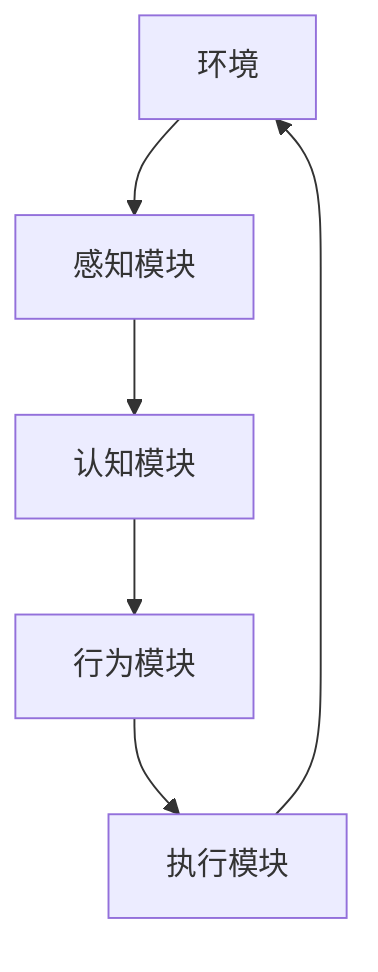

# AI Agent: AI的下一个风口 具身智能在硬件设计中的应用

## 1.背景介绍

### 1.1 人工智能发展简史

人工智能(Artificial Intelligence, AI)是当代科技发展的重要领域之一,自20世纪50年代诞生以来,已经经历了数次重大突破和发展浪潮。从早期的专家系统、机器学习,到近年来的深度学习、强化学习等,AI技术不断推陈出新,应用领域也日益广泛。

### 1.2 AI发展的新趋势:具身智能

尽管传统的AI系统取得了令人瞩目的成就,但它们大多局限于虚拟世界中处理抽象数据和符号运算。而现实世界是一个高度动态、多变和复杂的物理环境,传统AI系统难以高效地融入和驾驭这样的环境。这就催生了"具身智能"(Embodied AI)的新兴概念和研究方向。

具身智能旨在赋予AI系统物理实体,使其能够直接感知和操作现实世界,而不仅仅是处理虚拟数据。具身智能代理(Embodied AI Agent)就是这种新型AI系统的核心,它们被设计为拥有类似人类的感知和运动能力,能够灵活地完成现实世界中的各种任务。

### 1.3 具身智能与硬件设计的关系

要实现真正的具身智能,仅依赖软件是远远不够的,必须与硬件设备深度融合。具身智能代理需要各种传感器来感知环境,同时需要机器人机构来与环境进行物理交互。因此,硬件设计对于具身智能的发展至关重要。

本文将重点探讨具身智能在硬件设计中的应用,包括感知硬件(如视觉、听觉等传感器)和机器人硬件(如机械臂、移动平台等)的创新设计,以及这些硬件如何与AI软件系统相融合,从而构建出高度智能化的具身代理。

## 2.核心概念与联系  

### 2.1 具身认知

具身认知(Embodied Cognition)理论认为,智能不仅是大脑中抽象计算的结果,更重要的是源于有身体的主体与环境的互动。具身智能代理正是基于这一理念,通过物理实体与环境进行实际交互,而不是简单地操纵符号。

### 2.2 感知-运动循环

感知-运动循环(Perception-Action Cycle)描述了具身智能代理与环境互动的核心过程:代理首先通过传感器感知环境信息,然后基于感知结果计算出行为策略,再通过执行器(如机械臂)对环境产生影响,环境的变化又被传感器感知,如此循环往复。这种闭环互动是具身智能的关键特征。



### 2.3 机器人操作系统ROS

机器人操作系统(Robot Operating System, ROS)是实现具身智能系统的重要基础软件平台。ROS提供了标准的通信机制、硬件抽象层、开发工具等,使得感知、决策、控制等模块能够高效集成,并与各种硬件设备无缝连接。

### 2.4 模块化设计

具身智能系统通常采用模块化设计,将不同的功能分割到独立的模块中,如视觉模块、语音模块、规划模块、控制模块等。这些模块相互协作,形成一个复杂的软硬件集成系统。模块化设计有利于系统的可扩展性和可维护性。

## 3.核心算法原理具体操作步骤

### 3.1 视觉感知算法

视觉是具身智能代理最关键的感知能力之一。主流的视觉算法包括:

1. **目标检测**:使用深度学习模型(如YOLO,Faster R-CNN等)在图像或视频中识别出感兴趣的目标物体及其位置。

2. **语义分割**:将图像像素级别上的分割成不同的语义对象,常用的方法是基于全卷积网络(FCN)。

3. **视觉测距**:通过双目视觉或RGB-D相机获取环境的深度信息,用于构建3D环境模型。

4. **视觉里程计**:利用图像序列估计相机运动轨迹,在机器人导航和建图中有重要应用。

5. **视觉伺服**:将视觉反馈与机器人控制闭环相结合,精确地控制机器人执行操作。

### 3.2 语音交互算法

语音交互能力可以使具身智能代理更自然地与人类进行交互。常用的语音算法有:

1. **语音识别**:将语音信号转录为文本,主流方法是基于深度神经网络的端到端模型。

2. **语义理解**:从自然语言文本中提取语义信息,通常使用序列到序列模型。

3. **对话管理**:根据上下文状态生成合理的对话响应,需要对话策略模型。

4. **语音合成**:将文本转换为自然语音,基于深度生成模型和声学建模。

### 3.3 决策规划算法

具身智能代理需要根据感知信息做出合理的决策和行为规划,主要算法包括:

1. **强化学习**:通过与环境的交互,学习获取最大化预期回报的最优策略,常用的方法有Q-Learning、策略梯度等。

2. **路径规划**:为机器人设计出安全、高效的运动路径,算法如A*、RRT*等。

3. **任务规划**:将复杂任务分解为一系列子任务,并合理安排执行顺序,可采用自动规划技术。

4. **约束优化**:在满足各种约束条件下寻找最优解,常用的方法有线性规划、非线性规划等。

### 3.4 控制与执行算法

为了精准地控制机器人硬件执行运动,需要以下核心算法:

1. **运动控制**:根据规划的轨迹,生成控制机构(如电机)的控制指令,常用PID、反步阻尼等控制器。

2. **力控制**:在接触环境时,通过测量作用力,实现对机器人末端执行器的力/力矩控制。

3. **视觉伺服**:利用视觉反馈,对机器人运动进行闭环控制,确保精确定位或跟踪。

4. **阻抗控制**:在机器人与环境接触时,通过调节阻抗特性,实现安全、顺畅的交互。

## 4.数学模型和公式详细讲解举例说明

### 4.1 机器人运动学模型

描述机器人各关节的运动学约束关系是控制的基础。给定关节角度$\boldsymbol{q}$,机器人末端执行器在笛卡尔空间的位置和姿态可表示为:

$$
\begin{bmatrix}
\boldsymbol{p} \\
\boldsymbol{R}
\end{bmatrix} = \begin{bmatrix}
f_p(\boldsymbol{q}) \\
f_R(\boldsymbol{q})
\end{bmatrix}
$$

其中$\boldsymbol{p}$是位置向量,$\boldsymbol{R}$是旋转矩阵。机器人的运动学方程反映了关节空间与笛卡尔空间之间的映射关系。

对于冗余机器人,可以通过优化的方式解析冗余度,例如使用叉乘性能指标:

$$
\min \left\|\boldsymbol{J}(\boldsymbol{q})\dot{\boldsymbol{q}} - \dot{\boldsymbol{x}}_d\right\|^2 + \lambda\left\|\boldsymbol{N}(\boldsymbol{q})\dot{\boldsymbol{q}}\right\|^2
$$

其中$\boldsymbol{J}$是雅可比矩阵,$\boldsymbol{N}$是零空间投影矩阵,$\dot{\boldsymbol{x}}_d$是期望的末端运动速度,$\lambda$是权重系数。

### 4.2 视觉测距模型

双目视觉是获取三维深度信息的有效方式。对于已知相机内外参数的情况,可以通过视差(Disparity)估计深度值:

$$
Z = \frac{bf}{d}
$$

其中$Z$是深度值(相机到点的距离),$b$是双目基线长度,$f$是相机焦距,$d$是视差值(两幅图像上对应点的水平位移)。

对于未知内外参数的情况,可以通过结构光编码等主动测距方式获取深度信息。

### 4.3 强化学习模型

强化学习的目标是学习一个策略$\pi$,使得预期回报$J(\pi)$最大化:

$$
J(\pi) = \mathbb{E}_{\tau \sim \pi}\left[\sum_{t=0}^{T} \gamma^t r(s_t, a_t)\right]
$$

其中$\tau = (s_0, a_0, s_1, a_1, \dots)$是状态-动作序列的轨迹,$\gamma \in [0, 1]$是折现因子,$r(s_t, a_t)$是在状态$s_t$执行动作$a_t$获得的即时回报。

策略梯度算法通过梯度上升的方式优化策略参数$\theta$:

$$
\nabla_\theta J(\theta) = \mathbb{E}_{\tau \sim \pi_\theta}\left[\sum_{t=0}^{T} \nabla_\theta \log \pi_\theta(a_t|s_t)Q^{\pi_\theta}(s_t, a_t)\right]
$$

其中$Q^{\pi_\theta}(s_t, a_t)$是在状态$s_t$执行动作$a_t$后的期望回报。

## 5.项目实践:代码实例和详细解释说明

以下是一个基于ROS和Python的具身智能代理示例,实现了视觉导航和机械臂抓取的功能:

```python
# 导入必要的ROS包
import rospy
from sensor_msgs.msg import Image
from geometry_msgs.msg import Twist, Pose
from cv_bridge import CvBridge
import cv2

# 初始化ROS节点
rospy.init_node('embodied_agent')

# 创建发布者和订阅者
cmd_vel_pub = rospy.Publisher('/cmd_vel', Twist, queue_size=10)
arm_pose_pub = rospy.Publisher('/arm_pose', Pose, queue_size=10)
image_sub = rospy.Subscriber('/camera/rgb/image_raw', Image, image_callback)

# 设置OpenCV桥接器
bridge = CvBridge()

# 导航控制函数
def navigate(linear_x, angular_z):
    twist = Twist()
    twist.linear.x = linear_x
    twist.angular.z = angular_z
    cmd_vel_pub.publish(twist)

# 机械臂控制函数
def move_arm(x, y, z):
    pose = Pose()
    pose.position.x = x
    pose.position.y = y
    pose.position.z = z
    arm_pose_pub.publish(pose)

# 图像处理回调函数
def image_callback(msg):
    # 获取图像数据
    cv_image = bridge.imgmsg_to_cv2(msg, desired_encoding='bgr8')
    
    # 进行视觉处理(如目标检测、语义分割等)
    # ...
    
    # 根据视觉结果做出决策和控制
    if target_detected:
        navigate(0.2, 0.0)  # 前进
    else:
        navigate(0.0, 0.5)  # 原地旋转
        
    if target_in_range:
        move_arm(target_x, target_y, target_z)  # 控制机械臂抓取
        
# 主循环
rate = rospy.Rate(10)  # 10Hz
while not rospy.is_shutdown():
    rate.sleep()
```

上述代码实现了以下功能:

1. 初始化ROS节点,创建发布者和订阅者。
2. 定义导航控制函数`navigate()`和机械臂控制函数`move_arm()`。
3. 在`image_callback()`函数中,获取来自相机的图像数据,并进行视觉处理(如目标检测、语义分割等)。
4. 根据视觉处理结果,做出相应的决策和控制,如导航机器人前进或旋转,控制机械臂进行抓取操作。

需要注意的是,上述代码只是一个简单示例,实际的具身智能系统会更加复杂,需要集成多种感知、决策和控制模块,并针对特定应用场景进行优化和扩展。

## 6.实际应用场景

具身智能代理在诸多领域都有广阔的应用前景,下面列举了几个典型场景:

### 6.1 智