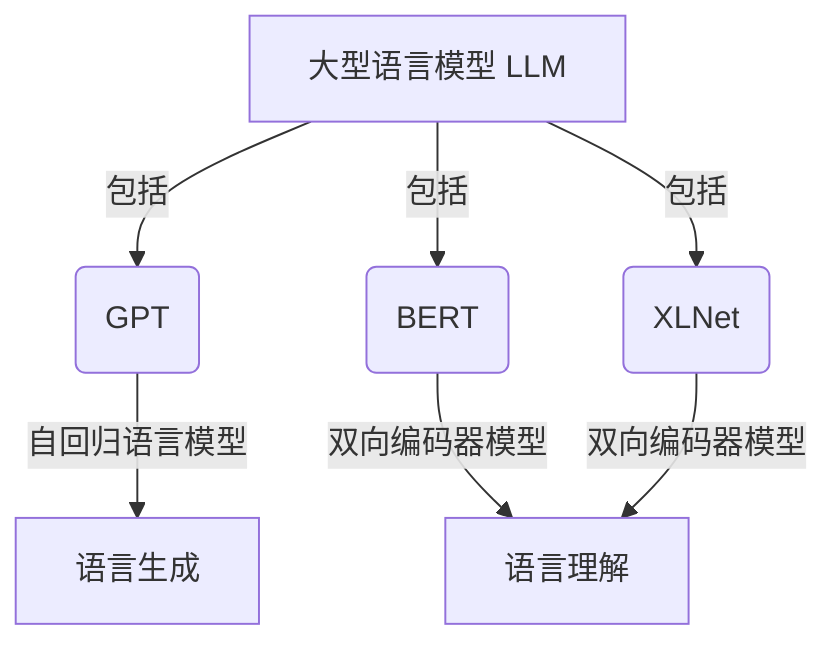
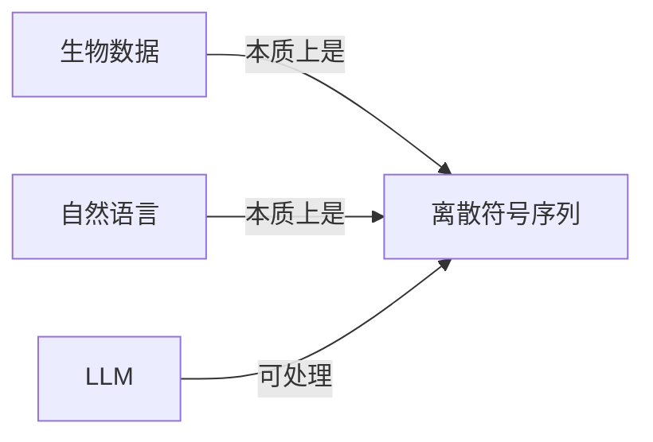

# AI LLM在遗传学研究中的新方法

## 1.背景介绍

### 1.1 遗传学研究的重要性

遗传学是一门研究生物遗传规律和遗传机制的科学,是现代生命科学的基础。它不仅对揭示生命本质、探索生命起源和演化规律具有重要意义,而且在医学、农业、畜牧业、环境保护等诸多领域都有着广泛的应用前景。

随着高通量测序技术的不断发展,生物数据的积累速度呈现出爆炸式增长,给遗传学研究带来了前所未有的机遇和挑战。传统的数据分析方法已经难以满足现有需求,迫切需要新的高效、智能的分析工具。

### 1.2 人工智能在遗传学中的应用

人工智能(AI)技术在近年来得到了长足发展,尤其是深度学习等机器学习算法在计算机视觉、自然语言处理等领域取得了卓越成就。AI技术在生物信息学领域也展现出了巨大的潜力,可以辅助科学家加快数据分析的步伐、发现隐藏的生物学规律。

其中,大型语言模型(Large Language Model,LLM)作为AI的一个重要分支,凭借其强大的自然语言理解和生成能力,为遗传学研究开辟了新的可能性。

## 2.核心概念与联系  

### 2.1 大型语言模型(LLM)

大型语言模型指的是使用大量文本语料训练而成的深度神经网络模型,能够理解和生成人类语言。这些模型通过自监督学习,捕捉语言的语义和语法规则,从而获得强大的语言理解和生成能力。

典型的LLM包括GPT(Generative Pre-trained Transformer)、BERT(Bidirectional Encoder Representations from Transformers)、XLNet等,其中GPT是一种自回归语言模型,BERT则是一种双向编码器模型。这些模型已在自然语言处理任务中取得了卓越的成绩。



### 2.2 生物数据与自然语言的联系

生物数据(如DNA序列、蛋白质序列等)本质上是由一个个离散符号构成的序列,与自然语言存在内在的相似性。例如,DNA序列是由A、T、C、G四种核苷酸构成的序列;而自然语言是由单词构成的序列。

因此,LLM可以被用于处理生物数据,将其视为"生物序列语言",并利用其强大的语言建模能力来挖掘数据中蕴含的生物学知识。这种新颖的思路为遗传学研究提供了新的分析工具和方法。



### 2.3 LLM在遗传学中的应用场景

LLM在遗传学研究中可以发挥重要作用,主要应用场景包括:

1. 序列注释: 利用LLM对DNA、RNA、蛋白质等生物序列进行注释和功能预测。
2. 变异检测: 基于LLM对基因组序列进行变异检测和致病性预测。
3. 蛋白质结构预测: 利用LLM预测蛋白质的二级和三级结构。
4. 文献挖掘: 使用LLM从大量生物医学文献中提取有价值的信息和知识。
5. 问答系统: 构建基于LLM的生物医学问答系统,为研究人员提供智能辅助。

## 3.核心算法原理具体操作步骤

### 3.1 LLM在生物数据处理中的应用原理

将生物序列数据(如DNA、RNA、蛋白质序列)视为一种"生物序列语言",将LLM应用于其中,主要包括以下几个步骤:

1. 序列标记化(Tokenization): 将生物序列按照一定规则切分成一个个标记(token),类似于将自然语言切分成单词。
2. 序列嵌入(Embedding): 将标记映射到连续的向量空间,得到序列的向量表示。
3. 语言模型编码(Encoding): 使用预训练的LLM对嵌入后的序列进行编码,捕捉序列中的模式和上下文信息。
4. 下游任务微调(Fine-tuning): 在特定的下游任务上(如序列注释、变异检测等)对LLM进行进一步的微调,使其适应该任务。
5. 预测和输出: 使用微调后的LLM对新的生物序列进行预测,并输出结果。


### 3.2 LLM在序列注释中的应用

序列注释是指对生物序列(如基因、蛋白质等)进行功能和结构的标注,是遗传学研究的基础工作之一。使用LLM进行序列注释的具体步骤如下:

1. 数据准备: 收集已经注释好的序列数据作为训练集。
2. 序列标记化和嵌入: 对序列进行标记化和嵌入,得到向量表示。
3. 语言模型编码: 使用预训练的LLM(如BERT)对嵌入后的序列进行编码。
4. 注释任务微调: 在序列注释任务上对LLM进行微调,使用监督学习的方式训练模型。
5. 预测和输出: 对新的序列输入微调后的LLM,输出预测的注释结果。

在注释任务中,LLM不仅可以利用序列本身的信息,还可以融合其他辅助信息(如序列的物理化学性质、进化信息等),进一步提高注释的准确性。

### 3.3 LLM在变异检测中的应用

基因变异是导致遗传疾病的主要原因之一,及时准确地检测基因变异对于疾病诊断和治疗至关重要。使用LLM进行变异检测的步骤如下:

1. 数据准备: 收集已知的携带变异的序列数据作为训练集。
2. 序列标记化和嵌入: 对序列进行标记化和嵌入,得到向量表示。
3. 语言模型编码: 使用预训练的LLM对嵌入后的序列进行编码。
4. 变异检测任务微调: 在变异检测任务上对LLM进行微调,使用监督学习的方式训练模型。
5. 预测和输出: 对新的序列输入微调后的LLM,输出预测的变异位置和类型。

在变异检测任务中,LLM不仅可以利用序列本身的信息,还可以融合其他辅助信息(如进化保守性、结构信息等),提高变异检测的准确性和可解释性。

## 4.数学模型和公式详细讲解举例说明

### 4.1 LLM中的自注意力机制(Self-Attention)

自注意力机制是Transformer等LLM模型的核心组件之一,它能够捕捉序列中任意两个位置之间的依赖关系,是LLM获得强大语言建模能力的关键。

给定一个长度为 $n$ 的序列 $\boldsymbol{x} = (x_1, x_2, \ldots, x_n)$,其中 $x_i \in \mathbb{R}^{d_x}$ 表示第 $i$ 个位置的向量表示。自注意力机制首先计算序列中每两个位置之间的相似性分数:

$$
\operatorname{Attention}(Q, K, V) = \operatorname{softmax}\left(\frac{QK^T}{\sqrt{d_k}}\right)V
$$

其中 $Q$、$K$、$V$ 分别表示查询(Query)、键(Key)和值(Value)向量,通过线性变换得到:

$$
\begin{aligned}
Q &= X W_Q \\
K &= X W_K \\
V &= X W_V
\end{aligned}
$$

$W_Q$、$W_K$、$W_V$ 是可学习的权重矩阵。相似性分数通过 softmax 函数归一化后,与值向量 $V$ 相乘,得到每个位置的注意力表示。

自注意力机制能够自适应地捕捉序列中任意两个位置之间的依赖关系,是LLM获得强大语言建模能力的关键。在处理生物序列数据时,自注意力机制可以捕捉序列中的重要模式和结构信息,为下游任务提供有价值的特征表示。

### 4.2 LLM中的掩码语言模型(Masked Language Model)

掩码语言模型是BERT等双向编码器LLM的预训练目标之一,它通过随机掩码序列中的某些位置,然后预测这些被掩码位置的标记,从而学习序列的双向上下文信息。

给定一个长度为 $n$ 的序列 $\boldsymbol{x} = (x_1, x_2, \ldots, x_n)$,我们随机选择其中的 $k$ 个位置进行掩码,得到掩码后的序列 $\boldsymbol{x}^{mask}$。对于每个被掩码的位置 $x_i^{mask}$,模型需要预测其原始标记 $x_i$,即最大化如下条件概率:

$$
\log P(x_i | \boldsymbol{x}^{mask}) = \log \operatorname{softmax}(W_e h_i + b_e)
$$

其中 $h_i$ 是该位置的隐藏状态向量(通过自注意力机制等计算得到), $W_e$ 和 $b_e$ 分别是可学习的权重矩阵和偏置向量。

掩码语言模型的预训练过程能够让LLM充分利用序列的双向上下文信息,学习到更加丰富和准确的语言表示,为下游任务奠定良好的基础。在处理生物序列数据时,掩码语言模型可以捕捉序列中的保守区域、结构域等重要信息,提高模型的预测能力。

## 5.项目实践:代码实例和详细解释说明

在本节中,我们将使用PyTorch实现一个简单的LLM模型,并将其应用于DNA序列的分类任务。虽然这个例子相对简单,但它展示了如何将LLM应用于生物序列数据处理的基本流程。

### 5.1 数据准备

我们使用一个小型的DNA序列数据集,包含两类序列(正例和负例)。每条序列长度为100,由A、T、C、G四种核苷酸构成。

```python
import torch
from torch.utils.data import Dataset

DNA_VOCAB = {'A': 0, 'T': 1, 'C': 2, 'G': 3}

class DNADataset(Dataset):
    def __init__(self, sequences, labels):
        self.sequences = sequences
        self.labels = labels

    def __len__(self):
        return len(self.sequences)

    def __getitem__(self, idx):
        seq = self.sequences[idx]
        label = self.labels[idx]
        seq_tensor = torch.tensor([DNA_VOCAB[c] for c in seq], dtype=torch.long)
        return seq_tensor, label
```

### 5.2 LLM模型实现

我们实现一个简单的基于Transformer的LLM模型,包括嵌入层、编码器层和分类头。

```python
import torch.nn as nn

class LLMModel(nn.Module):
    def __init__(self, vocab_size, embed_dim, num_heads, num_layers, output_dim):
        super(LLMModel, self).__init__()
        self.embedding = nn.Embedding(vocab_size, embed_dim)
        encoder_layer = nn.TransformerEncoderLayer(embed_dim, num_heads, dim_feedforward=2048, dropout=0.1)
        self.encoder = nn.TransformerEncoder(encoder_layer, num_layers)
        self.classifier = nn.Linear(embed_dim, output_dim)

    def forward(self, input_seq):
        embedded = self.embedding(input_seq)
        encoded = self.encoder(embedded)
        pooled = encoded.mean(dim=1)
        logits = self.classifier(pooled)
        return logits
```

### 5.3 模型训练

我们定义训练循环,使用交叉熵损失函数和Adam优化器进行模