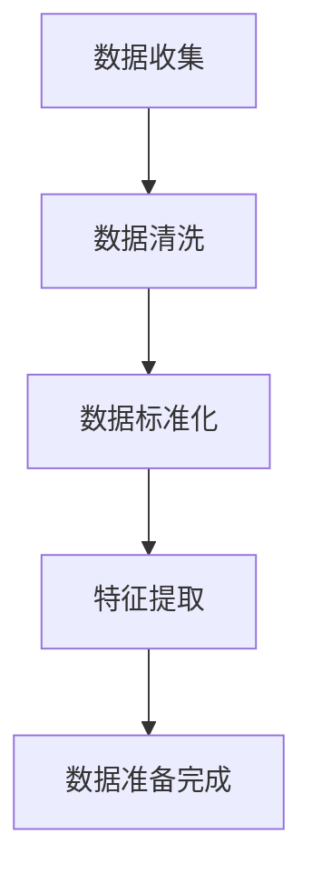
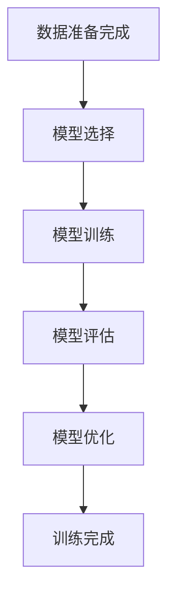
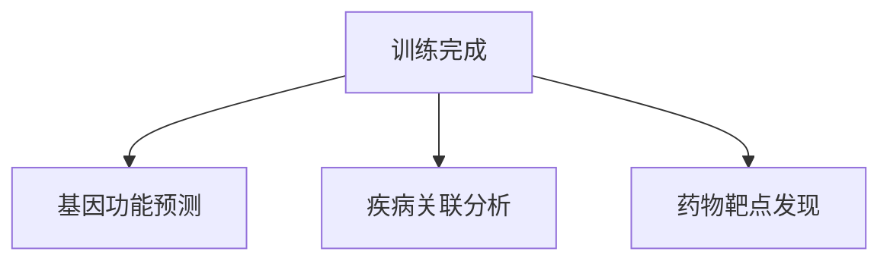

# AI LLM在遗传学研究中的新方法

## 1.背景介绍

### 1.1 遗传学研究的现状

遗传学研究是生物学中一个重要的分支，主要研究基因、遗传物质的结构、功能及其传递规律。随着高通量测序技术的发展，遗传学研究进入了一个数据爆炸的时代。大量的基因组数据、转录组数据和表观基因组数据为科学家提供了丰富的研究素材，但也带来了数据处理和分析的巨大挑战。

### 1.2 人工智能在遗传学中的应用

人工智能（AI）技术，特别是深度学习和大规模语言模型（LLM），在处理和分析大规模生物数据方面展现出了巨大的潜力。AI技术可以帮助科学家从海量数据中提取有价值的信息，发现新的生物学规律，甚至预测疾病的发生和发展。

### 1.3 本文的目的

本文旨在探讨AI LLM在遗传学研究中的新方法，介绍核心概念、算法原理、数学模型、项目实践、实际应用场景、工具和资源，并展望未来的发展趋势与挑战。

## 2.核心概念与联系

### 2.1 大规模语言模型（LLM）

大规模语言模型（LLM）是基于深度学习的自然语言处理模型，能够理解和生成自然语言文本。典型的LLM包括GPT-3、BERT等，这些模型通过在大规模文本数据上进行训练，能够捕捉语言中的复杂模式和结构。

### 2.2 遗传学数据

遗传学数据包括基因组数据、转录组数据、表观基因组数据等。这些数据通常具有高维度、复杂性和异质性，传统的分析方法难以处理和解释。

### 2.3 AI LLM与遗传学的结合

AI LLM可以用于处理和分析遗传学数据，通过自然语言处理技术，能够从文献、数据库和实验数据中提取有价值的信息，辅助科学家进行遗传学研究。

## 3.核心算法原理具体操作步骤

### 3.1 数据预处理

数据预处理是AI LLM应用于遗传学研究的第一步。包括数据清洗、标准化、特征提取等步骤。



### 3.2 模型训练

模型训练是AI LLM应用的核心步骤。通过在大规模遗传学数据上进行训练，模型能够学习到数据中的模式和规律。



### 3.3 模型应用

训练完成的模型可以应用于实际的遗传学研究中，包括基因功能预测、疾病关联分析等。



## 4.数学模型和公式详细讲解举例说明

### 4.1 神经网络模型

神经网络是AI LLM的基础模型。一个简单的神经网络可以表示为：

$$
y = f(Wx + b)
$$

其中，$W$ 是权重矩阵，$x$ 是输入向量，$b$ 是偏置向量，$f$ 是激活函数。

### 4.2 损失函数

损失函数用于衡量模型预测与实际值之间的差距。常用的损失函数包括均方误差（MSE）和交叉熵损失。

$$
\text{MSE} = \frac{1}{n} \sum_{i=1}^{n} (y_i - \hat{y}_i)^2
$$

$$
\text{交叉熵损失} = -\sum_{i=1}^{n} y_i \log(\hat{y}_i)
$$

### 4.3 优化算法

优化算法用于调整模型的参数，使损失函数最小化。常用的优化算法包括梯度下降和Adam优化器。

$$
\theta = \theta - \eta \nabla_\theta J(\theta)
$$

其中，$\theta$ 是模型参数，$\eta$ 是学习率，$J(\theta)$ 是损失函数。

## 5.项目实践：代码实例和详细解释说明

### 5.1 数据预处理代码示例

```python
import pandas as pd
from sklearn.preprocessing import StandardScaler

# 读取数据
data = pd.read_csv('genetic_data.csv')

# 数据清洗
data = data.dropna()

# 数据标准化
scaler = StandardScaler()
data_scaled = scaler.fit_transform(data)

# 特征提取
features = data_scaled[:, :-1]
labels = data_scaled[:, -1]
```

### 5.2 模型训练代码示例

```python
import tensorflow as tf
from tensorflow.keras.models import Sequential
from tensorflow.keras.layers import Dense

# 构建模型
model = Sequential([
    Dense(64, activation='relu', input_shape=(features.shape[1],)),
    Dense(32, activation='relu'),
    Dense(1, activation='sigmoid')
])

# 编译模型
model.compile(optimizer='adam', loss='binary_crossentropy', metrics=['accuracy'])

# 训练模型
model.fit(features, labels, epochs=10, batch_size=32)
```

### 5.3 模型应用代码示例

```python
# 预测基因功能
predictions = model.predict(new_data)

# 结果分析
for i, pred in enumerate(predictions):
    print(f'样本 {i} 的预测结果: {pred}')
```

## 6.实际应用场景

### 6.1 基因功能预测

AI LLM可以用于预测基因的功能，通过分析基因序列和表达数据，发现基因的生物学功能。

### 6.2 疾病关联分析

AI LLM可以用于分析基因与疾病之间的关联，帮助科学家发现潜在的疾病基因和生物标志物。

### 6.3 药物靶点发现

AI LLM可以用于发现新的药物靶点，通过分析基因与蛋白质的相互作用，找到潜在的药物靶点。

## 7.工具和资源推荐

### 7.1 工具推荐

- **TensorFlow**：一个开源的深度学习框架，适用于构建和训练神经网络模型。
- **PyTorch**：另一个流行的深度学习框架，具有灵活性和易用性。
- **scikit-learn**：一个用于数据预处理和机器学习的Python库。

### 7.2 资源推荐

- **Kaggle**：一个数据科学竞赛平台，提供大量的公开数据集和竞赛。
- **NCBI**：美国国家生物技术信息中心，提供丰富的生物学数据和文献资源。
- **Bioinformatics.org**：一个生物信息学资源网站，提供工具、教程和社区支持。

## 8.总结：未来发展趋势与挑战

### 8.1 未来发展趋势

- **多模态数据融合**：未来的研究将更多地关注多模态数据的融合，包括基因组数据、转录组数据、表观基因组数据等。
- **个性化医疗**：AI LLM将推动个性化医疗的发展，通过分析个体的基因数据，提供个性化的治疗方案。
- **自动化研究**：AI LLM将进一步推动遗传学研究的自动化，减少人工干预，提高研究效率。

### 8.2 挑战

- **数据隐私和伦理问题**：遗传学数据涉及个人隐私，如何保护数据隐私和伦理问题是一个重要的挑战。
- **模型解释性**：AI LLM模型的黑箱性质使得结果的解释性较差，如何提高模型的解释性是一个重要的研究方向。
- **计算资源需求**：AI LLM的训练和应用需要大量的计算资源，如何优化计算资源的使用是一个重要的挑战。

## 9.附录：常见问题与解答

### 9.1 AI LLM在遗传学研究中的优势是什么？

AI LLM在遗传学研究中的优势包括处理大规模数据的能力、从数据中提取复杂模式的能力以及自动化分析的能力。

### 9.2 如何选择合适的AI LLM模型？

选择合适的AI LLM模型需要考虑数据的特点、研究的目标以及计算资源的限制。常用的模型包括GPT-3、BERT等。

### 9.3 如何处理遗传学数据的高维度和复杂性？

处理遗传学数据的高维度和复杂性可以通过数据预处理、特征提取和降维技术来实现。例如，使用PCA（主成分分析）进行降维。

### 9.4 AI LLM在遗传学研究中的应用前景如何？

AI LLM在遗传学研究中的应用前景非常广阔，未来将进一步推动基因功能预测、疾病关联分析和药物靶点发现等领域的发展。

---

作者：禅与计算机程序设计艺术 / Zen and the Art of Computer Programming