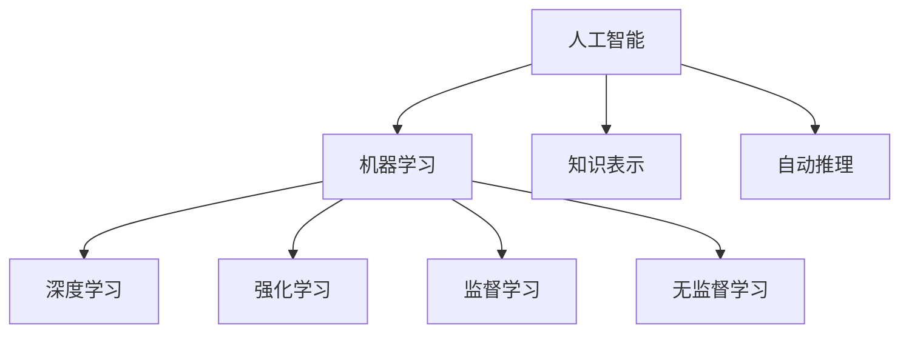

# AI 原理与代码实例讲解

## 1.背景介绍
### 1.1 人工智能的发展历程
#### 1.1.1 人工智能的起源与发展
#### 1.1.2 人工智能的三次浪潮
#### 1.1.3 人工智能的现状与未来

### 1.2 人工智能的应用领域
#### 1.2.1 自然语言处理
#### 1.2.2 计算机视觉
#### 1.2.3 智能机器人
#### 1.2.4 专家系统

## 2.核心概念与联系
### 2.1 机器学习
#### 2.1.1 监督学习
#### 2.1.2 无监督学习  
#### 2.1.3 强化学习

### 2.2 深度学习
#### 2.2.1 神经网络
#### 2.2.2 卷积神经网络(CNN)
#### 2.2.3 循环神经网络(RNN)

### 2.3 人工智能与机器学习、深度学习的关系



## 3.核心算法原理具体操作步骤
### 3.1 神经网络
#### 3.1.1 感知机
##### 3.1.1.1 感知机模型
##### 3.1.1.2 感知机学习算法
##### 3.1.1.3 感知机的局限性

#### 3.1.2 多层前馈神经网络 
##### 3.1.2.1 网络结构
##### 3.1.2.2 前向传播
##### 3.1.2.3 反向传播算法

### 3.2 卷积神经网络(CNN)
#### 3.2.1 卷积层
#### 3.2.2 池化层  
#### 3.2.3 全连接层
#### 3.2.4 经典CNN网络架构

### 3.3 循环神经网络(RNN)
#### 3.3.1 RNN基本结构
#### 3.3.2 LSTM网络
#### 3.3.3 GRU网络

## 4.数学模型和公式详细讲解举例说明
### 4.1 线性回归
#### 4.1.1 一元线性回归模型
假设有数据集 $D=\{(x_1,y_1),(x_2,y_2),...,(x_n,y_n)\}, x_i \in \mathbb{R}$。线性回归试图学得一个线性模型以尽可能准确地预测实值输出标记。其模型形式为：
$$f(x)=wx+b$$
其中，$w$ 和 $b$ 是模型参数，分别称为权重和偏置。通过最小化损失函数来估计模型参数：
$$\mathcal{L}(w,b)=\sum_{i=1}^{n}(f(x_i)-y_i)^2$$

#### 4.1.2 多元线性回归模型
对于多元线性回归，数据集 $D=\{(\boldsymbol{x}_1,y_1),(\boldsymbol{x}_2,y_2),...,(\boldsymbol{x}_n,y_n)\}, \boldsymbol{x}_i \in \mathbb{R}^p, y_i \in \mathbb{R}$。多元线性回归模型为：
$$f(\boldsymbol{x}_i)=\boldsymbol{w}^T\boldsymbol{x}_i+b$$
其中，$\boldsymbol{w}=(w_1;w_2;...;w_p)$。同样通过最小化损失函数来估计模型参数。

### 4.2 逻辑回归
对于二分类问题，可以使用逻辑回归模型。设 $P(Y=1|x)=\pi(x)$，则
$$\ln\frac{\pi(x)}{1-\pi(x)}=\boldsymbol{w}^T\boldsymbol{x}+b$$
等价于
$$\pi(x)=\frac{\exp(\boldsymbol{w}^T\boldsymbol{x}+b)}{1+\exp(\boldsymbol{w}^T\boldsymbol{x}+b)}$$
这就是逻辑回归模型。通过极大似然估计来估计模型参数。

### 4.3 支持向量机
支持向量机(SVM)是一种二分类模型，它的基本模型是定义在特征空间上的间隔最大的线性分类器。对于线性可分数据集，SVM学习的目标是找到几何间隔最大的分离超平面：
$$\begin{aligned}
\max_{\boldsymbol{w},b} & \quad \frac{2}{||\boldsymbol{w}||} \\
s.t. & \quad y_i(\boldsymbol{w}^T\boldsymbol{x}_i+b) \geq 1, \quad i=1,2,...,n
\end{aligned}$$

对于线性不可分数据集，通过核技巧将样本从原始空间映射到高维特征空间，使得样本在这个特征空间内线性可分。

## 5.项目实践：代码实例和详细解释说明
### 5.1 使用TensorFlow实现线性回归
```python
import tensorflow as tf
import numpy as np

# 生成数据集
x_data = np.random.rand(100).astype(np.float32)
y_data = 0.1 * x_data + 0.3

# 构建线性回归模型
W = tf.Variable(tf.random_uniform([1], -1.0, 1.0))
b = tf.Variable(tf.zeros([1]))
y = W * x_data + b

# 定义损失函数
loss = tf.reduce_mean(tf.square(y - y_data))

# 使用梯度下降法优化参数
optimizer = tf.train.GradientDescentOptimizer(0.5)
train = optimizer.minimize(loss)

# 初始化变量
init = tf.global_variables_initializer()

# 启动图
sess = tf.Session()
sess.run(init)

# 拟合平面
for step in range(201):
    sess.run(train)
    if step % 20 == 0:
        print(step, sess.run(W), sess.run(b))
```
上述代码首先生成数据集，然后构建线性回归模型。通过最小化均方误差损失函数来优化模型参数，使用梯度下降法进行优化。最后迭代训练得到最优参数。

### 5.2 使用PyTorch实现逻辑回归
```python
import torch
import torch.nn as nn
import torchvision
import torchvision.transforms as transforms

# 定义超参数 
input_size = 784
num_classes = 10
num_epochs = 5
batch_size = 100
learning_rate = 0.001

# 加载MNIST数据集
train_dataset = torchvision.datasets.MNIST(root='../../data', 
                                           train=True, 
                                           transform=transforms.ToTensor(),  
                                           download=True)

test_dataset = torchvision.datasets.MNIST(root='../../data', 
                                          train=False, 
                                          transform=transforms.ToTensor())

# 数据加载器
train_loader = torch.utils.data.DataLoader(dataset=train_dataset, 
                                           batch_size=batch_size, 
                                           shuffle=True)

test_loader = torch.utils.data.DataLoader(dataset=test_dataset, 
                                          batch_size=batch_size, 
                                          shuffle=False)

# 逻辑回归模型
model = nn.Linear(input_size, num_classes)

# 损失函数和优化器
criterion = nn.CrossEntropyLoss()  
optimizer = torch.optim.SGD(model.parameters(), lr=learning_rate)  

# 训练模型
total_step = len(train_loader)
for epoch in range(num_epochs):
    for i, (images, labels) in enumerate(train_loader):
        # 将图像重塑为行向量
        images = images.reshape(-1, 28*28)
        
        # 前向传播
        outputs = model(images)
        loss = criterion(outputs, labels)
        
        # 反向传播和优化
        optimizer.zero_grad()
        loss.backward()
        optimizer.step()
        
        if (i+1) % 100 == 0:
            print ('Epoch [{}/{}], Step [{}/{}], Loss: {:.4f}' 
                   .format(epoch+1, num_epochs, i+1, total_step, loss.item()))

# 测试模型
with torch.no_grad():
    correct = 0
    total = 0
    for images, labels in test_loader:
        images = images.reshape(-1, 28*28)
        outputs = model(images)
        _, predicted = torch.max(outputs.data, 1)
        total += labels.size(0)
        correct += (predicted == labels).sum()

    print('Accuracy of the model on the 10000 test images: {} %'.format(100 * correct / total))
```

上述代码使用PyTorch实现了一个简单的逻辑回归模型用于MNIST手写数字识别。首先加载MNIST数据集，然后定义逻辑回归模型、损失函数和优化器。在训练阶段，将图像重塑为行向量，然后进行前向传播、计算损失、反向传播和参数更新。最后在测试集上评估模型性能。

## 6.实际应用场景
### 6.1 计算机视觉
- 图像分类：使用CNN对图像进行分类，如识别手写数字、人脸识别等。
- 目标检测：检测图像中的目标及其位置，如行人检测、车辆检测等。
- 图像分割：将图像分割为不同的区域或对象，如语义分割、实例分割等。

### 6.2 自然语言处理  
- 文本分类：将文本分类到预定义的类别中，如情感分析、垃圾邮件检测等。
- 命名实体识别：从文本中识别出人名、地名、组织机构名等命名实体。
- 机器翻译：将一种语言的文本翻译成另一种语言，如谷歌翻译。
- 问答系统：根据用户提出的问题给出相应的答案，如智能客服。

### 6.3 语音识别
- 语音转文字：将语音信号转换为相应的文本。
- 说话人识别：识别说话人的身份。
- 语音合成：将文本转换为语音信号。

### 6.4 推荐系统
- 电商推荐：根据用户的历史行为、偏好等推荐相关商品。
- 新闻推荐：根据用户的兴趣爱好推荐相关新闻。
- 音乐推荐：根据用户的听歌记录、喜好等推荐歌曲。

## 7.工具和资源推荐
### 7.1 深度学习框架
- TensorFlow：由Google开发的端到端开源机器学习平台。
- PyTorch：由Facebook开发的深度学习框架，强调动态计算图的概念。 
- Keras：高层神经网络API，可以作为TensorFlow、CNTK或Theano的高层封装。

### 7.2 数据集
- MNIST：手写数字数据集，包含60,000个训练样本和10,000个测试样本。
- CIFAR-10/CIFAR-100：包含60,000张32x32的彩色图像，分为10/100个类别。
- ImageNet：超过1400万幅图像的大型视觉数据库，涵盖2万多个类别。
- 20 Newsgroups：大约20,000篇新闻文本的集合，分为20个不同主题。

### 7.3 开源项目
- OpenCV：广泛使用的计算机视觉库，包含大量图像处理和机器视觉算法。
- scikit-learn：基于Python的机器学习库，提供了大量机器学习算法的实现。
- NLTK：自然语言处理工具包，提供了常用的自然语言处理任务支持。
- Transformers：自然语言处理领域的通用架构，如BERT、GPT等都是基于Transformer实现的。

## 8.总结：未来发展趋势与挑战
人工智能技术正在飞速发展，已经在很多领域取得了显著成果。未来人工智能将向更加通用化、大规模化、自主化的方向发展。同时，人工智能也面临着一些挑战：

- 可解释性：当前的深度学习模型大多是黑盒模型，缺乏可解释性，这限制了它们在某些领域的应用。如何设计可解释的机器学习模型是一个重要的研究方向。

- 数据和标注：深度学习的成功很大程度上得益于大规模标注数据集的支持。但是人工标注数据成本高昂，如何利用少量标注数据或无监督的方式来训练模型是一个挑战。

- 泛化和鲁棒性：目前的机器学习模型在应用于新场景时的泛化能力还比较差，对对抗样本、噪声等的鲁棒性也有待提高。

- 机器学习的安全性：机器学习系统面临着数据中毒、模型窃取等安全威胁，如何构建安全、可信的机器学习系统是一个新的挑战。

- 机器学习的伦理问题：如何避免机器学习系统产生偏见和歧视，如何保护用户隐