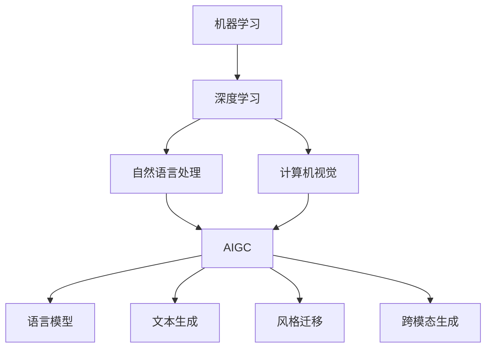

# AIGC 原理与代码实例讲解

## 1. 背景介绍

### 1.1 AIGC 的定义与发展历程
AIGC（AI-Generated Content），即人工智能生成内容，是指利用人工智能技术自动生成各种形式的内容，如文本、图像、音频、视频等。AIGC 的发展可以追溯到上世纪 50 年代，图灵提出了"机器能否思考"的问题。随着人工智能技术的不断进步，尤其是深度学习的兴起，AIGC 在近年来取得了长足的发展。

### 1.2 AIGC 的应用领域
AIGC 在许多领域都有广泛的应用，例如：

- 内容创作：自动生成新闻报道、小说、诗歌、剧本等
- 数字营销：生成产品描述、广告文案、社交媒体内容等  
- 游戏设计：生成游戏关卡、NPC 对话、任务描述等
- 艺术设计：生成音乐、绘画、设计稿等
- 教育培训：生成教材、试题、解析等

### 1.3 AIGC 的优势与挑战
AIGC 具有诸多优势，如提高内容生产效率、降低人力成本、实现个性化定制等。但同时也面临一些挑战，例如生成内容的质量把控、版权归属问题、伦理道德风险等。

## 2. 核心概念与联系

### 2.1 机器学习
机器学习是实现 AIGC 的基础，它让计算机系统能够从数据中自动学习和改进，而无需明确编程。常见的机器学习任务包括分类、回归、聚类、降维等。

### 2.2 深度学习
深度学习是机器学习的一个分支，它模仿人脑的神经网络结构，使用多层次的表示和抽象来学习数据中的特征。深度学习模型如 CNN、RNN、Transformer 等在 AIGC 中发挥着重要作用。

### 2.3 自然语言处理
自然语言处理（NLP）是人工智能的一个重要分支，旨在让计算机理解、生成和处理人类语言。NLP 技术如分词、词性标注、句法分析、语义理解等，是实现文本 AIGC 的基础。

### 2.4 计算机视觉
计算机视觉（CV）让计算机能够从图像和视频中提取信息，进行分类、检测、分割等任务。CV 技术如卷积神经网络（CNN）、生成对抗网络（GAN）等，是图像和视频 AIGC 的核心。

### 2.5 AIGC 的关键技术
除了上述基础概念，AIGC 还涉及一些关键技术，例如：

- 语言模型：用于建模文本序列概率分布的统计模型
- 文本生成：根据上下文或提示自动生成连贯的文本
- 风格迁移：将一种风格的特征迁移到另一种风格的内容上
- 跨模态生成：利用不同模态（如文本和图像）的信息进行生成

下图展示了这些核心概念之间的联系：



## 3. 核心算法原理具体操作步骤

### 3.1 Transformer 原理与步骤

Transformer 是一种基于自注意力机制的深度学习模型，广泛用于 NLP 和 AIGC 任务。其主要步骤如下：

1. 输入嵌入：将输入序列映射为连续向量表示。
2. 位置编码：为每个位置添加位置信息。
3. 自注意力层：通过计算 query、key、value 来提取序列内部的依赖关系。
4. 前馈神经网络：对自注意力层的输出进行非线性变换。
5. 残差连接和层归一化：促进梯度传播和模型收敛。
6. 解码器：根据编码器的输出和之前的生成结果，预测下一个词。

### 3.2 GAN 原理与步骤

GAN（生成对抗网络）通过让生成器和判别器相互博弈，从随机噪声中生成逼真的数据。其主要步骤为：

1. 随机采样噪声向量作为生成器的输入。
2. 生成器将噪声向量映射为目标数据的分布。
3. 判别器尝试区分生成数据和真实数据。
4. 通过反向传播更新生成器和判别器的参数。
5. 重复步骤 1-4，直到生成器能生成足够逼真的数据。

### 3.3 Diffusion Model 原理与步骤

Diffusion Model 通过迭代地添加和去除噪声，逐步优化生成结果。其主要步骤包括：

1. 前向过程：通过逐步添加高斯噪声，将数据分布转变为标准正态分布。
2. 反向过程：通过逐步去噪，将标准正态分布转变回原始数据分布。
3. 训练目标：最小化前向和反向过程的 KL 散度。
4. 采样生成：从标准正态分布采样，通过反向过程生成新数据。

## 4. 数学模型和公式详细讲解举例说明

### 4.1 Transformer 的数学模型

Transformer 的核心是自注意力机制，可以表示为：

$$
\text{Attention}(Q,K,V) = \text{softmax}(\frac{QK^T}{\sqrt{d_k}})V
$$

其中，$Q$、$K$、$V$ 分别是 query、key、value 矩阵，$d_k$ 是 key 向量的维度。这个公式的含义是：通过 query 和 key 的相似度来为 value 分配权重，从而提取序列内部的依赖关系。

例如，在机器翻译任务中，给定源语言句子 "I love AI"，Transformer 的编码器首先将其嵌入为矩阵 $X$。然后，通过自注意力机制计算 $Q=XW^Q$、$K=XW^K$、$V=XW^V$，其中 $W^Q$、$W^K$、$W^V$ 是可学习的参数矩阵。最后，将注意力输出传递给前馈神经网络和解码器，生成目标语言句子 "我爱人工智能"。

### 4.2 GAN 的数学模型

GAN 的目标函数可以表示为生成器 $G$ 和判别器 $D$ 之间的极小极大博弈：

$$
\min_G \max_D V(D,G) = \mathbb{E}_{x \sim p_{data}(x)}[\log D(x)] + \mathbb{E}_{z \sim p_z(z)}[\log (1-D(G(z)))]
$$

其中，$p_{data}$ 是真实数据分布，$p_z$ 是噪声分布。这个公式的含义是：判别器 $D$ 尝试最大化分辨真实数据和生成数据的概率，而生成器 $G$ 尝试最小化判别器的判别能力。

例如，在图像生成任务中，给定随机噪声 $z$，生成器 $G(z)$ 生成一张假图像。判别器 $D$ 接收真实图像 $x$ 和生成图像 $G(z)$，输出它们是真实的概率。通过不断训练，$G$ 可以生成越来越逼真的图像，而 $D$ 的判别能力也越来越强。

### 4.3 Diffusion Model 的数学模型

Diffusion Model 的前向过程可以表示为一系列的高斯噪声添加：

$$
q(x_t|x_{t-1}) = \mathcal{N}(x_t; \sqrt{1-\beta_t} x_{t-1}, \beta_t \mathbf{I})
$$

其中，$x_t$ 是时间步 $t$ 的噪声版本，$\beta_t$ 是噪声强度。反向过程可以表示为一系列的去噪：

$$
p_\theta(x_{t-1}|x_t) = \mathcal{N}(x_{t-1}; \mu_\theta(x_t, t), \sigma_\theta(x_t, t)^2\mathbf{I})
$$

其中，$\mu_\theta$ 和 $\sigma_\theta$ 是可学习的均值和方差函数。模型的训练目标是最小化前向和反向过程的 KL 散度：

$$
L_{diffusion} = \mathbb{E}_{x_0, \epsilon, t} \left[ \frac{1}{2\sigma_t^2} \Vert \epsilon - \epsilon_\theta(x_t, t) \Vert^2 \right]
$$

例如，在图像生成任务中，给定一张真实图像 $x_0$，通过前向过程逐步添加高斯噪声，得到一系列噪声版本 $x_1, \dots, x_T$。然后，通过反向过程逐步去噪，得到生成图像 $\hat{x}_0$。模型通过最小化重构误差来学习去噪过程，从而实现图像生成。

## 5. 项目实践：代码实例和详细解释说明

下面以 PyTorch 为例，展示如何实现一个简单的 Transformer 模型，并应用于文本生成任务。

### 5.1 Transformer 编码器实现

```python
import torch
import torch.nn as nn

class TransformerEncoder(nn.Module):
    def __init__(self, d_model, nhead, dim_feedforward, num_layers):
        super(TransformerEncoder, self).__init__()
        encoder_layer = nn.TransformerEncoderLayer(d_model, nhead, dim_feedforward)
        self.transformer_encoder = nn.TransformerEncoder(encoder_layer, num_layers)
        
    def forward(self, src):
        return self.transformer_encoder(src)
```

这段代码定义了一个 Transformer 编码器模块，其中 `d_model` 是特征维度，`nhead` 是自注意力头数，`dim_feedforward` 是前馈神经网络的维度，`num_layers` 是编码器层数。编码器接收输入序列 `src`，通过自注意力机制提取特征，并返回编码结果。

### 5.2 Transformer 解码器实现

```python
class TransformerDecoder(nn.Module):
    def __init__(self, d_model, nhead, dim_feedforward, num_layers):
        super(TransformerDecoder, self).__init__()
        decoder_layer = nn.TransformerDecoderLayer(d_model, nhead, dim_feedforward)
        self.transformer_decoder = nn.TransformerDecoder(decoder_layer, num_layers)
        
    def forward(self, tgt, memory):
        return self.transformer_decoder(tgt, memory)
```

这段代码定义了一个 Transformer 解码器模块，其参数含义与编码器类似。解码器接收目标序列 `tgt` 和编码器输出 `memory`，通过自注意力机制和编码-解码注意力机制生成预测结果。

### 5.3 文本生成任务示例

```python
# 定义模型参数
d_model = 512
nhead = 8
dim_feedforward = 2048
num_layers = 6

# 实例化编码器和解码器
encoder = TransformerEncoder(d_model, nhead, dim_feedforward, num_layers)
decoder = TransformerDecoder(d_model, nhead, dim_feedforward, num_layers)

# 准备输入数据
src = torch.rand(10, 32, d_model) # (seq_len, batch_size, d_model)
tgt = torch.rand(20, 32, d_model) # (seq_len, batch_size, d_model)

# 编码
memory = encoder(src)

# 解码生成
output = decoder(tgt, memory)

print(output.shape) # torch.Size([20, 32, 512])
```

这段代码展示了如何使用 Transformer 进行文本生成。首先定义模型参数并实例化编码器和解码器，然后准备源序列 `src` 和目标序列 `tgt`。接着，将 `src` 传入编码器得到 `memory`，再将 `tgt` 和 `memory` 传入解码器得到生成结果 `output`。最后，输出结果的形状为 `(seq_len, batch_size, d_model)`。

通过这个简单的示例，我们可以看到 Transformer 模型在文本生成任务中的应用。在实际项目中，我们还需要进行词嵌入、位置编码、损失函数设计、模型训练等步骤，以优化生成效果。

## 6. 实际应用场景

AIGC 技术在许多领域都有广泛的应用，下面列举几个典型场景：

### 6.1 智能写作助手
AIGC 可以用于开发智能写作助手，根据用户输入的关键词、主题、风格等，自动生