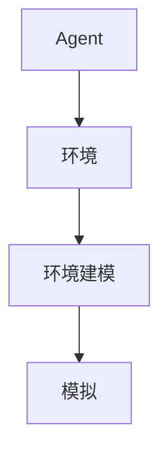

## 1.背景介绍

在人工智能（AI）的世界里，Agent是一个核心概念。Agent是一个自主的实体，它可以感知环境并做出决策，以达成其预设的目标。在这篇文章中，我们将深入研究AI Agent的环境建模与模拟。

## 2.核心概念与联系

在AI中，环境是Agent所处的世界，它包括Agent可以感知和影响的所有事物。环境建模是对这个世界的抽象表示，而模拟则是对环境可能的状态变化的预测。



## 3.核心算法原理具体操作步骤

环境建模与模拟的核心是状态转移函数。这个函数描述了在给定当前状态和Agent的动作后，环境将如何变化。在实际的AI系统中，我们通常使用一种叫做马尔科夫决策过程（MDP）的模型来描述这种状态转移。

## 4.数学模型和公式详细讲解举例说明

马尔科夫决策过程是一个四元组 $(S, A, P, R)$，其中：

- $S$ 是状态的集合，
- $A$ 是动作的集合，
- $P$ 是状态转移概率函数，$P(s'|s, a)$ 表示在状态 $s$ 下执行动作 $a$ 后转移到状态 $s'$ 的概率，
- $R$ 是奖励函数，$R(s, a, s')$ 表示在状态 $s$ 下执行动作 $a$ 并转移到状态 $s'$ 后得到的奖励。

## 5.项目实践：代码实例和详细解释说明

我们可以使用Python的Gym库来创建一个环境模型并进行模拟。以下是一个简单的例子：

```python
import gym

# 创建环境
env = gym.make('CartPole-v0')

# 初始化环境
state = env.reset()

for _ in range(1000):
    # 渲染环境
    env.render()
    
    # 随机选择一个动作
    action = env.action_space.sample()
    
    # 执行动作并获取反馈
    state, reward, done, info = env.step(action)
    
    if done:
        # 如果游戏结束，重置环境
        state = env.reset()

# 关闭环境
env.close()
```

## 6.实际应用场景

环境建模与模拟在许多AI应用中都起着关键的作用，例如自动驾驶汽车、机器人控制、游戏AI、资源调度等。

## 7.工具和资源推荐

- Python的Gym库：一个用于开发和比较强化学习算法的工具箱。
- OpenAI的Baselines：一个提供高质量强化学习算法实现的库。

## 8.总结：未来发展趋势与挑战

随着硬件技术的进步和算法的发展，环境建模与模拟的精度和效率将得到进一步提升。然而，如何建立复杂环境的高效模型和如何处理模型的不确定性仍是未来的挑战。

## 9.附录：常见问题与解答

**Q：环境建模与模拟有什么用？**

A：环境建模与模拟可以帮助Agent理解其所处的世界，并预测其动作的后果，从而做出更好的决策。

**Q：如何选择合适的环境模型？**

A：选择环境模型需要考虑问题的复杂性、可用的计算资源和所需的模拟精度等因素。

作者：禅与计算机程序设计艺术 / Zen and the Art of Computer Programming