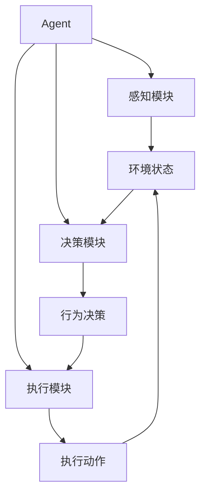

# AI人工智能 Agent：高级概念剖析

## 1. 背景介绍
### 1.1 人工智能的发展历程
#### 1.1.1 早期人工智能的探索
#### 1.1.2 专家系统的兴起
#### 1.1.3 机器学习的崛起
### 1.2 智能Agent的概念
#### 1.2.1 Agent的定义
#### 1.2.2 Agent的特点
#### 1.2.3 Agent与传统软件的区别
### 1.3 智能Agent的应用前景
#### 1.3.1 智能助理
#### 1.3.2 自动化决策
#### 1.3.3 智能交互

## 2. 核心概念与联系
### 2.1 Agent的组成要素
#### 2.1.1 感知模块
#### 2.1.2 决策模块
#### 2.1.3 执行模块  
### 2.2 Agent的分类
#### 2.2.1 反应型Agent
#### 2.2.2 目标导向型Agent
#### 2.2.3 效用导向型Agent
#### 2.2.4 学习型Agent
### 2.3 多Agent系统
#### 2.3.1 多Agent系统的特点
#### 2.3.2 多Agent系统的协作机制
#### 2.3.3 多Agent系统的应用



## 3. 核心算法原理具体操作步骤
### 3.1 搜索算法
#### 3.1.1 盲目搜索
##### 3.1.1.1 广度优先搜索
##### 3.1.1.2 深度优先搜索
#### 3.1.2 启发式搜索
##### 3.1.2.1 最佳优先搜索
##### 3.1.2.2 A*搜索
### 3.2 规划算法
#### 3.2.1 状态空间规划
#### 3.2.2 STRIPS规划
#### 3.2.3 偏序规划
### 3.3 学习算法
#### 3.3.1 强化学习
##### 3.3.1.1 Q-learning
##### 3.3.1.2 SARSA
#### 3.3.2 监督学习
##### 3.3.2.1 决策树
##### 3.3.2.2 支持向量机
#### 3.3.3 无监督学习 
##### 3.3.3.1 聚类
##### 3.3.3.2 关联规则

## 4. 数学模型和公式详细讲解举例说明
### 4.1 马尔可夫决策过程
#### 4.1.1 马尔可夫决策过程的定义
一个马尔可夫决策过程可以用一个五元组 $(S,A,P,R,\gamma)$ 来表示：
- $S$ 表示状态集合
- $A$ 表示动作集合
- $P$ 表示状态转移概率矩阵，$P(s'|s,a)$ 表示在状态 $s$ 下执行动作 $a$ 后转移到状态 $s'$ 的概率
- $R$ 表示奖励函数，$R(s,a)$ 表示在状态 $s$ 下执行动作 $a$ 获得的即时奖励
- $\gamma$ 表示折扣因子，$0\leq\gamma\leq1$

#### 4.1.2 最优策略与值函数
- 策略 $\pi(a|s)$ 表示在状态 $s$ 下选择动作 $a$ 的概率
- 状态值函数 $V^{\pi}(s)$ 表示从状态 $s$ 开始，按照策略 $\pi$ 执行所获得的期望累积奖励
$$V^{\pi}(s)=\mathbb{E}\left[\sum_{t=0}^{\infty}\gamma^tR(s_t,a_t)|s_0=s,\pi\right]$$
- 动作值函数 $Q^{\pi}(s,a)$ 表示在状态 $s$ 下执行动作 $a$，然后按照策略 $\pi$ 执行所获得的期望累积奖励
$$Q^{\pi}(s,a)=\mathbb{E}\left[\sum_{t=0}^{\infty}\gamma^tR(s_t,a_t)|s_0=s,a_0=a,\pi\right]$$
- 最优状态值函数 $V^*(s)=\max_{\pi}V^{\pi}(s)$
- 最优动作值函数 $Q^*(s,a)=\max_{\pi}Q^{\pi}(s,a)$
- 最优策略 $\pi^*$ 满足 $V^{\pi^*}(s)=V^*(s)$

#### 4.1.3 贝尔曼最优方程
$$V^*(s)=\max_a\left[R(s,a)+\gamma\sum_{s'}P(s'|s,a)V^*(s')\right]$$
$$Q^*(s,a)=R(s,a)+\gamma\sum_{s'}P(s'|s,a)\max_{a'}Q^*(s',a')$$

### 4.2 部分可观测马尔可夫决策过程
#### 4.2.1 POMDP的定义
部分可观测马尔可夫决策过程（Partially Observable Markov Decision Process，POMDP）是MDP的扩展，引入了观测集合 $\Omega$ 和观测概率函数 $O$。一个POMDP可以用一个七元组 $(S,A,P,R,\Omega,O,\gamma)$ 来表示：
- $\Omega$ 表示观测集合
- $O$ 表示观测概率函数，$O(o|s',a)$ 表示在执行动作 $a$ 后到达状态 $s'$ 时得到观测 $o$ 的概率

#### 4.2.2 信念状态与最优策略
- 信念状态 $b(s)$ 表示对当前状态的概率分布
- 信念状态值函数 $V^*(b)$ 表示从信念状态 $b$ 开始执行最优策略所获得的期望累积奖励
- 最优策略 $\pi^*$ 满足 $V^{\pi^*}(b)=V^*(b)$

#### 4.2.3 信念状态更新
在执行动作 $a$ 并观测到 $o$ 后，信念状态可以按照以下公式进行更新：
$$b'(s')=\frac{O(o|s',a)\sum_sP(s'|s,a)b(s)}{P(o|b,a)}$$
其中，$P(o|b,a)=\sum_{s'}\sum_sO(o|s',a)P(s'|s,a)b(s)$。

## 5. 项目实践：代码实例和详细解释说明
### 5.1 基于Q-learning的迷宫寻路Agent
```python
import numpy as np

# 定义迷宫环境
class Maze:
    def __init__(self):
        self.maze = np.array([
            [0, 0, 0, 0, 0, 0, 0],
            [0, -1, 0, 0, 0, -1, 0],
            [0, 0, 0, -1, 0, 0, 0],
            [0, -1, 0, 0, 0, -1, 0],
            [0, 0, 0, 0, 0, 0, 1]
        ])
        self.state = (0, 0)
        
    def reset(self):
        self.state = (0, 0)
        return self.state
    
    def step(self, action):
        i, j = self.state
        if action == 0:  # 向上
            next_state = (max(i-1, 0), j)
        elif action == 1:  # 向右
            next_state = (i, min(j+1, self.maze.shape[1]-1))
        elif action == 2:  # 向下
            next_state = (min(i+1, self.maze.shape[0]-1), j)
        else:  # 向左
            next_state = (i, max(j-1, 0))
        
        if self.maze[next_state] == -1:
            reward = -10
            done = True
        elif self.maze[next_state] == 1:
            reward = 10
            done = True
        else:
            reward = -1
            done = False
        
        self.state = next_state
        return next_state, reward, done

# 定义Q-learning Agent
class QLearningAgent:
    def __init__(self, env, alpha=0.1, gamma=0.9, epsilon=0.1):
        self.env = env
        self.alpha = alpha
        self.gamma = gamma
        self.epsilon = epsilon
        self.Q = np.zeros((env.maze.shape[0], env.maze.shape[1], 4))
        
    def choose_action(self, state):
        if np.random.uniform() < self.epsilon:
            action = np.random.choice(4)
        else:
            action = np.argmax(self.Q[state])
        return action
    
    def learn(self, state, action, reward, next_state, done):
        target = reward + self.gamma * np.max(self.Q[next_state]) * (1 - done)
        self.Q[state][action] += self.alpha * (target - self.Q[state][action])
        
    def train(self, episodes):
        for _ in range(episodes):
            state = self.env.reset()
            done = False
            while not done:
                action = self.choose_action(state)
                next_state, reward, done = self.env.step(action)
                self.learn(state, action, reward, next_state, done)
                state = next_state
                
    def test(self):
        state = self.env.reset()
        done = False
        while not done:
            action = np.argmax(self.Q[state])
            next_state, _, done = self.env.step(action)
            state = next_state
        return state

# 创建环境和Agent
env = Maze()
agent = QLearningAgent(env)

# 训练Agent
agent.train(1000)

# 测试Agent
final_state = agent.test()
print("Agent reached goal state:", final_state)
```

这个示例代码实现了一个基于Q-learning的迷宫寻路Agent。代码主要分为以下几个部分：

1. 定义迷宫环境类`Maze`，包含迷宫地图、当前状态以及状态转移函数`step`。
2. 定义Q-learning Agent类`QLearningAgent`，包含Q值表、动作选择策略、学习函数以及训练和测试函数。
3. 创建环境和Agent实例，并进行训练和测试。

在训练过程中，Agent通过与环境交互，不断更新Q值表，学习最优策略。在测试过程中，Agent根据学习到的Q值表选择最优动作，寻找到达目标状态的路径。

### 5.2 基于STRIPS的自动规划Agent
```python
class Predicate:
    def __init__(self, name, args):
        self.name = name
        self.args = args
        
    def __str__(self):
        return f"{self.name}({','.join(self.args)})"
        
class Action:
    def __init__(self, name, parameters, preconditions, effects):
        self.name = name
        self.parameters = parameters
        self.preconditions = preconditions
        self.effects = effects
        
    def __str__(self):
        return f"{self.name}({','.join(self.parameters)})"
        
class STRIPSPlanner:
    def __init__(self, initial_state, goal_state, actions):
        self.initial_state = initial_state
        self.goal_state = goal_state
        self.actions = actions
        
    def is_applicable(self, state, action):
        return all(precond in state for precond in action.preconditions)
    
    def apply(self, state, action):
        new_state = set(state)
        for effect in action.effects:
            if effect.startswith("not"):
                new_state.discard(Predicate(effect[4:-1], action.parameters))
            else:
                new_state.add(Predicate(effect, action.parameters))
        return new_state
    
    def plan(self):
        frontier = [(self.initial_state, [])]
        explored = set()
        while frontier:
            state, path = frontier.pop(0)
            if state == self.goal_state:
                return path
            explored.add(frozenset(state))
            for action in self.actions:
                for binding in self.get_bindings(state, action):
                    if self.is_applicable(state, action.instantiate(binding)):
                        new_state = self.apply(state, action.instantiate(binding))
                        if frozenset(new_state) not in explored:
                            frontier.append((new_state, path + [action.instantiate(binding)]))
        return None
    
    def get_bindings(self, state, action):
        # 实现参数绑定的逻辑
        pass

# 定义动作
actions = [
    Action("move", ["from", "to"],
           [Predicate("at", ["from"]), Predicate("adjacent", ["from", "to"])],
           ["not at(from)", "at(to)"]),
    Action("pick", ["obj", "loc"],
           [Predicate("at", ["loc"]), Predicate("on", ["obj", "loc"])],
           ["not on(obj,loc)", "holding(obj)"]),
    Action("drop", ["obj", "loc"],
           [Predicate("holding", ["obj"]), Predicate("at", ["loc"])],
           ["not holding(obj)", "on(obj,loc)"])
]

# 定义初始状态和目标状态
initial_state = {Predicate("at", ["loc1"]), Predicate("on", ["obj1", "loc2"]), Predicate("adjacent", ["loc1", "loc2"])}
goal_state = {Predicate("at", ["loc2"]), Predicate("on", ["obj1", "loc2"]