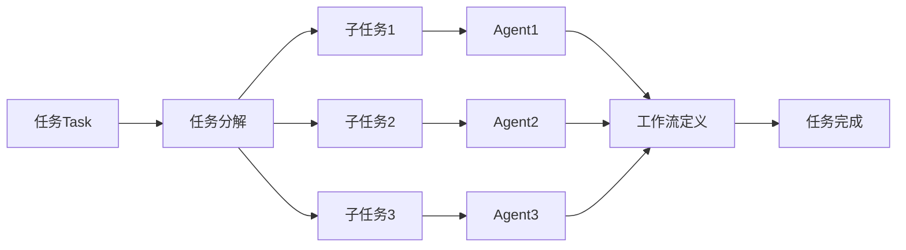

# AI人工智能代理工作流 AI Agent WorkFlow：在智能交通中的应用

## 1. 背景介绍

### 1.1 智能交通的发展现状

随着城市化进程的加快和汽车保有量的不断增加,交通拥堵、事故频发、环境污染等问题日益突出,严重影响着城市的可持续发展。为了缓解这些问题,各国政府和相关机构都在积极探索智能交通系统(Intelligent Transportation Systems, ITS)的建设和应用。

智能交通是利用先进的信息技术、数据通信传输技术、电子传感技术、控制技术以及计算机技术等,将人、车、路有机地结合起来,形成一个实时、准确、高效的综合交通运输管理系统。近年来,人工智能技术的飞速发展为智能交通系统的建设和优化提供了新的思路和方法。

### 1.2 人工智能在智能交通中的应用前景

将人工智能技术引入智能交通系统,可以极大地提高交通系统的智能化水平和管理效率。一方面,人工智能可以对海量的交通数据进行分析和挖掘,及时发现交通拥堵、事故等异常情况,并提供优化的解决方案。另一方面,人工智能还可以通过自主学习不断提高系统性能,使得交通管理更加智能化。

目前,人工智能在智能交通领域的应用主要集中在交通流量预测、信号灯控制优化、自动驾驶、交通事件检测等方面。一些研究机构和企业已经开发出了相应的人工智能系统和产品,并在实际的交通管理中得到应用,取得了良好的效果。

本文将重点介绍一种称为"AI Agent WorkFlow"的人工智能代理工作流技术,探讨其在智能交通领域的应用。通过对其核心概念、工作原理、关键技术以及应用实例的分析和阐述,展现人工智能赋能智慧交通的广阔前景。

## 2. 核心概念与联系

### 2.1 Agent的概念

Agent是一个可以感知环境并作出相应行为的自主实体。它具有一定的智能,能够根据自身的知识和目标,在动态变化的环境中自主地完成特定任务。Agent可以是软件程序,也可以是硬件设备,如机器人。一个典型的Agent通常包含以下几个关键要素:

- 感知(Perception):Agent需要通过传感器获取环境信息。
- 决策(Decision Making):Agent根据获取的信息和知识,推理出下一步的行动。
- 执行(Execution):Agent执行推理得出的行动,对环境产生影响。

### 2.2 AI Agent的特点

AI Agent是一种基于人工智能技术的智能Agent,除了具备普通Agent的特点外,还具有以下显著特征:

- 自主学习(Autonomous Learning):AI Agent可以通过机器学习算法,在与环境的交互中不断学习和优化,提高自身的智能水平。
- 知识表示(Knowledge Representation):AI Agent以知识的形式将环境信息和领域知识表示出来,用于推理决策。
- 推理决策(Reasoning and Decision):AI Agent利用知识推理和决策算法,在复杂动态环境中自主地制定行动策略。
- 分布协作(Distribution and Collaboration):多个AI Agent可以通过通信协作,共同完成复杂任务。

### 2.3 AI Agent WorkFlow的概念

AI Agent WorkFlow是一种任务驱动的、基于工作流的AI Agent构建方法。它将一个复杂的任务划分为若干个子任务,每个子任务由一个Agent完成。通过定义Agent之间的工作流,协调多个Agent,最终完成整个任务。其核心思想如下:

- 任务分解(Task Decomposition):将一个复杂任务分解为多个可由Agent完成的子任务。
- Agent构建(Agent Construction):针对每个子任务,构建一个完成该任务的Agent。
- 工作流定义(Workflow Definition):定义Agent之间的协作关系和流程,形成工作流。
- 任务驱动(Task-driven):Agent根据分配的任务,在工作流中协同工作,最终完成整个任务。

下图是AI Agent WorkFlow的一个示意图:



## 3. 核心算法原理具体操作步骤

AI Agent WorkFlow的核心是如何构建和协调多个Agent来完成复杂任务。这里我们介绍两种常用的构建Agent的算法:基于规则的推理和强化学习。

### 3.1 基于规则的Agent构建

基于规则的Agent利用一系列的if-then规则来推理决策。其基本步骤如下:

1. 定义Agent的感知、动作和目标。
2. 收集领域知识,总结出一系列if-then规则。
3. 将规则转化为Agent可执行的形式(如决策树)。
4. Agent根据感知到的环境信息,利用规则进行推理,得出下一步行动。
5. Agent执行行动,并根据反馈更新规则库。

基于规则的方法实现简单,适用于领域知识比较明确、环境变化不大的情况。但其缺点是规则的获取和维护比较困难,且适应动态环境的能力较差。

### 3.2 基于强化学习的Agent构建

强化学习是一种试错式学习方法,Agent通过与环境的交互,不断尝试、评估和改进自身的策略,最终学习到最优策略。Q-learning是一种常用的强化学习算法,其核心是学习一个Q函数,估计在某种状态下采取某个动作的长期回报。其基本步骤如下:

1. 定义Agent的状态空间、动作空间和奖励函数。
2. 随机初始化Q函数。
3. Agent根据当前状态,用ε-greedy策略选择一个动作。
4. Agent执行动作,环境反馈下一个状态和奖励。 
5. 利用Q-learning更新公式更新Q函数:
$$Q(s,a) \leftarrow Q(s,a)+\alpha [r+\gamma \max _{a^{\prime }}Q(s^{\prime },a^{\prime })-Q(s,a)]$$
其中$s$为当前状态,$a$为当前动作,$r$为获得的即时奖励,$s'$为下一个状态,$\alpha$为学习率,$\gamma$为折扣因子。
6. 重复步骤3-5,直到Q函数收敛或满足终止条件。

强化学习方法具有很强的自适应能力,能够在未知环境中自主学习,寻找最优策略。但其也存在一些问题,如探索-利用困境、难以收敛等。

### 3.3 Agent协作与工作流构建

在实际应用中,单个Agent往往难以完成复杂任务,需要多个Agent协同工作。工作流是一种自然的方式来组织多Agent协作。构建基于Agent的工作流的一般步骤如下:

1. 定义整个任务的目标和评价指标。
2. 将任务分解为多个子任务,明确任务之间的依赖关系和数据流。
3. 针对每个子任务,构建一个Agent,可以采用上述基于规则或强化学习的方法。
4. 定义Agent之间的交互接口和通信协议。
5. 将Agent组织成一个工作流,实现Agent之间的调度和协同。
6. 运行工作流,评估和优化整个系统的性能。

常见的工作流构建方法有有向无环图(DAG)、petri网等。此外,还需要一些任务调度和容错机制,以确保工作流的可靠执行。

## 4. 数学模型和公式详细讲解举例说明

在AI Agent WorkFlow中,有许多地方用到了数学模型和公式,如强化学习中的Q-learning算法。下面我们对Q-learning算法做进一步说明。

Q-learning是一种无模型(model-free)、异策略(off-policy)的时序差分学习算法。其核心是学习一个Q函数(Action-Value Function),估计在某种状态下采取某个动作的长期回报。Q函数定义为:
$$Q(s,a)=\mathbb{E}[R_t|s_t=s,a_t=a]$$
其中$R_t$为t时刻之后的累积折扣奖励:
$$R_t=\sum_{k=0}^{\infty }\gamma^k r_{t+k+1}$$

Q-learning的更新公式为:
$$Q(s,a) \leftarrow Q(s,a)+\alpha [r+\gamma \max _{a^{\prime }}Q(s^{\prime },a^{\prime })-Q(s,a)]$$

这个公式可以这样理解:$Q(s,a)$的更新量为学习率$\alpha$乘以TD误差。TD误差为实际获得的奖励$r$加上下一个状态的最大Q值$\gamma \max _{a^{\prime }}Q(s^{\prime },a^{\prime })$,再减去当前状态动作对的Q值$Q(s,a)$。

举一个具体的例子,假设一个Agent在状态$s_1$下采取动作$a_1$,环境反馈奖励$r_1=1$,并转移到状态$s_2$。假设$\gamma=0.9$,学习率$\alpha=0.1$,则Q值更新过程如下:

1. 假设初始$Q(s_1,a_1)=0$,$Q(s_2,a_1)=0$,$Q(s_2,a_2)=0$。
2. 在状态$s_1$采取动作$a_1$,观测到奖励$r_1=1$,下一状态为$s_2$。
3. 计算TD误差:
$$\delta = r_1+\gamma \max _{a^{\prime }}Q(s_2,a^{\prime })-Q(s_1,a_1)$$
$$=1+0.9*\max(0,0)-0=1$$
4. 更新$Q(s_1,a_1)$:
$$Q(s_1,a_1) \leftarrow Q(s_1,a_1)+\alpha \delta$$
$$=0+0.1*1=0.1$$

这样,Agent就通过一次与环境的交互更新了Q值。重复这个过程,Q值会不断被优化,最终收敛到最优值。Agent的策略也随之改进,学会了在每个状态下选择最优动作。

Q-learning算法简单有效,在理论上被证明能够收敛到最优策略。但其也有一些局限,如在状态和动作空间很大时,Q表难以存储;探索-利用困境等。一些改进的算法如DQN、DDPG等,利用深度神经网络来近似Q函数,在复杂环境中取得了很好的效果。

## 5. 项目实践：代码实例和详细解释说明

下面我们用Python实现一个简单的Q-learning Agent,并应用于一个交通信号灯控制的例子。

### 5.1 Q-learning Agent的实现

首先定义一个QLearningAgent类,实现Q-learning算法:

```python
import numpy as np

class QLearningAgent:
    def __init__(self, state_size, action_size, learning_rate=0.1, discount_factor=0.9, epsilon=0.1):
        self.state_size = state_size
        self.action_size = action_size
        self.learning_rate = learning_rate
        self.discount_factor = discount_factor
        self.epsilon = epsilon
        self.q_table = np.zeros((state_size, action_size))

    def act(self, state):
        if np.random.uniform() < self.epsilon:
            return np.random.choice(self.action_size)
        else:
            return np.argmax(self.q_table[state])

    def learn(self, state, action, reward, next_state):
        td_error = reward + self.discount_factor * np.max(self.q_table[next_state]) - self.q_table[state, action]
        self.q_table[state, action] += self.learning_rate * td_error
```

这个Agent包含以下关键要素:

- `state_size`:状态空间大小。
- `action_size`:动作空间大小。
- `learning_rate`:学习率$\alpha$。
- `discount_factor`:折扣因子$\gamma$。
- `epsilon`:探索概率$\epsilon$。
- `q_table`:Q值表。

`act`方法根据当前状态选择动作,以$\epsilon$的概率随机探索,否则选择Q值最大的动作。`learn`方法根据观测到的$(s,a,r,s')$元组更新Q表。

### 5.2 交通信号灯控制的应用

假设我们要控制一个十字路口的交通信号灯,目标是最小化车辆的平均等待时间。状态空间为当前红绿灯状态和各车道车辆数,动作空间为切换红绿灯或保持不变。

首先定义