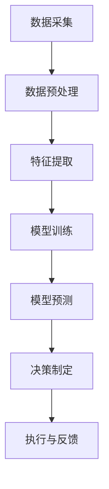

# AI人工智能代理工作流 AI Agent WorkFlow：在物联网中的应用

## 1.背景介绍

物联网（IoT）作为现代科技的前沿领域，已经在各个行业中得到了广泛应用。随着设备数量的增加和数据量的爆炸式增长，如何高效地管理和利用这些数据成为了一个巨大的挑战。人工智能（AI）代理工作流作为一种新兴的技术手段，能够在物联网环境中提供智能化的解决方案，提升系统的自动化和智能化水平。

## 2.核心概念与联系

### 2.1 物联网（IoT）

物联网是指通过互联网将各种设备连接起来，实现数据的采集、传输和处理。物联网设备包括传感器、执行器、智能家居设备、工业设备等。

### 2.2 人工智能（AI）

人工智能是指通过计算机模拟人类智能的技术，包括机器学习、深度学习、自然语言处理等。AI能够从数据中学习，进行预测和决策。

### 2.3 AI代理

AI代理是指能够自主执行任务的智能体。它们可以感知环境、做出决策并采取行动。AI代理在物联网中的应用可以实现设备的智能化管理和自动化操作。

### 2.4 AI代理工作流

AI代理工作流是指通过一系列有序的步骤和算法，利用AI代理来处理和管理物联网数据和设备的过程。它包括数据采集、数据处理、决策制定和执行等环节。

### 2.5 核心联系

物联网提供了大量的数据和设备，AI通过代理工作流对这些数据进行处理和分析，从而实现智能化的管理和控制。AI代理工作流在物联网中的应用能够提高系统的效率和智能化水平。

## 3.核心算法原理具体操作步骤

### 3.1 数据采集

数据采集是AI代理工作流的第一步。物联网设备通过传感器采集环境数据，如温度、湿度、光照强度等。这些数据通过网络传输到数据中心进行处理。

### 3.2 数据预处理

数据预处理是指对采集到的数据进行清洗、归一化、降噪等处理，以提高数据的质量和可用性。常用的预处理方法包括缺失值填补、异常值检测和处理等。

### 3.3 特征提取

特征提取是指从原始数据中提取出有用的特征，以便后续的模型训练和预测。常用的特征提取方法包括主成分分析（PCA）、线性判别分析（LDA）等。

### 3.4 模型训练

模型训练是指利用预处理后的数据和提取的特征，训练机器学习或深度学习模型。常用的模型包括决策树、支持向量机（SVM）、神经网络等。

### 3.5 模型预测

模型预测是指利用训练好的模型对新数据进行预测和分类。预测结果可以用于决策制定和执行。

### 3.6 决策制定

决策制定是指根据模型的预测结果，制定相应的决策和策略。决策可以是自动化的，也可以是人工辅助的。

### 3.7 执行与反馈

执行与反馈是指将决策结果应用到实际的物联网设备中，并通过反馈机制不断优化和改进工作流。



## 4.数学模型和公式详细讲解举例说明

### 4.1 数据预处理中的归一化

归一化是数据预处理中的常用方法，用于将数据缩放到一个特定的范围内。常用的归一化方法包括最小-最大归一化和Z-score归一化。

最小-最大归一化公式：
$$
x' = \frac{x - x_{min}}{x_{max} - x_{min}}
$$

Z-score归一化公式：
$$
x' = \frac{x - \mu}{\sigma}
$$

### 4.2 特征提取中的主成分分析（PCA）

主成分分析是一种降维技术，用于从高维数据中提取出主要特征。PCA的核心思想是通过线性变换将数据投影到一个新的坐标系中，使得投影后的数据方差最大。

PCA的数学公式：
$$
X' = XW
$$
其中，$X$ 是原始数据矩阵，$W$ 是特征向量矩阵，$X'$ 是降维后的数据矩阵。

### 4.3 模型训练中的线性回归

线性回归是一种常用的回归分析方法，用于预测因变量与自变量之间的线性关系。线性回归的目标是找到一个线性函数，使得预测值与实际值之间的误差最小。

线性回归的数学公式：
$$
y = \beta_0 + \beta_1 x_1 + \beta_2 x_2 + \cdots + \beta_n x_n
$$
其中，$y$ 是因变量，$x_1, x_2, \cdots, x_n$ 是自变量，$\beta_0, \beta_1, \cdots, \beta_n$ 是回归系数。

### 4.4 模型预测中的支持向量机（SVM）

支持向量机是一种用于分类和回归的监督学习模型。SVM的核心思想是通过寻找一个最优超平面，将数据分成不同的类别。

SVM的数学公式：
$$
f(x) = \text{sign}(w \cdot x + b)
$$
其中，$w$ 是权重向量，$x$ 是输入向量，$b$ 是偏置项。

## 5.项目实践：代码实例和详细解释说明

### 5.1 数据采集

```python
import requests

def collect_data(sensor_url):
    response = requests.get(sensor_url)
    data = response.json()
    return data

sensor_url = "http://example.com/sensor"
data = collect_data(sensor_url)
print(data)
```

### 5.2 数据预处理

```python
import pandas as pd
from sklearn.preprocessing import MinMaxScaler

def preprocess_data(data):
    df = pd.DataFrame(data)
    scaler = MinMaxScaler()
    scaled_data = scaler.fit_transform(df)
    return scaled_data

preprocessed_data = preprocess_data(data)
print(preprocessed_data)
```

### 5.3 特征提取

```python
from sklearn.decomposition import PCA

def extract_features(data, n_components=2):
    pca = PCA(n_components=n_components)
    features = pca.fit_transform(data)
    return features

features = extract_features(preprocessed_data)
print(features)
```

### 5.4 模型训练

```python
from sklearn.linear_model import LinearRegression

def train_model(features, target):
    model = LinearRegression()
    model.fit(features, target)
    return model

target = [1, 0, 1, 0, 1]  # 示例目标值
model = train_model(features, target)
print(model.coef_)
```

### 5.5 模型预测

```python
def predict(model, new_data):
    predictions = model.predict(new_data)
    return predictions

new_data = [[0.1, 0.2], [0.3, 0.4]]  # 示例新数据
predictions = predict(model, new_data)
print(predictions)
```

### 5.6 决策制定

```python
def make_decision(predictions):
    decisions = ["Action A" if pred > 0.5 else "Action B" for pred in predictions]
    return decisions

decisions = make_decision(predictions)
print(decisions)
```

### 5.7 执行与反馈

```python
def execute_decision(decisions):
    for decision in decisions:
        print(f"Executing {decision}")

execute_decision(decisions)
```

## 6.实际应用场景

### 6.1 智能家居

在智能家居中，AI代理工作流可以用于自动化控制家电设备。例如，通过传感器采集室内温度和湿度数据，AI代理可以预测用户的舒适度，并自动调节空调和加湿器的工作状态。

### 6.2 智能交通

在智能交通系统中，AI代理工作流可以用于交通流量预测和信号灯控制。通过采集道路上的车辆数据，AI代理可以预测交通流量，并优化信号灯的切换时间，减少交通拥堵。

### 6.3 工业自动化

在工业自动化中，AI代理工作流可以用于设备故障预测和维护。通过采集设备的运行数据，AI代理可以预测设备的故障风险，并提前安排维护，减少停机时间。

### 6.4 智能农业

在智能农业中，AI代理工作流可以用于作物生长监测和灌溉控制。通过采集土壤湿度和气象数据，AI代理可以预测作物的需水量，并自动控制灌溉系统，优化水资源利用。

## 7.工具和资源推荐

### 7.1 开源工具

- **TensorFlow**：一个开源的机器学习框架，适用于大规模数据处理和深度学习模型训练。
- **PyTorch**：一个开源的深度学习框架，提供灵活的模型定义和训练接口。
- **Scikit-learn**：一个开源的机器学习库，提供丰富的算法和工具，用于数据预处理、特征提取和模型训练。

### 7.2 数据集

- **UCI Machine Learning Repository**：一个常用的机器学习数据集库，提供各种领域的数据集。
- **Kaggle**：一个数据科学竞赛平台，提供丰富的数据集和竞赛项目。

### 7.3 在线课程

- **Coursera**：提供丰富的人工智能和机器学习课程，包括斯坦福大学的机器学习课程。
- **edX**：提供各种在线课程，包括麻省理工学院的人工智能课程。

## 8.总结：未来发展趋势与挑战

### 8.1 未来发展趋势

随着物联网设备的普及和数据量的增加，AI代理工作流在物联网中的应用前景广阔。未来，AI代理工作流将更加智能化和自动化，能够处理更复杂的任务和决策。同时，随着边缘计算和5G技术的发展，AI代理工作流将能够在更低的延迟和更高的带宽下运行，提升系统的实时性和可靠性。

### 8.2 挑战

尽管AI代理工作流在物联网中的应用前景广阔，但也面临一些挑战。首先，数据隐私和安全问题是一个重要的挑战。物联网设备采集的数据可能涉及用户的隐私，如何保护这些数据是一个亟待解决的问题。其次，AI模型的可解释性和透明性也是一个挑战。AI代理的决策过程可能比较复杂，如何让用户理解和信任这些决策是一个需要解决的问题。

## 9.附录：常见问题与解答

### 9.1 什么是AI代理工作流？

AI代理工作流是指通过一系列有序的步骤和算法，利用AI代理来处理和管理物联网数据和设备的过程。它包括数据采集、数据处理、决策制定和执行等环节。

### 9.2 AI代理工作流在物联网中的应用有哪些？

AI代理工作流在物联网中的应用包括智能家居、智能交通、工业自动化和智能农业等。通过AI代理工作流，可以实现设备的智能化管理和自动化操作，提升系统的效率和智能化水平。

### 9.3 如何保护物联网数据的隐私和安全？

保护物联网数据的隐私和安全可以通过以下几种方法：数据加密、访问控制、数据匿名化和隐私保护计算等。同时，制定和遵守相关的法律法规和标准也是保护数据隐私和安全的重要手段。

### 9.4 AI代理的决策过程如何解释和透明？

提高AI代理的可解释性和透明性可以通过以下几种方法：使用可解释的模型（如决策树）、提供决策过程的可视化工具、进行模型的后处理分析（如特征重要性分析）等。同时，建立用户信任和透明的沟通机制也是提高AI代理可解释性的重要手段。

### 9.5 AI代理工作流的未来发展趋势是什么？

未来，AI代理工作流将更加智能化和自动化，能够处理更复杂的任务和决策。随着边缘计算和5G技术的发展，AI代理工作流将能够在更低的延迟和更高的带宽下运行，提升系统的实时性和可靠性。

---

作者：禅与计算机程序设计艺术 / Zen and the Art of Computer Programming