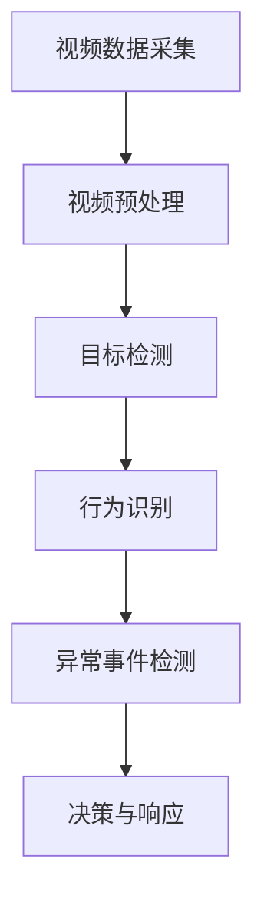

# AI人工智能代理工作流 AI Agent WorkFlow：在视频监控中的应用

## 1.背景介绍

随着人工智能技术的迅猛发展，视频监控系统已经从传统的被动监控转变为主动智能监控。传统的视频监控系统主要依赖于人工观察和分析，效率低下且容易出错。而引入AI人工智能代理工作流（AI Agent WorkFlow）后，视频监控系统能够实现自动化、智能化的监控和分析，大大提升了监控效率和准确性。

AI人工智能代理工作流在视频监控中的应用，主要包括目标检测、行为识别、异常事件检测等多个方面。通过引入深度学习、计算机视觉等技术，AI代理能够实时分析视频流，识别并处理各种复杂场景和事件。

## 2.核心概念与联系

### 2.1 人工智能代理

人工智能代理（AI Agent）是指能够自主感知环境、做出决策并执行相应动作的智能系统。在视频监控中，AI代理通过摄像头获取视频数据，利用深度学习算法进行分析，从而实现自动化监控和事件处理。

### 2.2 工作流

工作流（WorkFlow）是指一系列有序的任务和活动，通过预定义的规则和逻辑进行协调和管理。在视频监控中，AI代理工作流包括视频数据采集、预处理、分析、决策和响应等多个环节。

### 2.3 深度学习与计算机视觉

深度学习是人工智能的一个重要分支，通过构建多层神经网络来模拟人脑的学习过程。计算机视觉是深度学习的重要应用领域，主要研究如何让计算机理解和处理图像和视频数据。在视频监控中，深度学习和计算机视觉技术是实现智能分析的核心。

### 2.4 核心联系

AI代理工作流在视频监控中的应用，主要依赖于深度学习和计算机视觉技术。通过构建智能代理系统，能够实现视频数据的自动化分析和处理，从而提升监控效率和准确性。

## 3.核心算法原理具体操作步骤

### 3.1 视频数据采集与预处理

视频数据采集是AI代理工作流的起点，通过摄像头获取实时视频流。预处理步骤包括视频帧的提取、图像增强、去噪等操作，以提高后续分析的准确性。

### 3.2 目标检测

目标检测是视频监控中的关键任务，主要包括物体的定位和分类。常用的目标检测算法有YOLO（You Only Look Once）、SSD（Single Shot MultiBox Detector）等。这些算法通过卷积神经网络（CNN）对视频帧进行特征提取和分类，从而实现目标检测。

### 3.3 行为识别

行为识别是指通过分析视频中的人物动作，识别其行为类型。常用的行为识别算法有LSTM（Long Short-Term Memory）、3D CNN等。这些算法通过对视频帧序列进行时空特征提取和分析，从而实现行为识别。

### 3.4 异常事件检测

异常事件检测是指识别视频中出现的异常行为或事件。常用的异常事件检测算法有Autoencoder、GAN（Generative Adversarial Network）等。这些算法通过学习正常行为模式，检测出与之不同的异常行为。

### 3.5 决策与响应

在完成视频分析后，AI代理需要根据分析结果做出决策并执行相应的响应动作。例如，当检测到异常事件时，AI代理可以自动报警或启动相应的应急预案。

以下是AI代理工作流的Mermaid流程图：



## 4.数学模型和公式详细讲解举例说明

### 4.1 卷积神经网络（CNN）

卷积神经网络是目标检测和图像分类的核心算法。其基本结构包括卷积层、池化层和全连接层。卷积层通过卷积操作提取图像特征，池化层通过下采样减少特征图的尺寸，全连接层通过线性变换实现分类。

卷积操作的数学公式为：

$$
y_{i,j,k} = \sum_{m=0}^{M-1} \sum_{n=0}^{N-1} x_{i+m,j+n} \cdot w_{m,n,k}
$$

其中，$x$ 是输入图像，$w$ 是卷积核，$y$ 是输出特征图，$M$ 和 $N$ 分别是卷积核的高度和宽度。

### 4.2 长短期记忆网络（LSTM）

长短期记忆网络是行为识别中的常用算法，能够处理视频帧序列中的时序信息。LSTM通过引入记忆单元和门控机制，解决了传统RNN（Recurrent Neural Network）中的梯度消失问题。

LSTM的数学公式为：

$$
f_t = \sigma(W_f \cdot [h_{t-1}, x_t] + b_f)
$$

$$
i_t = \sigma(W_i \cdot [h_{t-1}, x_t] + b_i)
$$

$$
\tilde{C}_t = \tanh(W_C \cdot [h_{t-1}, x_t] + b_C)
$$

$$
C_t = f_t \cdot C_{t-1} + i_t \cdot \tilde{C}_t
$$

$$
o_t = \sigma(W_o \cdot [h_{t-1}, x_t] + b_o)
$$

$$
h_t = o_t \cdot \tanh(C_t)
$$

其中，$f_t$ 是遗忘门，$i_t$ 是输入门，$\tilde{C}_t$ 是候选记忆单元，$C_t$ 是记忆单元，$o_t$ 是输出门，$h_t$ 是隐藏状态，$x_t$ 是输入，$W$ 和 $b$ 是权重和偏置。

### 4.3 自动编码器（Autoencoder）

自动编码器是异常事件检测中的常用算法，通过学习正常行为模式，检测出与之不同的异常行为。自动编码器包括编码器和解码器两个部分，编码器将输入映射到低维表示，解码器将低维表示重建为原始输入。

自动编码器的损失函数为：

$$
L(x, \hat{x}) = \|x - \hat{x}\|^2
$$

其中，$x$ 是输入，$\hat{x}$ 是重建输出，$L$ 是重建误差。

## 5.项目实践：代码实例和详细解释说明

### 5.1 视频数据采集与预处理

以下是使用OpenCV进行视频数据采集和预处理的示例代码：

```python
import cv2

# 打开摄像头
cap = cv2.VideoCapture(0)

while True:
    # 读取视频帧
    ret, frame = cap.read()
    
    # 图像预处理
    gray = cv2.cvtColor(frame, cv2.COLOR_BGR2GRAY)
    blurred = cv2.GaussianBlur(gray, (5, 5), 0)
    
    # 显示处理后的图像
    cv2.imshow('Processed Frame', blurred)
    
    # 按下'q'键退出
    if cv2.waitKey(1) & 0xFF == ord('q'):
        break

# 释放摄像头
cap.release()
cv2.destroyAllWindows()
```

### 5.2 目标检测

以下是使用YOLO进行目标检测的示例代码：

```python
import cv2
import numpy as np

# 加载YOLO模型
net = cv2.dnn.readNet("yolov3.weights", "yolov3.cfg")
layer_names = net.getLayerNames()
output_layers = [layer_names[i[0] - 1] for i in net.getUnconnectedOutLayers()]

# 打开摄像头
cap = cv2.VideoCapture(0)

while True:
    # 读取视频帧
    ret, frame = cap.read()
    
    # 图像预处理
    blob = cv2.dnn.blobFromImage(frame, 0.00392, (416, 416), (0, 0, 0), True, crop=False)
    net.setInput(blob)
    outs = net.forward(output_layers)
    
    # 解析检测结果
    class_ids = []
    confidences = []
    boxes = []
    for out in outs:
        for detection in out:
            scores = detection[5:]
            class_id = np.argmax(scores)
            confidence = scores[class_id]
            if confidence > 0.5:
                center_x = int(detection[0] * frame.shape[1])
                center_y = int(detection[1] * frame.shape[0])
                w = int(detection[2] * frame.shape[1])
                h = int(detection[3] * frame.shape[0])
                x = int(center_x - w / 2)
                y = int(center_y - h / 2)
                boxes.append([x, y, w, h])
                confidences.append(float(confidence))
                class_ids.append(class_id)
    
    # 绘制检测框
    for i in range(len(boxes)):
        x, y, w, h = boxes[i]
        label = str(class_ids[i])
        cv2.rectangle(frame, (x, y), (x + w, y + h), (0, 255, 0), 2)
        cv2.putText(frame, label, (x, y - 10), cv2.FONT_HERSHEY_SIMPLEX, 0.5, (0, 255, 0), 2)
    
    # 显示检测结果
    cv2.imshow('YOLO Detection', frame)
    
    # 按下'q'键退出
    if cv2.waitKey(1) & 0xFF == ord('q'):
        break

# 释放摄像头
cap.release()
cv2.destroyAllWindows()
```

### 5.3 行为识别

以下是使用LSTM进行行为识别的示例代码：

```python
import numpy as np
import tensorflow as tf
from tensorflow.keras.models import Sequential
from tensorflow.keras.layers import LSTM, Dense

# 构建LSTM模型
model = Sequential()
model.add(LSTM(50, return_sequences=True, input_shape=(30, 100)))
model.add(LSTM(50))
model.add(Dense(10, activation='softmax'))

# 编译模型
model.compile(optimizer='adam', loss='categorical_crossentropy', metrics=['accuracy'])

# 生成示例数据
X_train = np.random.rand(1000, 30, 100)
y_train = np.random.randint(0, 10, (1000, 10))

# 训练模型
model.fit(X_train, y_train, epochs=10, batch_size=32)

# 预测行为
X_test = np.random.rand(1, 30, 100)
y_pred = model.predict(X_test)
print("Predicted behavior:", np.argmax(y_pred))
```

### 5.4 异常事件检测

以下是使用Autoencoder进行异常事件检测的示例代码：

```python
import numpy as np
import tensorflow as tf
from tensorflow.keras.models import Model
from tensorflow.keras.layers import Input, Dense

# 构建Autoencoder模型
input_img = Input(shape=(100,))
encoded = Dense(50, activation='relu')(input_img)
decoded = Dense(100, activation='sigmoid')(encoded)
autoencoder = Model(input_img, decoded)

# 编译模型
autoencoder.compile(optimizer='adam', loss='mse')

# 生成示例数据
X_train = np.random.rand(1000, 100)

# 训练模型
autoencoder.fit(X_train, X_train, epochs=10, batch_size=32)

# 检测异常
X_test = np.random.rand(1, 100)
X_reconstructed = autoencoder.predict(X_test)
reconstruction_error = np.mean((X_test - X_reconstructed) ** 2)
print("Reconstruction error:", reconstruction_error)
```

## 6.实际应用场景

### 6.1 智能交通监控

在智能交通监控中，AI代理工作流可以用于实时监控交通流量、检测交通事故、识别违章行为等。通过引入目标检测和行为识别算法，能够实现对车辆和行人的自动化监控和管理。

### 6.2 智能安防监控

在智能安防监控中，AI代理工作流可以用于监控公共场所、办公楼、住宅区等。通过引入异常事件检测算法，能够实时检测并报警异常行为，如入侵、打架、火灾等。

### 6.3 智能零售监控

在智能零售监控中，AI代理工作流可以用于监控商店、超市等。通过引入目标检测和行为识别算法，能够实现顾客行为分析、商品管理、防盗监控等功能。

### 6.4 智能医疗监控

在智能医疗监控中，AI代理工作流可以用于监控病房、手术室等。通过引入行为识别和异常事件检测算法，能够实时监控病人状态、检测异常行为、辅助医疗决策等。

## 7.工具和资源推荐

### 7.1 开发工具

- OpenCV：一个开源的计算机视觉库，提供了丰富的图像和视频处理功能。
- TensorFlow：一个开源的深度学习框架，支持构建和训练各种神经网络模型。
- PyTorch：一个开源的深度学习框架，提供了灵活的模型构建和训练接口。

### 7.2 数据集

- COCO：一个大规模的图像数据集，包含丰富的目标检测和分割标注。
- UCF101：一个行为识别数据集，包含101种不同的行为类别。
- Kinetics：一个大规模的行为识别数据集，包含400种不同的行为类别。

### 7.3 预训练模型

- YOLO：一个高效的目标检测模型，提供了多种预训练模型。
- ResNet：一个经典的图像分类模型，提供了多种预训练模型。
- LSTM：一个常用的时序模型，支持多种行为识别任务。

## 8.总结：未来发展趋势与挑战

### 8.1 未来发展趋势

随着人工智能技术的不断进步，AI代理工作流在视频监控中的应用将会越来越广泛。未来的发展趋势主要包括以下几个方面：

- 多模态融合：通过融合视频、音频、传感器等多种数据源，实现更全面的监控和分析。
- 边缘计算：通过在边缘设备上部署AI代理，实现实时、高效的监控和处理。
- 自主学习：通过引入强化学习和自监督学习算法，提升AI代理的自主学习和适应能力。

### 8.2 挑战

尽管AI代理工作流在视频监控中具有广阔的应用前景，但仍面临一些挑战：

- 数据隐私：视频监控涉及大量的个人隐私数据，如何保护数据隐私是一个重要问题。
- 计算资源：视频监控需要处理大量的实时数据，对计算资源要求较高。
- 模型鲁棒性：AI代理在复杂环境下的鲁棒性和可靠性仍需进一步提升。

## 9.附录：常见问题与解答

### 9.1 如何选择合适的目标检测算法？

选择目标检测算法时，需要考虑检测精度、速度和计算资源等因素。YOLO适用于实时检测任务，SSD适用于中等速度和精度的任务，Faster R-CNN适用于高精度检测任务。

### 9.2 如何提升行为识别的准确性？

提升行为识别准确性的方法包括：增加训练数据、使用更复杂的模型、引入时空特征、进行数据增强等。

### 9.3 如何处理视频监控中的数据隐私问题？

处理数据隐私问题的方法包括：对视频数据进行加密、使用隐私保护算法、限制数据访问权限等。

### 9.4 如何优化AI代理的计算资源？

优化计算资源的方法包括：使用边缘计算、进行模型压缩、采用高效的推理框架等。

### 9.5 如何提升AI代理的鲁棒性？

提升鲁棒性的方法包括：进行多样化的数据训练、引入对抗训练、进行模型验证和测试等。

---

作者：禅与计算机程序设计艺术 / Zen and the Art of Computer Programming