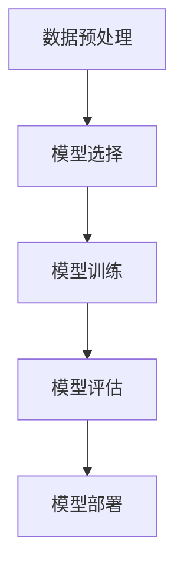

# AI人工智能深度学习算法：在股市预测中的应用

## 1.背景介绍

在金融市场中，股市预测一直是一个备受关注的研究领域。随着人工智能和深度学习技术的迅猛发展，越来越多的研究者和从业者开始尝试将这些先进的技术应用于股市预测。深度学习算法通过处理大量的历史数据，能够捕捉到股市中潜在的复杂模式，从而提高预测的准确性和可靠性。

## 2.核心概念与联系

### 2.1 人工智能与深度学习

人工智能（AI）是计算机科学的一个分支，旨在开发能够执行通常需要人类智能的任务的系统。深度学习是人工智能的一个子领域，基于人工神经网络，特别是多层神经网络，来模拟人脑的学习过程。

### 2.2 股市预测的挑战

股市预测面临许多挑战，包括市场的高波动性、非线性和噪声。传统的统计方法在处理这些问题时往往力不从心，而深度学习算法则能够通过学习复杂的非线性关系来应对这些挑战。

### 2.3 深度学习在股市预测中的优势

深度学习算法具有以下几个优势：
- **自动特征提取**：无需手动设计特征，算法能够自动从数据中提取有用的特征。
- **处理大规模数据**：能够处理大量的历史数据，提高预测的准确性。
- **非线性建模**：能够捕捉到数据中的非线性关系。

## 3.核心算法原理具体操作步骤

### 3.1 数据预处理

数据预处理是深度学习模型训练的第一步。包括数据清洗、归一化、特征选择等步骤。

### 3.2 模型选择

常用的深度学习模型包括卷积神经网络（CNN）、循环神经网络（RNN）和长短期记忆网络（LSTM）等。

### 3.3 模型训练

模型训练是通过优化算法（如梯度下降）来调整模型参数，使得模型在训练数据上的预测误差最小。

### 3.4 模型评估

使用验证集和测试集来评估模型的性能，常用的评估指标包括均方误差（MSE）、平均绝对误差（MAE）等。

### 3.5 模型部署

将训练好的模型部署到生产环境中，进行实时预测。



## 4.数学模型和公式详细讲解举例说明

### 4.1 神经网络基础

神经网络由多个神经元组成，每个神经元接收输入并通过激活函数输出。常用的激活函数包括ReLU、Sigmoid和Tanh。

$$
y = f(Wx + b)
$$

其中，$W$ 是权重矩阵，$x$ 是输入向量，$b$ 是偏置，$f$ 是激活函数。

### 4.2 损失函数

损失函数用于衡量模型预测值与真实值之间的差距。常用的损失函数包括均方误差（MSE）和交叉熵损失。

$$
MSE = \frac{1}{n} \sum_{i=1}^{n} (y_i - \hat{y}_i)^2
$$

### 4.3 优化算法

优化算法用于调整模型参数以最小化损失函数。常用的优化算法包括梯度下降和Adam。

$$
\theta = \theta - \eta \nabla J(\theta)
$$

其中，$\theta$ 是模型参数，$\eta$ 是学习率，$J(\theta)$ 是损失函数。

## 5.项目实践：代码实例和详细解释说明

### 5.1 数据准备

```python
import pandas as pd

# 读取股票数据
data = pd.read_csv('stock_data.csv')
# 数据预处理
data = data.fillna(method='ffill')
```

### 5.2 模型构建

```python
import tensorflow as tf
from tensorflow.keras.models import Sequential
from tensorflow.keras.layers import LSTM, Dense

# 构建LSTM模型
model = Sequential()
model.add(LSTM(50, return_sequences=True, input_shape=(60, 1)))
model.add(LSTM(50, return_sequences=False))
model.add(Dense(25))
model.add(Dense(1))

# 编译模型
model.compile(optimizer='adam', loss='mean_squared_error')
```

### 5.3 模型训练

```python
# 训练模型
model.fit(X_train, y_train, batch_size=1, epochs=1)
```

### 5.4 模型评估

```python
# 评估模型
loss = model.evaluate(X_test, y_test)
print(f'Model Loss: {loss}')
```

### 5.5 模型预测

```python
# 进行预测
predictions = model.predict(X_test)
```

## 6.实际应用场景

### 6.1 短期交易策略

深度学习算法可以用于短期交易策略，通过预测未来几天的股价走势，帮助交易者做出买卖决策。

### 6.2 长期投资策略

通过分析长期的历史数据，深度学习算法可以帮助投资者识别长期的市场趋势，从而制定长期投资策略。

### 6.3 风险管理

深度学习算法可以用于风险管理，通过预测市场波动，帮助投资者制定风险对冲策略。

## 7.工具和资源推荐

### 7.1 开源框架

- TensorFlow
- PyTorch
- Keras

### 7.2 数据源

- Yahoo Finance
- Alpha Vantage
- Quandl

### 7.3 学习资源

- Coursera深度学习课程
- 《深度学习》 by Ian Goodfellow
- GitHub上的开源项目

## 8.总结：未来发展趋势与挑战

### 8.1 未来发展趋势

随着计算能力的提升和数据量的增加，深度学习在股市预测中的应用将会越来越广泛。未来，可能会出现更多的混合模型，将深度学习与其他技术（如强化学习、量子计算）结合起来，提高预测的准确性。

### 8.2 挑战

尽管深度学习在股市预测中展现了巨大的潜力，但仍然面临许多挑战，包括数据质量问题、模型过拟合、市场变化等。研究者需要不断探索新的方法来应对这些挑战。

## 9.附录：常见问题与解答

### 9.1 深度学习模型是否能够完全预测股市？

深度学习模型能够提高股市预测的准确性，但无法完全预测股市。市场中存在许多不可预测的因素，如政策变化、突发事件等。

### 9.2 如何选择合适的深度学习模型？

选择合适的深度学习模型需要根据具体的应用场景和数据特点来决定。常用的模型包括LSTM、CNN等。

### 9.3 如何避免模型过拟合？

可以通过增加数据量、使用正则化技术、交叉验证等方法来避免模型过拟合。

### 9.4 深度学习在股市预测中的应用是否具有法律风险？

在某些国家和地区，使用深度学习进行股市预测可能涉及法律风险。建议在应用之前了解相关法律法规。

---

作者：禅与计算机程序设计艺术 / Zen and the Art of Computer Programming