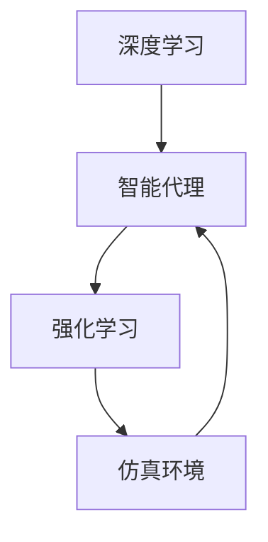

# AI人工智能深度学习算法：智能深度学习代理的仿真环境下的实验与评估

## 1.背景介绍

### 1.1 人工智能与深度学习的崛起

人工智能（AI）和深度学习（DL）在过去十年中取得了显著的进展。深度学习，作为机器学习的一个子领域，通过多层神经网络的训练，能够在图像识别、自然语言处理、语音识别等领域取得突破性成果。深度学习的成功得益于大数据的积累、计算能力的提升以及算法的不断优化。

### 1.2 智能代理与仿真环境

智能代理是指能够自主感知环境并采取行动以实现特定目标的计算机系统。在深度学习的背景下，智能代理通常通过强化学习（RL）进行训练。仿真环境则提供了一个虚拟的实验平台，使得智能代理可以在安全、可控的条件下进行训练和评估。

### 1.3 研究动机与目标

本篇文章旨在探讨智能深度学习代理在仿真环境下的实验与评估方法。通过详细介绍核心概念、算法原理、数学模型、项目实践、实际应用场景等内容，帮助读者深入理解这一领域的前沿技术，并提供实用的指导和资源。

## 2.核心概念与联系

### 2.1 深度学习

深度学习是一种基于人工神经网络的机器学习方法。其核心在于通过多层神经元的连接和权重调整，实现对复杂数据的特征提取和模式识别。常见的深度学习模型包括卷积神经网络（CNN）、循环神经网络（RNN）和生成对抗网络（GAN）等。

### 2.2 强化学习

强化学习是一种通过与环境交互来学习策略的机器学习方法。智能代理通过试错和奖励机制，不断优化其行为策略，以最大化累积奖励。常见的强化学习算法包括Q学习、深度Q网络（DQN）和策略梯度方法等。

### 2.3 智能代理

智能代理是指能够自主感知环境并采取行动以实现特定目标的计算机系统。在深度学习和强化学习的背景下，智能代理通常通过神经网络进行感知和决策。

### 2.4 仿真环境

仿真环境是指通过计算机模拟真实世界的虚拟环境。它为智能代理提供了一个安全、可控的训练和评估平台。常见的仿真环境包括OpenAI Gym、Unity ML-Agents和DeepMind Lab等。

### 2.5 核心概念之间的联系

深度学习和强化学习是智能代理的核心技术，通过仿真环境进行训练和评估。深度学习用于特征提取和模式识别，强化学习用于策略优化，仿真环境提供了实验平台。



## 3.核心算法原理具体操作步骤

### 3.1 深度Q网络（DQN）

深度Q网络（DQN）是将深度学习与Q学习相结合的一种强化学习算法。其核心思想是使用神经网络来近似Q值函数，从而实现对高维状态空间的处理。

#### 3.1.1 算法步骤

1. 初始化经验回放池和Q网络。
2. 在仿真环境中执行动作，收集经验（状态、动作、奖励、下一状态）。
3. 从经验回放池中随机抽取小批量经验，计算目标Q值。
4. 使用梯度下降法更新Q网络参数。
5. 重复步骤2-4，直到收敛。

### 3.2 策略梯度方法

策略梯度方法是通过直接优化策略函数来实现强化学习的一种方法。其核心思想是通过梯度上升法，最大化累积奖励的期望值。

#### 3.2.1 算法步骤

1. 初始化策略网络。
2. 在仿真环境中执行策略，收集经验（状态、动作、奖励）。
3. 计算累积奖励的期望值。
4. 使用梯度上升法更新策略网络参数。
5. 重复步骤2-4，直到收敛。

### 3.3 近端策略优化（PPO）

近端策略优化（PPO）是一种改进的策略梯度方法，通过限制策略更新的幅度，提高训练的稳定性和效率。

#### 3.3.1 算法步骤

1. 初始化策略网络和价值网络。
2. 在仿真环境中执行策略，收集经验（状态、动作、奖励、优势函数）。
3. 计算策略损失和价值损失。
4. 使用梯度下降法更新策略网络和价值网络参数。
5. 重复步骤2-4，直到收敛。

## 4.数学模型和公式详细讲解举例说明

### 4.1 深度Q网络（DQN）

#### 4.1.1 Q值函数

Q值函数 $Q(s, a)$ 表示在状态 $s$ 下采取动作 $a$ 所能获得的期望累积奖励。DQN使用神经网络来近似Q值函数。

$$
Q(s, a; \theta) \approx Q^*(s, a)
$$

其中，$\theta$ 是神经网络的参数。

#### 4.1.2 目标Q值

目标Q值 $y$ 由当前奖励 $r$ 和下一状态的最大Q值组成：

$$
y = r + \gamma \max_{a'} Q(s', a'; \theta^-)
$$

其中，$\gamma$ 是折扣因子，$\theta^-$ 是目标网络的参数。

#### 4.1.3 损失函数

DQN的损失函数为目标Q值和当前Q值之间的均方误差：

$$
L(\theta) = \mathbb{E}[(y - Q(s, a; \theta))^2]
$$

### 4.2 策略梯度方法

#### 4.2.1 策略函数

策略函数 $\pi(a|s; \theta)$ 表示在状态 $s$ 下采取动作 $a$ 的概率。策略梯度方法通过优化策略函数来最大化累积奖励的期望值。

#### 4.2.2 累积奖励

累积奖励 $R$ 是从当前状态开始，未来所有奖励的折扣和：

$$
R = \sum_{t=0}^{\infty} \gamma^t r_t
$$

#### 4.2.3 策略梯度

策略梯度 $\nabla_\theta J(\theta)$ 表示累积奖励的期望值对策略参数 $\theta$ 的梯度：

$$
\nabla_\theta J(\theta) = \mathbb{E}[\nabla_\theta \log \pi(a|s; \theta) R]
$$

### 4.3 近端策略优化（PPO）

#### 4.3.1 优势函数

优势函数 $A(s, a)$ 表示在状态 $s$ 下采取动作 $a$ 相对于平均策略的优势：

$$
A(s, a) = Q(s, a) - V(s)
$$

其中，$V(s)$ 是状态值函数。

#### 4.3.2 PPO损失函数

PPO的损失函数由策略损失和价值损失组成：

$$
L^{PPO}(\theta) = \mathbb{E}[\min(r_t(\theta) A(s, a), \text{clip}(r_t(\theta), 1 - \epsilon, 1 + \epsilon) A(s, a))]
$$

其中，$r_t(\theta)$ 是策略比率，$\epsilon$ 是剪切参数。

## 5.项目实践：代码实例和详细解释说明

### 5.1 深度Q网络（DQN）代码实例

以下是一个使用DQN在OpenAI Gym环境中训练智能代理的代码示例：

```python
import gym
import numpy as np
import tensorflow as tf
from collections import deque
import random

# 创建环境
env = gym.make('CartPole-v1')

# 定义Q网络
class QNetwork(tf.keras.Model):
    def __init__(self, action_size):
        super(QNetwork, self).__init__()
        self.dense1 = tf.keras.layers.Dense(24, activation='relu')
        self.dense2 = tf.keras.layers.Dense(24, activation='relu')
        self.dense3 = tf.keras.layers.Dense(action_size, activation=None)

    def call(self, x):
        x = self.dense1(x)
        x = self.dense2(x)
        return self.dense3(x)

# 初始化参数
state_size = env.observation_space.shape[0]
action_size = env.action_space.n
q_network = QNetwork(action_size)
target_network = QNetwork(action_size)
optimizer = tf.keras.optimizers.Adam(learning_rate=0.001)
loss_fn = tf.keras.losses.MeanSquaredError()
replay_buffer = deque(maxlen=2000)
batch_size = 64
gamma = 0.99

# 训练函数
def train_step():
    if len(replay_buffer) < batch_size:
        return
    minibatch = random.sample(replay_buffer, batch_size)
    states, actions, rewards, next_states, dones = zip(*minibatch)
    states = np.array(states)
    next_states = np.array(next_states)
    rewards = np.array(rewards)
    dones = np.array(dones)
    actions = np.array(actions)

    target_q_values = target_network(next_states)
    max_target_q_values = np.max(target_q_values, axis=1)
    targets = rewards + (1 - dones) * gamma * max_target_q_values

    with tf.GradientTape() as tape:
        q_values = q_network(states)
        action_q_values = tf.reduce_sum(q_values * tf.one_hot(actions, action_size), axis=1)
        loss = loss_fn(targets, action_q_values)

    grads = tape.gradient(loss, q_network.trainable_variables)
    optimizer.apply_gradients(zip(grads, q_network.trainable_variables))

# 主训练循环
num_episodes = 1000
for episode in range(num_episodes):
    state = env.reset()
    total_reward = 0
    done = False
    while not done:
        action = np.argmax(q_network(np.expand_dims(state, axis=0)))
        next_state, reward, done, _ = env.step(action)
        replay_buffer.append((state, action, reward, next_state, done))
        state = next_state
        total_reward += reward
        train_step()
    if episode % 10 == 0:
        target_network.set_weights(q_network.get_weights())
    print(f'Episode: {episode}, Total Reward: {total_reward}')
```

### 5.2 策略梯度方法代码实例

以下是一个使用策略梯度方法在OpenAI Gym环境中训练智能代理的代码示例：

```python
import gym
import numpy as np
import tensorflow as tf

# 创建环境
env = gym.make('CartPole-v1')

# 定义策略网络
class PolicyNetwork(tf.keras.Model):
    def __init__(self, action_size):
        super(PolicyNetwork, self).__init__()
        self.dense1 = tf.keras.layers.Dense(24, activation='relu')
        self.dense2 = tf.keras.layers.Dense(24, activation='relu')
        self.dense3 = tf.keras.layers.Dense(action_size, activation='softmax')

    def call(self, x):
        x = self.dense1(x)
        x = self.dense2(x)
        return self.dense3(x)

# 初始化参数
state_size = env.observation_space.shape[0]
action_size = env.action_space.n
policy_network = PolicyNetwork(action_size)
optimizer = tf.keras.optimizers.Adam(learning_rate=0.001)

# 训练函数
def train_step(states, actions, rewards):
    with tf.GradientTape() as tape:
        action_probs = policy_network(states)
        action_indices = tf.range(len(actions)) * action_size + actions
        selected_action_probs = tf.gather(tf.reshape(action_probs, [-1]), action_indices)
        loss = -tf.reduce_mean(tf.math.log(selected_action_probs) * rewards)

    grads = tape.gradient(loss, policy_network.trainable_variables)
    optimizer.apply_gradients(zip(grads, policy_network.trainable_variables))

# 主训练循环
num_episodes = 1000
for episode in range(num_episodes):
    state = env.reset()
    states, actions, rewards = [], [], []
    done = False
    while not done:
        action_probs = policy_network(np.expand_dims(state, axis=0)).numpy()[0]
        action = np.random.choice(action_size, p=action_probs)
        next_state, reward, done, _ = env.step(action)
        states.append(state)
        actions.append(action)
        rewards.append(reward)
        state = next_state

    # 计算累积奖励
    discounted_rewards = []
    cumulative_reward = 0
    for reward in rewards[::-1]:
        cumulative_reward = reward + gamma * cumulative_reward
        discounted_rewards.insert(0, cumulative_reward)

    # 标准化累积奖励
    discounted_rewards = np.array(discounted_rewards)
    discounted_rewards = (discounted_rewards - np.mean(discounted_rewards)) / np.std(discounted_rewards)

    # 训练策略网络
    train_step(np.array(states), np.array(actions), discounted_rewards)
    print(f'Episode: {episode}, Total Reward: {sum(rewards)}')
```

### 5.3 近端策略优化（PPO）代码实例

以下是一个使用PPO在OpenAI Gym环境中训练智能代理的代码示例：

```python
import gym
import numpy as np
import tensorflow as tf

# 创建环境
env = gym.make('CartPole-v1')

# 定义策略网络和价值网络
class PolicyNetwork(tf.keras.Model):
    def __init__(self, action_size):
        super(PolicyNetwork, self).__init__()
        self.dense1 = tf.keras.layers.Dense(24, activation='relu')
        self.dense2 = tf.keras.layers.Dense(24, activation='relu')
        self.dense3 = tf.keras.layers.Dense(action_size, activation='softmax')

    def call(self, x):
        x = self.dense1(x)
        x = self.dense2(x)
        return self.dense3(x)

class ValueNetwork(tf.keras.Model):
    def __init__(self):
        super(ValueNetwork, self).__init__()
        self.dense1 = tf.keras.layers.Dense(24, activation='relu')
        self.dense2 = tf.keras.layers.Dense(24, activation='relu')
        self.dense3 = tf.keras.layers.Dense(1, activation=None)

    def call(self, x):
        x = self.dense1(x)
        x = self.dense2(x)
        return self.dense3(x)

# 初始化参数
state_size = env.observation_space.shape[0]
action_size = env.action_space.n
policy_network = PolicyNetwork(action_size)
value_network = ValueNetwork()
policy_optimizer = tf.keras.optimizers.Adam(learning_rate=0.001)
value_optimizer = tf.keras.optimizers.Adam(learning_rate=0.001)
gamma = 0.99
epsilon = 0.2

# 训练函数
def train_step(states, actions, rewards, advantages):
    with tf.GradientTape() as policy_tape, tf.GradientTape() as value_tape:
        action_probs = policy_network(states)
        action_indices = tf.range(len(actions)) * action_size + actions
        selected_action_probs = tf.gather(tf.reshape(action_probs, [-1]), action_indices)
        old_action_probs = tf.stop_gradient(selected_action_probs)
        ratio = selected_action_probs / old_action_probs
        clipped_ratio = tf.clip_by_value(ratio, 1 - epsilon, 1 + epsilon)
        policy_loss = -tf.reduce_mean(tf.minimum(ratio * advantages, clipped_ratio * advantages))

        values = value_network(states)
        value_loss = tf.reduce_mean(tf.square(rewards - values))

    policy_grads = policy_tape.gradient(policy_loss, policy_network.trainable_variables)
    value_grads = value_tape.gradient(value_loss, value_network.trainable_variables)
    policy_optimizer.apply_gradients(zip(policy_grads, policy_network.trainable_variables))
    value_optimizer.apply_gradients(zip(value_grads, value_network.trainable_variables))

# 主训练循环
num_episodes = 1000
for episode in range(num_episodes):
    state = env.reset()
    states, actions, rewards, values = [], [], [], []
    done = False
    while not done:
        action_probs = policy_network(np.expand_dims(state, axis=0)).numpy()[0]
        action = np.random.choice(action_size, p=action_probs)
        next_state, reward, done, _ = env.step(action)
        states.append(state)
        actions.append(action)
        rewards.append(reward)
        values.append(value_network(np.expand_dims(state, axis=0)).numpy()[0])
        state = next_state

    # 计算累积奖励和优势函数
    discounted_rewards = []
    cumulative_reward = 0
    for reward in rewards[::-1]:
        cumulative_reward = reward + gamma * cumulative_reward
        discounted_rewards.insert(0, cumulative_reward)

    advantages = np.array(discounted_rewards) - np.array(values)

    # 训练策略网络和价值网络
    train_step(np.array(states), np.array(actions), np.array(discounted_rewards), advantages)
    print(f'Episode: {episode}, Total Reward: {sum(rewards)}')
```

## 6.实际应用场景

### 6.1 游戏AI

深度学习和强化学习在游戏AI中得到了广泛应用。通过在仿真环境中训练智能代理，可以实现自动化的游戏策略优化。例如，DeepMind的AlphaGo通过深度强化学习击败了人类围棋冠军。

### 6.2 自动驾驶

自动驾驶是深度学习和强化学习的另一个重要应用场景。通过在仿真环境中训练智能代理，可以实现对复杂交通环境的感知和决策。例如，特斯拉和Waymo等公司都在使用深度学习和强化学习技术来开发自动驾驶系统。

### 6.3 机器人控制

深度学习和强化学习在机器人控制领域也有广泛应用。通过在仿真环境中训练智能代理，可以实现对机器人运动的