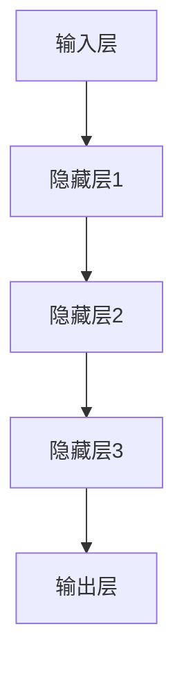
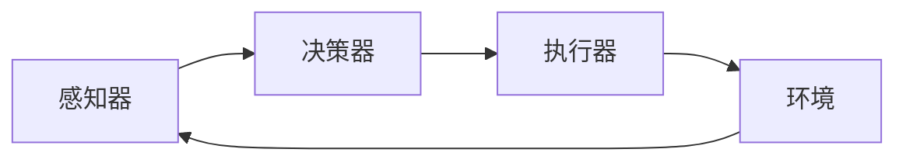

# AI人工智能深度学习算法：智能深度学习代理的性能调整与优化

## 1.背景介绍

### 1.1 人工智能的崛起

近年来,人工智能(AI)技术的快速发展正在深刻影响着各行各业。随着大数据和计算能力的不断提升,机器学习和深度学习等人工智能技术展现出了前所未有的能力,在图像识别、自然语言处理、决策优化等领域取得了令人瞩目的成就。

### 1.2 深度学习的核心地位  

在人工智能的多种技术中,深度学习无疑占据了核心地位。深度学习是一种模仿人脑神经网络结构和工作原理的算法,通过对大量数据的学习,能够自主获取知识并用于解决复杂的问题。其强大的特征提取和模式识别能力使其在计算机视觉、自然语言处理、推荐系统等领域大放异彩。

### 1.3 智能代理的重要性

随着人工智能系统的不断复杂化,智能代理(Intelligent Agent)的概念应运而生。智能代理是指能够感知环境,并基于这些感知做出决策以实现特定目标的软件实体。在现实世界中,智能代理需要具备强大的感知、决策和执行能力,以便灵活应对多变的环境。

### 1.4 性能调优的必要性

然而,构建高性能的智能深度学习代理并非一蹴而就。深度学习模型通常包含大量参数,训练和推理过程计算量巨大,对硬件资源的需求极高。此外,智能代理还需要在有限的计算资源下实时响应,做出高效的决策。因此,优化智能深度学习代理的性能,提高其计算效率和响应速度,是实现高质量人工智能系统的关键一环。

## 2.核心概念与联系

### 2.1 深度神经网络

深度神经网络(Deep Neural Network,DNN)是深度学习的核心模型,它由多个隐藏层组成,每一层都由大量的神经元互连构成。通过对大量训练数据的学习,神经网络可以自动提取特征,并对输入数据进行分类或预测。

常见的深度神经网络架构包括卷积神经网络(CNN)、递归神经网络(RNN)、长短期记忆网络(LSTM)等,它们在计算机视觉、自然语言处理等领域有着广泛的应用。

### 2.2 智能代理架构

智能代理通常由以下几个核心组件构成:

- 感知器(Sensor):用于获取环境信息,如图像、声音、文本等。
- 决策器(Decision Maker):基于感知信息和内部状态,做出相应的决策。
- 执行器(Actuator):根据决策器的指令,对环境进行操作。

智能代理与环境之间是一个持续的交互过程,代理需要不断感知环境变化,并作出相应的决策和行为。

### 2.3 深度强化学习

深度强化学习(Deep Reinforcement Learning,DRL)是将深度神经网络应用于强化学习的一种方法。在强化学习中,智能代理通过不断与环境交互,获得奖励或惩罚,从而学习到最优策略。

深度神经网络可以作为强化学习的决策器,根据当前状态输出最优行为。同时,神经网络也可以用于估计状态价值函数或行为价值函数,指导代理朝着获得最大累积奖励的方向学习。

## 3.核心算法原理具体操作步骤

### 3.1 深度Q网络算法(DQN)

深度Q网络算法是将深度神经网络应用于Q学习的典型算法,它使用神经网络来近似状态行为值函数Q(s,a)。算法的核心步骤如下:

1. 初始化深度神经网络,其输入为状态s,输出为所有可能行为a对应的Q值。
2. 初始化经验回放池(Experience Replay Buffer)用于存储代理与环境的交互数据。
3. 对于每一个时间步:
    - 根据当前策略选择行为a,并在环境中执行该行为,获得下一状态s'、奖励r。
    - 将(s,a,r,s')存入经验回放池。
    - 从经验回放池中随机采样一个批次的数据。
    - 使用当前Q网络计算Q(s,a),使用目标Q网络计算Q(s',a')。
    - 计算损失函数:$L = \mathbb{E}_{(s,a,r,s')\sim D}\left[(r + \gamma\max_{a'}Q(s',a';\theta^-) - Q(s,a;\theta))^2\right]$
    - 使用梯度下降法更新Q网络的参数$\theta$,最小化损失函数L。
    - 每隔一定步数,将Q网络的参数复制到目标Q网络。

4. 重复步骤3,直到收敛。

### 3.2 策略梯度算法(PG)

策略梯度算法直接对代理的策略进行参数化,并通过梯度上升法最大化期望回报。算法步骤如下:

1. 初始化策略网络$\pi_\theta(a|s)$,其输入为状态s,输出为每个行为a的概率分布。
2. 对于每一个episode:
    - 初始化episode的轨迹$\tau = \{(s_0,a_0,r_0),(s_1,a_1,r_1),...\}$
    - 对于每一个时间步t:
        - 根据当前策略$\pi_\theta(a|s_t)$选择行为$a_t$
        - 在环境中执行$a_t$,获得下一状态$s_{t+1}$和奖励$r_t$
        - 将$(s_t,a_t,r_t)$添加到轨迹$\tau$
    - 计算episode的回报$R(\tau) = \sum_{t=0}^{T}\gamma^tr_t$
    - 计算策略梯度:$\nabla_\theta J(\theta) = \mathbb{E}_{\tau\sim\pi_\theta}[R(\tau)\nabla_\theta\log\pi_\theta(\tau)]$
    - 使用梯度上升法更新策略网络参数:$\theta \leftarrow \theta + \alpha\nabla_\theta J(\theta)$

3. 重复步骤2,直到收敛。

### 3.3 Actor-Critic算法

Actor-Critic算法将策略梯度和值函数估计相结合,通过值函数的估计来减小策略梯度的方差,从而提高了算法的稳定性和收敛速度。算法步骤如下:

1. 初始化Actor网络$\pi_\theta(a|s)$和Critic网络$V_\phi(s)$。
2. 对于每一个episode:
    - 初始化episode的轨迹$\tau = \{(s_0,a_0,r_0),(s_1,a_1,r_1),...\}$
    - 对于每一个时间步t:
        - 根据Actor网络$\pi_\theta(a|s_t)$选择行为$a_t$
        - 在环境中执行$a_t$,获得下一状态$s_{t+1}$和奖励$r_t$
        - 将$(s_t,a_t,r_t)$添加到轨迹$\tau$
        - 计算优势函数(Advantage):$A(s_t,a_t) = r_t + \gamma V_\phi(s_{t+1}) - V_\phi(s_t)$
    - 计算Actor网络的策略梯度:$\nabla_\theta J(\theta) = \mathbb{E}_{\tau\sim\pi_\theta}[\sum_t\nabla_\theta\log\pi_\theta(a_t|s_t)A(s_t,a_t)]$
    - 计算Critic网络的值函数损失:$L_V(\phi) = \mathbb{E}_{(s,r,s')\sim\tau}[(r + \gamma V_\phi(s') - V_\phi(s))^2]$
    - 使用梯度上升法更新Actor网络参数:$\theta \leftarrow \theta + \alpha\nabla_\theta J(\theta)$
    - 使用梯度下降法更新Critic网络参数:$\phi \leftarrow \phi - \beta\nabla_\phi L_V(\phi)$

3. 重复步骤2,直到收敛。

## 4.数学模型和公式详细讲解举例说明

### 4.1 Q学习

Q学习是一种基于时间差分的强化学习算法,它试图学习一个行为价值函数Q(s,a),表示在状态s下执行行为a后可获得的期望回报。Q函数满足以下贝尔曼方程:

$$Q(s,a) = \mathbb{E}_{s'\sim P(s'|s,a)}\left[r(s,a,s') + \gamma\max_{a'}Q(s',a')\right]$$

其中,$r(s,a,s')$是在状态s执行行为a后到达状态s'获得的即时奖励,$\gamma$是折现因子,用于权衡当前奖励和未来奖励的重要性。

Q学习的目标是找到一个最优的Q函数$Q^*(s,a)$,使得对于任意状态s,执行$\arg\max_aQ^*(s,a)$就能获得最大的期望回报。

为了求解最优Q函数,Q学习采用了一种基于时间差分的迭代更新方式:

$$Q(s_t,a_t) \leftarrow Q(s_t,a_t) + \alpha\left[r_t + \gamma\max_{a'}Q(s_{t+1},a') - Q(s_t,a_t)\right]$$

其中,$\alpha$是学习率,用于控制更新的步长。通过不断与环境交互并更新Q函数,最终可以收敛到最优的Q^*函数。

### 4.2 策略梯度

策略梯度算法直接对代理的策略$\pi_\theta(a|s)$进行参数化,并试图最大化期望回报$J(\theta)$:

$$J(\theta) = \mathbb{E}_{\tau\sim\pi_\theta}\left[\sum_{t=0}^{T}r(s_t,a_t)\right]$$

其中,$\tau$表示一个由状态序列和行为序列组成的轨迹,符号$\sim$表示该轨迹是由策略$\pi_\theta$生成的。

为了最大化$J(\theta)$,我们可以计算其关于策略参数$\theta$的梯度:

$$\nabla_\theta J(\theta) = \mathbb{E}_{\tau\sim\pi_\theta}\left[\sum_{t=0}^{T}\nabla_\theta\log\pi_\theta(a_t|s_t)Q^{\pi_\theta}(s_t,a_t)\right]$$

其中,$Q^{\pi_\theta}(s_t,a_t)$是在策略$\pi_\theta$下,状态s_t执行行为a_t后的期望回报。

通过梯度上升法不断更新策略参数$\theta$,就可以最大化期望回报$J(\theta)$,从而获得最优策略。

### 4.3 Actor-Critic算法

Actor-Critic算法将策略梯度和值函数估计相结合,使用值函数的估计来减小策略梯度的方差,提高算法的稳定性和收敛速度。

在Actor-Critic算法中,Actor网络$\pi_\theta(a|s)$用于生成策略,而Critic网络$V_\phi(s)$用于估计状态价值函数。

Actor网络的目标是最大化期望回报:

$$J(\theta) = \mathbb{E}_{\tau\sim\pi_\theta}\left[\sum_{t=0}^{T}r(s_t,a_t)\right]$$

其梯度可以表示为:

$$\nabla_\theta J(\theta) = \mathbb{E}_{\tau\sim\pi_\theta}\left[\sum_{t=0}^{T}\nabla_\theta\log\pi_\theta(a_t|s_t)A(s_t,a_t)\right]$$

其中,$A(s_t,a_t)$是优势函数(Advantage Function),表示在状态s_t下执行行为a_t相对于当前策略的优势程度,定义为:

$$A(s_t,a_t) = Q^{\pi_\theta}(s_t,a_t) - V_\phi(s_t)$$

Critic网络的目标是最小化状态价值函数的均方误差:

$$L_V(\phi) = \mathbb{E}_{(s,r,s')\sim\tau}\left[(r + \gamma V_\phi(s') - V_\phi(s))^2\right]$$

通过交替更新Actor网络和Critic网络的参数,就可以同时优化策略和值函数估计,从而