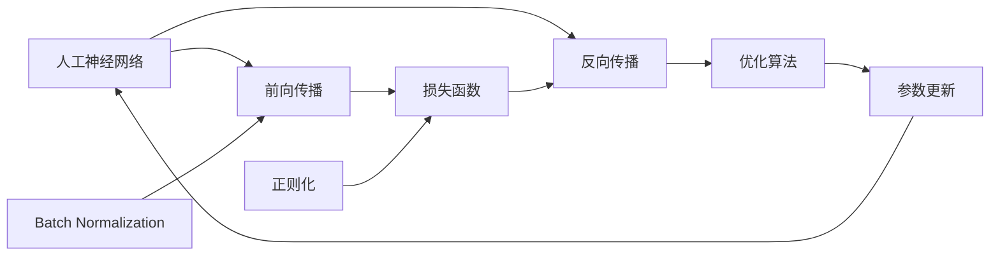

# AI人工智能深度学习算法：模型优化与参数调整

## 1. 背景介绍
### 1.1 人工智能与深度学习的兴起
人工智能(Artificial Intelligence, AI)作为计算机科学的一个分支,旨在研究如何让机器模拟人类的智能行为。近年来,随着计算机硬件性能的飞速提升和大数据时代的到来,人工智能技术得到了空前的发展。其中,深度学习(Deep Learning, DL)作为人工智能的一个重要分支,更是受到学术界和工业界的广泛关注。

深度学习是一种基于人工神经网络(Artificial Neural Network, ANN)的机器学习方法。通过构建多层神经网络并使用大量数据进行训练,深度学习模型能够自动学习数据中的特征表示,并应用于图像识别、语音识别、自然语言处理等诸多领域,取得了远超传统机器学习方法的性能。

### 1.2 深度学习面临的挑战
尽管深度学习取得了瞩目的成就,但在实际应用中仍然面临诸多挑战:

1. 模型复杂度高,训练时间长。深度学习模型通常包含数以百万计的参数,训练过程非常耗时。
2. 容易过拟合。由于模型复杂度高,如果训练数据不足或正则化方法不当,很容易导致过拟合。
3. 超参数调优困难。深度学习模型包含许多超参数,如学习率、批量大小、网络层数等,调优这些超参数需要大量的时间和经验。
4. 可解释性差。深度学习模型是一个"黑盒",人们很难解释其内部工作原理,这限制了其在某些领域的应用。

因此,如何优化深度学习模型、提高训练效率和泛化性能,成为当前深度学习领域的重要研究课题。

### 1.3 本文的主要内容
本文将围绕深度学习模型优化与参数调整这一主题,详细介绍几种主流的优化算法和参数调整策略。内容安排如下:

1. 介绍深度学习的核心概念,如神经网络、前向传播、反向传播、损失函数等。
2. 详细讲解几种常用的优化算法,包括随机梯度下降(SGD)、动量(Momentum)、自适应学习率(AdaGrad、RMSProp、Adam)等。
3. 介绍模型正则化方法,如L1/L2正则化、Dropout、早停法等,以及Batch Normalization等训练加速技术。 
4. 给出参数初始化和学习率调整的策略和技巧。
5. 通过实例代码演示如何在Pytorch等深度学习框架中应用这些优化和调参方法。
6. 总结优化和调参的一般性原则,展望未来的研究方向。

希望通过本文的讲解,读者能够系统地掌握深度学习模型优化与参数调整的方法,提高深度学习模型的性能,并将其应用到实际问题中去。

## 2. 核心概念与联系
### 2.1 人工神经网络
人工神经网络(ANN)是深度学习的基础。它模仿了人脑神经元的结构和工作方式,由大量的节点(神经元)和连接(权重)组成。一个典型的前馈神经网络包含输入层、隐藏层和输出层,每层由多个节点组成,相邻两层之间的节点通过权重连接。

### 2.2 前向传播与反向传播
前向传播是神经网络的预测过程。输入数据经过逐层计算,每个节点先计算加权和,再通过激活函数得到输出值,最终得到网络的预测输出。

反向传播是神经网络的训练过程。通过比较预测输出与真实标签,计算损失函数,然后按照链式法则,将损失函数的梯度反向传播到每个权重,并根据梯度下降法更新权重,使得网络的预测结果不断逼近真实标签。

### 2.3 损失函数
损失函数衡量了神经网络的预测输出与真实标签之间的差异。常见的损失函数包括均方误差(MSE)、交叉熵(Cross Entropy)等。神经网络的训练目标就是最小化损失函数。

### 2.4 优化算法
优化算法是指在反向传播过程中,如何根据梯度信息更新网络权重的方法。随机梯度下降(SGD)是最基础的优化算法,它以固定的学习率沿着损失函数梯度的反方向更新权重。此外还有momentum、AdaGrad、RMSProp、Adam等改进算法。

### 2.5 正则化
正则化是一类防止模型过拟合的方法。L1和L2正则化通过在损失函数中加入权重的L1范数或L2范数,使得模型倾向于学习更小的权重。Dropout通过在训练过程中随机关闭一部分神经元,提高模型的鲁棒性。早停法通过在验证集上监控模型性能,在性能开始下降时停止训练。

### 2.6 Batch Normalization
Batch Normalization(BN)是一种加速神经网络训练的技术。通过在每个隐藏层引入归一化操作,使得每层的输入数据分布保持稳定,从而降低了网络对参数初始化和学习率的敏感度,加速了训练过程。

下面是这些核心概念之间的联系:

## 3. 核心算法原理与具体步骤
### 3.1 随机梯度下降(SGD)
随机梯度下降是最基础的优化算法。它的基本思想是:每次从训练集中随机抽取一个小批量(mini-batch)的样本,计算这个mini-batch上的损失函数梯度,然后沿梯度反方向更新模型参数。重复这个过程,直到模型收敛。

具体步骤如下:
1. 初始化模型参数$w$
2. 重复以下步骤直到收敛:
   a. 从训练集中随机抽取一个mini-batch的样本 
   b. 前向传播计算预测输出 
   c. 计算损失函数$L(w)$关于当前mini-batch的梯度$g$
   d. 更新参数: $w = w - \alpha \cdot g$,其中$\alpha$为学习率

### 3.2 Momentum
Momentum是对SGD的一种改进,它引入了动量的概念。与SGD不同,Momentum会维护一个速度向量$v$,用于记录之前梯度的指数衰减平均。在更新参数时,Momentum不仅考虑当前梯度,还考虑了之前梯度的累积动量,这有助于加速收敛并减少震荡。

具体步骤如下:
1. 初始化参数$w$和速度$v$
2. 重复以下步骤直到收敛:  
   a. 从训练集中随机抽取一个mini-batch的样本
   b. 前向传播计算预测输出
   c. 计算损失函数$L(w)$关于当前mini-batch的梯度$g$
   d. 更新速度: $v = \beta \cdot v + g$,其中$\beta$为动量系数
   e. 更新参数: $w = w - \alpha \cdot v$

### 3.3 自适应学习率算法(AdaGrad、RMSProp、Adam)
SGD和Momentum使用全局学习率,对所有参数一视同仁。但实际上,不同参数的更新频率和幅度可能差异很大。自适应学习率算法根据每个参数的历史梯度信息,自动调整其学习率。

#### AdaGrad
AdaGrad会记录每个参数的历史梯度平方和,用于调整学习率。具体地,参数$w_i$在第$t$步的更新公式为:

$$w_i^{(t+1)} = w_i^{(t)} - \frac{\alpha}{\sqrt{G_i^{(t)}+\epsilon}} \cdot g_i^{(t)}$$

其中$g_i^{(t)}$是参数$w_i$在第$t$步的梯度,$G_i^{(t)}$是$w_i$前$t$步梯度平方和,$\epsilon$是平滑项(避免分母为0)。

可以看出,梯度平方和$G_i^{(t)}$越大,学习率就越小。这意味着更新频繁的参数学习率会逐渐变小,而很少更新的参数学习率会保持较大。

#### RMSProp
RMSProp在AdaGrad的基础上,对梯度平方和引入了指数衰减,使其能够适应非平稳问题。参数$w_i$在第$t$步的更新公式为:

$$
\begin{aligned}
E[g^2]_i^{(t)} &= \beta \cdot E[g^2]_i^{(t-1)} + (1-\beta) \cdot (g_i^{(t)})^2 \\
w_i^{(t+1)} &= w_i^{(t)} - \frac{\alpha}{\sqrt{E[g^2]_i^{(t)}+\epsilon}} \cdot g_i^{(t)}
\end{aligned}
$$

其中$E[g^2]_i^{(t)}$是$w_i$前$t$步梯度平方的指数加权移动平均,$\beta$是衰减率。

#### Adam
Adam结合了Momentum和RMSProp,同时维护了梯度的指数加权移动平均$m$和梯度平方的指数加权移动平均$v$。参数更新公式为:

$$
\begin{aligned}
m_i^{(t)} &= \beta_1 \cdot m_i^{(t-1)} + (1-\beta_1) \cdot g_i^{(t)} \\
v_i^{(t)} &= \beta_2 \cdot v_i^{(t-1)} + (1-\beta_2) \cdot (g_i^{(t)})^2 \\
\hat{m}_i^{(t)} &= \frac{m_i^{(t)}}{1-\beta_1^t} \\
\hat{v}_i^{(t)} &= \frac{v_i^{(t)}}{1-\beta_2^t} \\
w_i^{(t+1)} &= w_i^{(t)} - \frac{\alpha}{\sqrt{\hat{v}_i^{(t)}}+\epsilon} \cdot \hat{m}_i^{(t)}
\end{aligned}
$$

其中$\beta_1$和$\beta_2$是衰减率,$\hat{m}_i^{(t)}$和$\hat{v}_i^{(t)}$是对$m_i^{(t)}$和$v_i^{(t)}$的偏差修正。

Adam通过自适应调整每个参数的学习率,结合了Momentum的动量属性和RMSProp对梯度平方的缩放,是目前使用最广泛的优化算法之一。

## 4. 数学模型与公式推导
本节我们详细推导随机梯度下降、Momentum和Adam算法的数学模型和更新公式。考虑一个简单的线性回归模型:

$$\hat{y} = w^T x + b$$

其中$w$是权重向量,$b$是偏置,$x$是输入特征。假设训练集为$\{(x_1,y_1), (x_2,y_2), ..., (x_N,y_N)\}$,我们使用均方误差作为损失函数:

$$L(w,b) = \frac{1}{N} \sum_{i=1}^N (\hat{y}_i - y_i)^2 = \frac{1}{N} \sum_{i=1}^N (w^T x_i + b - y_i)^2$$

### 4.1 随机梯度下降(SGD)
SGD的目标是找到损失函数$L(w,b)$的最小值点。根据梯度下降法,参数$w$和$b$的更新公式为:

$$
\begin{aligned}
w^{(t+1)} &= w^{(t)} - \alpha \cdot \frac{\partial L}{\partial w}|_{w^{(t)}} \\
b^{(t+1)} &= b^{(t)} - \alpha \cdot \frac{\partial L}{\partial b}|_{b^{(t)}}
\end{aligned}
$$

其中$\alpha$是学习率。对于均方误差损失函数,偏导数为:

$$
\begin{aligned}
\frac{\partial L}{\partial w} &= \frac{2}{N} \sum_{i=1}^N (w^T x_i + b - y_i) \cdot x_i \\
\frac{\partial L}{\partial b} &= \frac{2}{N} \sum_{i=1}^