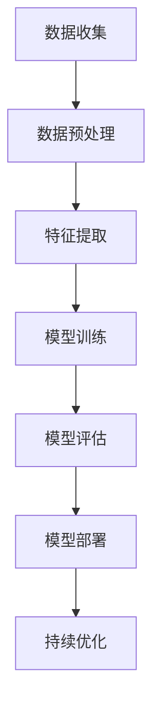

# AI人工智能深度学习算法：自然语言处理在工作流代理中的运用

## 1.背景介绍

在当今数字化转型的浪潮中，人工智能（AI）和深度学习（DL）技术正在迅速改变各行各业的工作方式。特别是自然语言处理（NLP）技术的进步，使得机器能够理解和生成人类语言，从而在工作流代理中发挥重要作用。工作流代理是指通过自动化技术来管理和执行业务流程，以提高效率和减少人为错误。本文将深入探讨NLP在工作流代理中的应用，揭示其核心算法、数学模型、实际应用场景以及未来发展趋势。

## 2.核心概念与联系

### 2.1 自然语言处理（NLP）

自然语言处理是计算机科学、人工智能和语言学的交叉领域，旨在使计算机能够理解、解释和生成人类语言。NLP的核心任务包括文本分类、情感分析、机器翻译、问答系统等。

### 2.2 深度学习（DL）

深度学习是机器学习的一个子领域，利用多层神经网络来模拟人脑的工作方式。深度学习在图像识别、语音识别和自然语言处理等领域取得了显著的成果。

### 2.3 工作流代理

工作流代理是指通过自动化技术来管理和执行业务流程。它可以显著提高工作效率，减少人为错误，并提供更高的灵活性和可扩展性。

### 2.4 核心联系

NLP和DL技术在工作流代理中的应用主要体现在以下几个方面：
- 自动化文本处理：通过NLP技术，工作流代理可以自动处理和理解大量的文本数据。
- 智能决策：利用深度学习模型，工作流代理可以进行复杂的决策和预测。
- 自然语言生成：通过NLP技术，工作流代理可以生成自然语言文本，用于报告生成、客户服务等。

## 3.核心算法原理具体操作步骤

### 3.1 预处理

在进行任何NLP任务之前，首先需要对文本数据进行预处理。预处理步骤包括分词、去除停用词、词干提取等。

### 3.2 特征提取

特征提取是将文本数据转换为机器学习模型可以理解的形式。常用的方法包括词袋模型（Bag of Words）、TF-IDF（Term Frequency-Inverse Document Frequency）和词向量（Word Embeddings）。

### 3.3 模型训练

在特征提取之后，需要选择合适的深度学习模型进行训练。常用的模型包括卷积神经网络（CNN）、循环神经网络（RNN）和变换器（Transformer）。

### 3.4 模型评估

模型训练完成后，需要对模型进行评估。常用的评估指标包括准确率、精确率、召回率和F1分数。

### 3.5 部署与优化

最后，将训练好的模型部署到生产环境中，并进行持续优化，以提高模型的性能和稳定性。

以下是一个简单的Mermaid流程图，展示了NLP在工作流代理中的基本流程：



## 4.数学模型和公式详细讲解举例说明

### 4.1 词袋模型（Bag of Words）

词袋模型是一种简单而有效的特征提取方法。它将文本表示为词频向量，忽略词的顺序。

$$
\text{TF}(t,d) = \frac{f_{t,d}}{\sum_{t'} f_{t',d}}
$$

其中，$f_{t,d}$ 表示词 $t$ 在文档 $d$ 中出现的次数。

### 4.2 TF-IDF

TF-IDF是一种改进的词袋模型，它不仅考虑词频，还考虑词在整个语料库中的逆文档频率。

$$
\text{IDF}(t,D) = \log \frac{N}{|\{d \in D : t \in d\}|}
$$

其中，$N$ 是文档总数，$|\{d \in D : t \in d\}|$ 是包含词 $t$ 的文档数。

### 4.3 词向量（Word Embeddings）

词向量是将词映射到连续向量空间的技术。常用的方法包括Word2Vec和GloVe。

$$
\text{Word2Vec}(w) = \frac{1}{|C(w)|} \sum_{c \in C(w)} v_c
$$

其中，$C(w)$ 是词 $w$ 的上下文窗口，$v_c$ 是上下文词 $c$ 的向量表示。

### 4.4 循环神经网络（RNN）

RNN是一种适用于序列数据的神经网络。其核心公式为：

$$
h_t = \sigma(W_h h_{t-1} + W_x x_t + b)
$$

其中，$h_t$ 是时间步 $t$ 的隐藏状态，$x_t$ 是输入，$W_h$ 和 $W_x$ 是权重矩阵，$b$ 是偏置，$\sigma$ 是激活函数。

### 4.5 变换器（Transformer）

变换器是一种基于自注意力机制的模型，广泛应用于NLP任务。其核心公式为：

$$
\text{Attention}(Q, K, V) = \text{softmax}\left(\frac{QK^T}{\sqrt{d_k}}\right)V
$$

其中，$Q$ 是查询矩阵，$K$ 是键矩阵，$V$ 是值矩阵，$d_k$ 是键的维度。

## 5.项目实践：代码实例和详细解释说明

### 5.1 数据预处理

```python
import nltk
from nltk.corpus import stopwords
from nltk.tokenize import word_tokenize

# 下载停用词
nltk.download('stopwords')
nltk.download('punkt')

# 示例文本
text = "自然语言处理是人工智能的一个重要领域。"

# 分词
tokens = word_tokenize(text)

# 去除停用词
filtered_tokens = [word for word in tokens if word not in stopwords.words('chinese')]

print(filtered_tokens)
```

### 5.2 特征提取

```python
from sklearn.feature_extraction.text import TfidfVectorizer

# 示例文本
documents = ["自然语言处理是人工智能的一个重要领域。", "深度学习在自然语言处理中的应用越来越广泛。"]

# TF-IDF特征提取
vectorizer = TfidfVectorizer()
tfidf_matrix = vectorizer.fit_transform(documents)

print(tfidf_matrix.toarray())
```

### 5.3 模型训练

```python
import tensorflow as tf
from tensorflow.keras.models import Sequential
from tensorflow.keras.layers import Dense, LSTM, Embedding

# 示例数据
X_train = [[1, 2, 3], [4, 5, 6]]
y_train = [0, 1]

# 模型定义
model = Sequential()
model.add(Embedding(input_dim=10, output_dim=8))
model.add(LSTM(16))
model.add(Dense(1, activation='sigmoid'))

# 模型编译
model.compile(optimizer='adam', loss='binary_crossentropy', metrics=['accuracy'])

# 模型训练
model.fit(X_train, y_train, epochs=10)
```

### 5.4 模型评估

```python
# 示例数据
X_test = [[7, 8, 9]]
y_test = [1]

# 模型评估
loss, accuracy = model.evaluate(X_test, y_test)
print(f'Loss: {loss}, Accuracy: {accuracy}')
```

### 5.5 部署与优化

```python
import joblib

# 保存模型
joblib.dump(model, 'model.pkl')

# 加载模型
loaded_model = joblib.load('model.pkl')

# 模型预测
predictions = loaded_model.predict(X_test)
print(predictions)
```

## 6.实际应用场景

### 6.1 客户服务

NLP技术可以用于自动化客户服务，通过分析客户的自然语言输入，提供智能回复和解决方案。例如，聊天机器人可以处理常见问题，减少人工客服的工作量。

### 6.2 文档管理

在文档管理系统中，NLP技术可以自动分类和索引文档，提高检索效率。例如，通过情感分析，可以自动标记情感倾向，帮助企业更好地理解客户反馈。

### 6.3 数据分析

NLP技术可以用于大规模文本数据的分析和挖掘。例如，通过主题模型，可以自动提取文本中的主题，帮助企业发现潜在的市场趋势。

### 6.4 医疗健康

在医疗健康领域，NLP技术可以用于电子病历的自动化处理和分析。例如，通过命名实体识别，可以自动提取病人信息，提高医疗服务的效率和准确性。

## 7.工具和资源推荐

### 7.1 工具

- **NLTK**：一个强大的Python库，用于自然语言处理。
- **spaCy**：一个高效的自然语言处理库，支持多种语言。
- **TensorFlow**：一个开源的深度学习框架，广泛应用于NLP任务。
- **PyTorch**：另一个流行的深度学习框架，具有灵活的动态计算图。

### 7.2 资源

- **《深度学习》**：一本经典的深度学习教材，详细介绍了深度学习的基本概念和算法。
- **《自然语言处理入门》**：一本适合初学者的NLP教材，涵盖了NLP的基本任务和技术。
- **Coursera**：提供多种NLP和深度学习的在线课程。
- **Kaggle**：一个数据科学竞赛平台，提供丰富的NLP数据集和竞赛。

## 8.总结：未来发展趋势与挑战

### 8.1 未来发展趋势

- **多模态学习**：结合文本、图像、语音等多种模态的数据，提升模型的理解能力。
- **自监督学习**：通过自监督学习技术，减少对标注数据的依赖，提高模型的泛化能力。
- **边缘计算**：将NLP模型部署到边缘设备上，提高响应速度和隐私保护。

### 8.2 挑战

- **数据隐私**：在处理敏感数据时，如何保护用户隐私是一个重要的挑战。
- **模型解释性**：深度学习模型的黑箱性质使得其解释性较差，需要开发更好的解释方法。
- **计算资源**：训练大型NLP模型需要大量的计算资源，如何优化计算效率是一个关键问题。

## 9.附录：常见问题与解答

### 9.1 什么是自然语言处理？

自然语言处理是计算机科学、人工智能和语言学的交叉领域，旨在使计算机能够理解、解释和生成人类语言。

### 9.2 深度学习在NLP中的应用有哪些？

深度学习在NLP中的应用包括文本分类、情感分析、机器翻译、问答系统等。

### 9.3 如何选择合适的NLP工具？

选择NLP工具时，可以根据任务的具体需求和工具的性能、易用性等因素进行综合考虑。例如，NLTK适合初学者，spaCy适合高效处理，TensorFlow和PyTorch适合深度学习任务。

### 9.4 NLP模型的评估指标有哪些？

常用的评估指标包括准确率、精确率、召回率和F1分数。

### 9.5 如何保护NLP模型中的数据隐私？

可以通过数据加密、差分隐私等技术来保护NLP模型中的数据隐私。

---

作者：禅与计算机程序设计艺术 / Zen and the Art of Computer Programming