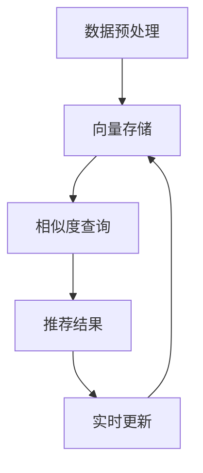

# AI向量数据库在实时推荐系统中的应用

## 1.背景介绍

在当今信息爆炸的时代，推荐系统已经成为各大互联网平台不可或缺的组成部分。无论是电商平台的商品推荐，还是社交媒体的内容推荐，推荐系统都在帮助用户发现他们感兴趣的内容。然而，随着数据量的不断增加和用户需求的多样化，传统的推荐系统面临着巨大的挑战。AI向量数据库的出现，为实时推荐系统提供了一种全新的解决方案。

AI向量数据库是一种专门用于存储和查询高维向量数据的数据库。它利用向量化技术，将复杂的数据转换为高维向量，并通过高效的相似度计算，实现快速的查询和推荐。本文将深入探讨AI向量数据库在实时推荐系统中的应用，介绍其核心概念、算法原理、数学模型、项目实践、实际应用场景、工具和资源推荐，并展望其未来发展趋势与挑战。

## 2.核心概念与联系

### 2.1 向量化技术

向量化技术是AI向量数据库的核心。它将复杂的数据（如文本、图像、音频等）转换为高维向量，使得这些数据可以在向量空间中进行操作。向量化技术的关键在于如何选择合适的特征和维度，以确保向量能够准确地表示原始数据的特性。

### 2.2 相似度计算

相似度计算是推荐系统的基础。通过计算用户与物品之间的相似度，推荐系统可以为用户推荐最相关的内容。常见的相似度计算方法包括欧氏距离、余弦相似度、曼哈顿距离等。AI向量数据库通过高效的相似度计算算法，实现了快速的查询和推荐。

### 2.3 实时推荐系统

实时推荐系统需要在极短的时间内为用户提供个性化的推荐。这要求系统具备高效的数据处理能力和快速的响应速度。AI向量数据库通过高效的向量化和相似度计算技术，满足了实时推荐系统的需求。

## 3.核心算法原理具体操作步骤

### 3.1 数据预处理

数据预处理是推荐系统的第一步。它包括数据清洗、特征提取和向量化。数据清洗是为了去除噪声和无效数据，特征提取是为了从原始数据中提取有用的信息，向量化是为了将特征转换为高维向量。

### 3.2 向量存储

向量存储是AI向量数据库的核心功能。它需要高效地存储和管理大量的高维向量数据。常见的向量存储结构包括稀疏矩阵、哈希表和树结构等。

### 3.3 相似度查询

相似度查询是推荐系统的关键步骤。它通过计算用户与物品之间的相似度，为用户推荐最相关的内容。AI向量数据库通过高效的相似度计算算法，实现了快速的查询和推荐。

### 3.4 实时更新

实时更新是实时推荐系统的重要特性。它要求系统能够在数据变化时，及时更新向量和相似度计算结果。AI向量数据库通过高效的数据处理和更新机制，满足了实时更新的需求。

以下是AI向量数据库在实时推荐系统中的基本流程图：



## 4.数学模型和公式详细讲解举例说明

### 4.1 向量化公式

向量化公式是将原始数据转换为高维向量的关键。假设我们有一个文本数据 $T$，我们可以使用词袋模型（Bag of Words）将其转换为向量。具体公式如下：

$$
\mathbf{v}(T) = [f_1(T), f_2(T), \ldots, f_n(T)]
$$

其中，$f_i(T)$ 表示词汇表中第 $i$ 个词在文本 $T$ 中的出现频率。

### 4.2 相似度计算公式

相似度计算公式用于计算两个向量之间的相似度。常见的相似度计算方法包括欧氏距离和余弦相似度。欧氏距离的公式如下：

$$
d(\mathbf{v}_1, \mathbf{v}_2) = \sqrt{\sum_{i=1}^n (\mathbf{v}_1[i] - \mathbf{v}_2[i])^2}
$$

余弦相似度的公式如下：

$$
\text{cos}(\mathbf{v}_1, \mathbf{v}_2) = \frac{\mathbf{v}_1 \cdot \mathbf{v}_2}{\|\mathbf{v}_1\| \|\mathbf{v}_2\|}
$$

### 4.3 实例说明

假设我们有两个文本数据 $T_1$ 和 $T_2$，通过词袋模型将其转换为向量 $\mathbf{v}(T_1)$ 和 $\mathbf{v}(T_2)$。我们可以使用余弦相似度计算它们之间的相似度：

$$
\text{cos}(\mathbf{v}(T_1), \mathbf{v}(T_2)) = \frac{\mathbf{v}(T_1) \cdot \mathbf{v}(T_2)}{\|\mathbf{v}(T_1)\| \|\mathbf{v}(T_2)\|}
$$

## 5.项目实践：代码实例和详细解释说明

### 5.1 数据预处理

以下是一个简单的Python代码示例，展示了如何进行数据预处理和向量化：

```python
from sklearn.feature_extraction.text import CountVectorizer

# 示例文本数据
texts = ["这是一个推荐系统的示例", "AI向量数据库在实时推荐系统中的应用"]

# 词袋模型向量化
vectorizer = CountVectorizer()
X = vectorizer.fit_transform(texts)

print(X.toarray())
```

### 5.2 向量存储

以下是一个简单的Python代码示例，展示了如何使用NumPy存储向量数据：

```python
import numpy as np

# 示例向量数据
vectors = np.array([[1, 2, 3], [4, 5, 6]])

# 存储向量数据
np.save('vectors.npy', vectors)

# 加载向量数据
loaded_vectors = np.load('vectors.npy')
print(loaded_vectors)
```

### 5.3 相似度查询

以下是一个简单的Python代码示例，展示了如何计算向量之间的余弦相似度：

```python
from sklearn.metrics.pairwise import cosine_similarity

# 示例向量数据
vectors = np.array([[1, 2, 3], [4, 5, 6]])

# 计算余弦相似度
similarity = cosine_similarity(vectors)
print(similarity)
```

### 5.4 实时更新

以下是一个简单的Python代码示例，展示了如何进行向量数据的实时更新：

```python
# 示例向量数据
vectors = np.array([[1, 2, 3], [4, 5, 6]])

# 新的向量数据
new_vector = np.array([7, 8, 9])

# 实时更新向量数据
vectors = np.vstack([vectors, new_vector])
print(vectors)
```

## 6.实际应用场景

### 6.1 电商平台

在电商平台中，推荐系统可以根据用户的浏览历史和购买记录，为用户推荐相关的商品。AI向量数据库可以高效地存储和查询用户和商品的向量数据，实现快速的推荐。

### 6.2 社交媒体

在社交媒体中，推荐系统可以根据用户的兴趣和行为，为用户推荐相关的内容。AI向量数据库可以高效地存储和查询用户和内容的向量数据，实现个性化的推荐。

### 6.3 音乐和视频平台

在音乐和视频平台中，推荐系统可以根据用户的播放历史和喜好，为用户推荐相关的音乐和视频。AI向量数据库可以高效地存储和查询用户和媒体的向量数据，实现精准的推荐。

## 7.工具和资源推荐

### 7.1 向量数据库

- **Milvus**：一个开源的向量数据库，支持高效的向量存储和查询。
- **Faiss**：Facebook AI Research开发的一个高效相似性搜索库，适用于大规模向量数据。

### 7.2 向量化工具

- **Word2Vec**：Google开发的一个词向量化工具，适用于文本数据的向量化。
- **GloVe**：斯坦福大学开发的一个词向量化工具，适用于文本数据的向量化。

### 7.3 相似度计算工具

- **Scikit-learn**：一个Python机器学习库，提供了多种相似度计算方法。
- **Annoy**：Spotify开发的一个高效相似性搜索库，适用于大规模向量数据。

## 8.总结：未来发展趋势与挑战

AI向量数据库在实时推荐系统中的应用，展示了其强大的数据处理和查询能力。随着数据量的不断增加和用户需求的多样化，AI向量数据库将面临更大的挑战。未来的发展趋势包括：

- **更高效的向量化技术**：随着深度学习技术的发展，向量化技术将变得更加高效和准确。
- **更快速的相似度计算**：通过优化算法和硬件加速，相似度计算的速度将进一步提升。
- **更智能的推荐系统**：结合用户行为分析和情感分析，推荐系统将变得更加智能和个性化。

然而，AI向量数据库也面临一些挑战，如数据隐私和安全问题、向量数据的存储和管理问题等。解决这些问题，将是未来研究的重点。

## 9.附录：常见问题与解答

### 9.1 什么是AI向量数据库？

AI向量数据库是一种专门用于存储和查询高维向量数据的数据库。它利用向量化技术，将复杂的数据转换为高维向量，并通过高效的相似度计算，实现快速的查询和推荐。

### 9.2 向量化技术的关键是什么？

向量化技术的关键在于如何选择合适的特征和维度，以确保向量能够准确地表示原始数据的特性。

### 9.3 实时推荐系统的核心是什么？

实时推荐系统的核心在于高效的数据处理能力和快速的响应速度。AI向量数据库通过高效的向量化和相似度计算技术，满足了实时推荐系统的需求。

### 9.4 如何选择合适的相似度计算方法？

选择合适的相似度计算方法，取决于数据的特性和应用场景。常见的相似度计算方法包括欧氏距离、余弦相似度、曼哈顿距离等。

### 9.5 AI向量数据库的未来发展趋势是什么？

AI向量数据库的未来发展趋势包括更高效的向量化技术、更快速的相似度计算和更智能的推荐系统。

---

作者：禅与计算机程序设计艺术 / Zen and the Art of Computer Programming