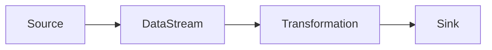

## 1.背景介绍

Apache Flink是一个开源流处理框架，它能够以高性能、高可靠性、低延迟的方式处理无限和有限的数据集。随着大数据和实时分析的普及，Flink在各种行业场景中的应用日益广泛，包括实时报告、实时推荐、实时预警等。本文将详细介绍Flink的基本概念、原理，并通过代码实战案例帮助读者掌握如何在AI系统中应用Flink。

## 2.核心概念与联系

Flink基于流处理模型，它的核心概念包括DataStream、Transformation、Sink和Source。其中，DataStream是Flink处理的数据流，Transformation是对DataStream的操作，Sink是数据流的输出，Source是数据流的输入。这些概念之间的关系可以通过下面的Mermaid流程图进行表示：



## 3.核心算法原理具体操作步骤

Flink的核心算法原理包括流处理、窗口操作、状态管理和容错机制。

### 3.1 流处理

Flink的流处理是基于事件驱动的，它可以处理无界和有界的数据流。无界数据流是指数据流的大小无法预知，例如实时的用户行为数据；有界数据流是指数据流的大小已知，例如历史的订单数据。

### 3.2 窗口操作

窗口操作是Flink进行时间和数量聚合的重要手段，它可以定义在一个固定的时间间隔或者数量间隔上。窗口操作可以处理延迟的数据，并能够保证在窗口关闭后的一段时间内仍能接收到的数据。

### 3.3 状态管理

Flink的状态管理是基于分布式快照的，它可以保证在发生故障时，系统能够从最近的快照恢复。

### 3.4 容错机制

Flink的容错机制是基于Chandy-Lamport算法的，它可以保证在发生故障时，系统能够从最近的检查点恢复。

## 4.数学模型和公式详细讲解举例说明

Flink的窗口操作可以通过滑动窗口模型进行描述。滑动窗口模型的大小为$w$，滑动步长为$s$。如果有$n$个数据项，那么窗口的数量为$\lceil \frac{n-w}{s} \rceil + 1$。例如，如果数据项的数量为10，窗口的大小为3，滑动步长为2，那么窗口的数量为$\lceil \frac{10-3}{2} \rceil + 1 = 5$。

## 5.项目实践：代码实例和详细解释说明

下面是一个使用Flink进行流处理的代码实例，它从SocketSource读取数据，然后使用FlatMapTransformation进行分词，最后使用ReduceTransformation进行词频统计，并将结果输出到PrintSink。

```java
public class WordCount {
    public static void main(String[] args) throws Exception {
        StreamExecutionEnvironment env = StreamExecutionEnvironment.getExecutionEnvironment();
        DataStream<String> text = env.socketTextStream("localhost", 9999);

        DataStream<Tuple2<String, Integer>> counts = text
                .flatMap(new Tokenizer())
                .keyBy(0)
                .reduce(new ReduceFunction<Tuple2<String, Integer>>() {
                    @Override
                    public Tuple2<String, Integer> reduce(Tuple2<String, Integer> a, Tuple2<String, Integer> b) {
                        return new Tuple2<>(a.f0, a.f1 + b.f1);
                    }
                });

        counts.print();

        env.execute("WordCount");
    }

    public static final class Tokenizer implements FlatMapFunction<String, Tuple2<String, Integer>> {
        @Override
        public void flatMap(String value, Collector<Tuple2<String, Integer>> out) {
            String[] words = value.toLowerCase().split("\\W+");
            for (String word : words) {
                if (word.length() > 0) {
                    out.collect(new Tuple2<>(word, 1));
                }
            }
        }
    }
}
```

## 6.实际应用场景

Flink在各种行业场景中都有广泛的应用，例如：

- 在金融领域，Flink可以用于实时风控，通过分析用户的实时行为数据，发现异常行为并进行预警。
- 在电商领域，Flink可以用于实时推荐，通过分析用户的实时行为数据，实时更新用户的兴趣模型，并推送相关的商品。
- 在物联网领域，Flink可以用于实时监控，通过分析设备的实时数据，发现设备的异常状态并进行预警。

## 7.工具和资源推荐

如果你想深入学习和使用Flink，以下是一些有用的工具和资源：

- Apache Flink官方网站：https://flink.apache.org/
- Apache Flink GitHub仓库：https://github.com/apache/flink
- Apache Flink用户邮件列表：https://flink.apache.org/community.html#mailing-lists
- Apache Flink论坛：https://flink.apache.org/community.html#forums

## 8.总结：未来发展趋势与挑战

随着大数据和实时分析的普及，Flink的应用将更加广泛。但是，Flink也面临着一些挑战，例如如何处理数据的延迟和乱序，如何保证系统的可扩展性和稳定性，以及如何提高系统的易用性。

## 9.附录：常见问题与解答

1. 问：Flink和Spark Streaming有什么区别？
答：Flink和Spark Streaming都是流处理框架，但是它们的处理模型不同。Spark Streaming是基于微批处理模型的，它将数据分成一小块一小块的进行处理，而Flink是基于事件驱动的流处理模型的，它可以处理无界和有界的数据流。

2. 问：Flink如何处理数据的延迟和乱序？
答：Flink通过窗口操作和水位线（Watermark）机制来处理数据的延迟和乱序。窗口操作可以处理延迟的数据，并能够保证在窗口关闭后的一段时间内仍能接收到的数据。水位线机制可以处理乱序的数据，它通过定义一个时间戳，表示所有小于该时间戳的数据都已经接收到。

3. 问：Flink的状态管理是如何实现的？
答：Flink的状态管理是基于分布式快照的，它可以保证在发生故障时，系统能够从最近的快照恢复。

作者：禅与计算机程序设计艺术 / Zen and the Art of Computer Programming