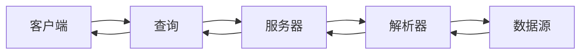

## 1.背景介绍

近年来，随着Web应用的复杂性不断提升，RESTful API已经不能满足开发者对于高效率、高灵活性的需求。在这个背景下，GraphQL作为一种新的API查询语言，逐渐受到了开发者的青睐。

GraphQL由Facebook于2015年开源，其主要目标是提高客户端和服务器之间的数据传输效率和灵活性。GraphQL的出现，使得开发者可以精确地获取所需的数据，避免了RESTful API中常见的过度获取和数据冗余的问题。

## 2.核心概念与联系

GraphQL主要由以下几个核心概念组成：

- **查询（Query）**：查询是GraphQL中的核心概念，它允许客户端指定所需的数据结构，服务器将按照这个结构返回数据。
- **变更（Mutation）**：变更用于改变数据。在GraphQL中，任何改变数据的操作都被称为变更。
- **类型系统（Type System）**：GraphQL使用类型系统来描述API中的数据。每个类型有一组字段，这些字段返回特定类型的数据。
- **解析器（Resolver）**：解析器是GraphQL服务的核心，它负责将查询转化为实际的数据。

这些核心概念之间的联系可以用下面的Mermaid流程图表示：



## 3.核心算法原理具体操作步骤

GraphQL的核心算法主要包括查询解析、数据获取和结果合成三个步骤。

1. **查询解析**：服务器接收到客户端的查询请求后，首先需要解析查询语句，确定客户端需要获取哪些数据。
2. **数据获取**：解析完成后，服务器通过解析器从数据源获取数据。解析器根据查询语句中的字段，按照特定的顺序获取数据。
3. **结果合成**：服务器将获取的数据按照客户端指定的结构合成结果，然后返回给客户端。

## 4.数学模型和公式详细讲解举例说明

在GraphQL中，查询的解析和数据的获取是一个递归的过程。假设查询语句中有n个字段，每个字段的获取需要m个操作，那么整个查询的复杂度可以用以下公式表示：

$$ T(n) = n \cdot T(m) $$

这个公式表明，GraphQL查询的时间复杂度是线性的，也就是说，查询的复杂度和查询中字段的数量成正比。

## 5.项目实践：代码实例和详细解释说明

下面是一个简单的GraphQL服务的实现，使用了Node.js和graphql.js库。

```javascript
const { graphql, buildSchema } = require('graphql');

const schema = buildSchema(`
  type Query {
    hello: String
  }
`);

const root = { hello: () => 'Hello world!' };

graphql(schema, '{ hello }', root).then((response) => {
  console.log(response);
});
```

在这个例子中，我们首先定义了一个简单的GraphQL模式，然后创建了一个解析器对象，最后使用graphql函数执行查询。查询结果将被打印出来。

## 6.实际应用场景

GraphQL在许多场景下都有广泛的应用，例如：

- **社交网络**：Facebook就是GraphQL的主要使用者，他们在移动应用中广泛使用GraphQL来获取用户的社交信息。
- **电商平台**：Shopify等电商平台使用GraphQL来处理商品、订单等复杂的数据关系。
- **内容管理**：许多内容管理系统（CMS）也开始使用GraphQL，以提高内容获取的效率和灵活性。

## 7.工具和资源推荐

以下是一些学习和使用GraphQL的推荐资源：

- **GraphQL官方文档**：这是学习GraphQL最权威的资源，详细介绍了GraphQL的所有概念和使用方法。
- **Apollo**：Apollo是一个强大的GraphQL客户端，支持React、Vue等多种前端框架。
- **GraphiQL**：GraphiQL是一个在线的GraphQL IDE，可以在浏览器中编写和测试GraphQL查询。

## 8.总结：未来发展趋势与挑战

随着Web应用的复杂性不断提升，GraphQL的优点越来越明显。然而，GraphQL也面临着一些挑战，例如查询效率的优化、权限管理等问题。未来，GraphQL需要在实践中不断完善和发展，以满足更多复杂的需求。

## 9.附录：常见问题与解答

1. **GraphQL和RESTful API有什么区别？**

   GraphQL的主要优点是能够让客户端精确地获取所需的数据，避免了RESTful API中常见的过度获取和数据冗余的问题。

2. **GraphQL适用于哪些场景？**

   GraphQL适用于数据关系复杂、需要高效率和高灵活性的场景，例如社交网络、电商平台、内容管理等。

作者：禅与计算机程序设计艺术 / Zen and the Art of Computer Programming