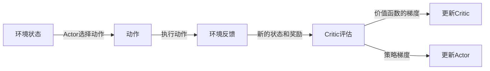

# Actor-Critic算法

## 1. 背景介绍

在强化学习领域，Agent的学习和决策是核心问题。Agent需要在与环境交互的过程中学习策略，以获得最大的长期回报。Actor-Critic算法是一种结合了值函数近似和策略梯度方法的强化学习算法，它通过两个模块——Actor和Critic的协同工作来优化策略。

## 2. 核心概念与联系

### 2.1 Actor和Critic的定义
- **Actor**：负责生成动作，即策略函数，它直接影响Agent与环境的交互。
- **Critic**：评估Actor的动作，即值函数，它提供对当前策略好坏的反馈。

### 2.2 策略梯度与值函数近似
- **策略梯度**：直接对策略函数进行参数化，通过梯度上升来优化策略。
- **值函数近似**：通过学习一个值函数来间接优化策略。

### 2.3 Actor-Critic的交互过程
Actor根据当前策略选择动作，Critic评估这个动作并给出价值函数的估计，Actor再根据Critic的反馈调整策略。

## 3. 核心算法原理具体操作步骤



1. 初始化Actor和Critic网络的参数。
2. 对于每个时间步：
   - Actor根据当前状态选择动作。
   - 执行动作，环境返回新的状态和奖励。
   - Critic评估动作，计算价值函数的梯度。
   - 更新Critic网络，减少价值函数的预测误差。
   - 更新Actor网络，使用策略梯度提升策略性能。

## 4. 数学模型和公式详细讲解举例说明

Actor-Critic算法的核心是策略梯度定理，它提供了一个优化策略的方法。策略梯度定理可以表示为：

$$
\nabla_{\theta}J(\theta) = \mathbb{E}_{\pi_\theta}[\nabla_{\theta}\log \pi_\theta(a|s)Q^{\pi_\theta}(s, a)]
$$

其中，$J(\theta)$ 是期望回报，$\pi_\theta$ 是参数为$\theta$的策略，$Q^{\pi_\theta}(s, a)$ 是在策略$\pi_\theta$下状态$s$采取动作$a$的动作价值函数。

Critic的价值函数更新可以使用TD(Temporal Difference)学习，更新公式为：

$$
\delta = r + \gamma V(s') - V(s)
$$

$$
V(s) \leftarrow V(s) + \alpha \delta
$$

其中，$\delta$ 是TD误差，$r$ 是奖励，$\gamma$ 是折扣因子，$V(s)$ 是状态$s$的价值函数，$\alpha$ 是学习率。

## 5. 项目实践：代码实例和详细解释说明

以下是一个简单的Actor-Critic算法的伪代码实现：

```python
# 初始化Actor和Critic网络
actor = ActorNetwork()
critic = CriticNetwork()

for episode in range(max_episodes):
    state = env.reset()
    for t in range(max_steps):
        action = actor.select_action(state)
        next_state, reward, done, _ = env.step(action)
        
        # Critic评估当前动作
        td_target = reward + gamma * critic.value(next_state)
        td_error = td_target - critic.value(state)
        
        # 更新Critic
        critic.update(td_error, state)
        
        # 更新Actor
        actor.update(td_error, state, action)
        
        if done:
            break
        state = next_state
```

在这个代码中，`ActorNetwork`和`CriticNetwork`是用于表示Actor和Critic的神经网络。`select_action`方法根据当前状态选择动作，`value`方法评估状态的价值。`update`方法用于更新网络的参数。

## 6. 实际应用场景

Actor-Critic算法在许多领域都有应用，包括但不限于：
- 游戏AI：如棋类游戏、电子竞技等。
- 机器人控制：如机械臂的精准操作、自主导航等。
- 资源管理：如数据中心的能源优化、交通流量控制等。

## 7. 工具和资源推荐

- **TensorFlow** 和 **PyTorch**：两个流行的深度学习框架，适用于实现Actor-Critic算法。
- **OpenAI Gym**：提供了多种环境，用于测试和比较强化学习算法。
- **Stable Baselines**：一个高级强化学习库，包含了多种预先实现的算法。

## 8. 总结：未来发展趋势与挑战

Actor-Critic算法作为一种有效的强化学习方法，其未来的发展趋势可能包括算法的进一步优化、多Agent系统的协同学习、以及与其他机器学习技术的结合。挑战则包括如何提高算法的稳定性和收敛速度，以及如何在复杂环境中保持良好的性能。

## 9. 附录：常见问题与解答

- **Q**: Actor-Critic算法与纯策略梯度方法有何不同？
- **A**: Actor-Critic算法结合了策略梯度和值函数近似，通过Critic来减少方差，提高学习效率。

- **Q**: 如何选择Actor和Critic的网络结构？
- **A**: 网络结构的选择依赖于具体问题。一般来说，可以从简单的全连接网络开始，根据问题的复杂度逐渐增加网络的深度和宽度。

- **Q**: Actor-Critic算法如何处理连续动作空间？
- **A**: 对于连续动作空间，Actor通常输出一个动作的概率分布，然后从这个分布中采样来获得连续动作。

作者：禅与计算机程序设计艺术 / Zen and the Art of Computer Programming