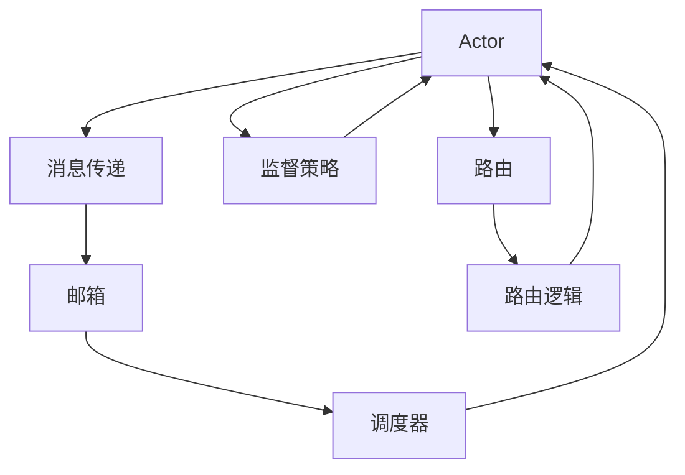

# Akka原理与代码实例讲解

## 1.背景介绍
### 1.1 分布式系统的挑战
#### 1.1.1 并发与并行
#### 1.1.2 容错与高可用
#### 1.1.3 可伸缩性与弹性
### 1.2 Actor模型的诞生
#### 1.2.1 Actor模型的起源
#### 1.2.2 Actor模型的核心理念
#### 1.2.3 Actor模型的优势
### 1.3 Akka框架概述  
#### 1.3.1 Akka的发展历程
#### 1.3.2 Akka的主要特性
#### 1.3.3 Akka在行业中的应用

## 2.核心概念与联系
### 2.1 Actor
#### 2.1.1 Actor的定义
#### 2.1.2 Actor的生命周期
#### 2.1.3 Actor的层级结构
### 2.2 消息传递
#### 2.2.1 消息的定义与类型
#### 2.2.2 消息的发送与接收
#### 2.2.3 消息的序列化与反序列化
### 2.3 监督策略
#### 2.3.1 监督策略的作用
#### 2.3.2 常见的监督策略
#### 2.3.3 自定义监督策略
### 2.4 路由
#### 2.4.1 路由的概念
#### 2.4.2 内置路由策略
#### 2.4.3 自定义路由策略
### 2.5 调度器
#### 2.5.1 调度器的作用
#### 2.5.2 内置调度器
#### 2.5.3 自定义调度器

## 3.核心算法原理具体操作步骤
### 3.1 Actor的创建与启动
#### 3.1.1 定义Actor类
#### 3.1.2 创建Actor实例
#### 3.1.3 启动Actor系统
### 3.2 消息的发送与处理
#### 3.2.1 发送消息的方式
#### 3.2.2 接收消息的模式匹配
#### 3.2.3 消息的转发与响应
### 3.3 Actor的状态管理
#### 3.3.1 Actor的内部状态
#### 3.3.2 状态的更新与查询
#### 3.3.3 状态的持久化
### 3.4 错误处理与容错
#### 3.4.1 异常的捕获与处理
#### 3.4.2 Actor的重启策略
#### 3.4.3 系统的容错机制
### 3.5 Actor的终止与清理
#### 3.5.1 正常终止Actor
#### 3.5.2 异常终止Actor
#### 3.5.3 资源的释放与清理

## 4.数学模型和公式详细讲解举例说明
### 4.1 Actor模型的数学表示
#### 4.1.1 Actor的形式化定义
#### 4.1.2 消息传递的数学描述
#### 4.1.3 Actor系统的状态转移
### 4.2 性能分析与建模
#### 4.2.1 吞吐量与延迟的计算
#### 4.2.2 资源利用率的估算
#### 4.2.3 可伸缩性的数学建模
### 4.3 容错性与可靠性分析
#### 4.3.1 故障场景的概率模型
#### 4.3.2 容错策略的数学分析
#### 4.3.3 可靠性指标的计算

## 5.项目实践：代码实例和详细解释说明
### 5.1 环境准备
#### 5.1.1 JDK与Scala的安装
#### 5.1.2 Akka依赖的配置
#### 5.1.3 开发工具的选择
### 5.2 简单的Actor示例
#### 5.2.1 创建Actor类
#### 5.2.2 发送与接收消息
#### 5.2.3 启动Actor系统
### 5.3 Actor层级与监督
#### 5.3.1 创建父子Actor
#### 5.3.2 实现监督策略
#### 5.3.3 错误处理与恢复
### 5.4 消息路由与调度
#### 5.4.1 使用内置路由
#### 5.4.2 自定义路由策略
#### 5.4.3 配置调度器
### 5.5 集群与分布式应用
#### 5.5.1 搭建Akka集群
#### 5.5.2 分布式计数器的实现
#### 5.5.3 分布式发布订阅的实现

## 6.实际应用场景
### 6.1 实时流处理
#### 6.1.1 数据流的采集与分发
#### 6.1.2 实时计算与聚合
#### 6.1.3 结果的输出与持久化
### 6.2 分布式缓存
#### 6.2.1 缓存的分布式存储
#### 6.2.2 缓存的一致性维护
#### 6.2.3 缓存的容错与恢复
### 6.3 微服务架构
#### 6.3.1 服务的拆分与划分
#### 6.3.2 服务间的通信与协作
#### 6.3.3 服务的监控与管理
### 6.4 物联网平台
#### 6.4.1 设备的连接与管理
#### 6.4.2 数据的采集与处理
#### 6.4.3 事件的检测与响应

## 7.工具和资源推荐
### 7.1 Akka官方文档
#### 7.1.1 入门指南
#### 7.1.2 API参考
#### 7.1.3 最佳实践
### 7.2 社区与生态
#### 7.2.1 Akka社区资源
#### 7.2.2 第三方库与工具
#### 7.2.3 案例与经验分享
### 7.3 学习资料
#### 7.3.1 书籍推荐
#### 7.3.2 视频教程
#### 7.3.3 在线课程

## 8.总结：未来发展趋势与挑战
### 8.1 Akka的发展方向
#### 8.1.1 Akka的版本演进
#### 8.1.2 新特性与改进
#### 8.1.3 与其他技术的融合
### 8.2 分布式系统的挑战
#### 8.2.1 大规模系统的设计
#### 8.2.2 数据一致性与共识
#### 8.2.3 安全与隐私保护
### 8.3 未来展望
#### 8.3.1 Akka在分布式领域的地位
#### 8.3.2 新的应用场景与机遇
#### 8.3.3 技术的创新与突破

## 9.附录：常见问题与解答
### 9.1 Akka与其他并发模型的比较
#### 9.1.1 Akka与线程模型
#### 9.1.2 Akka与响应式编程
#### 9.1.3 Akka与CSP模型
### 9.2 Akka的性能优化
#### 9.2.1 消息序列化优化
#### 9.2.2 网络通信优化
#### 9.2.3 内存与CPU的优化
### 9.3 Akka的测试与调试
#### 9.3.1 单元测试
#### 9.3.2 集成测试
#### 9.3.3 调试技巧与工具

Akka是一个基于Actor模型的强大的并发与分布式框架，它提供了一种优雅而高效的方式来构建可伸缩、容错的分布式系统。Akka的核心概念包括Actor、消息传递、监督策略、路由和调度器等，这些概念相互关联，共同组成了Akka的核心架构。

下面是Akka核心概念与架构的Mermaid流程图：



在Akka中，Actor是最基本的计算单元，它封装了状态和行为，通过消息传递与其他Actor进行通信。每个Actor都有一个邮箱，用于缓存接收到的消息。调度器负责从邮箱中取出消息，并将其分发给对应的Actor进行处理。Actor之间可以形成层级结构，父Actor可以对子Actor进行监督，并定义相应的监督策略来处理错误和异常情况。此外，Akka还提供了丰富的路由策略，用于将消息分发给一组Actor，实现负载均衡和伸缩性。

Akka的核心算法包括Actor的创建与启动、消息的发送与处理、状态管理、错误处理与容错等。下面是一个简单的Akka Actor示例，演示了如何创建Actor并发送消息：

```scala
import akka.actor.{Actor, ActorSystem, Props}

// 定义Actor类
class MyActor extends Actor {
  override def receive: Receive = {
    case message: String => println(s"Received message: $message")
  }
}

// 创建Actor系统和Actor实例
val system = ActorSystem("MyActorSystem")
val myActor = system.actorOf(Props[MyActor], "myActor")

// 发送消息给Actor
myActor ! "Hello, Akka!"
```

在这个示例中，我们定义了一个`MyActor`类，它继承自`Actor`，并重写了`receive`方法来处理接收到的消息。通过`ActorSystem`创建了一个Actor系统，并使用`actorOf`方法创建了一个`MyActor`实例。最后，使用`!`操作符向`myActor`发送了一条消息。

Akka在实际应用中有广泛的应用场景，如实时流处理、分布式缓存、微服务架构、物联网平台等。Akka提供了一套完整的工具和库，用于构建高性能、可伸缩的分布式系统。

随着分布式系统的不断发展，Akka也在不断演进和创新。未来，Akka将继续在分布式领域发挥重要作用，与其他技术进行融合，应对大规模系统设计、数据一致性、安全隐私等挑战，为构建高可用、高性能的分布式应用提供强大的支持。

总之，Akka是一个功能强大、设计优雅的并发与分布式框架，它基于Actor模型，提供了一种高效、可伸缩、容错的方式来构建分布式系统。通过深入理解Akka的核心概念、算法原理和实际应用，我们可以更好地应对分布式系统开发中的挑战，构建出高质量、高可靠性的分布式应用。

作者：禅与计算机程序设计艺术 / Zen and the Art of Computer Programming