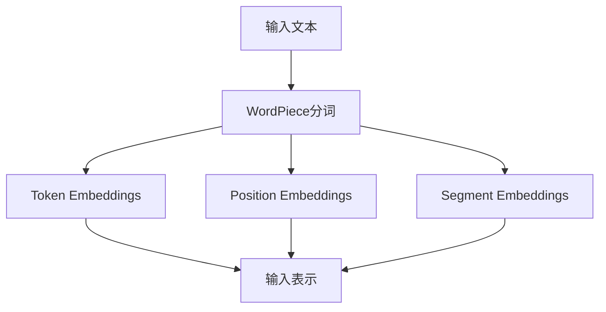

# BERT原理与代码实例讲解

## 1. 背景介绍
### 1.1 自然语言处理的发展历程
#### 1.1.1 早期的统计语言模型
#### 1.1.2 深度学习时代的语言模型
#### 1.1.3 预训练语言模型的崛起

### 1.2 BERT的诞生
#### 1.2.1 Transformer架构的引入  
#### 1.2.2 预训练和微调范式
#### 1.2.3 BERT的优势和影响力

## 2. 核心概念与联系
### 2.1 自注意力机制(Self-Attention)
#### 2.1.1 自注意力机制的定义
#### 2.1.2 自注意力机制的计算过程
#### 2.1.3 自注意力机制的优势

### 2.2 Transformer架构
#### 2.2.1 Transformer的整体结构
#### 2.2.2 编码器(Encoder)和解码器(Decoder) 
#### 2.2.3 残差连接和层归一化

### 2.3 预训练和微调
#### 2.3.1 预训练的目的和方法
#### 2.3.2 微调的过程和应用
#### 2.3.3 预训练和微调的关系

### 2.4 BERT的输入表示
#### 2.4.1 WordPiece分词
#### 2.4.2 位置编码
#### 2.4.3 段落编码

## 3. 核心算法原理具体操作步骤
### 3.1 预训练阶段
#### 3.1.1 Masked Language Model(MLM)
#### 3.1.2 Next Sentence Prediction(NSP)
#### 3.1.3 预训练数据的准备

### 3.2 微调阶段
#### 3.2.1 下游任务的数据准备
#### 3.2.2 微调的损失函数
#### 3.2.3 微调的优化策略

## 4. 数学模型和公式详细讲解举例说明
### 4.1 自注意力机制的数学表达
#### 4.1.1 查询(Query)、键(Key)、值(Value)的计算
$$Attention(Q,K,V) = softmax(\frac{QK^T}{\sqrt{d_k}})V$$
#### 4.1.2 多头注意力机制
$$MultiHead(Q,K,V) = Concat(head_1,...,head_h)W^O$$
#### 4.1.3 自注意力机制的矩阵计算

### 4.2 前向传播和反向传播
#### 4.2.1 前向传播的数学表达
#### 4.2.2 反向传播的梯度计算
#### 4.2.3 参数更新的优化算法

## 5. 项目实践：代码实例和详细解释说明
### 5.1 预训练阶段的代码实现
#### 5.1.1 数据预处理和批次生成
#### 5.1.2 构建BERT模型
#### 5.1.3 定义损失函数和优化器
#### 5.1.4 训练循环和保存模型

### 5.2 微调阶段的代码实现
#### 5.2.1 加载预训练模型
#### 5.2.2 准备下游任务的数据
#### 5.2.3 定义微调的模型结构
#### 5.2.4 训练和评估微调模型

### 5.3 实例应用：情感分析任务
#### 5.3.1 数据集介绍和预处理
#### 5.3.2 构建情感分析模型
#### 5.3.3 训练和评估情感分析模型
#### 5.3.4 结果分析和可视化

## 6. 实际应用场景
### 6.1 文本分类
#### 6.1.1 情感分析
#### 6.1.2 主题分类
#### 6.1.3 意图识别

### 6.2 命名实体识别
#### 6.2.1 实体类型和标注方式
#### 6.2.2 基于BERT的命名实体识别
#### 6.2.3 应用案例

### 6.3 问答系统
#### 6.3.1 阅读理解式问答
#### 6.3.2 知识库问答
#### 6.3.3 对话式问答

### 6.4 文本生成
#### 6.4.1 摘要生成
#### 6.4.2 对话生成
#### 6.4.3 创意写作辅助

## 7. 工具和资源推荐
### 7.1 BERT的开源实现
#### 7.1.1 Google BERT
#### 7.1.2 Hugging Face Transformers
#### 7.1.3 微软 NNI Toolkit

### 7.2 预训练模型的资源
#### 7.2.1 BERT-Base和BERT-Large
#### 7.2.2 多语言BERT
#### 7.2.3 领域特定的BERT模型

### 7.3 数据集资源
#### 7.3.1 GLUE基准测试
#### 7.3.2 SQuAD问答数据集
#### 7.3.3 中文数据集资源

## 8. 总结：未来发展趋势与挑战
### 8.1 BERT的改进和扩展
#### 8.1.1 模型压缩和加速
#### 8.1.2 知识增强的预训练模型
#### 8.1.3 多模态预训练模型

### 8.2 预训练模型的发展方向
#### 8.2.1 更大规模的预训练模型
#### 8.2.2 跨语言和跨领域的迁移学习
#### 8.2.3 自监督学习和无监督学习

### 8.3 挑战和展望
#### 8.3.1 可解释性和可信性
#### 8.3.2 公平性和去偏见
#### 8.3.3 模型的鲁棒性和安全性

## 9. 附录：常见问题与解答
### 9.1 BERT和GPT系列模型的区别
### 9.2 BERT在实际应用中的注意事项
### 9.3 如何选择合适的预训练模型
### 9.4 BERT微调的技巧和经验分享
### 9.5 BERT在垂直领域的应用案例

作者：禅与计算机程序设计艺术 / Zen and the Art of Computer Programming