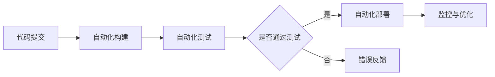

# CI/CD与自动化测试原理与代码实战案例讲解

## 1. 背景介绍
在软件开发的世界里，持续集成（Continuous Integration，CI）和持续交付/持续部署（Continuous Delivery/Deployment，CD）已经成为提高软件交付速度和质量的关键实践。自动化测试作为CI/CD流程中不可或缺的一环，确保了代码变更在集成到主分支之前的质量。本文将深入探讨CI/CD与自动化测试的原理，并通过代码实战案例，为读者提供实用的技术指导和见解。

## 2. 核心概念与联系
CI/CD的核心在于自动化软件交付过程，而自动化测试则是保障软件质量的基石。CI是指开发人员频繁地将代码变更集成到主分支的过程，每次集成都通过自动化测试来验证代码的正确性。CD可以是持续交付，即自动化地将代码变更交付到预生产环境中，也可以是持续部署，即直接将变更部署到生产环境中。



## 3. 核心算法原理具体操作步骤
CI/CD流程中的核心算法原理涉及到版本控制、构建自动化、测试自动化和部署自动化。操作步骤通常包括：

1. 版本控制：开发人员提交代码到版本控制系统。
2. 自动化构建：触发构建过程，编译代码，生成可执行文件或者部署包。
3. 自动化测试：执行单元测试、集成测试、性能测试等。
4. 部署自动化：将通过测试的代码部署到相应环境。
5. 监控与反馈：监控应用状态，收集反馈，优化流程。

## 4. 数学模型和公式详细讲解举例说明
在自动化测试中，我们经常需要计算测试覆盖率，这是一个重要的指标。测试覆盖率的数学模型可以表示为：

$$
\text{测试覆盖率} = \frac{\text{执行的测试用例数}}{\text{总的测试用例数}} \times 100\%
$$

例如，如果我们有100个测试用例，自动化测试执行了85个，那么测试覆盖率为：

$$
\text{测试覆盖率} = \frac{85}{100} \times 100\% = 85\%
$$

## 5. 项目实践：代码实例和详细解释说明
以一个简单的Java项目为例，我们可以使用JUnit作为单元测试框架，Maven作为构建工具，Jenkins作为CI/CD工具。以下是一个单元测试的代码实例：

```java
import static org.junit.Assert.*;
import org.junit.Test;

public class CalculatorTest {
    @Test
    public void testAdd() {
        Calculator calculator = new Calculator();
        assertEquals(5, calculator.add(2, 3));
    }
}
```

在Jenkins中配置项目，每次代码提交都会触发构建和测试流程，保证代码质量。

## 6. 实际应用场景
CI/CD与自动化测试在多种场景下都有应用，例如：

- Web应用开发：自动化部署到测试服务器，进行集成测试和性能测试。
- 移动应用发布：自动化测试在不同设备和操作系统上的兼容性。
- 微服务架构：独立部署和测试各个微服务，确保整体系统的稳定性。

## 7. 工具和资源推荐
- 版本控制：Git, SVN
- CI/CD工具：Jenkins, GitLab CI, CircleCI
- 构建工具：Maven, Gradle
- 测试框架：JUnit, TestNG, Selenium

## 8. 总结：未来发展趋势与挑战
随着DevOps文化的发展，CI/CD与自动化测试将更加普及。未来的趋势包括：

- AI驱动的测试：使用人工智能优化测试用例和提高测试效率。
- 无服务器架构：CI/CD流程将更加灵活和可扩展。
- 容器化和微服务：提高部署速度和系统的可靠性。

挑战包括：

- 测试环境的复杂性：需要更智能的环境管理和配置。
- 安全性：自动化流程中的安全保障是一个重要议题。

## 9. 附录：常见问题与解答
Q1: CI/CD对小团队是否必要？
A1: 是的，CI/CD可以帮助任何规模的团队提高效率和软件质量。

Q2: 自动化测试是否可以完全替代手动测试？
A2: 自动化测试可以大幅度提高测试效率，但在某些场景下，手动测试仍然不可或缺。

作者：禅与计算机程序设计艺术 / Zen and the Art of Computer Programming