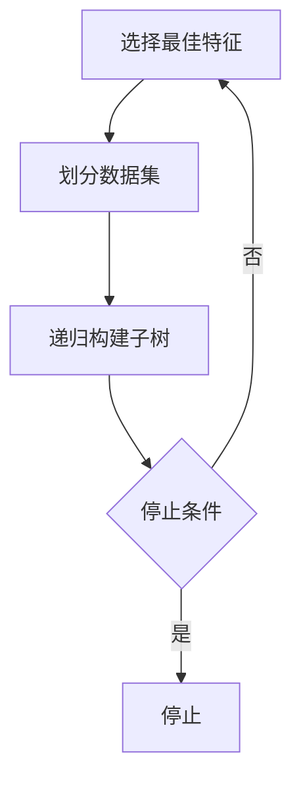

# Decision Trees 原理与代码实战案例讲解

## 1.背景介绍

决策树（Decision Tree）是一种常用的机器学习算法，广泛应用于分类和回归任务。其直观的树状结构使得决策树在解释性和可视化方面具有显著优势。决策树的基本思想是通过一系列的决策规则将数据集划分成不同的子集，最终形成一个树状结构，用于预测新数据的类别或数值。

## 2.核心概念与联系

### 2.1 决策树的基本结构

决策树由节点和边组成，主要包括以下几种节点：
- **根节点**：树的起始节点，包含整个数据集。
- **内部节点**：包含一个特征测试，用于将数据集划分成不同的子集。
- **叶节点**：最终的决策输出，表示分类结果或回归值。

### 2.2 信息增益与基尼指数

决策树的构建过程依赖于选择最佳的特征进行数据划分。常用的度量标准包括信息增益和基尼指数：
- **信息增益**：衡量特征对数据集的不确定性减少程度，基于熵的概念。
- **基尼指数**：衡量数据集的不纯度，基于概率的概念。

### 2.3 过拟合与剪枝

决策树容易过拟合，即在训练数据上表现良好，但在测试数据上表现较差。为了解决过拟合问题，常用的方法包括预剪枝和后剪枝：
- **预剪枝**：在构建树的过程中提前停止分裂。
- **后剪枝**：在构建完整树后，去除不必要的节点。

## 3.核心算法原理具体操作步骤

### 3.1 构建决策树的步骤

1. **选择最佳特征**：根据信息增益或基尼指数选择最佳特征。
2. **划分数据集**：根据选择的特征将数据集划分成子集。
3. **递归构建子树**：对每个子集递归地构建子树，直到满足停止条件。

### 3.2 停止条件

- 所有样本属于同一类别。
- 没有更多特征可供选择。
- 达到预设的树深度或节点样本数阈值。

### 3.3 决策树的剪枝

- **预剪枝**：在构建过程中通过交叉验证等方法提前停止分裂。
- **后剪枝**：在构建完整树后，通过剪枝算法去除不必要的节点。



## 4.数学模型和公式详细讲解举例说明

### 4.1 信息增益

信息增益基于熵的概念，熵表示数据集的不确定性。给定数据集 $D$，其熵定义为：

$$
H(D) = - \sum_{i=1}^{n} p_i \log_2 p_i
$$

其中，$p_i$ 是第 $i$ 类的概率。特征 $A$ 的信息增益定义为：

$$
IG(D, A) = H(D) - \sum_{v \in \text{Values}(A)} \frac{|D_v|}{|D|} H(D_v)
$$

### 4.2 基尼指数

基尼指数表示数据集的不纯度，定义为：

$$
Gini(D) = 1 - \sum_{i=1}^{n} p_i^2
$$

特征 $A$ 的基尼指数定义为：

$$
Gini(D, A) = \sum_{v \in \text{Values}(A)} \frac{|D_v|}{|D|} Gini(D_v)
$$

### 4.3 示例

假设有一个数据集 $D$，包含以下样本：

| 特征A | 特征B | 类别 |
|-------|-------|------|
| 高    | 是    | 是   |
| 低    | 否    | 否   |
| 中    | 是    | 是   |
| 高    | 否    | 否   |

计算特征A的信息增益：

1. 计算数据集 $D$ 的熵：

$$
H(D) = - \left( \frac{2}{4} \log_2 \frac{2}{4} + \frac{2}{4} \log_2 \frac{2}{4} \right) = 1
$$

2. 计算特征A的条件熵：

$$
H(D, A) = \frac{2}{4} H(D_{\text{高}}) + \frac{1}{4} H(D_{\text{低}}) + \frac{1}{4} H(D_{\text{中}})
$$

假设 $H(D_{\text{高}}) = 0.5$，$H(D_{\text{低}}) = 0$，$H(D_{\text{中}}) = 0$，则：

$$
H(D, A) = \frac{2}{4} \times 0.5 + \frac{1}{4} \times 0 + \frac{1}{4} \times 0 = 0.25
$$

3. 计算信息增益：

$$
IG(D, A) = H(D) - H(D, A) = 1 - 0.25 = 0.75
$$

## 5.项目实践：代码实例和详细解释说明

### 5.1 数据准备

首先，我们需要准备一个数据集。这里我们使用一个简单的玩具数据集进行演示。

```python
import pandas as pd

data = {
    'FeatureA': ['High', 'Low', 'Medium', 'High'],
    'FeatureB': ['Yes', 'No', 'Yes', 'No'],
    'Label': ['Yes', 'No', 'Yes', 'No']
}

df = pd.DataFrame(data)
print(df)
```

### 5.2 构建决策树

我们使用 `scikit-learn` 库来构建决策树。

```python
from sklearn.tree import DecisionTreeClassifier
from sklearn.preprocessing import LabelEncoder

# 编码特征和标签
le = LabelEncoder()
df['FeatureA'] = le.fit_transform(df['FeatureA'])
df['FeatureB'] = le.fit_transform(df['FeatureB'])
df['Label'] = le.fit_transform(df['Label'])

# 特征和标签
X = df[['FeatureA', 'FeatureB']]
y = df['Label']

# 构建决策树
clf = DecisionTreeClassifier(criterion='entropy')
clf.fit(X, y)
```

### 5.3 可视化决策树

我们可以使用 `graphviz` 库来可视化决策树。

```python
from sklearn.tree import export_graphviz
import graphviz

dot_data = export_graphviz(clf, out_file=None, 
                           feature_names=['FeatureA', 'FeatureB'],  
                           class_names=['No', 'Yes'],  
                           filled=True, rounded=True,  
                           special_characters=True)  
graph = graphviz.Source(dot_data)  
graph.render("decision_tree")
```

### 5.4 预测新数据

我们可以使用训练好的决策树模型来预测新数据的类别。

```python
# 新数据
new_data = pd.DataFrame({'FeatureA': [1], 'FeatureB': [0]})
prediction = clf.predict(new_data)
print("Prediction:", le.inverse_transform(prediction))
```

## 6.实际应用场景

决策树在许多实际应用中表现出色，以下是一些典型的应用场景：

### 6.1 医疗诊断

决策树可以用于医疗诊断，通过分析患者的症状和体征，预测疾病的可能性。例如，基于患者的年龄、性别、血压等特征，预测是否患有心脏病。

### 6.2 客户细分

在市场营销中，决策树可以用于客户细分，根据客户的购买行为、人口统计特征等，将客户分为不同的群体，以便制定针对性的营销策略。

### 6.3 风险评估

在金融领域，决策树可以用于风险评估，例如信用评分。通过分析借款人的收入、信用记录等特征，预测其违约的可能性。

## 7.工具和资源推荐

### 7.1 编程库

- **scikit-learn**：Python中最常用的机器学习库，提供了决策树的实现。
- **XGBoost**：一种高效的梯度提升决策树实现，适用于大规模数据集。

### 7.2 可视化工具

- **graphviz**：用于可视化决策树结构。
- **dtreeviz**：一个更高级的决策树可视化工具，提供了更丰富的可视化选项。

### 7.3 在线资源

- **Kaggle**：一个数据科学竞赛平台，提供了丰富的数据集和决策树的实战案例。
- **Coursera**：提供了许多关于机器学习和决策树的在线课程。

## 8.总结：未来发展趋势与挑战

决策树作为一种经典的机器学习算法，具有直观、易解释的优点。然而，随着数据规模和复杂度的增加，决策树也面临一些挑战，如过拟合和计算效率问题。未来的发展趋势包括：

### 8.1 集成学习

通过集成学习方法，如随机森林和梯度提升决策树，可以提高决策树的性能和稳定性。

### 8.2 高效算法

研究更高效的决策树构建算法，以应对大规模数据集的挑战。

### 8.3 自动化机器学习

自动化机器学习（AutoML）可以自动选择和优化决策树模型，降低使用门槛。

## 9.附录：常见问题与解答

### 9.1 决策树容易过拟合，如何解决？

可以通过剪枝、设置最大深度、最小样本数等方法来防止过拟合。

### 9.2 如何选择信息增益和基尼指数？

信息增益和基尼指数在大多数情况下效果相似，可以根据具体问题和数据集选择。

### 9.3 决策树能处理缺失值吗？

决策树可以处理缺失值，但需要在构建过程中进行特殊处理，如使用缺失值替代策略。

### 9.4 决策树能处理连续特征吗？

决策树可以处理连续特征，通过选择最佳分割点将连续特征离散化。

### 9.5 决策树的计算复杂度如何？

决策树的计算复杂度主要取决于数据集的大小和特征的数量，通常为 $O(n \log n)$。

---

作者：禅与计算机程序设计艺术 / Zen and the Art of Computer Programming