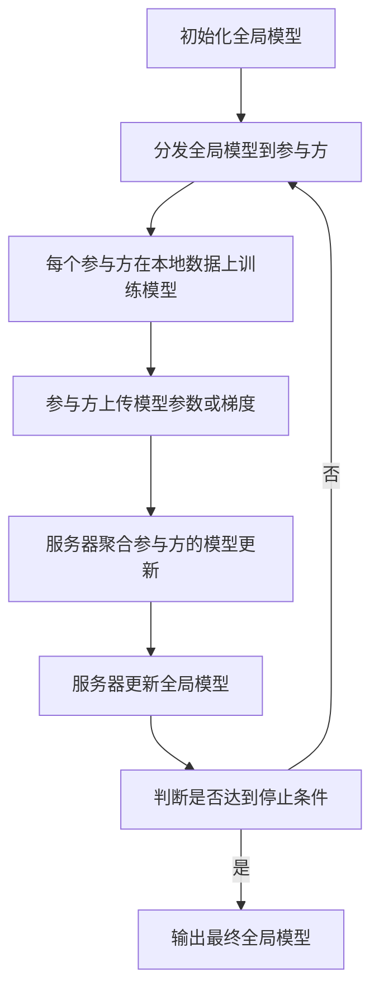

# Federated Learning原理与代码实例讲解

## 1. 背景介绍

随着移动设备和物联网设备的快速发展,海量的数据被产生和存储在这些边缘设备中。然而,由于隐私、安全和带宽等限制,将这些数据集中到云端进行传统的机器学习训练变得越来越具有挑战性。为了解决这个问题,联邦学习(Federated Learning)作为一种新兴的分布式机器学习范式应运而生。

联邦学习允许多个参与方在不共享原始数据的情况下,通过协作训练出一个全局模型。每个参与方只需在本地使用自己的数据训练模型,然后将模型参数或梯度上传到一个中央服务器。服务器聚合所有参与方的模型更新,并将新的全局模型分发回各个参与方。通过这种方式,联邦学习可以保护数据隐私,同时利用大规模分散的数据进行模型训练,实现更好的性能。

## 2. 核心概念与联系

### 2.1 联邦学习的核心概念

1. **参与方(Client)**:参与联邦学习的各个实体,如移动设备、物联网设备或组织机构等。每个参与方都拥有自己的本地数据集。

2. **中央服务器(Server)**:协调整个联邦学习过程的中心节点。它负责聚合参与方的模型更新,并将新的全局模型分发回各个参与方。

3. **本地训练**:每个参与方在本地使用自己的数据集对模型进行训练,获得模型参数或梯度的更新。

4. **模型聚合**:中央服务器根据某种聚合策略(如联邦平均、加权平均等)将所有参与方的模型更新聚合成一个新的全局模型。

5. **模型分发**:中央服务器将新的全局模型分发回各个参与方,作为下一轮本地训练的初始模型。

6. **隐私保护机制**:为了防止参与方的数据隐私泄露,联邦学习通常采用差分隐私、安全多方计算等技术来保护参与方的隐私。

### 2.2 联邦学习与传统机器学习的联系

传统的机器学习方法通常需要将所有数据集中到一个中心节点进行训练。这种做法在数据隐私、通信成本和系统故障等方面存在一些挑战。联邦学习则通过将模型训练分散到各个参与方,解决了这些问题。

与传统机器学习相比,联邦学习具有以下优势:

1. **隐私保护**:参与方的原始数据不需要离开本地设备,从而有效保护了数据隐私。

2. **通信效率**:只需要传输模型参数或梯度,而不是原始数据,从而大大降低了通信成本。

3. **容错性**:由于模型训练分散在各个参与方,系统更加健壮,不会因为单个节点故障而完全瘫痪。

4. **异构数据利用**:联邦学习可以利用来自不同领域和不同分布的异构数据,提高模型的泛化能力。

## 3. 核心算法原理具体操作步骤

联邦学习的核心算法是联邦平均(FedAvg),它是一种基于模型平均的聚合策略。FedAvg算法的具体操作步骤如下:



1. **初始化全局模型**:服务器初始化一个全局模型,作为所有参与方的初始模型。

2. **分发全局模型**:服务器将初始化的全局模型分发给所有参与方。

3. **本地训练**:每个参与方在本地使用自己的数据集对模型进行训练,获得模型参数或梯度的更新。

4. **上传模型更新**:参与方将本地训练得到的模型参数或梯度上传到服务器。

5. **模型聚合**:服务器根据联邦平均策略,将所有参与方的模型更新进行加权平均,得到新的全局模型。

6. **更新全局模型**:服务器使用聚合后的模型参数更新全局模型。

7. **判断停止条件**:检查是否满足停止条件,如达到最大迭代轮数或模型收敛等。如果满足,则输出最终的全局模型;否则,重复步骤2-6。

联邦平均的数学表达式如下:

$$\theta^{t+1} = \sum_{k=1}^{K} \frac{n_k}{n} \theta_k^t$$

其中:
- $\theta^{t+1}$是新的全局模型参数
- $K$是参与方的数量
- $n_k$是第$k$个参与方的本地数据样本数量
- $n$是所有参与方的总数据样本数量
- $\theta_k^t$是第$k$个参与方在第$t$轮迭代后的本地模型参数

通过对参与方的模型参数进行加权平均,联邦平均算法可以综合各个参与方的训练结果,得到一个在整体上表现良好的全局模型。

## 4. 数学模型和公式详细讲解举例说明

### 4.1 联邦学习的目标函数

在联邦学习中,我们希望找到一个能够最小化所有参与方的损失函数之和的模型参数$\theta$。数学表达式如下:

$$\min_\theta F(\theta) = \sum_{k=1}^{K} \frac{n_k}{n} F_k(\theta)$$

其中:
- $F(\theta)$是所有参与方的加权平均损失函数
- $K$是参与方的数量
- $n_k$是第$k$个参与方的本地数据样本数量
- $n$是所有参与方的总数据样本数量
- $F_k(\theta)$是第$k$个参与方的本地损失函数

由于每个参与方只能访问自己的本地数据,因此无法直接优化上述目标函数。联邦学习算法通过迭代的方式,在每一轮中更新模型参数,逐步逼近最优解。

### 4.2 联邦平均算法的收敛性分析

联邦平均算法的收敛性取决于以下几个因素:

1. **本地数据分布的异质性**:如果各个参与方的本地数据分布相差较大,则收敛速度会变慢。

2. **参与方数量**:参与方数量越多,收敛速度通常越快。但是,过多的参与方也会增加通信开销和隐私风险。

3. **本地更新步数**:每个参与方在本地进行多少次迭代更新会影响收敛速度。一般来说,本地更新步数越大,收敛速度越快,但是也会增加计算开销。

4. **学习率**:合适的学习率可以加快收敛速度,但过大或过小的学习率都会导致收敛缓慢或发散。

5. **模型复杂度**:模型越复杂,收敛速度往往越慢。

为了提高收敛速度,研究人员提出了多种优化策略,如自适应学习率调整、模型压缩、客户端选择等。这些策略可以根据具体情况进行调整和组合,以获得更好的收敛性能。

### 4.3 联邦学习中的隐私保护机制

由于联邦学习涉及多个参与方的数据,因此需要采取一些隐私保护机制来防止数据隐私泄露。常见的隐私保护机制包括:

1. **差分隐私(Differential Privacy)**:通过在模型参数或梯度中添加噪声,来保护个体数据的隐私。差分隐私可以提供严格的隐私保证,但也会引入一定的噪声,影响模型精度。

2. **安全多方计算(Secure Multi-Party Computation)**:允许多个参与方在不泄露各自的输入数据的情况下,共同计算一个函数的结果。在联邦学习中,可以用于安全地聚合参与方的模型更新。

3. **同态加密(Homomorphic Encryption)**:允许在加密数据上直接进行计算,而无需解密。在联邦学习中,可以用于在服务器端对加密的模型更新进行聚合,从而保护参与方的隐私。

4. **混淆机制(Obfuscation Mechanisms)**:通过对模型参数或梯度进行混淆,来隐藏个体数据的特征。常见的混淆机制包括随机掩码、梯度裁剪等。

在实际应用中,通常需要根据具体场景的隐私需求和性能约束,选择合适的隐私保护机制或者组合使用多种机制。

## 5. 项目实践:代码实例和详细解释说明

在本节中,我们将使用Python和TensorFlow实现一个简单的联邦学习示例,对手写数字图像进行分类。

### 5.1 准备数据

我们使用著名的MNIST数据集,将其分割成多个非均匀分布的子集,模拟不同参与方的本地数据。

```python
import tensorflow as tf
import numpy as np

# 加载MNIST数据集
(x_train, y_train), (x_test, y_test) = tf.keras.datasets.mnist.load_data()

# 将数据集分割成多个非均匀分布的子集
num_clients = 10
x_train_splits, y_train_splits = split_data(x_train, y_train, num_clients)
```

### 5.2 定义联邦学习模型

我们定义一个简单的卷积神经网络模型,用于手写数字图像分类。

```python
def create_model():
    model = tf.keras.Sequential([
        tf.keras.layers.Conv2D(32, 3, activation='relu', input_shape=(28, 28, 1)),
        tf.keras.layers.MaxPooling2D(),
        tf.keras.layers.Flatten(),
        tf.keras.layers.Dense(64, activation='relu'),
        tf.keras.layers.Dense(10)
    ])
    return model
```

### 5.3 实现联邦平均算法

我们实现一个`FederatedAveraging`类,用于协调整个联邦学习过程。

```python
class FederatedAveraging:
    def __init__(self, model, clients, epochs, batch_size, learning_rate):
        self.model = model
        self.clients = clients
        self.epochs = epochs
        self.batch_size = batch_size
        self.learning_rate = learning_rate

    def train(self):
        global_model = self.model
        for epoch in range(self.epochs):
            weights = []
            for client in self.clients:
                client_model = self.model_clone(global_model)
                client_weights = client.train(client_model, self.epochs, self.batch_size, self.learning_rate)
                weights.append(client_weights)

            global_weights = self.aggregate_weights(weights)
            global_model.set_weights(global_weights)

        return global_model

    def model_clone(self, model):
        clone = create_model()
        clone.set_weights(model.get_weights())
        return clone

    def aggregate_weights(self, weights):
        averaged_weights = []
        for weights_tuple in zip(*weights):
            averaged_weights.append(tf.math.reduce_mean(weights_tuple, axis=0))
        return averaged_weights
```

### 5.4 定义参与方(Client)

我们定义一个`Client`类,表示参与联邦学习的每个客户端。每个客户端都有自己的本地数据集,并在本地进行模型训练。

```python
class Client:
    def __init__(self, x_train, y_train):
        self.x_train = x_train
        self.y_train = y_train

    def train(self, model, epochs, batch_size, learning_rate):
        model.compile(optimizer=tf.keras.optimizers.SGD(learning_rate=learning_rate),
                      loss=tf.keras.losses.SparseCategoricalCrossentropy(from_logits=True),
                      metrics=['accuracy'])

        model.fit(self.x_train, self.y_train, epochs=epochs, batch_size=batch_size, verbose=0)
        return model.get_weights()
```

### 5.5 运行联邦学习

最后,我们创建参与方实例,并运行联邦平均算法进行训练。

```python
# 创建参与方实例
clients = [Client(x, y) for x, y in zip(x_train_splits, y_train_splits)]

# 初始化模型
model = create_model()

# 运行联邦平均算法
federated_averaging = FederatedAveraging(model, clients, epochs=10, batch_size=32, learning_rate=0.01)
global_model = federated_averaging.train()