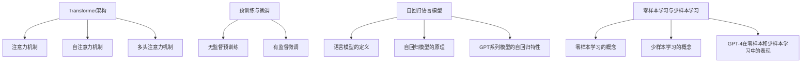

# GPT-4：点亮人工通用智能的火花

## 1. 背景介绍
### 1.1 人工智能的发展历程
#### 1.1.1 早期人工智能
#### 1.1.2 机器学习时代  
#### 1.1.3 深度学习革命

### 1.2 GPT系列语言模型的演进
#### 1.2.1 GPT-1：开启语言模型新纪元
#### 1.2.2 GPT-2：展现语言模型的潜力
#### 1.2.3 GPT-3：迈向通用人工智能的一大步

### 1.3 GPT-4的诞生
#### 1.3.1 OpenAI的研究进展
#### 1.3.2 GPT-4的发布与期望
#### 1.3.3 GPT-4对人工智能领域的影响

## 2. 核心概念与联系
### 2.1 Transformer架构
#### 2.1.1 注意力机制
#### 2.1.2 自注意力机制
#### 2.1.3 多头注意力机制

### 2.2 预训练与微调
#### 2.2.1 无监督预训练
#### 2.2.2 有监督微调
#### 2.2.3 预训练与微调的优势

### 2.3 自回归语言模型
#### 2.3.1 语言模型的定义
#### 2.3.2 自回归模型的原理
#### 2.3.3 GPT系列模型的自回归特性

### 2.4 零样本学习与少样本学习
#### 2.4.1 零样本学习的概念
#### 2.4.2 少样本学习的概念 
#### 2.4.3 GPT-4在零样本和少样本学习中的表现



## 3. 核心算法原理具体操作步骤
### 3.1 Transformer编码器
#### 3.1.1 输入嵌入
#### 3.1.2 位置编码
#### 3.1.3 自注意力层
#### 3.1.4 前馈神经网络层
#### 3.1.5 残差连接与层标准化

### 3.2 Transformer解码器  
#### 3.2.1 掩码自注意力机制
#### 3.2.2 编码器-解码器注意力机制
#### 3.2.3 前馈神经网络层
#### 3.2.4 残差连接与层标准化

### 3.3 Transformer的训练过程
#### 3.3.1 数据预处理
#### 3.3.2 模型初始化
#### 3.3.3 前向传播与反向传播
#### 3.3.4 参数更新与优化

### 3.4 GPT-4的架构创新
#### 3.4.1 模型规模的扩大
#### 3.4.2 稀疏注意力机制
#### 3.4.3 高效的并行训练策略
#### 3.4.4 其他潜在的改进

## 4. 数学模型和公式详细讲解举例说明
### 4.1 注意力机制的数学表示
#### 4.1.1 查询、键、值的计算
$$Attention(Q,K,V) = softmax(\frac{QK^T}{\sqrt{d_k}})V$$
其中，$Q$表示查询，$K$表示键，$V$表示值，$d_k$表示键的维度。

#### 4.1.2 多头注意力的计算
$$MultiHead(Q,K,V) = Concat(head_1, ..., head_h)W^O$$
$$head_i = Attention(QW_i^Q, KW_i^K, VW_i^V)$$
其中，$W_i^Q, W_i^K, W_i^V$分别表示第$i$个头的查询、键、值的线性变换矩阵，$W^O$表示多头注意力的输出线性变换矩阵。

### 4.2 自回归语言模型的概率计算
给定一个文本序列$x=(x_1, x_2, ..., x_n)$，自回归语言模型的目标是最大化以下概率：
$$P(x) = \prod_{i=1}^n P(x_i | x_1, x_2, ..., x_{i-1})$$
其中，$P(x_i | x_1, x_2, ..., x_{i-1})$表示在给定前$i-1$个词的情况下，第$i$个词的条件概率。

### 4.3 损失函数与优化算法
#### 4.3.1 交叉熵损失函数
$$L = -\frac{1}{n}\sum_{i=1}^n \log P(x_i | x_1, x_2, ..., x_{i-1})$$

#### 4.3.2 Adam优化算法
Adam优化算法是一种自适应学习率的优化算法，它结合了动量和RMSprop的优点。
$$m_t = \beta_1 m_{t-1} + (1 - \beta_1) g_t$$
$$v_t = \beta_2 v_{t-1} + (1 - \beta_2) g_t^2$$
$$\hat{m}_t = \frac{m_t}{1 - \beta_1^t}$$
$$\hat{v}_t = \frac{v_t}{1 - \beta_2^t}$$
$$\theta_t = \theta_{t-1} - \frac{\eta}{\sqrt{\hat{v}_t} + \epsilon} \hat{m}_t$$
其中，$m_t$和$v_t$分别表示梯度的一阶矩和二阶矩的估计，$\beta_1$和$\beta_2$是衰减率，$\eta$是学习率，$\epsilon$是一个小常数，用于防止分母为零。

## 5. 项目实践：代码实例和详细解释说明
### 5.1 使用PyTorch实现Transformer
```python
import torch
import torch.nn as nn

class MultiHeadAttention(nn.Module):
    def __init__(self, d_model, num_heads):
        super().__init__()
        self.d_model = d_model
        self.num_heads = num_heads
        self.head_dim = d_model // num_heads
        
        self.q_linear = nn.Linear(d_model, d_model)
        self.k_linear = nn.Linear(d_model, d_model)
        self.v_linear = nn.Linear(d_model, d_model)
        self.out_linear = nn.Linear(d_model, d_model)
    
    def forward(self, query, key, value, mask=None):
        batch_size = query.size(0)
        
        # 线性变换
        Q = self.q_linear(query)
        K = self.k_linear(key)
        V = self.v_linear(value)
        
        # 分头
        Q = Q.view(batch_size, -1, self.num_heads, self.head_dim).transpose(1, 2)
        K = K.view(batch_size, -1, self.num_heads, self.head_dim).transpose(1, 2)
        V = V.view(batch_size, -1, self.num_heads, self.head_dim).transpose(1, 2)
        
        # 注意力计算
        scores = torch.matmul(Q, K.transpose(-2, -1)) / torch.sqrt(torch.tensor(self.head_dim, dtype=torch.float32))
        if mask is not None:
            scores = scores.masked_fill(mask == 0, -1e9)
        attn_weights = torch.softmax(scores, dim=-1)
        attn_output = torch.matmul(attn_weights, V)
        
        # 合并头
        attn_output = attn_output.transpose(1, 2).contiguous().view(batch_size, -1, self.d_model)
        
        # 线性变换
        output = self.out_linear(attn_output)
        
        return output

class TransformerBlock(nn.Module):
    def __init__(self, d_model, num_heads, dim_feedforward, dropout=0.1):
        super().__init__()
        self.attention = MultiHeadAttention(d_model, num_heads)
        self.linear1 = nn.Linear(d_model, dim_feedforward)
        self.dropout = nn.Dropout(dropout)
        self.linear2 = nn.Linear(dim_feedforward, d_model)
        self.norm1 = nn.LayerNorm(d_model)
        self.norm2 = nn.LayerNorm(d_model)
        self.dropout1 = nn.Dropout(dropout)
        self.dropout2 = nn.Dropout(dropout)
    
    def forward(self, x, mask=None):
        attn_output = self.attention(x, x, x, mask)
        x = x + self.dropout1(attn_output)
        x = self.norm1(x)
        
        ffn_output = self.linear2(self.dropout(torch.relu(self.linear1(x))))
        x = x + self.dropout2(ffn_output)
        x = self.norm2(x)
        
        return x
```

以上代码实现了Transformer的核心组件：多头注意力机制和Transformer编码器块。其中，`MultiHeadAttention`类实现了多头注意力机制，`TransformerBlock`类实现了包含多头注意力和前馈神经网络的Transformer编码器块。

### 5.2 使用Hugging Face的Transformers库进行预训练和微调
```python
from transformers import GPT2LMHeadModel, GPT2Tokenizer, TextDataset, DataCollatorForLanguageModeling
from transformers import Trainer, TrainingArguments

# 加载预训练模型和分词器
model = GPT2LMHeadModel.from_pretrained('gpt2')
tokenizer = GPT2Tokenizer.from_pretrained('gpt2')

# 准备数据集
train_dataset = TextDataset(
    tokenizer=tokenizer,
    file_path='train.txt',
    block_size=128
)
data_collator = DataCollatorForLanguageModeling(
    tokenizer=tokenizer, mlm=False
)

# 设置训练参数
training_args = TrainingArguments(
    output_dir='./results',
    num_train_epochs=3,
    per_device_train_batch_size=4,
    save_steps=10_000,
    save_total_limit=2,
    prediction_loss_only=True,
)

# 开始训练
trainer = Trainer(
    model=model,
    args=training_args,
    data_collator=data_collator,
    train_dataset=train_dataset,
)
trainer.train()

# 微调
model.save_pretrained('gpt2-finetuned')
tokenizer.save_pretrained('gpt2-finetuned')
```

以上代码展示了如何使用Hugging Face的Transformers库对GPT-2模型进行预训练和微调。首先加载预训练的GPT-2模型和分词器，然后准备训练数据集，设置训练参数，最后使用`Trainer`类进行训练。训练完成后，可以将微调后的模型保存下来，以便后续使用。

## 6. 实际应用场景
### 6.1 自然语言生成
#### 6.1.1 文本续写
#### 6.1.2 对话生成
#### 6.1.3 故事生成

### 6.2 语言翻译
#### 6.2.1 机器翻译
#### 6.2.2 多语言翻译
#### 6.2.3 低资源语言翻译

### 6.3 文本分类
#### 6.3.1 情感分析
#### 6.3.2 主题分类
#### 6.3.3 意图识别

### 6.4 问答系统
#### 6.4.1 开放域问答
#### 6.4.2 阅读理解
#### 6.4.3 知识图谱问答

### 6.5 其他应用
#### 6.5.1 文本摘要
#### 6.5.2 关键词提取
#### 6.5.3 文本纠错

## 7. 工具和资源推荐
### 7.1 开源框架和库
#### 7.1.1 PyTorch
#### 7.1.2 TensorFlow
#### 7.1.3 Hugging Face Transformers

### 7.2 预训练模型
#### 7.2.1 BERT
#### 7.2.2 GPT-2
#### 7.2.3 T5

### 7.3 数据集
#### 7.3.1 Wikipedia
#### 7.3.2 BookCorpus
#### 7.3.3 Common Crawl

### 7.4 学习资源
#### 7.4.1 《Attention is All You Need》论文
#### 7.4.2 《Language Models are Unsupervised Multitask Learners》论文
#### 7.4.3 《Transformers for Natural Language Processing》书籍

## 8. 总结：未来发展趋势与挑战
### 8.1 模型规模的持续增长
#### 8.1.1 更大的模型规模
#### 8.1.2 更多的计算资源需求
#### 8.1.3 模型压缩与加速技术

### 8.2 多模态学习
#### 8.2.1 文本-图像联合建模
#### 8.2.2 文本-语音联合建模
#### 8.2.3 多模态预训练模型

### 8.3 知识增强
#### 8.3.1 外部