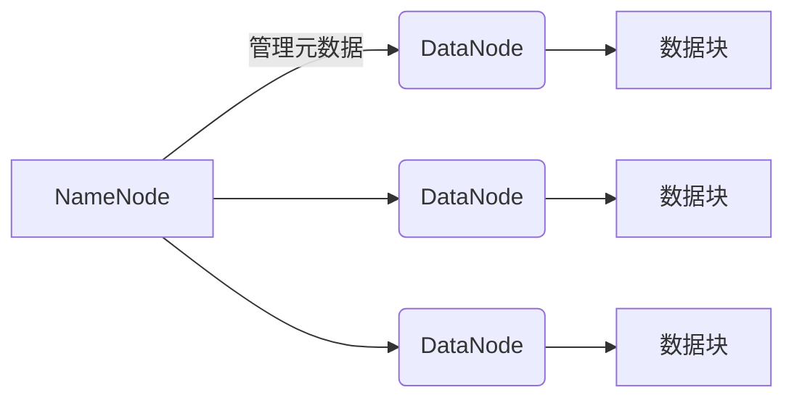
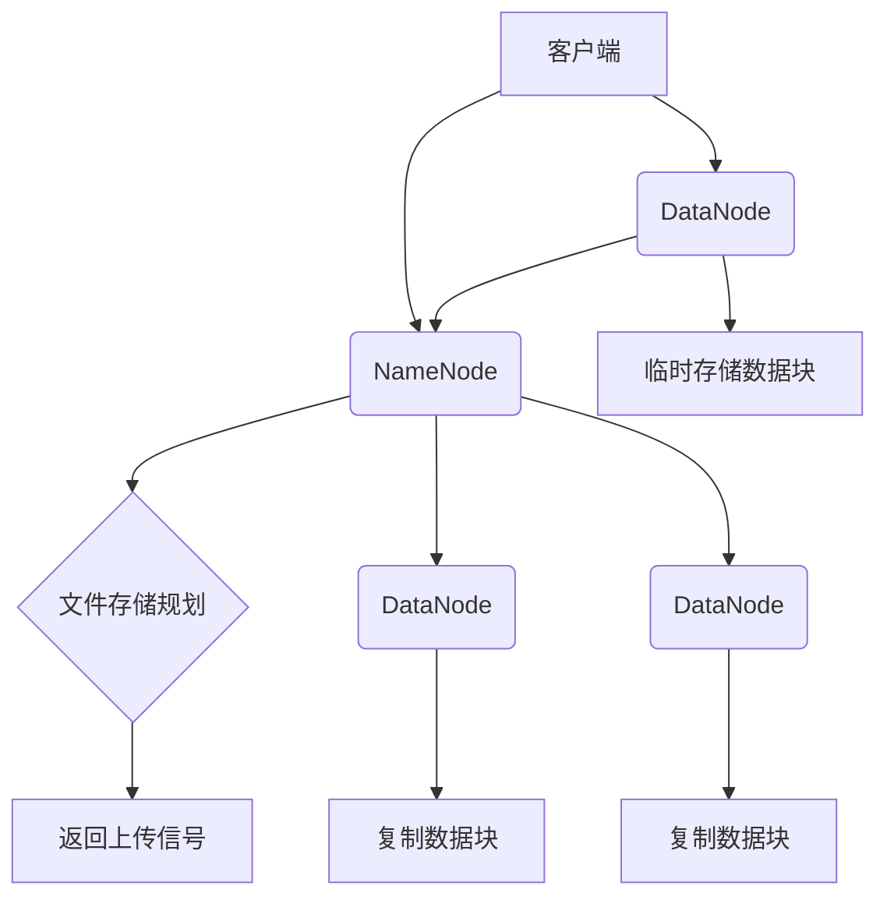
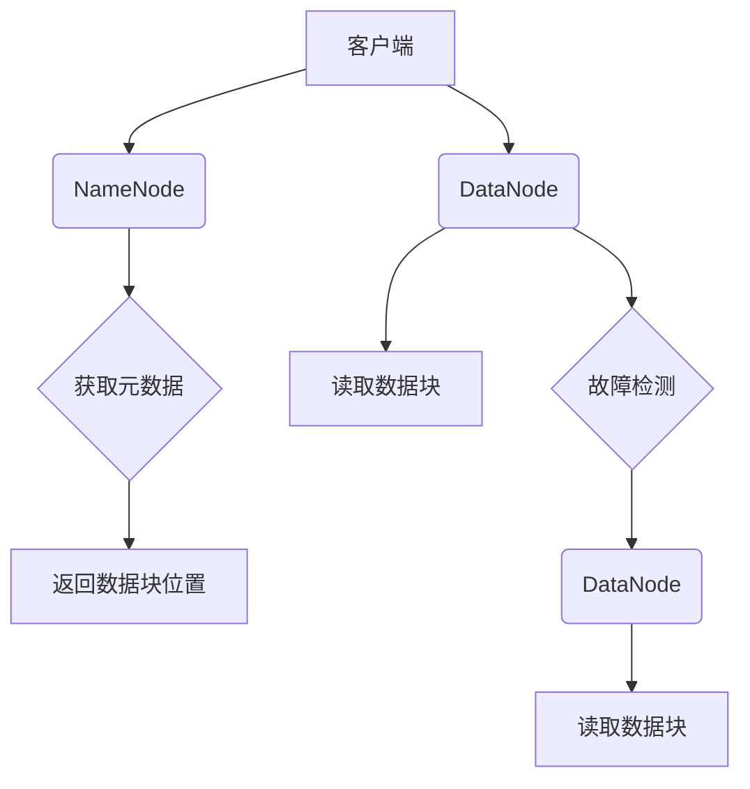

# Hadoop 原理与代码实例讲解

## 1. 背景介绍

### 1.1 大数据时代的到来

随着互联网、移动互联网、物联网等新兴技术的快速发展,数据呈现出爆炸式增长。根据国际数据公司(IDC)的预测,到2025年,全球数据总量将达到175ZB(1ZB=1万亿GB)。传统的数据处理系统已经无法满足如此庞大数据量的存储和计算需求。大数据时代的到来,对数据处理能力提出了更高的要求,迫切需要一种全新的数据处理架构和技术。

### 1.2 Hadoop的诞生

Hadoop诞生于谷歌的两篇论文"The Google File System"和"MapReduce: Simplified Data Processing on Large Clusters"。它是一个开源的分布式系统基础架构,由Apache软件基金会主持开发。Hadoop的设计理念是:通过可靠且可扩展的并行计算,在廉价的计算机集群上存储和分析大数据。

### 1.3 Hadoop的核心组件

Hadoop主要由两个核心组件组成:

1. **HDFS(Hadoop分布式文件系统)**: 一个高可靠、高吞吐量的分布式文件系统,用于存储大数据。
2. **MapReduce**: 一种分布式数据处理模型,用于在大规模集群上并行处理大数据。

## 2. 核心概念与联系

### 2.1 HDFS概念

HDFS是一个高度容错的分布式文件系统,适合运行在廉价的机器上。它的设计思想源于Google File System(GFS)论文。HDFS将文件数据分成块(Block),并将这些块分布存储在集群中的多台机器上,从而提供了数据冗余备份和高容错能力。



### 2.2 MapReduce概念

MapReduce是一种编程模型,用于大规模数据集的并行处理。它将计算过程分为两个阶段:Map阶段和Reduce阶段。

1. **Map阶段**:输入数据被分成独立的数据块,并行处理由Mapper函数完成。
2. **Reduce阶段**:Mapper的输出结果会按照Key值进行分组,并由Reducer函数并行处理。


### 2.3 HDFS与MapReduce的关系

HDFS为MapReduce提供了可靠的数据存储服务,而MapReduce则从HDFS中读取数据,进行并行计算处理,最终将结果写回HDFS。二者相互配合,构建了Hadoop的核心数据处理架构。

## 3. 核心算法原理具体操作步骤 

### 3.1 HDFS工作原理

#### 3.1.1 HDFS架构

HDFS采用主从架构,由一个NameNode(名称节点)和多个DataNode(数据节点)组成。

- **NameNode**: 管理文件系统的名称空间和客户端对文件的访问。
- **DataNode**: 存储实际的数据块,并执行数据块的创建、删除和复制等操作。

#### 3.1.2 文件存储过程

1. 客户端向NameNode请求上传文件。
2. NameNode进行文件存储规划,确定文件块的ID。
3. NameNode返回是否可以上传的信号给客户端。
4. 客户端请求其中一个DataNode上传数据。
5. DataNode在本地临时存储文件块数据。
6. DataNode通知NameNode已经存储好了文件块数据。
7. NameNode通知其他DataNode从最初的DataNode复制文件块数据。
8. 文件块在DataNode之间达到预定复制次数后,NameNode就可以允许客户端进行下一步操作。



#### 3.1.3 文件读取过程

1. 客户端向NameNode请求读取文件。
2. NameNode获取文件的元数据,包括文件对应的数据块存储位置。
3. 客户端从最近的DataNode读取数据。
4. 如果发生DataNode故障,则自动从另一个DataNode读取数据。



### 3.2 MapReduce工作原理

#### 3.2.1 MapReduce过程

1. **输入阶段**:MapReduce程序从HDFS或其他数据源读取输入数据。
2. **Map阶段**:输入数据被分成独立的数据块,并行处理由Mapper函数完成。
3. **Shuffle阶段**:Mapper的输出结果会按照Key值进行分组,分发给对应的Reducer。
4. **Reduce阶段**:Reducer对Mapper的输出结果进行并行处理,生成最终结果。
5. **输出阶段**:最终结果被写回HDFS或其他数据源。


#### 3.2.2 Map阶段

1. 输入数据被分割成多个数据块。
2. 每个数据块由一个独立的Map任务处理。
3. Map任务读取输入数据,并执行用户自定义的Mapper函数。
4. Mapper函数将输入的键值对转换为一组新的键值对。
5. 输出的键值对按照Key值进行分区,分发给对应的Reducer。

#### 3.2.3 Reduce阶段

1. Shuffle过程将Map阶段的输出结果按照Key值进行分组,分发给对应的Reducer。
2. Reducer对相同Key值的数据集进行处理,执行用户自定义的Reducer函数。
3. Reducer函数将相同Key值的数据集合并处理,生成最终的键值对结果。
4. 最终结果被写回HDFS或其他数据源。

## 4. 数学模型和公式详细讲解举例说明

在Hadoop的设计和实现中,涉及到一些数学模型和公式,用于优化系统性能和资源利用率。

### 4.1 数据块大小选择

HDFS将文件划分为一个或多个数据块存储,数据块的大小对系统性能有重大影响。数据块过大会导致磁盘空间浪费,数据块过小会增加元数据开销。Hadoop采用了一个简单的数学模型来确定最优的数据块大小。

假设:

- 平均文件大小为$F$
- 数据块大小为$B$
- 元数据开销为$M$

则,每个文件的元数据开销为:

$$
C = \frac{M \times F}{B}
$$

为了最小化元数据开销,需要最小化$C$,即求$\frac{dC}{dB} = 0$时的$B$值。

$$
\begin{aligned}
\frac{dC}{dB} &= \frac{d}{dB}\left(\frac{M \times F}{B}\right) \\
&= \frac{-M \times F}{B^2} \\
&= 0
\end{aligned}
$$

解得$B = \sqrt{M \times F}$。

例如,如果平均文件大小为$1GB$,元数据开销为$1KB$,则最优数据块大小为$\sqrt{1GB \times 1KB} \approx 1MB$。

### 4.2 数据块复制策略

为了提高数据可靠性和可用性,HDFS采用了数据块复制机制。每个数据块会复制多个副本,分布存储在不同的DataNode上。但是,过多的副本会浪费存储空间,过少的副本会降低数据可靠性。Hadoop采用了一个简单的数学模型来确定最优的复制因子。

假设:

- 集群中有$N$个DataNode
- 每个DataNode故障的概率为$p$
- 数据块的复制因子为$r$

则,整个集群中所有DataNode均故障的概率为:

$$
P = p^r \times \binom{N}{r}
$$

为了最小化$P$,需要求$\frac{dP}{dr} = 0$时的$r$值。

$$
\begin{aligned}
\frac{dP}{dr} &= \frac{d}{dr}\left(p^r \times \binom{N}{r}\right) \\
&= p^r \times \binom{N}{r} \times \left(\ln p + \frac{d}{dr}\ln\binom{N}{r}\right) \\
&= 0
\end{aligned}
$$

解得$r = \frac{N \times p}{1 - (1 - p)^N}$。

例如,如果集群中有$1000$个DataNode,每个DataNode故障的概率为$0.01$,则最优复制因子为$\frac{1000 \times 0.01}{1 - (1 - 0.01)^{1000}} \approx 3$。

## 5. 项目实践:代码实例和详细解释说明

为了更好地理解Hadoop的工作原理,我们将通过一个简单的WordCount示例程序,演示如何使用MapReduce进行并行计算。

### 5.1 WordCount需求

WordCount是一个经典的示例程序,它的目标是统计给定文本文件中每个单词出现的次数。

### 5.2 MapReduce实现

#### 5.2.1 Mapper代码

```java
public static class TokenizerMapper
    extends Mapper<Object, Text, Text, IntWritable>{

    private final static IntWritable one = new IntWritable(1);
    private Text word = new Text();

    public void map(Object key, Text value, Context context
                    ) throws IOException, InterruptedException {
        StringTokenizer itr = new StringTokenizer(value.toString());
        while (itr.hasMoreTokens()) {
            word.set(itr.nextToken());
            context.write(word, one);
        }
    }
}
```

1. `TokenizerMapper`继承自`Mapper`类,实现`map`方法。
2. `map`方法接收一行文本作为输入,使用`StringTokenizer`将其拆分为单词。
3. 对于每个单词,将其作为Key,值为常量`1`。
4. 使用`context.write`方法输出键值对`(单词, 1)`。

#### 5.2.2 Reducer代码

```java
public static class IntSumReducer
    extends Reducer<Text,IntWritable,Text,IntWritable> {
    private IntWritable result = new IntWritable();

    public void reduce(Text key, Iterable<IntWritable> values,
                       Context context
                       ) throws IOException, InterruptedException {
        int sum = 0;
        for (IntWritable val : values) {
            sum += val.get();
        }
        result.set(sum);
        context.write(key, result);
    }
}
```

1. `IntSumReducer`继承自`Reducer`类,实现`reduce`方法。
2. `reduce`方法接收一个Key和一个值迭代器。
3. 遍历值迭代器,累加所有值,得到单词的总计数。
4. 使用`context.write`方法输出键值对`(单词, 总计数)`。

#### 5.2.3 主程序代码

```java
public static void main(String[] args) throws Exception {
    Configuration conf = new Configuration();
    Job job = Job.getInstance(conf, "word count");
    job.setJarByClass(WordCount.class);
    job.setMapperClass(TokenizerMapper.class);
    job.setCombinerClass(IntSumReducer.class);
    job.setReducerClass(IntSumReducer.class);
    job.setOutputKeyClass(Text.class);
    job.setOutputValueClass(IntWritable.class);
    FileInputFormat.addInputPath(job, new Path(args[0]));
    FileOutputFormat.setOutputPath(job, new Path(args[1]));
    System.exit(job.waitForCompletion(true) ? 0 : 1);
}
```

1. 创建`Configuration`和`Job`对象。
2. 设置Mapper、Combiner和Reducer类。
3. 设置输出键值对类型。
4. 设置输入和输出路径。
5. 提交作业,等待完成。

### 5.3 运行示例

1. 将WordCount程序打包为JAR文件。
2. 将输入文件上传到HDFS。
3. 在Hadoop集群上运行JAR文件,指定输入和输出路径。

```bash
# 打包WordCount程序
$ mvn package

# 上传输入文件到