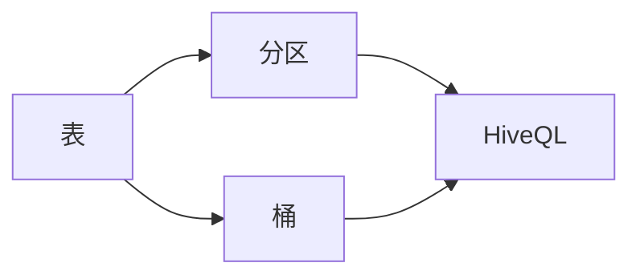
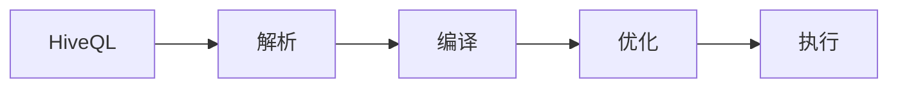

# Hive原理与代码实例讲解

## 1. 背景介绍

在大数据时代，数据的存储与处理成为了一个巨大的挑战。Hadoop作为一个分布式系统基础架构，解决了数据存储的问题，但是对于数据处理尤其是数据分析来说，直接使用MapReduce编程模型过于复杂。Hive应运而生，它提供了一种类SQL语言—HiveQL，让那些熟悉SQL的人也能在Hadoop上进行数据分析。Hive的设计初衷是为数据仓库应用提供数据汇总、查询和分析。

## 2. 核心概念与联系

Hive的核心概念包括表、分区、桶、HiveQL等。Hive表类似于关系数据库中的表，可以存储数据并定义数据的结构。分区是Hive中的一个优化机制，它可以将表中的数据根据某个字段的值分散存储到不同的目录中，以加快查询速度。桶是进一步在分区的基础上对数据进行划分，以便于更高效的数据处理。HiveQL是Hive定义的SQL方言，它允许用户执行类SQL查询来分析存储在Hadoop集群上的数据。



## 3. 核心算法原理具体操作步骤

Hive的核心算法原理是将HiveQL查询转换为MapReduce任务。这个过程主要包括以下步骤：

1. 解析：HiveQL语句被解析器解析成抽象语法树。
2. 编译：抽象语法树被编译成逻辑计划。
3. 优化：逻辑计划经过优化器优化，生成物理计划。
4. 执行：物理计划被转换为MapReduce任务，并在Hadoop集群上执行。



## 4. 数学模型和公式详细讲解举例说明

在Hive的查询优化中，代价模型是一个重要的数学模型。它用于估算执行计划的代价，包括时间、资源消耗等。代价模型可以表示为：

$$
C(Q) = \sum_{i=1}^{n} w_i \cdot f_i(Q)
$$

其中，$C(Q)$ 是查询 $Q$ 的总代价，$w_i$ 是第 $i$ 个因素的权重，$f_i(Q)$ 是第 $i$ 个因素的代价函数。

例如，如果考虑磁盘I/O和网络传输的代价，模型可以简化为：

$$
C(Q) = w_{\text{IO}} \cdot f_{\text{IO}}(Q) + w_{\text{Net}} \cdot f_{\text{Net}}(Q)
$$

## 5. 项目实践：代码实例和详细解释说明

假设我们有一个销售数据表 `sales`，包含字段 `date`, `region`, `amount`。我们要查询2019年在每个区域的总销售额。

HiveQL代码示例：

```sql
SELECT region, SUM(amount) AS total_sales
FROM sales
WHERE year(date) = 2019
GROUP BY region;
```

这个查询首先会被解析成抽象语法树，然后编译成逻辑计划。优化器可能会根据数据的分区信息重写查询，以减少需要扫描的数据量。最后，查询被转换成MapReduce任务在集群上执行。

## 6. 实际应用场景

Hive广泛应用于数据仓库的构建、日志数据分析、商业智能、机器学习数据预处理等场景。例如，电商公司可能会使用Hive来分析用户行为数据，以优化产品推荐算法。

## 7. 工具和资源推荐

- Apache Hive官方文档：提供全面的Hive使用指南。
- Hadoop：Hive的底层支持，了解Hadoop有助于更好地理解Hive的工作原理。
- SQL转HiveQL工具：帮助将标准SQL查询转换为HiveQL。

## 8. 总结：未来发展趋势与挑战

随着数据量的不断增长，Hive需要不断优化其性能和扩展性。未来的发展趋势可能包括更智能的查询优化器、更紧密的集成与其他大数据技术、以及对实时查询的支持。挑战包括处理更复杂的数据类型和查询、保证数据的安全性和隐私、以及提高系统的容错性。

## 9. 附录：常见问题与解答

Q1: Hive与传统数据库有什么区别？
A1: Hive是建立在Hadoop之上的数据仓库工具，它可以处理大规模数据，而传统数据库适用于在线事务处理。

Q2: HiveQL与SQL有什么不同？
A2: HiveQL是为Hadoop设计的类SQL查询语言，它在语法和功能上与SQL相似，但是有一些差异，比如不支持完整的事务特性。

Q3: Hive的性能如何优化？
A3: Hive的性能优化可以从多个方面入手，包括合理设计表和分区、使用适当的文件格式、编写高效的HiveQL以及调整Hadoop集群配置。

作者：禅与计算机程序设计艺术 / Zen and the Art of Computer Programming