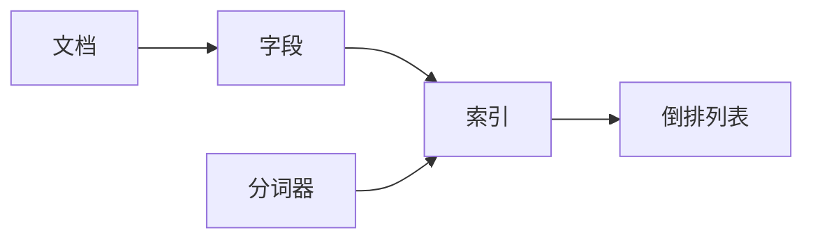
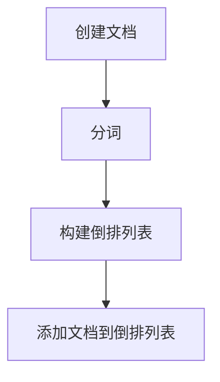

## 1.背景介绍

Lucene是Apache软件基金会（ASF）下的一个开源项目，它是一个高性能、可扩展的信息检索（IR）库。Lucene不是一个完整的搜索应用程序，而是一个用于构建搜索应用程序的代码库。Lucene提供了一个简单、灵活的框架，使得开发人员能够在各种应用程序中实现全文检索功能。

## 2.核心概念与联系

在深入了解Lucene的索引原理之前，我们首先需要了解一些核心概念：

- **文档（Document）**：在Lucene中，文档是信息检索的单位。每个文档都可以包含多个字段（Field）。

- **字段（Field）**：字段是构成文档的元素，每个字段都有一个名称和一个值。

- **索引（Index）**：索引是Lucene用于快速查找文档的数据结构。索引中包含了一组倒排列表，每个倒排列表对应一个单词。

- **倒排列表（Inverted List）**：倒排列表是索引的核心部分，它包含了一个单词以及出现该单词的所有文档的列表。

- **分词器（Analyzer）**：分词器用于将输入的文本分解为一系列的单词。

下面是这些概念之间的关系图：



## 3.核心算法原理具体操作步骤

Lucene的索引过程可以分为以下几个步骤：

1. **创建文档**：首先，我们需要创建一个文档对象，并向文档中添加字段。

2. **分词**：接下来，我们使用分词器将字段的值分解为一系列的单词。

3. **构建倒排列表**：对于每个单词，我们在索引中查找对应的倒排列表。如果倒排列表不存在，我们就创建一个新的倒排列表。

4. **添加文档到倒排列表**：最后，我们将文档添加到每个单词对应的倒排列表中。

下面是这个过程的流程图：



## 4.数学模型和公式详细讲解举例说明

在Lucene中，查询的相关性得分是根据以下公式计算的：

$$
score(q,d) = coord(q,d) \cdot queryNorm(q) \cdot \sum_{t \in q} \left( tf(t \in d) \cdot idf(t) ^ 2 \cdot t.getBoost() \cdot norm(t,d) \right)
$$

其中：

- $q$是查询，$d$是文档，$t$是查询中的单词。

- $coord(q,d)$是坐标因子，表示查询中的单词在文档中出现的频率。

- $queryNorm(q)$是查询规范因子，用于使得查询的得分与查询的长度无关。

- $tf(t \in d)$是单词$t$在文档$d$中的频率。

- $idf(t)$是单词$t$的逆文档频率，表示单词$t$的重要性。

- $t.getBoost()$是单词$t$的提升因子，表示单词$t$的权重。

- $norm(t,d)$是长度规范因子，表示文档$d$的长度。

## 5.项目实践：代码实例和详细解释说明

以下是在Lucene中创建索引和执行查询的简单示例：

```java
// 创建索引
IndexWriterConfig config = new IndexWriterConfig(new StandardAnalyzer());
Directory directory = new RAMDirectory();
IndexWriter indexWriter = new IndexWriter(directory, config);

Document doc = new Document();
doc.add(new TextField("content", "the quick brown fox jumps over the lazy dog", Field.Store.YES));
indexWriter.addDocument(doc);
indexWriter.close();

// 执行查询
IndexReader indexReader = DirectoryReader.open(directory);
IndexSearcher indexSearcher = new IndexSearcher(indexReader);

Query query = new TermQuery(new Term("content", "fox"));
TopDocs topDocs = indexSearcher.search(query, 10);
for (ScoreDoc scoreDoc : topDocs.scoreDocs) {
    doc = indexSearcher.doc(scoreDoc.doc);
    System.out.println(doc.get("content"));
}
indexReader.close();
```

这段代码首先创建了一个索引，并向索引中添加了一个包含一个字段的文档。然后，它执行了一个查询，查找包含单词"fox"的文档。

## 6.实际应用场景

Lucene被广泛应用在各种场景中，包括：

- **全文搜索**：Lucene最常见的应用就是全文搜索。许多网站和应用程序都使用Lucene来提供搜索功能。

- **信息检索**：Lucene也可以用于信息检索，例如在大量文档中查找包含特定单词或短语的文档。

- **文档分类**：Lucene可以用于文档分类，例如将文档分为不同的主题或类别。

## 7.工具和资源推荐

以下是一些有用的Lucene工具和资源：

- **Lucene官方网站**：[http://lucene.apache.org/](http://lucene.apache.org/)。这里有最新的Lucene版本，以及详细的文档和教程。

- **Lucene in Action**：这是一本关于Lucene的经典书籍，详细介绍了Lucene的各种功能和使用技巧。

- **Elasticsearch**：这是一个基于Lucene的搜索和分析引擎。Elasticsearch提供了一个简单的RESTful API，使得使用Lucene变得更加容易。

## 8.总结：未来发展趋势与挑战

Lucene作为一个成熟的全文检索库，已经在各种应用中得到了广泛的应用。然而，随着数据量的不断增长，Lucene面临着一些挑战，例如如何处理大规模的索引，如何提高查询的速度，以及如何提供更加丰富的查询功能。尽管如此，我相信Lucene的未来仍然充满了可能性。

## 9.附录：常见问题与解答

1. **Lucene是什么？**

Lucene是Apache软件基金会（ASF）下的一个开源项目，它是一个高性能、可扩展的信息检索（IR）库。

2. **Lucene的索引是如何工作的？**

Lucene的索引过程包括创建文档、分词、构建倒排列表和添加文档到倒排列表这几个步骤。

3. **如何在Lucene中执行查询？**

在Lucene中，我们可以使用`IndexSearcher`类来执行查询。查询的结果是一个`TopDocs`对象，它包含了匹配查询的文档的列表。

4. **Lucene有哪些应用场景？**

Lucene被广泛应用在全文搜索、信息检索和文档分类等场景中。

5. **Lucene有哪些挑战？**

随着数据量的不断增长，Lucene面临着一些挑战，例如如何处理大规模的索引，如何提高查询的速度，以及如何提供更加丰富的查询功能。

作者：禅与计算机程序设计艺术 / Zen and the Art of Computer Programming