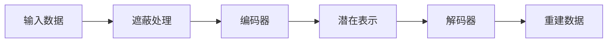

# MAE原理与代码实例讲解

## 1. 背景介绍

在深度学习领域，自监督学习（Self-Supervised Learning, SSL）已经成为一种重要的无监督学习方法。它通过构造辅助任务来学习数据的内在表示，而无需外部标注。Masked Autoencoders（MAE）是自监督学习的一种新兴形式，它通过遮蔽输入数据的一部分，然后训练模型去重建被遮蔽的信息，从而学习到数据的有效表示。

## 2. 核心概念与联系

MAE的核心概念是基于自编码器（Autoencoder）的结构，它包含两个主要部分：编码器（Encoder）和解码器（Decoder）。编码器负责将输入数据映射到一个低维的潜在空间，而解码器则负责将这个潜在表示重建回原始数据。在MAE中，输入数据首先经过一个遮蔽过程，然后编码器只对未被遮蔽的部分进行编码，解码器则尝试重建整个输入，包括被遮蔽的部分。



## 3. 核心算法原理具体操作步骤

MAE的操作步骤可以分为以下几个阶段：

1. **数据预处理**：对输入数据进行标准化处理，并随机遮蔽一部分数据。
2. **编码过程**：将未被遮蔽的数据输入编码器，得到潜在表示。
3. **解码过程**：将潜在表示输入解码器，重建整个数据，包括被遮蔽的部分。
4. **损失计算**：计算重建数据和原始数据之间的差异，通常使用均方误差（MSE）作为损失函数。
5. **反向传播与优化**：根据损失函数进行反向传播，更新模型参数。

## 4. 数学模型和公式详细讲解举例说明

假设输入数据为 $x \in \mathbb{R}^n$，遮蔽后的数据为 $\hat{x}$，编码器为 $f_{\theta}$（参数为 $\theta$），解码器为 $g_{\phi}$（参数为 $\phi$），则MAE的数学模型可以表示为：

$$
z = f_{\theta}(\hat{x})
$$

$$
\tilde{x} = g_{\phi}(z)
$$

其中，$z$ 是潜在表示，$\tilde{x}$ 是重建数据。损失函数 $L$ 通常定义为：

$$
L(\theta, \phi) = \frac{1}{n} \sum_{i=1}^{n} (x_i - \tilde{x}_i)^2
$$

## 5. 项目实践：代码实例和详细解释说明

以下是一个简单的MAE实现示例：

```python
import torch
import torch.nn as nn
import torch.optim as optim

# 定义编码器
class Encoder(nn.Module):
    def __init__(self, input_dim, latent_dim):
        super(Encoder, self).__init__()
        self.fc = nn.Linear(input_dim, latent_dim)
    
    def forward(self, x):
        return self.fc(x)

# 定义解码器
class Decoder(nn.Module):
    def __init__(self, latent_dim, output_dim):
        super(Decoder, self).__init__()
        self.fc = nn.Linear(latent_dim, output_dim)
    
    def forward(self, z):
        return self.fc(z)

# 定义MAE模型
class MAE(nn.Module):
    def __init__(self, input_dim, latent_dim):
        super(MAE, self).__init__()
        self.encoder = Encoder(input_dim, latent_dim)
        self.decoder = Decoder(latent_dim, input_dim)
    
    def forward(self, x, mask):
        x_masked = x * mask
        z = self.encoder(x_masked)
        x_reconstructed = self.decoder(z)
        return x_reconstructed

# 初始化模型
input_dim = 784  # 假设是28x28的图像展平后的维度
latent_dim = 64  # 潜在空间的维度
model = MAE(input_dim, latent_dim)

# 定义损失函数和优化器
criterion = nn.MSELoss()
optimizer = optim.Adam(model.parameters(), lr=0.001)

# 假设有一个数据批次和对应的遮蔽
x_batch = torch.randn(32, input_dim)  # 32个样本
mask = (torch.rand(32, input_dim) > 0.5).float()  # 随机遮蔽一半数据

# 训练步骤
optimizer.zero_grad()
x_reconstructed = model(x_batch, mask)
loss = criterion(x_reconstructed, x_batch)
loss.backward()
optimizer.step()

print(f"Loss: {loss.item()}")
```

在这个代码示例中，我们定义了一个简单的线性编码器和解码器，并通过遮蔽一部分输入数据来训练MAE模型。损失函数使用均方误差，优化器使用Adam。

## 6. 实际应用场景

MAE可以应用于多种场景，包括图像去噪、异常检测、特征提取等。在图像去噪中，MAE学习到的潜在表示可以捕捉到图像的主要特征，而忽略噪声。在异常检测中，MAE可以通过重建误差来识别异常样本。在特征提取中，MAE的潜在表示可以作为下游任务的输入特征。

## 7. 工具和资源推荐

- **PyTorch**：一个开源的机器学习库，适合于快速原型开发和研究。
- **TensorFlow**：谷歌开发的另一个强大的机器学习库。
- **Hugging Face Transformers**：提供了大量预训练模型，可以用于迁移学习和进一步的自监督学习研究。

## 8. 总结：未来发展趋势与挑战

MAE作为自监督学习的一种方法，其未来的发展趋势可能会集中在提高模型的泛化能力、减少计算资源的消耗以及探索更多的应用场景。挑战包括如何设计更有效的遮蔽策略、如何处理更复杂的数据类型以及如何与其他学习范式相结合。

## 9. 附录：常见问题与解答

- **Q: MAE和传统自编码器有什么区别？**
  - A: MAE通过遮蔽输入数据的一部分来强迫模型学习更加鲁棒的特征表示，而传统自编码器通常不进行这样的操作。

- **Q: MAE的遮蔽比例如何确定？**
  - A: 遮蔽比例是一个超参数，需要通过实验来确定。一般来说，遮蔽比例太高或太低都会影响模型的学习效果。

- **Q: MAE能否用于文本数据？**
  - A: 虽然MAE最初是为图像数据设计的，但理论上它也可以应用于文本或其他类型的序列数据，只要适当地设计遮蔽策略和模型结构。

作者：禅与计算机程序设计艺术 / Zen and the Art of Computer Programming