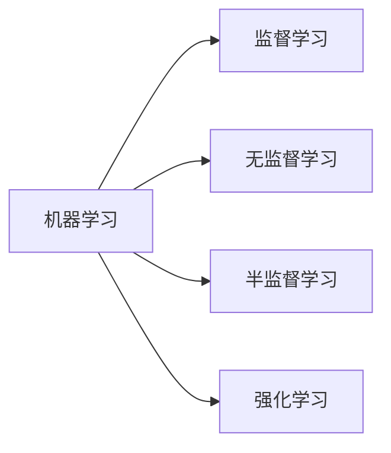

# Machine Learning

## 1. 背景介绍
在过去的几十年里，机器学习已经从一个主要在学术界讨论的概念，发展成为推动现代社会技术进步的关键力量。从图像识别到自然语言处理，从推荐系统到自动驾驶汽车，机器学习的应用几乎渗透到了我们生活的每一个角落。随着数据量的爆炸性增长和计算能力的显著提升，机器学习的潜力正在被逐步解锁，它正改变着商业模式、工作方式和我们与世界的互动。

## 2. 核心概念与联系
机器学习是人工智能的一个分支，它使计算机能够从数据中学习并做出决策或预测。核心概念包括监督学习、无监督学习、半监督学习和强化学习。这些概念之间的联系在于它们都依赖于数据来训练模型，但它们在数据标签的使用和学习方式上存在差异。



## 3. 核心算法原理具体操作步骤
以监督学习中的线性回归为例，其操作步骤包括数据预处理、模型选择、损失函数定义、优化算法选择和模型评估。具体步骤如下：

1. 数据预处理：包括数据清洗、特征选择、数据标准化等。
2. 模型选择：选择线性回归模型来拟合数据。
3. 损失函数定义：通常使用均方误差（MSE）作为损失函数。
4. 优化算法选择：如梯度下降法来最小化损失函数。
5. 模型评估：使用测试集数据来评估模型的性能。

## 4. 数学模型和公式详细讲解举例说明
线性回归模型可以表示为 $y = \beta_0 + \beta_1x_1 + \beta_2x_2 + ... + \beta_nx_n + \epsilon$，其中 $y$ 是目标变量，$x_i$ 是特征变量，$\beta_i$ 是模型参数，$\epsilon$ 是误差项。损失函数（均方误差）可以表示为：

$$
MSE = \frac{1}{N}\sum_{i=1}^{N}(y_i - \hat{y}_i)^2
$$

其中，$N$ 是样本数量，$y_i$ 是真实值，$\hat{y}_i$ 是预测值。

## 5. 项目实践：代码实例和详细解释说明
以下是一个简单的线性回归模型的Python代码示例：

```python
import numpy as np
from sklearn.linear_model import LinearRegression

# 假设我们有一些数据点
X = np.array([[1, 1], [1, 2], [2, 2], [2, 3]])
y = np.dot(X, np.array([1, 2])) + 3

# 创建并训练模型
model = LinearRegression().fit(X, y)

# 打印模型参数
print('系数:', model.coef_)
print('截距:', model.intercept_)
```

## 6. 实际应用场景
机器学习在许多领域都有广泛的应用，例如：

- 医疗领域：疾病预测、药物发现、医学影像分析。
- 金融领域：信用评分、算法交易、欺诈检测。
- 交通领域：自动驾驶汽车、路线规划、交通流量预测。

## 7. 工具和资源推荐
- 机器学习库：Scikit-learn、TensorFlow、PyTorch。
- 在线课程：Coursera的机器学习课程、fast.ai。
- 书籍：《Pattern Recognition and Machine Learning》、《Deep Learning》。

## 8. 总结：未来发展趋势与挑战
机器学习的未来发展趋势包括更深层次的模型解释性、自动化机器学习（AutoML）、联邦学习等。同时，挑战也很明显，如数据隐私保护、算法偏见、模型泛化能力等。

## 9. 附录：常见问题与解答
Q1: 机器学习和人工智能有什么区别？
A1: 人工智能是一个广泛的领域，包括机器学习在内的多种技术。机器学习是实现人工智能的一种方法。

Q2: 如何选择合适的机器学习算法？
A2: 需要根据具体问题的性质、数据的特点以及性能要求来选择合适的算法。

作者：禅与计算机程序设计艺术 / Zen and the Art of Computer Programming