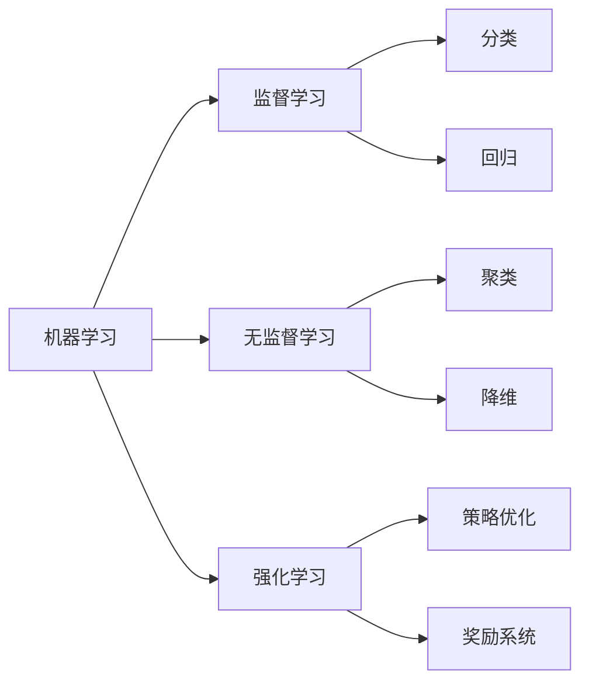

# Machine Learning

## 1. 背景介绍
机器学习作为人工智能的一个重要分支，已经渗透到我们生活的方方面面。从推荐系统到自动驾驶，从语音识别到图像处理，机器学习的应用几乎无处不在。随着数据量的爆炸性增长和计算能力的显著提升，机器学习的重要性和影响力日益凸显。

## 2. 核心概念与联系
机器学习涉及多个核心概念，包括监督学习、无监督学习、强化学习等。这些概念之间的联系在于它们都旨在通过从数据中学习模式和规律来提高预测或决策的准确性。



## 3. 核心算法原理具体操作步骤
以监督学习中的决策树为例，其操作步骤包括特征选择、树的生成和树的剪枝。特征选择的目的是选出对训练数据具有分类能力的特征，以减少生成模型的复杂度。

## 4. 数学模型和公式详细讲解举例说明
决策树的生成算法之一是ID3算法，它基于信息增益来选择特征。信息增益的计算公式为：

$$
IG(D, A) = H(D) - \sum_{v \in Values(A)} \frac{|D_v|}{|D|} H(D_v)
$$

其中，$IG(D, A)$ 是特征 $A$ 相对于数据集 $D$ 的信息增益，$H(D)$ 是数据集 $D$ 的熵，$D_v$ 是数据集 $D$ 中特征 $A$ 取值为 $v$ 的子集，$Values(A)$ 是特征 $A$ 的所有可能取值。

## 5. 项目实践：代码实例和详细解释说明
以Python语言和scikit-learn库为例，以下是决策树分类器的简单实现：

```python
from sklearn.datasets import load_iris
from sklearn.tree import DecisionTreeClassifier

# 加载数据集
iris = load_iris()
X, y = iris.data, iris.target

# 创建决策树分类器
clf = DecisionTreeClassifier()

# 训练模型
clf.fit(X, y)

# 进行预测
predictions = clf.predict(X)
```

## 6. 实际应用场景
机器学习在医疗诊断、金融风险评估、智能推荐系统等多个领域都有广泛应用。例如，在医疗诊断中，机器学习模型能够帮助医生分析病理图像，快速准确地诊断疾病。

## 7. 工具和资源推荐
对于机器学习的学习和研究，推荐使用Python语言，以及TensorFlow、PyTorch、scikit-learn等开源库。此外，Coursera、edX等在线教育平台提供了丰富的机器学习课程资源。

## 8. 总结：未来发展趋势与挑战
机器学习的未来发展趋势包括更深层次的模型解释能力、算法的自动化以及更强的泛化能力。同时，隐私保护、算法偏见和安全性等问题也是机器学习面临的挑战。

## 9. 附录：常见问题与解答
Q1: 机器学习和人工智能的关系是什么？
A1: 机器学习是实现人工智能的一种手段，它使得计算机能够从数据中学习。

Q2: 如何选择合适的机器学习算法？
A2: 选择算法时需要考虑问题的性质、数据的特点、算法的复杂度等因素。

作者：禅与计算机程序设计艺术 / Zen and the Art of Computer Programming