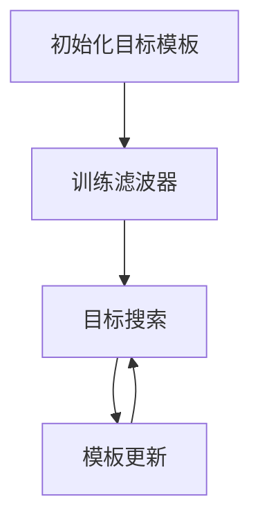
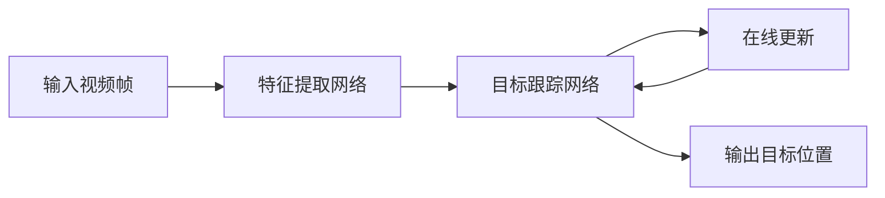

# Python深度学习实践：基于深度学习的视频理解方法

## 1.背景介绍

随着人工智能技术的不断发展,视频理解已成为深度学习领域的一个重要研究方向。视频理解是指利用计算机视觉和自然语言处理等技术,自动分析和理解视频内容的过程,包括检测和识别视频中的目标、行为、场景等,并生成相应的文本描述。

视频理解技术在许多领域都有广泛应用,如视频监控、人机交互、内容审核、自动化驾驶等。相比于静态图像理解,视频理解面临更多挑战,如时间维度信息的处理、目标运动跟踪、上下文语义理解等。因此,视频理解需要结合多模态深度学习模型,融合视觉、语音、文本等不同模态信息,提高理解精度。

## 2.核心概念与联系

### 2.1 视频理解的核心任务

视频理解主要包括以下几个核心任务:

1. **视频目标检测与跟踪(Video Object Detection and Tracking)**:检测并跟踪视频序列中的目标物体。

2. **视频动作识别(Video Action Recognition)**:识别视频中发生的动作类型。

3. **视频描述(Video Captioning)**:根据视频内容自动生成文本描述。

4. **视频问答(Video Question Answering)**:根据视频内容回答相关的问题。

5. **视频场景分割(Video Scene Segmentation)**:将视频按场景进行分割。

### 2.2 深度学习在视频理解中的应用

深度学习模型在视频理解任务中发挥着关键作用,常用的模型包括:

1. **卷积神经网络(CNN)**:用于提取视频帧的特征。

2. **循环神经网络(RNN)**:用于建模视频的时间依赖性。

3. **长短期记忆网络(LSTM)**:改进的RNN,能更好地捕捉长期依赖关系。

4. **注意力机制(Attention Mechanism)**:引导模型关注视频的关键部分。

5. **生成对抗网络(GAN)**:用于视频生成和增强任务。

6. **多模态融合模型**:融合视觉、语音、文本等不同模态信息。

这些模型通常会结合使用,构建复杂的端到端视频理解系统。

### 2.3 视频理解的挑战

视频理解面临以下主要挑战:

1. **视频数据复杂性**:视频包含大量时空信息,需要处理高维度数据。

2. **目标遮挡和运动模糊**:视频中目标可能被遮挡或运动模糊,增加了识别难度。

3. **上下文语义理解**:需要理解视频的上下文语义,而非孤立地识别目标。

4. **标注数据缺乏**:视频数据标注工作量大,高质量标注数据较少。

5. **计算资源需求高**:视频理解模型通常需要大量计算资源进行训练。

## 3.核心算法原理具体操作步骤

视频理解涉及多种核心算法,下面以视频目标检测与跟踪为例,介绍其核心算法原理和具体操作步骤。

### 3.1 视频目标检测算法

视频目标检测常用的算法有基于区域候选框的两阶段算法(如Faster R-CNN)和基于密集检测的单阶段算法(如YOLO)。

#### 3.1.1 两阶段算法(以Faster R-CNN为例)

两阶段算法步骤如下:

1. **区域候选框生成网络**:使用卷积神经网络提取图像特征,并生成区域候选框。

2. **区域候选框分类和精修网络**:对候选框进行分类(确定目标类别)和精修(调整边界框坐标)。

3. **非极大值抑制(NMS)**:去除重叠的冗余检测框。


#### 3.1.2 单阶段算法(以YOLO为例)

单阶段算法步骤如下:

1. **特征提取网络**:使用卷积神经网络提取图像特征。

2. **密集检测网络**:在特征图上密集预测边界框、置信度和类别概率。

3. **非极大值抑制(NMS)**:去除重叠的冗余检测框。


### 3.2 视频目标跟踪算法

视频目标跟踪常用的算法有基于相关滤波的算法(如MOSSE)和基于深度学习的算法。

#### 3.2.1 基于相关滤波的算法(以MOSSE为例)

MOSSE算法步骤如下:

1. **目标模板初始化**:使用第一帧中的目标边界框初始化目标模板。

2. **滤波器训练**:使用目标模板和环绕背景区域,训练能够区分目标和背景的滤波器。

3. **目标搜索**:在后续帧中,使用训练好的滤波器对图像进行滤波,找到与目标模板最相关的区域作为目标位置。

4. **模板更新**:根据新目标位置更新目标模板,用于下一帧的搜索。



#### 3.2.2 基于深度学习的算法

深度学习算法步骤如下:

1. **特征提取网络**:使用卷积神经网络提取视频帧的特征。

2. **目标跟踪网络**:设计能够学习目标运动模式的网络结构,如LSTM等。

3. **在线更新**:在跟踪过程中,不断更新网络参数以适应目标的变化。



## 4.数学模型和公式详细讲解举例说明

在视频理解任务中,常常需要使用数学模型和公式来描述和求解问题。下面以视频目标检测中的损失函数为例,详细讲解相关数学模型和公式。

### 4.1 边界框回归损失

边界框回归是视频目标检测中的一个重要步骤,它旨在精确地调整预测边界框的位置和大小,使其更好地匹配实际目标。常用的边界框回归损失函数是平滑L1损失函数,其公式如下:

$$
\begin{aligned}
L_{\text{reg}}(t_i, v_i) = \sum_{i\in\{x,y,w,h\}} \text{smooth}_{L_1}(t_i - v_i) \\
\text{smooth}_{L_1}(x) = \begin{cases}
0.5x^2, & \text{if }|x| < 1 \\
|x| - 0.5, & \text{otherwise}
\end{cases}
\end{aligned}
$$

其中:

- $t_i$是预测的边界框参数(中心坐标 $x$、$y$、宽度 $w$、高度 $h$)
- $v_i$是ground truth边界框参数
- $\text{smooth}_{L_1}$是平滑L1损失函数,对于小的残差使用平方损失,对于大的残差使用L1损失,从而在一定程度上避免了异常值的影响。

### 4.2 分类损失

除了边界框回归,视频目标检测还需要对目标进行分类。常用的分类损失函数是交叉熵损失函数,公式如下:

$$
L_{\text{cls}}(p, c) = -\log p_c
$$

其中:

- $p$是预测的类别概率分布
- $c$是ground truth类别
- $p_c$是预测的第$c$类的概率值

在实际应用中,通常会将回归损失和分类损失相加,作为总的损失函数:

$$
L = \alpha L_{\text{reg}} + \beta L_{\text{cls}}
$$

其中$\alpha$和$\beta$是平衡两个损失的超参数。

以上是视频目标检测中常用的损失函数,在其他视频理解任务中也会使用类似的数学模型和公式。掌握这些数学基础对于深入理解和优化算法性能非常重要。

## 5.项目实践:代码实例和详细解释说明

为了更好地理解视频理解的实现过程,下面我们将基于PyTorch框架,提供一个简单的视频目标检测和跟踪的代码示例,并对关键步骤进行详细解释。

### 5.1 导入所需库

```python
import torch
import torch.nn as nn
import torchvision
from torchvision.models.detection import FasterRCNN
from torchvision.models.detection.rpn import AnchorGenerator
import cv2
```

我们将使用PyTorch和torchvision库实现视频目标检测和跟踪。其中,FasterRCNN是torchvision中实现的Faster R-CNN目标检测模型,AnchorGenerator用于生成区域候选框。

### 5.2 定义模型和数据预处理

```python
# 初始化Faster R-CNN模型
model = FasterRCNN(pretrained=True)

# 设置模型为评估模式
model.eval()

# 定义预处理步骤
preprocess = torchvision.transforms.Compose([
    torchvision.transforms.ToTensor()
])
```

我们初始化一个预训练的Faster R-CNN模型,并将其设置为评估模式。同时定义了一个简单的预处理步骤,将输入图像转换为PyTorch张量。

### 5.3 视频目标检测

```python
# 打开视频文件
cap = cv2.VideoCapture('input_video.mp4')

while True:
    # 读取一帧
    ret, frame = cap.read()
    if not ret:
        break

    # 预处理
    img = preprocess(frame)
    img = img.unsqueeze(0)  # 添加批次维度

    # 进行目标检测
    outputs = model(img)

    # 非极大值抑制
    boxes = outputs[0]['boxes'].cpu().detach().numpy()
    scores = outputs[0]['scores'].cpu().detach().numpy()
    labels = outputs[0]['labels'].cpu().detach().numpy()
    keep = torchvision.ops.nms(boxes, scores, 0.5)

    # 在原始帧上绘制检测结果
    for i in keep:
        x1, y1, x2, y2 = boxes[i]
        label = labels[i]
        score = scores[i]
        cv2.rectangle(frame, (int(x1), int(y1)), (int(x2), int(y2)), (0, 255, 0), 2)
        cv2.putText(frame, f'{label}: {score:.2f}', (int(x1), int(y1) - 10), cv2.FONT_HERSHEY_SIMPLEX, 0.5, (36, 255, 12), 2)

    # 显示结果
    cv2.imshow('Video', frame)
    if cv2.waitKey(1) & 0xFF == ord('q'):
        break

cap.release()
cv2.destroyAllWindows()
```

在这个示例中,我们打开一个视频文件,并逐帧读取视频数据。对于每一帧,我们首先进行预处理,然后使用Faster R-CNN模型进行目标检测。检测结果包括边界框坐标、分数和类别标签。我们使用非极大值抑制(NMS)去除重叠的冗余检测框。最后,将检测结果绘制在原始帧上,并显示出来。

### 5.4 视频目标跟踪

```python
# 初始化MOSSE跟踪器
tracker = cv2.MultiTracker_create()

# 打开视频文件
cap = cv2.VideoCapture('input_video.mp4')

# 读取第一帧并选择初始目标
ret, frame = cap.read()
bbox = cv2.selectROI(frame, False)
tracker.add(cv2.TrackerMOSSE_create(), frame, bbox)

while True:
    # 读取一帧
    ret, frame = cap.read()
    if not ret:
        break

    # 更新跟踪器
    success, boxes = tracker.update(frame)

    # 在原始帧上绘制跟踪结果
    for box in boxes:
        x, y, w, h = [int(v) for v in box]
        cv2.rectangle(frame, (x, y), (x + w, y + h), (0, 255, 0), 2)

    # 显示结果
    cv2.imshow('Video', frame)