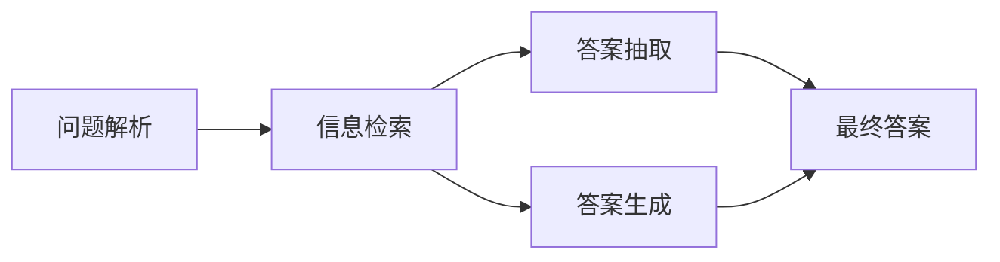

# Question Answering原理与代码实例讲解

## 1. 背景介绍
问答系统（Question Answering, QA）是自然语言处理（NLP）领域的一个重要分支，它旨在让计算机能够理解自然语言提出的问题，并给出准确的答案。随着深度学习技术的发展，QA系统在信息检索、智能客服、虚拟助手等领域得到了广泛应用。

## 2. 核心概念与联系
QA系统通常包括以下几个核心组件：问题解析、信息检索、答案抽取和答案生成。问题解析负责理解用户的查询意图；信息检索则是从大量数据中找到相关信息；答案抽取和生成则是从相关信息中提取答案或生成回答。



## 3. 核心算法原理具体操作步骤
QA系统的核心算法原理可以分为以下步骤：

1. **问题理解**：使用NLP技术解析问题，提取关键词和实体。
2. **文档检索**：根据问题关键词在数据库中检索相关文档。
3. **候选答案生成**：从相关文档中抽取可能的答案。
4. **答案排序**：对候选答案进行打分和排序，选择最佳答案。

## 4. 数学模型和公式详细讲解举例说明
QA系统中常用的数学模型包括TF-IDF、BM25、BERT等。以BERT为例，其核心思想是通过Transformer模型学习词语的上下文表示。BERT的输入是一系列Token，输出是这些Token的高维表示。

$$
\text{BERT}(Token_1, Token_2, ..., Token_n) = [Embedding_1, Embedding_2, ..., Embedding_n]
$$

其中，$Embedding_i$ 是第 $i$ 个Token的向量表示。

## 5. 项目实践：代码实例和详细解释说明
以BERT为基础的QA系统实现代码如下：

```python
from transformers import BertForQuestionAnswering, BertTokenizer
import torch

# 加载预训练模型和分词器
model = BertForQuestionAnswering.from_pretrained('bert-large-uncased-whole-word-masking-finetuned-squad')
tokenizer = BertTokenizer.from_pretrained('bert-large-uncased-whole-word-masking-finetuned-squad')

# 输入问题和文本
question = "What is the capital of France?"
text = "Paris is the capital and most populous city of France."

# 对问题和文本进行编码
inputs = tokenizer.encode_plus(question, text, return_tensors='pt', add_special_tokens=True)
input_ids = inputs["input_ids"].tolist()[0]

# 模型预测
outputs = model(**inputs)
answer_start_scores = outputs.start_logits
answer_end_scores = outputs.end_logits

# 获取答案的起始和结束位置
answer_start = torch.argmax(answer_start_scores)
answer_end = torch.argmax(answer_end_scores) + 1

# 转换回文本
answer = tokenizer.convert_tokens_to_string(tokenizer.convert_ids_to_tokens(input_ids[answer_start:answer_end]))

print("Answer:", answer)
```

在这段代码中，我们首先加载了预训练的BERT模型和分词器，然后对输入的问题和文本进行编码，通过模型预测得到答案的起始和结束位置，最后将这些位置转换回文本形式的答案。

## 6. 实际应用场景
QA系统在多个领域都有实际应用，例如：

- 在线客服：自动回答用户的常见问题。
- 医疗咨询：提供针对性的健康和医疗信息。
- 法律咨询：自动解答法律相关的查询。

## 7. 工具和资源推荐
- **Transformers**：一个广泛使用的NLP库，提供了多种预训练模型。
- **Elasticsearch**：一个强大的搜索引擎，可以用于信息检索。
- **SQuAD**：一个问答数据集，常用于训练和评估QA模型。

## 8. 总结：未来发展趋势与挑战
QA系统的未来发展趋势包括更深层次的语义理解、多模态问答和实时互动。同时，挑战也很明显，如如何处理复杂问题、提高跨领域的泛化能力等。

## 9. 附录：常见问题与解答
- **问：QA系统如何理解复杂问题？**
  答：通过深度学习模型，如BERT，可以更好地理解问题的上下文和隐含意义。

- **问：QA系统的准确性如何提高？**
  答：通过更大的数据集训练、更精细的模型调优和结合领域知识可以提高准确性。

作者：禅与计算机程序设计艺术 / Zen and the Art of Computer Programming