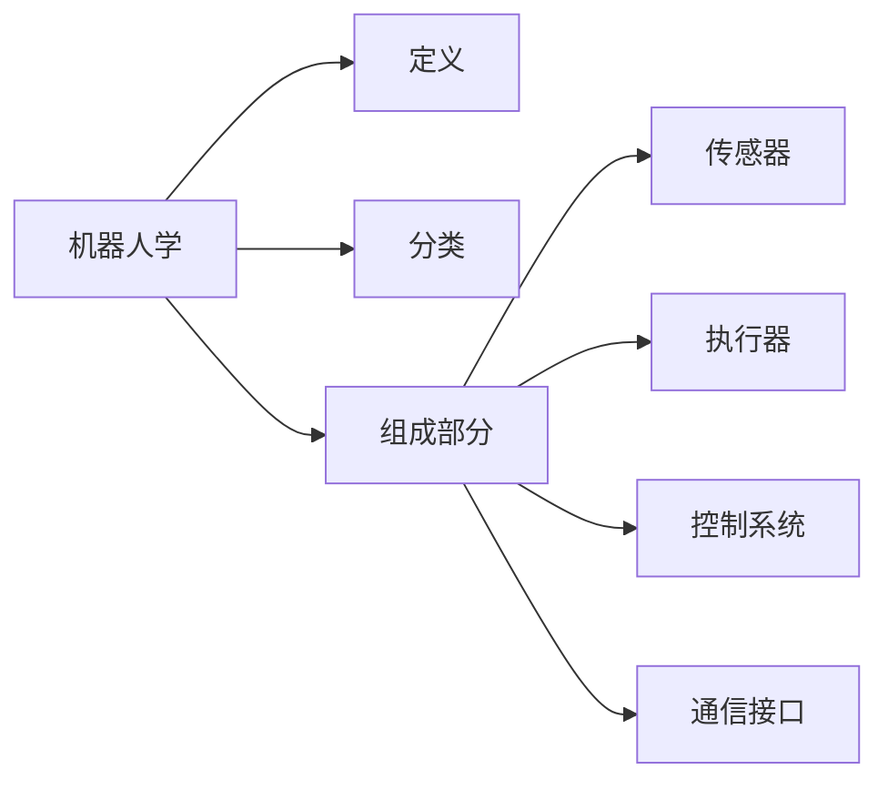

# Robotics 原理与代码实战案例讲解

## 1. 背景介绍
在本章节中，将介绍机器人技术的历史发展，当前的技术现状，以及机器人技术对社会的影响。此外，还将探讨机器人技术的跨学科特性，涉及机械工程、电子工程、计算机科学和人工智能等领域。

## 2. 核心概念与联系
本章节将详细介绍机器人学的核心概念，包括机器人的定义、分类、基本组成部分，以及这些组成部分如何相互作用。同时，将使用Mermaid流程图来展示这些概念之间的联系。



## 3. 核心算法原理具体操作步骤
在这一章节中，将深入探讨机器人学中的核心算法，如路径规划、避障算法、机器视觉处理等。每个算法将通过具体的操作步骤进行解释，以便读者能够理解其工作原理。

## 4. 数学模型和公式详细讲解举例说明
此章节将重点讲解机器人学中的数学模型和公式，如运动学、动力学、概率模型等。每个模型和公式都将通过实例进行详细讲解，以帮助读者更好地理解其数学原理。

$$
\text{例如，运动学方程：} \mathbf{J}(\mathbf{q})\dot{\mathbf{q}} = \dot{\mathbf{x}}
$$

## 5. 项目实践：代码实例和详细解释说明
在本章节中，将提供几个机器人项目的代码实例，并对代码进行详细的解释说明。这些实例将涵盖传感器数据处理、运动控制、决策制定等方面。

```python
# 示例代码片段
def sensor_processing(sensor_data):
    # 处理传感器数据的代码
    processed_data = ...
    return processed_data
```

## 6. 实际应用场景
本章节将探讨机器人技术在不同领域的实际应用场景，如制造业、医疗、服务业、探索和救援等。每个应用场景都将详细描述机器人如何被使用，以及它们带来的影响和价值。

## 7. 工具和资源推荐
在这一章节中，将推荐一些有用的工具和资源，包括开发平台、模拟器、开源项目和学习资料，以帮助读者更深入地学习和实践机器人技术。

## 8. 总结：未来发展趋势与挑战
本章节将总结机器人技术的当前状态，并展望未来的发展趋势。同时，将讨论机器人学面临的挑战，如技术、伦理和社会接受度等问题。

## 9. 附录：常见问题与解答
最后，将提供一个附录，回答一些关于机器人学的常见问题，帮助读者解决在学习和实践过程中可能遇到的问题。

作者：禅与计算机程序设计艺术 / Zen and the Art of Computer Programming

请注意，这个概要提供了文章的结构和每个章节的主要内容，但需要进一步扩展每个部分以达到8000字的要求。每个章节都应该包含详细的信息、示例和解释，以确保文章的完整性和深度。