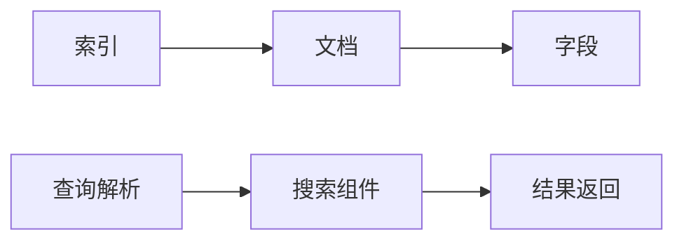

# Solr原理与代码实例讲解

## 1. 背景介绍
Apache Solr是一个开源的搜索平台，基于Apache Lucene构建。它被广泛应用于企业级搜索领域，提供了全文搜索、高亮显示、分面搜索、实时索引、动态聚类、数据库集成以及丰富的文档处理能力。Solr的强大功能和灵活性使其成为了许多大型网站和应用的首选搜索解决方案。

## 2. 核心概念与联系
Solr的核心概念包括索引、文档、字段、查询解析、搜索组件等。索引是Solr存储数据的方式，文档是索引中的基本单位，字段是文档的属性。查询解析是将用户输入的查询字符串转换为Solr可以理解的查询对象的过程，搜索组件是处理查询和返回结果的模块。



## 3. 核心算法原理具体操作步骤
Solr的核心算法包括文本分析、索引构建和查询处理。文本分析涉及分词、去停用词、同义词扩展等步骤。索引构建是将文档转换为索引形式，涉及倒排索引的创建。查询处理包括查询解析、查询执行和结果排序。

## 4. 数学模型和公式详细讲解举例说明
Solr的相关性打分模型通常基于TF-IDF算法，其中TF表示词频，IDF表示逆文档频率。打分公式如下：

$$
Score(q,d) = \sum_{t \in q} (TF(t,d) \times IDF(t) \times Boost(t,q,d))
$$

其中，$Score(q,d)$ 是查询 $q$ 和文档 $d$ 的相关性得分，$TF(t,d)$ 是词项 $t$ 在文档 $d$ 中的频率，$IDF(t)$ 是词项 $t$ 的逆文档频率，$Boost(t,q,d)$ 是对词项 $t$ 的权重提升。

## 5. 项目实践：代码实例和详细解释说明
在Solr中，一个简单的文档添加操作可以通过以下代码实现：

```java
SolrClient client = new HttpSolrClient.Builder("http://localhost:8983/solr/collection1").build();
SolrInputDocument document = new SolrInputDocument();
document.addField("id", "1");
document.addField("name", "A sample document");
client.add(document);
client.commit();
```

这段代码创建了一个Solr客户端，构建了一个文档对象，并添加了两个字段：id和name。然后将文档添加到Solr并提交更改。

## 6. 实际应用场景
Solr被应用于电子商务网站的商品搜索、社交媒体平台的内容检索、企业内部的文档管理系统等多种场景。它的高可扩展性和定制化能力使其能够满足各种复杂的搜索需求。

## 7. 工具和资源推荐
- Apache Solr官方网站：提供最新的Solr发行版和文档。
- Solr in Action：一本深入讲解Solr的书籍。
- Solr官方Wiki：包含了大量的教程和最佳实践。

## 8. 总结：未来发展趋势与挑战
Solr的未来发展趋势包括更加智能的查询解析、更高效的索引技术和更丰富的数据处理功能。挑战则来自于处理大数据、实时搜索和多语言支持等方面。

## 9. 附录：常见问题与解答
Q1: Solr和Elasticsearch有什么区别？
A1: Solr和Elasticsearch都是基于Lucene的搜索服务器，但在分布式处理、API和客户端工具等方面有所不同。

Q2: Solr如何实现高可用性？
A2: Solr可以通过SolrCloud模式实现高可用性，它支持分片、复制和自动故障转移。

Q3: Solr的性能优化有哪些方法？
A3: 性能优化方法包括合理设计索引和查询、使用缓存、调整Java虚拟机设置等。

作者：禅与计算机程序设计艺术 / Zen and the Art of Computer Programming