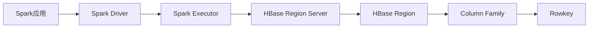

# Spark-HBase整合原理与代码实例讲解

## 1. 背景介绍
### 1.1 大数据处理的挑战
在当今大数据时代,海量数据的存储和处理已成为企业面临的重大挑战。传统的关系型数据库难以满足实时、高并发的大数据处理需求。因此,大数据技术应运而生,其中Apache Spark和Apache HBase就是两个广泛应用的开源大数据处理框架。

### 1.2 Spark与HBase的优势
- Spark是一个快速、通用的大规模数据处理引擎,具有高效的内存计算和迭代处理能力,适合复杂的数据分析和机器学习场景。
- HBase是一个可扩展的、分布式的NoSQL数据库,提供了实时随机读写和海量数据存储能力,适合存储非结构化和半结构化数据。

### 1.3 Spark与HBase整合的意义
Spark与HBase的整合可以发挥两者的优势,实现大数据的高效处理和存储:
- Spark可以并行读写HBase中的海量数据,提高数据处理效率
- HBase为Spark提供了可扩展、高可用的数据存储,保证数据的持久化
- 将Spark计算后的结果数据存入HBase,方便后续的查询和分析

因此,深入理解Spark-HBase整合的原理,并掌握其代码实现,对于构建高性能的大数据应用至关重要。

## 2. 核心概念与联系
### 2.1 Spark生态系统
- Spark Core:Spark的核心计算引擎,提供了RDD(弹性分布式数据集)编程模型和任务调度
- Spark SQL:用于结构化数据处理,支持SQL查询、DataFrame和DataSet API
- Spark Streaming:对实时数据流进行处理和分析的组件
- MLlib:Spark的机器学习库,提供了常用的机器学习算法
- GraphX:用于图计算和图挖掘的Spark组件

### 2.2 HBase架构
- Region Server:负责管理一个或多个Region,处理数据的读写请求
- Region:HBase表的分片,每个Region包含一定范围的行键
- Column Family:HBase表中的列族,一个列族包含多个列,每个列都有时间戳
- Rowkey:HBase表的主键,用于唯一标识一行数据
- HMaster:负责管理Region Server,协调Region的分配和负载均衡

### 2.3 Spark与HBase的交互
Spark与HBase的交互主要通过以下几种方式实现:
- 使用Spark RDD API读写HBase表数据
- 使用Spark DataFrame和DataSet API操作HBase表
- 使用Spark SQL外部表映射HBase表,并进行SQL查询
- 使用Bulk Load批量导入数据到HBase

下图展示了Spark与HBase整合的总体架构:


## 3. 核心算法原理具体操作步骤
### 3.1 Spark读取HBase数据的原理
Spark读取HBase数据的基本步骤如下:
1. Spark应用创建一个HBase连接,并获取HBase表的元数据信息
2. Spark根据元数据将HBase表划分为多个分区(Partition),每个分区对应一个Region
3. Spark在Executor上启动多个Task,每个Task负责读取一个分区的数据
4. Task通过HBase的客户端API(如Table和Scan)读取所属Region的数据
5. Task将读取到的数据转换为RDD、DataFrame或DataSet,并返回给Driver

### 3.2 Spark写入HBase数据的原理
Spark写入HBase数据的基本步骤如下:
1. Spark应用将待写入的数据转换为RDD、DataFrame或DataSet
2. Spark根据数据的Rowkey对数据进行分区,确保相同Rowkey的数据在同一个分区内
3. Spark在Executor上启动多个Task,每个Task负责写入一个分区的数据  
4. Task通过HBase的客户端API(如Table和Put)将数据写入对应的Region Server
5. Region Server将数据持久化到HFile,并更新Region的元数据信息

### 3.3 Bulk Load批量导入HBase的原理
Bulk Load是一种高效的批量导入数据到HBase的方法,其基本原理如下:
1. Spark应用将待导入的数据处理成HFile格式,并存储在HDFS上
2. Spark应用调用HBase的Bulk Load工具类(如LoadIncrementalHFiles),将HFile加载到对应的Region Server
3. Region Server将HFile移动到相应的Region目录下,并更新元数据信息
4. Bulk Load完成后,新导入的数据可以被查询和访问

Bulk Load相比普通的写入方式,可以显著提高数据导入的效率和吞吐量。

## 4. 数学模型和公式详细讲解举例说明
在Spark-HBase整合应用中,经常涉及到数据分区、数据分布等问题,这里以数据分区为例,介绍相关的数学模型。

### 4.1 数据分区的数学模型
假设有一个大小为N的数据集D,需要将其划分为M个分区,每个分区的数据量尽可能均衡。可以使用以下数学模型来描述数据分区问题:

$min \sum_{i=1}^{M} (|D_i| - \frac{N}{M})^2$

其中,$D_i$表示第i个分区的数据子集,$|D_i|$表示第i个分区的数据量。上述模型的目标是最小化各分区数据量与平均数据量之差的平方和,从而使得数据分布尽量均衡。

### 4.2 数据分区的代码实现
在Spark中,可以使用RDD的partitionBy方法对数据进行分区,其分区器需要继承Partitioner类。以HashPartitioner为例,其分区逻辑如下:

$P_i = hash(key) \mod M$

其中,$P_i$表示第i个分区,$hash(key)$表示对数据的键进行哈希,M为分区数。这种哈希分区方式可以保证相同键的数据被分配到同一个分区,但不能保证各分区数据量的均衡性。

下面是使用Spark RDD进行哈希分区的代码示例:

```scala
val data = sc.parallelize(Seq((1, "a"), (2, "b"), (3, "c"), (4, "d")))
val partitionedData = data.partitionBy(new HashPartitioner(2))
partitionedData.foreachPartition(iter => {
  println(s"Partition: ${TaskContext.getPartitionId()}")
  iter.foreach(println)
})
```

以上代码将数据划分为2个分区,并打印每个分区的数据。运行结果如下:

```
Partition: 0
(2,b)
(4,d)
Partition: 1
(1,a)
(3,c)
```

可以看到,哈希分区将键为偶数的数据分配到了第0个分区,键为奇数的数据分配到了第1个分区。

## 5. 项目实践:代码实例和详细解释说明
下面通过一个完整的Spark-HBase整合项目示例,演示如何使用Spark读写HBase表,并进行数据分析。

### 5.1 项目环境准备
- Hadoop集群:2.7.3
- Spark版本:2.4.5
- HBase版本:1.2.6
- Scala版本:2.11.12

### 5.2 创建HBase表
首先,在HBase Shell中创建一个用于测试的表:

```sql
create 'student', 'info'
```

该表名为"student",包含一个列族"info"。

### 5.3 使用Spark写入数据到HBase
下面是使用Spark DataFrame API将数据写入HBase表的代码示例:

```scala
import org.apache.spark.sql.{DataFrame, SparkSession}
import org.apache.hadoop.hbase.{HBaseConfiguration, TableName}
import org.apache.hadoop.hbase.client.{Connection, ConnectionFactory, Put, Table}
import org.apache.hadoop.hbase.util.Bytes

object SparkWriteHBase {
  def main(args: Array[String]): Unit = {
    // 创建SparkSession
    val spark = SparkSession.builder()
      .appName("SparkWriteHBase")
      .getOrCreate()

    // 创建DataFrame
    val data = Seq(
      (1, "Tom", 18),
      (2, "Jerry", 16),
      (3, "Jack", 20)
    )
    val df: DataFrame = spark.createDataFrame(data).toDF("id", "name", "age")

    // 将DataFrame数据写入HBase
    df.foreachPartition(iter => {
      val conf = HBaseConfiguration.create()
      val conn: Connection = ConnectionFactory.createConnection(conf)
      val table: Table = conn.getTable(TableName.valueOf("student"))

      iter.foreach(row => {
        val put = new Put(Bytes.toBytes(row.getAs[Int]("id").toString))
        put.addColumn(Bytes.toBytes("info"), Bytes.toBytes("name"), Bytes.toBytes(row.getAs[String]("name")))
        put.addColumn(Bytes.toBytes("info"), Bytes.toBytes("age"), Bytes.toBytes(row.getAs[Int]("age").toString))
        table.put(put)
      })

      table.close()
      conn.close()
    })

    spark.stop()
  }
}
```

代码解释:
- 首先创建一个SparkSession,用于创建DataFrame
- 然后定义一个包含学生信息的数据集,并转换为DataFrame
- 接着使用foreachPartition方法对DataFrame的每个分区进行处理
- 在分区内,创建HBase连接和表对象,并将每行数据转换为Put对象写入HBase
- 最后关闭HBase连接和表对象,并停止SparkSession

### 5.4 使用Spark读取HBase数据
下面是使用Spark RDD API读取HBase表数据的代码示例:

```scala
import org.apache.hadoop.hbase.{Cell, CellUtil, HBaseConfiguration, TableName}
import org.apache.hadoop.hbase.client.{Connection, ConnectionFactory, Result, Scan, Table}
import org.apache.hadoop.hbase.util.Bytes
import org.apache.spark.rdd.RDD
import org.apache.spark.{SparkConf, SparkContext}

object SparkReadHBase {
  def main(args: Array[String]): Unit = {
    // 创建SparkContext
    val conf = new SparkConf().setAppName("SparkReadHBase").setMaster("local[2]")
    val sc = new SparkContext(conf)

    // 读取HBase表数据
    val hbaseConf = HBaseConfiguration.create()
    hbaseConf.set("hbase.zookeeper.quorum", "localhost")
    hbaseConf.set("hbase.zookeeper.property.clientPort", "2181")
    hbaseConf.set(TableName.META_TABLE_NAME.getNameAsString, "hbase:meta")

    val scan = new Scan()
    scan.addFamily(Bytes.toBytes("info"))

    val hbaseRDD: RDD[(String, String)] = sc.newAPIHadoopRDD(
      hbaseConf,
      classOf[org.apache.hadoop.hbase.mapreduce.TableInputFormat],
      classOf[org.apache.hadoop.hbase.io.ImmutableBytesWritable],
      classOf[org.apache.hadoop.hbase.client.Result]
    ).map(tuple => {
      val result: Result = tuple._2
      val rowkey = Bytes.toString(result.getRow)
      val name = Bytes.toString(result.getValue(Bytes.toBytes("info"), Bytes.toBytes("name")))
      val age = Bytes.toString(result.getValue(Bytes.toBytes("info"), Bytes.toBytes("age")))
      (rowkey, s"name: $name, age: $age")
    })

    // 打印RDD数据
    hbaseRDD.foreach(println)

    sc.stop()
  }
}
```

代码解释:
- 首先创建一个SparkContext,用于创建RDD
- 然后配置HBase连接参数,如ZooKeeper地址和端口
- 接着创建一个Scan对象,指定要扫描的列族
- 使用newAPIHadoopRDD方法从HBase表创建RDD,并指定输入格式和键值类型
- 在RDD的map算子中,将每个Result对象解析为(rowkey, info)的元组形式
- 最后打印RDD数据并停止SparkContext

运行以上代码,可以看到从HBase表读取到的学生信息:

```
(1,name: Tom, age: 18)
(2,name: Jerry, age: 16)
(3,name: Jack, age: 20)
```

### 5.5 使用Spark SQL分析HBase数据
除了使用RDD API,还可以使用Spark SQL对HBase表进行查询和分析。下面是一个使用Spark SQL查询HBase表的代码示例:

```scala
import org.apache.spark.sql.{DataFrame, SparkSession}

object SparkSQLHBase {
  def main(args: Array[String]): Unit = {
    // 创建SparkSession
    val spark = SparkSession.builder()
      .appName("SparkSQLHBase")
      .getOrCreate()

    // 将HBase表映射为DataFrame
    val hbaseDF: DataFrame = spark.read
      .format("org.apache.hadoop.hbase.spark")
      .option("hbase.table", "student")
      .option("hbase.columns.mapping", "id STRING