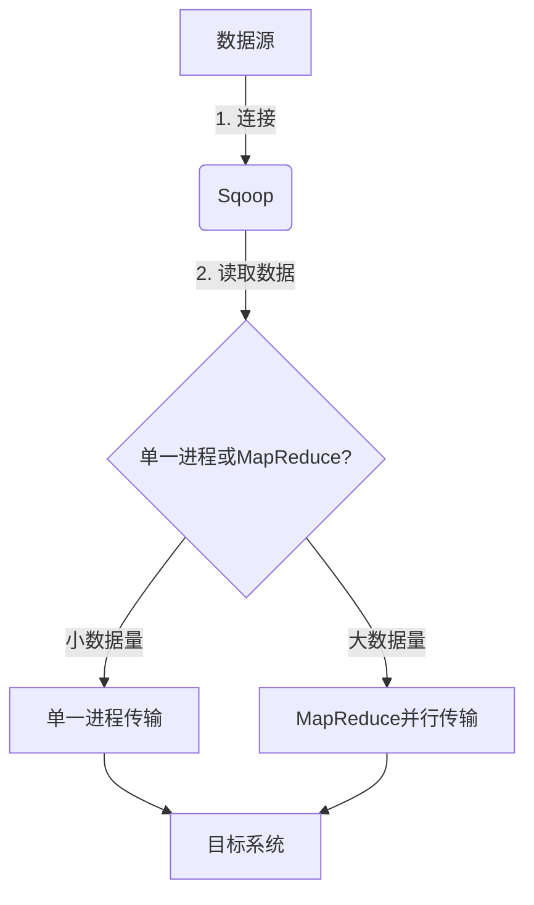
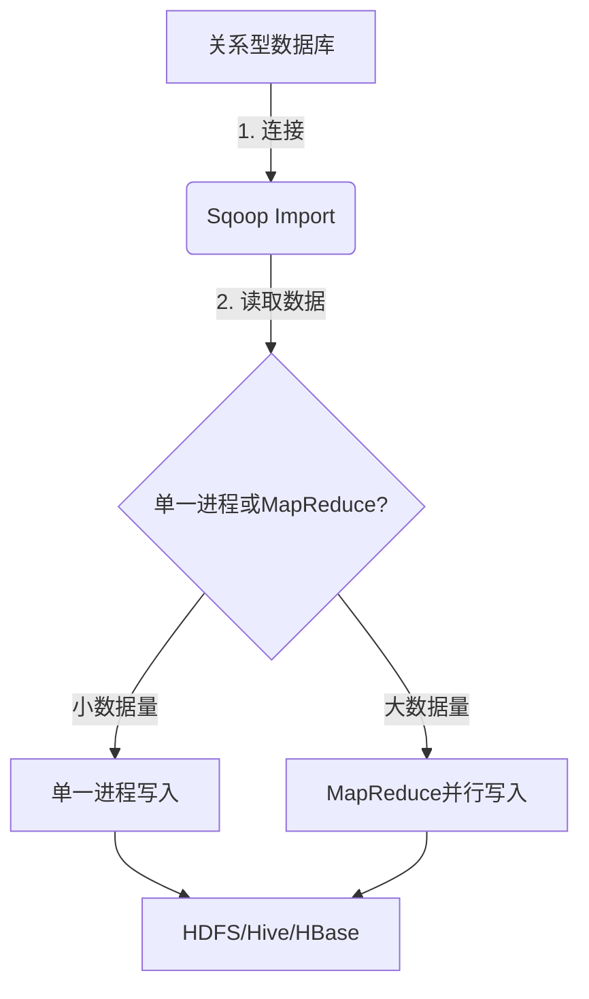
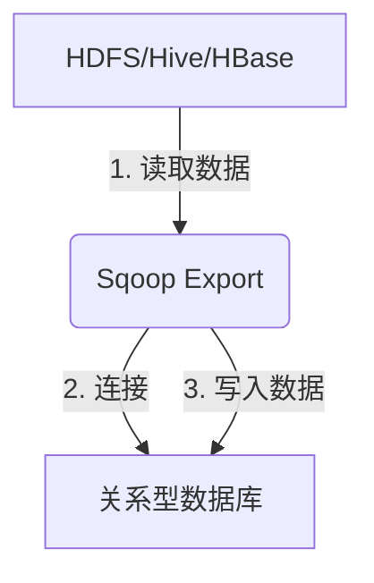
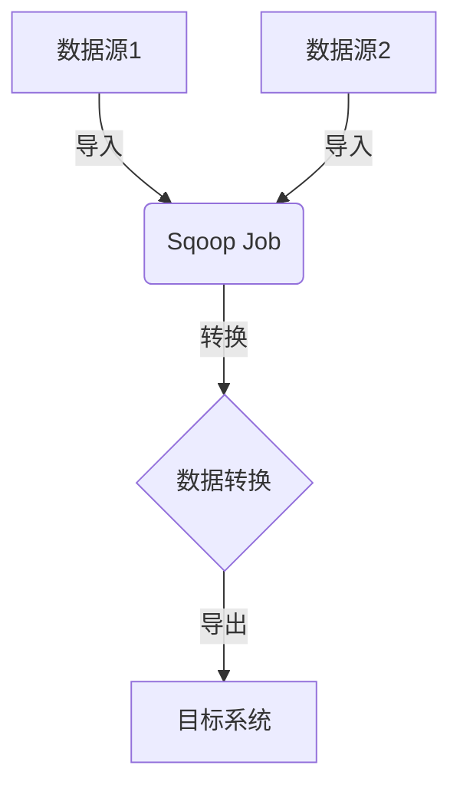

# Sqoop原理与代码实例讲解

## 1.背景介绍

在大数据时代,数据已经成为了企业的核心资产之一。然而,企业中的数据通常分布在不同的存储系统中,例如关系型数据库、NoSQL数据库、大数据存储系统等。为了充分利用这些数据,需要将它们集中存储到一个统一的大数据平台中,以便进行数据分析和处理。Apache Sqoop就是一个专门用于在不同存储系统之间高效传输大量数据的工具。

Sqoop最初是Hadoop的一个子项目,旨在使用简单的命令行界面在Hadoop和关系型数据库之间高效传输数据。随着时间的推移,Sqoop已经发展成为一个成熟的项目,支持多种数据源和目标系统,包括关系型数据库、NoSQL数据库、大数据存储系统等。

## 2.核心概念与联系

### 2.1 Sqoop的核心概念

Sqoop的核心概念包括:

- **Connector**:连接器,用于连接不同的数据源和目标系统。Sqoop提供了多种连接器,如关系型数据库连接器、Kafka连接器、Hive连接器等。
- **Job**:作业,表示一个数据传输任务。每个作业都包含了数据源、目标系统、传输模式等信息。
- **Tool**:工具,Sqoop提供了多种工具来执行不同类型的作业,如Import工具、Export工具、Merge工具等。

### 2.2 Sqoop与Hadoop生态系统的关系

Sqoop与Hadoop生态系统中的其他组件密切相关:

- **HDFS**: Hadoop分布式文件系统,Sqoop可以将数据导入或导出到HDFS中。
- **MapReduce**: Sqoop使用MapReduce框架来并行化数据传输过程,提高效率。
- **Hive**: Sqoop可以将数据导入Hive表中,也可以从Hive表中导出数据。
- **HBase**: Sqoop支持将数据导入或导出HBase表。

### 2.3 Sqoop的工作原理

Sqoop的工作原理可以概括为以下几个步骤:

1. 连接数据源和目标系统
2. 从数据源读取数据
3. 将数据传输到目标系统
4. 根据需要进行数据转换或清理

在传输过程中,Sqoop会根据数据量的大小自动选择是使用单一进程还是MapReduce作业来完成数据传输。



## 3.核心算法原理具体操作步骤

### 3.1 Sqoop Import

Sqoop Import是最常用的功能之一,用于将数据从关系型数据库或其他数据源导入到HDFS、Hive或HBase等目标系统中。

Import的基本操作步骤如下:

1. 连接数据源(关系型数据库)
2. 根据指定的查询语句或表名从数据源读取数据
3. 将数据写入到HDFS、Hive或HBase等目标系统中
4. 根据需要进行数据转换或清理操作



示例命令:

```bash
sqoop import \
--connect jdbc:mysql://hostname/databasename \
--username myuser \
--password mypassword \
--table mytable \
--target-dir /user/hdfs/target_dir
```

### 3.2 Sqoop Export

Sqoop Export用于将数据从HDFS、Hive或HBase等源系统导出到关系型数据库或其他目标系统中。

Export的基本操作步骤如下:

1. 连接目标系统(关系型数据库)
2. 从HDFS、Hive或HBase等源系统读取数据
3. 将数据写入到目标关系型数据库中
4. 根据需要进行数据转换或清理操作



示例命令:

```bash
sqoop export \
--connect jdbc:mysql://hostname/databasename \
--username myuser \
--password mypassword \
--table mytable \
--export-dir /user/hdfs/source_dir
```

### 3.3 Sqoop Job

Sqoop Job是一种更高级的功能,允许用户定义复杂的数据传输流程,包括多个导入或导出操作、数据转换等。

Job的基本操作步骤如下:

1. 定义Job流程,包括数据源、目标系统、传输模式等
2. 执行Job流程中的各个步骤
3. 根据需要进行数据转换或清理操作



示例命令:

```bash
sqoop job \
--create myjob \
-- import \
--connect jdbc:mysql://hostname/databasename \
--username myuser \
--password mypassword \
--table mytable \
--target-dir /user/hdfs/target_dir \
-- export \
--connect jdbc:postgresql://hostname/databasename \
--username myuser \
--password mypassword \
--table mytable \
--export-dir /user/hdfs/target_dir
```

## 4.数学模型和公式详细讲解举例说明

在Sqoop的数据传输过程中,有一些关键的数学模型和公式需要注意。

### 4.1 数据分割

当Sqoop使用MapReduce进行并行传输时,需要将数据分割成多个部分,分配给不同的Mapper任务处理。Sqoop使用以下公式来确定分割的数量:

$$分割数量 = \max\left\{\left\lceil\frac{数据大小}{最大分割大小}\right\rceil, 4\right\}$$

其中:

- 数据大小: 待传输数据的总大小(以字节为单位)
- 最大分割大小: 单个分割的最大大小,默认为512MB

例如,如果待传输数据的总大小为2GB,那么分割数量将是:

$$分割数量 = \max\left\{\left\lceil\frac{2 \times 10^9}{512 \times 10^6}\right\rceil, 4\right\} = \max\{4, 4\} = 4$$

因此,数据将被分割为4个部分,每个部分由一个Mapper任务处理。

### 4.2 数据压缩

为了提高传输效率,Sqoop支持对数据进行压缩。常用的压缩算法包括gzip、bzip2和lzo等。压缩率可以使用以下公式计算:

$$压缩率 = 1 - \frac{压缩后大小}{原始大小}$$

例如,如果原始数据大小为1GB,压缩后大小为200MB,那么压缩率将是:

$$压缩率 = 1 - \frac{200 \times 10^6}{1 \times 10^9} = 0.8$$

也就是说,数据被压缩了80%。

### 4.3 并行度优化

在Sqoop的MapReduce作业中,并行度是一个关键的优化参数。并行度决定了同时运行的Mapper任务数量,通常设置为集群中可用的最大Mapper槽位数。

如果并行度设置过低,可能导致资源利用率不足;如果并行度设置过高,可能导致任务之间的竞争和资源浪费。因此,需要根据集群资源和数据大小合理设置并行度。

$$并行度 = \min\{分割数量, 最大Mapper槽位数\}$$

## 5.项目实践:代码实例和详细解释说明

### 5.1 导入数据到HDFS

以下是一个将MySQL中的表导入到HDFS的示例:

```bash
sqoop import \
--connect jdbc:mysql://localhost/mydb \
--username root \
--password mypassword \
--table employees \
--target-dir /user/hdfs/employees \
--fields-terminated-by '\t' \
--lines-terminated-by '\n' \
--mysql-delimiters
```

- `--connect`: 指定MySQL数据库的JDBC连接字符串
- `--username`和`--password`: 指定连接数据库所需的用户名和密码
- `--table`: 指定要导入的表名
- `--target-dir`: 指定HDFS中的目标目录
- `--fields-terminated-by`和`--lines-terminated-by`: 指定字段和行的分隔符
- `--mysql-delimiters`: 告诉Sqoop使用MySQL的默认分隔符

### 5.2 导入查询结果到Hive

以下示例将MySQL中的查询结果导入到Hive表中:

```bash
sqoop import \
--connect jdbc:mysql://localhost/mydb \
--username root \
--password mypassword \
--query 'SELECT name, age FROM people WHERE age > 30 AND $CONDITIONS' \
--split-by id \
--target-dir /user/hdfs/people_over_30 \
--hive-import \
--create-hive-table \
--hive-table people_over_30
```

- `--query`: 指定要执行的SQL查询语句,可以使用`$CONDITIONS`作为占位符
- `--split-by`: 指定用于分割数据的列,以便进行并行导入
- `--hive-import`: 告诉Sqoop将数据导入到Hive表中
- `--create-hive-table`: 如果目标Hive表不存在,自动创建
- `--hive-table`: 指定目标Hive表的名称

### 5.3 导出HDFS数据到关系型数据库

以下示例将HDFS中的数据导出到PostgreSQL数据库中:

```bash
sqoop export \
--connect jdbc:postgresql://localhost/mydb \
--username myuser \
--password mypassword \
--table employees \
--export-dir /user/hdfs/employees \
--input-fields-terminated-by '\t'
```

- `--connect`: 指定PostgreSQL数据库的JDBC连接字符串
- `--username`和`--password`: 指定连接数据库所需的用户名和密码
- `--table`: 指定要导出到的表名
- `--export-dir`: 指定HDFS中的源数据目录
- `--input-fields-terminated-by`: 指定HDFS文件中字段的分隔符

### 5.4 Sqoop Job示例

以下示例定义了一个Sqoop Job,包括从MySQL导入数据到HDFS,然后将数据导出到PostgreSQL:

```bash
sqoop job \
--create myjob \
-- import \
--connect jdbc:mysql://localhost/mydb \
--username root \
--password mypassword \
--table employees \
--target-dir /user/hdfs/employees \
-- export \
--connect jdbc:postgresql://localhost/mydb \
--username myuser \
--password mypassword \
--table employees \
--export-dir /user/hdfs/employees
```

- `--create`: 创建一个新的Job,并指定Job名称
- `--`: 用于分隔Job中的不同步骤

## 6.实际应用场景

Sqoop在许多实际应用场景中发挥着重要作用,例如:

1. **数据迁移**: 将企业中的历史数据从关系型数据库迁移到Hadoop或云存储系统中,以便进行大数据分析。

2. **数据集成**: 将来自不同源系统(如关系型数据库、NoSQL数据库、日志文件等)的数据集成到统一的大数据平台中,为数据分析和机器学习算法提供输入数据。

3. **ETL(提取、转换、加载)**: Sqoop作为ETL流程的一部分,负责从源系统提取数据,并加载到目标系统中。

4. **实时数据处理**: 使用Sqoop从关系型数据库或其他源系统中导入实时数据,然后在Hadoop或Spark等大数据框架中进行实时处理和分析。

5. **备份和归档**: 将关系型数据库中的数据定期备份到HDFS或对象存储系统中,以实现数据保护和归档。

6. **测试和开发**: 在开发和测试环境中,使用Sqoop快速从生产数据库中导入样本数据,以进行测试和调试。

## 7.工具和资源推荐

除了Sqoop本身,还有一些其他工具和资源可以帮助您更好地使用和管理Sqoop:

1. **Sqoop Web UI**: Sqoop提供了一个基于Web的用户界面,可以方便地创建、监控和管理Sqoop作业。

2. **Sqoop Cookbook**: Sqoop官方提供的一本电子书