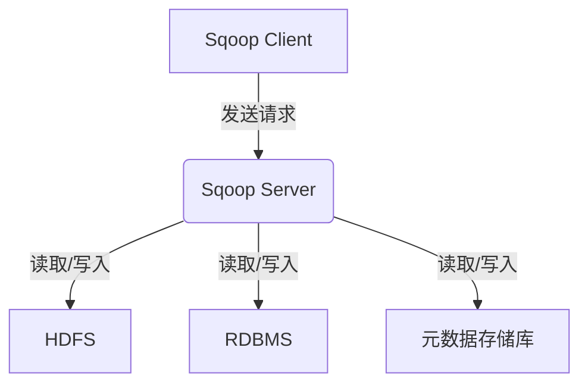
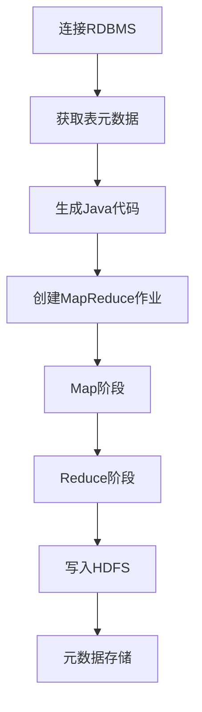
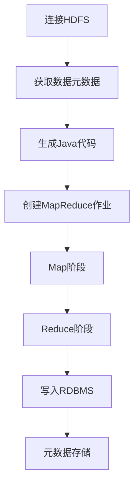

# Sqoop原理与代码实例讲解

## 1.背景介绍

在当今大数据时代，数据已经成为企业的核心资产之一。企业通常需要将存储在关系型数据库(RDBMS)中的结构化数据导入到Hadoop生态系统中,以便进行进一步的分析和处理。然而,手动完成这一过程是非常耗时和容易出错的。这就是Sqoop工具的用武之地。

Sqoop是一种用于高效地在Apache Hadoop和关系型数据库之间传输批量数据的工具。它使用MapReduce将输入数据并行传输到HDFS中,并使用从RDBMS中读取的元数据对数据进行解析。Sqoop支持从RDBMS导入数据到HDFS,从HDFS导出数据到RDBMS,以及在RDBMS和HDFS之间进行数据同步。

## 2.核心概念与联系

### 2.1 Sqoop架构

Sqoop的架构可以分为三个主要组件:

1. **Sqoop Client**:这是一个运行在边缘节点上的客户端工具,用于向Sqoop服务器发送导入和导出请求。

2. **Sqoop Server**:这是一个运行在Hadoop集群中的服务器进程,用于执行实际的导入和导出操作。它利用MapReduce框架在集群中并行化数据传输。

3. **元数据存储库**:Sqoop使用关系型数据库或HDFS中的元数据存储库来存储有关导入和导出作业的元数据。这些元数据包括表结构、列类型、分区信息等。



### 2.2 Sqoop连接器

Sqoop支持多种连接器,用于连接不同的数据源和目标。常用的连接器包括:

- **JDBC连接器**:用于连接关系型数据库,如MySQL、Oracle、PostgreSQL等。
- **Teradata连接器**:用于连接Teradata数据库。
- **Netezza连接器**:用于连接Netezza数据库。
- **Hive连接器**:用于将数据导入或导出到Hive表。
- **HBase连接器**:用于将数据导入或导出到HBase表。
- **Accumulo连接器**:用于将数据导入或导出到Accumulo表。

### 2.3 Sqoop导入和导出模式

Sqoop支持以下几种导入和导出模式:

1. **全量导入/导出**:将整个表或查询结果导入或导出到HDFS或RDBMS。

2. **增量导入/导出**:仅导入或导出自上次导入/导出以来发生更改的数据。

3. **基于查询的导入/导出**:根据SQL查询语句导入或导出数据。

4. **基于代码的导入/导出**:使用Java代码自定义导入或导出过程。

## 3.核心算法原理具体操作步骤

### 3.1 Sqoop导入流程

Sqoop导入数据的主要步骤如下:

1. **连接RDBMS**:Sqoop客户端使用提供的连接信息连接到RDBMS。

2. **获取表元数据**:Sqoop从RDBMS中获取表的元数据,包括表结构、列类型等。

3. **生成Java代码**:Sqoop根据表元数据生成Java代码,用于解析和处理数据。

4. **创建MapReduce作业**:Sqoop创建一个MapReduce作业来并行导入数据。

5. **Map阶段**:在Map阶段,Sqoop并行读取RDBMS中的数据,并将数据划分为多个Split。

6. **Reduce阶段**:在Reduce阶段,Sqoop将Map阶段的输出合并,并将数据写入HDFS。

7. **元数据存储**:Sqoop将导入作业的元数据存储在元数据存储库中。



### 3.2 Sqoop导出流程

Sqoop导出数据的主要步骤如下:

1. **连接HDFS**:Sqoop客户端使用提供的HDFS路径连接到HDFS。

2. **获取数据元数据**:Sqoop从HDFS中获取数据的元数据,包括文件格式、列类型等。

3. **生成Java代码**:Sqoop根据数据元数据生成Java代码,用于解析和处理数据。

4. **创建MapReduce作业**:Sqoop创建一个MapReduce作业来并行导出数据。

5. **Map阶段**:在Map阶段,Sqoop并行读取HDFS中的数据,并将数据划分为多个Split。

6. **Reduce阶段**:在Reduce阶段,Sqoop将Map阶段的输出合并,并将数据写入RDBMS。

7. **元数据存储**:Sqoop将导出作业的元数据存储在元数据存储库中。



## 4.数学模型和公式详细讲解举例说明

在Sqoop的导入和导出过程中,需要对数据进行划分和合并。这涉及到一些数学模型和公式。

### 4.1 数据划分

Sqoop使用**InputSplit**将输入数据划分为多个Split,以便并行处理。每个Split包含一个数据范围,由一个边界查询语句定义。

对于RDBMS,Sqoop使用以下公式计算Split的数量:

$$
numSplits = \max\left(\sqrt{numObjects}, \min\left(numMappers, \frac{totalSize}{bytesPerSplit}\right)\right)
$$

其中:

- $numObjects$是表中的对象数量(行数)
- $numMappers$是用户指定的映射器数量
- $totalSize$是表的总大小(以字节为单位)
- $bytesPerSplit$是用户指定的每个Split的最大字节数

对于HDFS,Sqoop使用以下公式计算Split的数量:

$$
numSplits = \min\left(numMappers, \max\left(1, \frac{totalSize}{bytesPerSplit}\right)\right)
$$

其中:

- $numMappers$是用户指定的映射器数量
- $totalSize$是文件的总大小(以字节为单位)
- $bytesPerSplit$是用户指定的每个Split的最大字节数

### 4.2 数据合并

在Reduce阶段,Sqoop需要将Map阶段的输出合并。对于RDBMS,Sqoop使用**TempPutOpObserver**来合并数据,以避免在RDBMS中创建临时表。对于HDFS,Sqoop使用**FileOutputCommitter**来合并数据。

## 5.项目实践:代码实例和详细解释说明

### 5.1 Sqoop导入示例

以下是一个使用Sqoop从MySQL导入数据到HDFS的示例:

```bash
sqoop import \
  --connect jdbc:mysql://hostname/databasename \
  --username myuser \
  --password mypassword \
  --table employees \
  --target-dir /user/hadoop/employees \
  --fields-terminated-by ','
```

- `--connect`指定JDBC连接字符串
- `--username`和`--password`提供数据库凭据
- `--table`指定要导入的表名
- `--target-dir`指定HDFS目标目录
- `--fields-terminated-by`指定字段分隔符

### 5.2 Sqoop导出示例

以下是一个使用Sqoop将数据从HDFS导出到MySQL的示例:

```bash
sqoop export \
  --connect jdbc:mysql://hostname/databasename \
  --username myuser \
  --password mypassword \
  --table employees \
  --export-dir /user/hadoop/employees \
  --input-fields-terminated-by ','
```

- `--connect`指定JDBC连接字符串
- `--username`和`--password`提供数据库凭据
- `--table`指定要导出到的表名
- `--export-dir`指定HDFS源目录
- `--input-fields-terminated-by`指定输入字段分隔符

### 5.3 Sqoop增量导入示例

以下是一个使用Sqoop进行增量导入的示例:

```bash
sqoop import \
  --connect jdbc:mysql://hostname/databasename \
  --username myuser \
  --password mypassword \
  --table employees \
  --target-dir /user/hadoop/employees \
  --check-column id \
  --incremental append \
  --last-value 1000
```

- `--check-column`指定用于增量导入的列
- `--incremental`指定增量导入模式
- `--incremental append`表示追加新数据
- `--last-value`指定上次导入的最后一个值

### 5.4 Sqoop基于查询导入示例

以下是一个使用Sqoop基于SQL查询导入数据的示例:

```bash
sqoop import \
  --connect jdbc:mysql://hostname/databasename \
  --username myuser \
  --password mypassword \
  --query 'SELECT name, age FROM employees WHERE $CONDITIONS' \
  --target-dir /user/hadoop/employees \
  --split-by id \
  --boundary-query 'SELECT MIN(id), MAX(id) FROM employees'
```

- `--query`指定SQL查询语句
- `$CONDITIONS`是一个占位符,用于动态生成WHERE子句
- `--split-by`指定用于划分数据的列
- `--boundary-query`指定用于确定数据范围的查询

## 6.实际应用场景

Sqoop在以下场景中得到了广泛应用:

1. **数据迁移**:将企业中存储在RDBMS中的数据迁移到Hadoop生态系统中,以便进行大数据分析。

2. **数据集成**:将来自多个异构数据源的数据集成到Hadoop中,为数据分析和处理提供统一的数据视图。

3. **ETL过程**:作为ETL(提取、转换、加载)过程的一部分,Sqoop用于从RDBMS中提取数据,并加载到Hadoop中进行进一步的转换和处理。

4. **数据备份**:将RDBMS中的数据定期备份到HDFS中,以确保数据的安全性和可用性。

5. **数据交换**:在不同的系统和组织之间交换数据,Sqoop可以方便地将数据从一个系统导出到另一个系统。

## 7.工具和资源推荐

以下是一些有用的Sqoop工具和资源:

1. **Sqoop Web UI**:一个基于Web的用户界面,可以方便地监控和管理Sqoop作业。

2. **Sqoop Cookbook**:一本详细介绍Sqoop用法和最佳实践的书籍。

3. **Sqoop源代码**:Sqoop是一个开源项目,你可以在GitHub上查看和贡献源代码。

4. **Sqoop用户邮件列表**:一个活跃的邮件列表,用于讨论Sqoop相关问题和获取支持。

5. **Sqoop培训课程**:许多供应商提供Sqoop培训课程,可以帮助你更好地掌握Sqoop。

## 8.总结:未来发展趋势与挑战

Sqoop作为一种重要的数据集成工具,在未来仍将扮演关键角色。然而,它也面临一些挑战和发展趋势:

1. **云集成**:随着越来越多的企业采用云计算,Sqoop需要支持与云存储和云数据库的集成。

2. **实时数据集成**:传统的Sqoop主要用于批量数据集成,但未来可能需要支持实时数据集成,以满足低延迟和高吞吐量的需求。

3. **安全性和隐私**:随着数据隐私和安全性日益受到重视,Sqoop需要提供更强大的安全性和隐私保护机制。

4. **可扩展性**:随着数据量的不断增长,Sqoop需要提高可扩展性,以支持大规模数据集成。

5. **简化配置**:Sqoop的配置和使用可能会相对复杂,未来需要简化配置过程,提高用户友好性。

6. **与其他工具集成**:Sqoop需要与Hadoop生态系统中的其他工具(如Hive、Spark等)更好地集成,以提供无缝的数据处理管道。

总的来说,Sqoop将继续发挥重要作用,但也需要不断进化以适应新的需求和挑战。

## 9.附录:常见问题与解答

1. **Sqoop是否支持增量导入?**

是的,Sqoop支持增量导入。你可