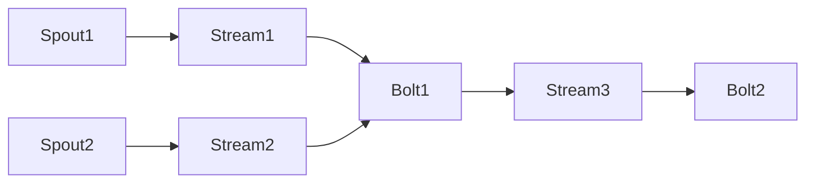
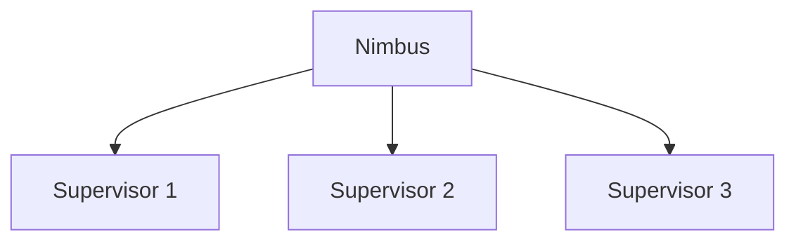

# Storm原理与代码实例讲解

## 1. 背景介绍

在当今大数据时代，实时流式数据处理已成为许多企业和组织的关键需求。Apache Storm是一个免费开源的分布式实时计算系统,旨在可靠地处理无限流数据。它最初由Nathan Marz等人在BackType公司开发,后于2011年9月开源,现已成为Apache顶级项目。

Storm的主要设计目标是为了满足实时处理大规模流数据的需求,具有以下几个核心优势:

1. **高可靠性**: Storm通过对消息进行有序重新发送来确保每条消息都被完全处理。
2. **高容错性**: Storm集群在出现故障时能自动重新分配任务,确保应用程序持续运行。
3. **高性能**: Storm可以在每个节点上处理数百万个消息,并且具有毫秒级的延迟。
4. **易于操作**: Storm提供了简单易用的API,支持多种编程语言。

Storm广泛应用于实时分析、在线机器学习、连续计算、分布式RPC、ETL等多种场景。

## 2. 核心概念与联系

在深入探讨Storm的原理之前,我们需要了解Storm的几个核心概念及其关系。

### 2.1 Topology

Topology是Storm中的核心抽象概念,它定义了一个实时应用程序的数据流向。一个Topology包含了多个Spout和Bolt,通过Stream Group将它们连接起来。



### 2.2 Spout

Spout是Storm Topology中的数据源,它从外部数据源(如Kafka、HDFS等)读取数据,并以Source Tuple的形式发送到Topology中。

### 2.3 Bolt

Bolt是Storm Topology中的处理单元,它接收并处理Spout或其他Bolt发送过来的Tuple。Bolt可以执行过滤、函数操作、持久化等多种操作。

### 2.4 Stream

Stream是Spout和Bolt之间传递数据的通道。一个Spout或Bolt可以通过一个或多个Stream向下游发送数据。

### 2.5 Task

Task是Spout或Bolt的实例,它是实际执行数据处理的工作单元。一个Spout或Bolt可以包含多个Task实例。

### 2.6 Worker

Worker是Storm中的工作进程,它运行在集群的某个节点上。一个Worker进程可以包含一个或多个Executor。

### 2.7 Executor

Executor是Storm中的线程,它负责执行Task的一个或多个线程。

## 3. 核心算法原理具体操作步骤

### 3.1 Storm集群架构

Storm集群由两种节点组成:Nimbus节点和Supervisor节点。

**Nimbus节点**是集群的主控节点,负责分发代码、为工作节点分配任务以及监控故障等工作。一个Storm集群只需要一个Nimbus节点。

**Supervisor节点**是工作节点,它们根据Nimbus节点的指令启动并运行工作进程(Worker)。一个Storm集群可以有多个Supervisor节点。



### 3.2 数据流向

Storm采用了"再次重放(Replaying)"的策略来实现消息的可靠传递。当一个Spout发送一个Tuple到Topology中时,它会在内存中缓存该Tuple。如果Tuple被成功处理,Spout会清除缓存;否则,Spout会定期重新发送该Tuple,直到它被成功处理。

Tuple在Topology中的流向由Storm的Stream Grouping策略决定。Storm提供了8种内置的Grouping策略,用于控制Tuple如何从上游组件分区到下游组件的Task。

1. **Shuffle Grouping**: 随机分发Tuple到下游Bolt的Task。
2. **Fields Grouping**: 根据Tuple中的某些Field值进行分区,相同Field值的Tuple会被分发到同一个Task。
3. **All Grouping**: 将一个Tuple的副本复制到下游所有的Task。
4. **Global Grouping**: 将所有Tuple路由到下游Bolt的一个Task。
5. **None Grouping**: 这是默认的Grouping方式,Tuple只会被分配到同一个线程。
6. **Direct Grouping**: 这是一种低级的Grouping方式,由发送者决定将Tuple发送到哪个Task。
7. **Local or Shuffle Grouping**: 如果目标Bolt有多个Task在同一个Worker进程中,则采用Shuffle方式;否则,采用Shuffle Grouping。
8. **Storm Local or Shuffle Grouping**: 与上面类似,但会避免在同一台机器上的不同Worker进程之间传输数据。

### 3.3 容错机制

Storm的容错机制主要依赖于消息的可靠传递和Worker进程的自动重启。

**消息可靠传递**:

1. 每个Spout在发送Tuple时会在内存中缓存该Tuple。
2. 如果一个Tuple被成功处理,Spout会清除该Tuple的缓存。
3. 如果一个Tuple在一定时间内没有被成功处理,Spout会重新发送该Tuple。

**Worker进程自动重启**:

1. Supervisor节点会定期向所有Worker进程发送心跳信号。
2. 如果一个Worker进程在一定时间内没有响应心跳,Supervisor会将其标记为失败并重启该进程。
3. 重启的Worker进程会从Spout重新获取未处理的Tuple。

## 4. 数学模型和公式详细讲解举例说明

在Storm中,有一个重要的指标叫做**完全处理语义(Exactly-Once Processing Semantics)**,它保证每个Tuple在Topology中只被处理一次。要实现这一语义,Storm需要解决以下两个问题:

1. **消息重复**: 由于网络延迟或故障,同一个Tuple可能会被重复发送和处理。
2. **消息丢失**: 由于Worker进程故障,一些Tuple可能会在处理过程中丢失。

为了解决这两个问题,Storm引入了一个名为**Trident**的高级抽象层。Trident通过引入**Transaction**和**Metadata Tuple**的概念来实现完全处理语义。

### 4.1 Transaction

在Trident中,一个Transaction是一组需要被原子执行的操作。如果Transaction中的任何一个操作失败,整个Transaction都会被回滚。

Transaction由一个**TransactionBatch**表示,它包含了一组**Operation**和一个**Metadata**。每个Operation都有一个唯一的ID,用于标识该Operation在Transaction中的位置。

$$
\begin{align*}
TransactionBatch &= \{Operation_1, Operation_2, \ldots, Operation_n, Metadata\} \\
Operation &= \{OperationID, OperationData\}
\end{align*}
$$

### 4.2 Metadata Tuple

Metadata Tuple是一种特殊的Tuple,它携带了Transaction的元数据信息,包括Transaction ID、Operation ID等。Metadata Tuple会与普通的数据Tuple一起流经Topology,用于跟踪Transaction的执行状态。

$$
MetadataTuple = \{TransactionID, OperationID, \ldots\}
$$

### 4.3 完全处理语义实现

Trident通过以下步骤来实现完全处理语义:

1. 当一个Transaction进入Topology时,它会被分解为一个TransactionBatch,并与对应的Metadata Tuple一起发送到Topology中。
2. 每个Bolt在处理Tuple时,都会检查Metadata Tuple中的信息,以确定该Tuple属于哪个Transaction。
3. 如果一个Bolt成功处理了一个Tuple,它会向下游发送该Tuple和对应的Metadata Tuple。
4. 如果一个Bolt失败,它会丢弃该Tuple和对应的Metadata Tuple,等待Spout重新发送。
5. 当一个Transaction的所有Operation都被成功处理后,该Transaction就被认为是成功的。否则,整个Transaction会被回滚。

通过这种方式,Trident可以保证每个Tuple只被处理一次,从而实现完全处理语义。

## 5. 项目实践: 代码实例和详细解释说明

在这一节,我们将通过一个简单的WordCount示例来展示如何使用Storm进行实时流式计算。

### 5.1 项目结构

```
wordcount-storm
├── pom.xml
├── src
│   ├── main
│   │   ├── java
│   │   │   └── com
│   │   │       └── example
│   │   │           ├── WordCountBolt.java
│   │   │           ├── WordCountSpout.java
│   │   │           └── WordCountTopology.java
│   │   └── resources
│   │       └── log4j2.properties
└── README.md
```

### 5.2 WordCountSpout

`WordCountSpout`是一个简单的Spout实现,它会不断从句子列表中发射句子。

```java
import java.util.Map;
import java.util.List;
import java.util.Random;

import org.apache.storm.spout.SpoutOutputCollector;
import org.apache.storm.task.TopologyContext;
import org.apache.storm.topology.OutputFieldsDeclarer;
import org.apache.storm.topology.base.BaseRichSpout;
import org.apache.storm.tuple.Fields;
import org.apache.storm.tuple.Values;

public class WordCountSpout extends BaseRichSpout {
    private SpoutOutputCollector collector;
    private List<String> sentences;
    private Random random;

    public WordCountSpout(List<String> sentences) {
        this.sentences = sentences;
        random = new Random();
    }

    @Override
    public void open(Map<String, Object> conf, TopologyContext context, SpoutOutputCollector collector) {
        this.collector = collector;
    }

    @Override
    public void nextTuple() {
        String sentence = sentences.get(random.nextInt(sentences.size()));
        collector.emit(new Values(sentence));
    }

    @Override
    public void declareOutputFields(OutputFieldsDeclarer declarer) {
        declarer.declare(new Fields("sentence"));
    }
}
```

### 5.3 WordCountBolt

`WordCountBolt`是一个简单的Bolt实现,它会统计每个单词出现的次数。

```java
import java.util.HashMap;
import java.util.Map;

import org.apache.storm.task.OutputCollector;
import org.apache.storm.task.TopologyContext;
import org.apache.storm.topology.OutputFieldsDeclarer;
import org.apache.storm.topology.base.BaseRichBolt;
import org.apache.storm.tuple.Fields;
import org.apache.storm.tuple.Tuple;
import org.apache.storm.tuple.Values;

public class WordCountBolt extends BaseRichBolt {
    private OutputCollector collector;
    private Map<String, Integer> counts;

    @Override
    public void prepare(Map<String, Object> topoConf, TopologyContext context, OutputCollector collector) {
        this.collector = collector;
        counts = new HashMap<>();
    }

    @Override
    public void execute(Tuple input) {
        String sentence = input.getStringByField("sentence");
        String[] words = sentence.split(" ");
        for (String word : words) {
            Integer count = counts.getOrDefault(word, 0);
            counts.put(word, count + 1);
            collector.emit(new Values(word, count + 1));
        }
    }

    @Override
    public void declareOutputFields(OutputFieldsDeclarer declarer) {
        declarer.declare(new Fields("word", "count"));
    }
}
```

### 5.4 WordCountTopology

`WordCountTopology`定义了Topology的结构,将`WordCountSpout`和`WordCountBolt`连接起来。

```java
import java.util.Arrays;

import org.apache.storm.Config;
import org.apache.storm.LocalCluster;
import org.apache.storm.topology.TopologyBuilder;
import org.apache.storm.tuple.Fields;

public class WordCountTopology {
    public static void main(String[] args) throws Exception {
        TopologyBuilder builder = new TopologyBuilder();

        builder.setSpout("word-spout", new WordCountSpout(Arrays.asList(
            "Hello Storm Hello World",
            "Hello Storm",
            "Hello World"
        )), 1);

        builder.setBolt("word-count", new WordCountBolt(), 2)
            .fieldsGrouping("word-spout", new Fields("sentence"));

        Config conf = new Config();
        conf.setDebug(true);

        LocalCluster cluster = new LocalCluster();
        cluster.submitTopology("word-count", conf, builder.createTopology());

        Thread.sleep(10000);
        cluster.shutdown();
    }
}
```

在这个示例中,我们创建了一个`WordCountSpout`和两个`WordCountBolt`实例。`WordCountSpout`会不断发射句子,而`WordCountBolt`会统计每个单词出现的次数。

我们使用`fieldsGrouping`将`WordCountSpout`的输出流按照"sentence"字段进行分组,并将分组后的流发送到`WordCountBolt`。这样可以确保具有相同"sentence"字段值的Tuple会被发送到同一个`WordCountBolt`实例进行处理。

最后,我们在本地模式下提交Topology并运行10秒钟。你可以在控制台中看到单词计数的结果。

## 6. 实际应用场景

Storm由于其高性能、低延迟