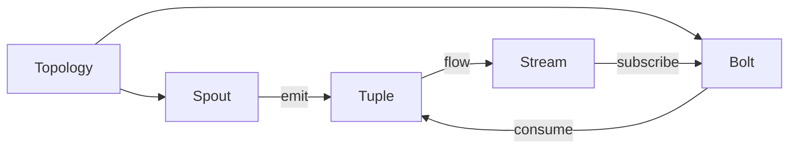

# Storm原理与代码实例讲解

## 1. 背景介绍

### 1.1 大数据处理的挑战

在当今大数据时代,海量数据的实时处理已成为众多行业面临的重大挑战。传统的批处理模式难以满足实时性要求,而Storm作为一个分布式实时计算系统应运而生。

### 1.2 Storm的诞生

Storm由Twitter的BackType团队开发,于2011年开源,现已成为Apache顶级项目。它为实时数据流处理提供了一套完整的解决方案,广泛应用于实时分析、在线机器学习、连续计算等领域。

### 1.3 Storm的优势

与Hadoop等批处理框架相比,Storm具有低延迟、高吞吐、可扩展、容错等优点,能够应对复杂的实时计算场景。同时,Storm采用类似于MapReduce的编程模型,易于开发人员上手。

## 2. 核心概念与联系

### 2.1 Topology（拓扑）

Topology是Storm中的一个抽象概念,代表一个实时计算任务。它是Spout和Bolt的有向无环图（DAG）,描述了数据在各个处理节点之间的流动方式。

### 2.2 Spout（数据源）  

Spout是Topology的数据输入源,负责从外部数据源读取数据,并将数据以元组（Tuple）的形式发送到下游的Bolt。常见的Spout包括KafkaSpout、TwitterSpout等。

### 2.3 Bolt（处理单元）

Bolt是Topology的处理节点,接收来自Spout或其他Bolt的元组,执行计算或转换操作,并可以将结果发送到下一个Bolt。Bolt可以执行过滤、聚合、函数操作、数据库读写等任务。

### 2.4 Tuple（元组）

Tuple是Storm中的数据传输单元,由一组命名的字段组成。每个字段可以是任意类型,但通常是字符串、数字等基本类型。Spout发出的Tuple称为源Tuple,Bolt处理过程中产生的Tuple称为中间Tuple。

### 2.5 Stream（流）

Stream表示Tuple在Topology中的流动,一个Stream由一个Spout或Bolt发出,并被一个或多个Bolt订阅。Stream分为Shuffle Grouping、Fields Grouping、All Grouping、Global Grouping等类型,决定了Tuple的分发策略。

### 2.6 核心概念关系图



## 3. 核心算法原理与具体操作步骤

### 3.1 数据分区与并行度

Storm通过将Topology的各个组件（Spout和Bolt）在集群中并行执行来实现高吞吐和低延迟。每个组件可以指定并行度,即在集群中同时运行的任务实例数。Storm使用一致性哈希等算法将Tuple均匀分配给任务实例。

### 3.2 可靠性机制

为保证数据处理的可靠性,Storm引入了"acker"机制。每个Spout发出的Tuple都带有一个唯一的MessageID,Bolt在完全处理该Tuple后,会向acker发送确认信息。如果在超时时间内未收到所有的确认信息,Spout会重新发送该Tuple,从而实现"at least once"的语义。  

### 3.3 容错与故障恢复

Storm通过Nimbus和Supervisor实现了容错机制。Nimbus负责在Supervisor上分配任务,监控工作进程,如果发现失败的进程,会自动在其他节点上重启。同时,Storm基于Zookeeper实现了状态的持久化,在故障恢复后能够从断点继续执行。

### 3.4 数据处理流程

1. Spout从外部数据源读取数据,将其封装成Tuple发射到输出流。 
2. Bolt从订阅的输入流接收Tuple,执行处理逻辑,并可以将结果Tuple发射到输出流。
3. Bolt通过anchor方法锚定处理的Tuple,并在完全处理后发送ack确认信息。
4. acker跟踪每个Spout Tuple的确认信息,如果全部确认则销毁,否则通知Spout重发。
5. Topology不断地执行以上过程,实现持续不断的实时计算。

## 4. 数学模型与公式详解

### 4.1 一致性哈希

Storm使用一致性哈希来实现Tuple在任务实例间的均匀分配。一致性哈希将整个哈希空间看作一个环,每个任务实例都映射到环上的一个点。当一个Tuple到达时,根据其key值计算哈希,顺时针找到第一个大于等于该哈希值的任务实例,将Tuple分配给它处理。

设哈希空间大小为$M$,哈希函数为$hash(x)$,第$i$个节点的位置为$node_i$,则Tuple的key为$k$的分配节点为:

$$
target = node_j, where\, j = min\{i \,|\, hash(node_i) \ge hash(k)\}
$$

### 4.2 acker机制

acker通过跟踪每个Spout Tuple的确认状态来实现可靠性。假设Spout共发出N个Tuple,Bolt的平均执行时间为$T_p$,acker的超时时间为$T_o$,则整个Topology的端到端延迟$D$可估算为:

$$
D = T_o + (T_p \times N)
$$

其中,$T_o$是acker的超时时间,代表Spout重发Tuple的最大间隔。$T_p \times N$表示处理N个Tuple的总时间。减小$T_o$可以降低延迟,但会增加Tuple的重发频率;增大$T_o$可以提高可靠性,但会增加延迟。需要根据具体的业务需求权衡设置。

## 5. 项目实践:代码实例与详解

下面以一个简单的WordCount为例,演示如何使用Storm进行实时单词计数。

### 5.1 WordSpout

```java
public class WordSpout extends BaseRichSpout {
    private SpoutOutputCollector collector;
    private String[] words = {"apple", "orange", "pear", "banana"};
    
    public void open(Map conf, TopologyContext context, SpoutOutputCollector collector) {
        this.collector = collector;
    }
    
    public void nextTuple() {
        String word = words[new Random().nextInt(words.length)];
        collector.emit(new Values(word));
        Thread.sleep(1000);
    }
    
    public void declareOutputFields(OutputFieldsDeclarer declarer) {
        declarer.declare(new Fields("word"));
    }
}
```

WordSpout继承自BaseRichSpout,在open方法中初始化了SpoutOutputCollector,nextTuple方法每秒随机发射一个单词,declareOutputFields声明了输出的字段。

### 5.2 SplitBolt

```java
public class SplitBolt extends BaseBasicBolt {
    public void execute(Tuple input, BasicOutputCollector collector) {
        String sentence = input.getStringByField("word");
        for (String word : sentence.split("\\s+")) {
            collector.emit(new Values(word));
        }
    }
    
    public void declareOutputFields(OutputFieldsDeclarer declarer) {
        declarer.declare(new Fields("word"));
    }
}
```

SplitBolt接收WordSpout发出的句子,将其按空格拆分成单词,并发送到下一个Bolt。

### 5.3 CountBolt

```java
public class CountBolt extends BaseBasicBolt {
    private Map<String, Integer> counts = new HashMap<>();
    
    public void execute(Tuple tuple, BasicOutputCollector collector) {
        String word = tuple.getStringByField("word");
        Integer count = counts.get(word);
        if (count == null) {
            count = 0;
        }
        count++;
        counts.put(word, count);
        collector.emit(new Values(word, count));
    }
    
    public void declareOutputFields(OutputFieldsDeclarer declarer) {
        declarer.declare(new Fields("word", "count"));
    }
}
```

CountBolt接收单词,对其出现次数进行累加,并发送单词和计数结果。

### 5.4 构建Topology

```java
TopologyBuilder builder = new TopologyBuilder();
builder.setSpout("word-spout", new WordSpout());
builder.setBolt("split-bolt", new SplitBolt()).shuffleGrouping("word-spout");
builder.setBolt("count-bolt", new CountBolt()).fieldsGrouping("split-bolt", new Fields("word"));

Config conf = new Config();
conf.setNumWorkers(2);
StormSubmitter.submitTopology("word-count", conf, builder.createTopology());
```

通过TopologyBuilder构建Topology,设置各个组件及其之间的数据流动方式。然后设置Topology的并行度,提交到集群运行。

## 6. 实际应用场景

Storm在实际生产环境中有广泛的应用,下面列举几个典型场景:

### 6.1 实时日志分析

将应用程序、服务器产生的日志实时传输到Storm,通过一系列Bolt进行解析、过滤、统计,实现实时的日志分析和监控,及时发现和定位问题。

### 6.2 实时推荐系统

利用Storm处理用户的实时行为数据,如浏览、点击、购买等,结合用户画像和商品属性,实时更新用户与商品的相关性,动态调整推荐结果。

### 6.3 实时欺诈检测

对交易数据流进行实时分析,根据交易金额、频率、位置等特征,实时识别异常交易,防范金融欺诈。

### 6.4 社交网络数据分析

对社交网络的用户互动数据,如点赞、转发、评论等进行实时处理,挖掘热点话题、用户群体、舆情走向等信息。

## 7. 工具与资源推荐

### 7.1 Storm官方文档

Storm的官方文档提供了全面的使用指南、API参考和最佳实践,是学习和使用Storm的权威资料。

链接: http://storm.apache.org/releases/current/index.html

### 7.2 Storm Starter示例项目

Storm Starter是官方提供的示例项目,包含了多个常见的Topology示例,展示了Storm的各项特性和使用方法,是新手入门的良好案例。

链接: https://github.com/apache/storm/tree/master/examples/storm-starter

### 7.3 Storm UI

Storm提供了一个用户友好的Web界面,可以实时监控集群、Topology、Spout、Bolt的运行状态,如发送速率、处理延迟、错误信息等,是调试和优化Topology的利器。

### 7.4 集成Kafka

Kafka是流行的分布式消息队列系统,常作为Storm的数据源。Storm提供了KafkaSpout,可以方便地从Kafka读取数据,实现可靠的端到端数据处理。

## 8. 总结:未来发展与挑战

Storm作为实时流处理领域的先驱,已经发展成为一个成熟、完善的分布式计算系统。未来随着数据规模和复杂性的不断提升,Storm还需要在以下方面持续改进:

### 8.1 性能优化

优化Storm的调度机制、序列化方式、网络传输等,进一步提高吞吐量和降低延迟,满足更苛刻的实时性需求。

### 8.2 易用性提升

简化Storm的部署、监控、调优过程,提供更友好的开发和管理工具,降低使用门槛。

### 8.3 与其他系统的集成

加强Storm与Hadoop、Spark、Flink等其他大数据处理系统的集成,实现lambda架构和kappa架构,构建端到端的大数据解决方案。 

### 8.4 机器学习支持

增强Storm对在线机器学习的支持,提供机器学习算法库和模型部署工具,实现实时学习和预测。

Storm经过多年的发展已经日趋成熟,在可预见的未来仍将是实时流处理领域的主流选择之一。开发者可以继续关注Storm的发展动态,学习其新特性和最佳实践,更好地应对实时数据处理的挑战。

## 9. 附录:常见问题与解答

### Q1:Storm适合处理什么样的数据?

A1:Storm适合处理连续的、无界的数据流,如日志、交易、传感器数据等。数据量可大可小,但要求低延迟、高吞吐。

### Q2:Storm的数据可靠性如何保证?

A2:Storm提供了acker机制来保证数据的可靠处理。通过在Spout和Bolt间传递ack消息,跟踪每个Tuple的处理进度,超时未完成则重发。同时,Nimbus和Supervisor能够容错,保证长期稳定运行。

### Q3:Storm的吞吐量和延迟如何?

A3:Storm的吞吐量和延迟与具体的Topology设计和集群规模有关。一般来说,Storm能够在毫秒级别的延迟下实现每秒数万到数十万