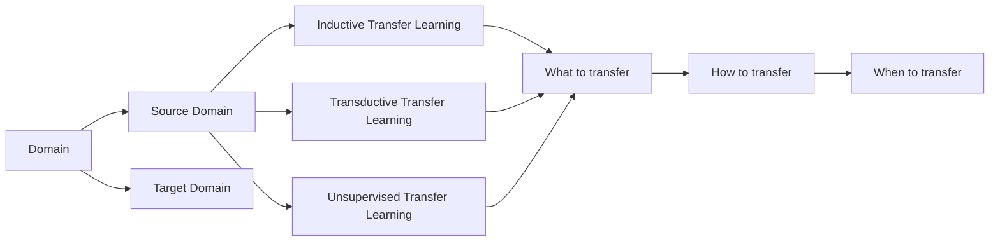

# Transfer Learning 原理与代码实战案例讲解

## 1. 背景介绍
### 1.1 什么是Transfer Learning
Transfer Learning(迁移学习)是一种机器学习方法,它利用已经学习过的知识来解决新的但相似的问题。与传统的机器学习方法相比,迁移学习通过迁移已学习过的知识,可以大大减少所需的训练数据量,加快训练速度,并提高模型的性能。

### 1.2 Transfer Learning的发展历程
Transfer Learning的概念最早由Lorien Pratt等人在1993年提出。此后,随着深度学习的发展,迁移学习也得到了广泛的应用和发展。一些里程碑式的工作包括:
- 2014年,Donahue等人提出了DeCAF特征,证明了CNN学习到的特征可以很好地迁移到其他视觉任务中。 
- 2015年,Yosinski等人系统研究了CNN特征迁移的可行性和有效性。
- 2017年,Howard等人提出了微调(fine-tuning)预训练模型的方法,使得迁移学习更加高效和实用。

### 1.3 Transfer Learning的优势
与传统的机器学习方法相比,Transfer Learning主要有以下优势:
1. 减少所需的训练数据:通过迁移已学习过的知识,可以大大减少目标任务所需的训练数据。
2. 加快训练速度:使用预训练的模型进行微调比从头开始训练要快得多。  
3. 提高模型性能:利用在大规模数据集上预训练的模型,可以获得更好的特征表示,从而提高模型性能。

## 2. 核心概念与联系
### 2.1 基本概念
- Domain(领域):由特征空间和边缘概率分布组成,即 $\mathcal{D}=\{\mathcal{X}, P(X)\}$。
- Task(任务):由标签空间和条件概率分布组成,即 $\mathcal{T}=\{\mathcal{Y}, P(Y|X)\}$。
- Source Domain(源领域):已标注的领域,用于训练源模型。
- Target Domain(目标领域):要进行预测的领域,通常只有很少或没有标注数据。

### 2.2 Transfer Learning的分类
根据源领域和目标领域的特征空间、标签空间是否相同,可以将迁移学习分为以下三类:
1. Inductive Transfer Learning:源领域和目标领域的标签空间不同,即 $\mathcal{Y}_S \neq \mathcal{Y}_T$。
2. Transductive Transfer Learning:源领域和目标领域的特征空间相同,标签空间也相同,但边缘概率分布不同,即 $\mathcal{X}_S = \mathcal{X}_T, \mathcal{Y}_S = \mathcal{Y}_T, P_S(X) \neq P_T(X)$。
3. Unsupervised Transfer Learning:源领域和目标领域的标签空间都不可用。

### 2.3 Transfer Learning的关键问题
迁移学习需要解决以下关键问题:
1. What to transfer:确定要迁移的知识,如特征表示、模型参数等。
2. How to transfer:设计有效的算法来迁移知识。 
3. When to transfer:判断何时进行迁移是有益的。

下图展示了这些核心概念之间的联系:



## 3. 核心算法原理与具体操作步骤
### 3.1 Fine-tuning 微调
Fine-tuning是利用预训练模型来初始化目标任务模型,然后在目标数据集上微调模型参数的方法。其基本步骤如下:
1. 加载预训练模型:从源任务加载预训练的模型参数。
2. 替换输出层:根据目标任务的类别数,替换模型的输出层。
3. 冻结基础层:根据任务相似度,选择冻结预训练模型的一些基础层。
4. 微调模型:在目标数据集上训练,只更新未冻结层的参数。

### 3.2 Domain Adaptation 领域自适应
Domain Adaptation旨在缓解源领域和目标领域数据分布差异带来的影响。其主要思想是学习一个映射函数,将源领域和目标领域数据映射到一个共同的特征空间,使得它们的分布尽可能接近。以下是两种常用的Domain Adaptation方法:

#### 3.2.1 MMD(Maximum Mean Discrepancy)
MMD度量了两个分布在再生希尔伯特空间(RKHS)中均值的距离。给定源域数据 $\{x_i^s\}_{i=1}^{n_s}$ 和目标域数据 $\{x_i^t\}_{i=1}^{n_t}$,其经验估计为:

$$
\text{MMD}(X_s, X_t) = \left\| \frac{1}{n_s}\sum_{i=1}^{n_s}\phi(x_i^s) - \frac{1}{n_t}\sum_{i=1}^{n_t}\phi(x_i^t) \right\|_\mathcal{H}
$$

其中 $\phi(\cdot)$ 为映射函数,将数据映射到RKHS $\mathcal{H}$。在深度神经网络中,可以将 $\phi(\cdot)$ 设置为网络的某一中间层,并在损失函数中加入MMD正则项,以最小化源域和目标域特征的MMD距离。

#### 3.2.2 Adversarial Domain Adaptation
Adversarial Domain Adaptation利用对抗学习的思想,通过训练一个领域判别器来判断特征来自源域还是目标域,同时训练特征提取器来欺骗判别器。其目标函数可以表示为:

$$
\min_f \max_d \mathcal{L}_{clf}(f, c) - \lambda \mathcal{L}_{adv}(f, d)
$$

其中 $f$ 为特征提取器,$c$ 为分类器,$d$ 为领域判别器。$\mathcal{L}_{clf}$ 为分类损失,$\mathcal{L}_{adv}$ 为对抗损失:

$$
\mathcal{L}_{adv} = \mathbb{E}_{x \sim p_s} \log d(f(x)) + \mathbb{E}_{x \sim p_t} \log (1-d(f(x)))
$$

通过这种对抗学习,可以使得提取的特征具有领域不变性,从而实现Domain Adaptation。

## 4. 数学模型和公式详细讲解举例说明
### 4.1 MMD的数学推导
给定两个分布 $p$ 和 $q$,它们在RKHS $\mathcal{H}$ 中的均值分别为 $\mu_p$ 和 $\mu_q$,则MMD距离定义为:

$$MMD(p, q) = \|\mu_p - \mu_q\|_\mathcal{H}$$

根据特征映射 $\phi(\cdot)$ 的定义,有:

$$\mu_p = \mathbb{E}_{x \sim p}[\phi(x)], \quad \mu_q = \mathbb{E}_{x \sim q}[\phi(x)]$$

将其代入MMD定义式,可得:

$$
\begin{aligned}
MMD(p, q) &= \|\mathbb{E}_{x \sim p}[\phi(x)] - \mathbb{E}_{x \sim q}[\phi(x)]\|_\mathcal{H} \\
&= \left(\mathbb{E}_{x \sim p}[\phi(x)] - \mathbb{E}_{x \sim q}[\phi(x)]\right)^T\left(\mathbb{E}_{x \sim p}[\phi(x)] - \mathbb{E}_{x \sim q}[\phi(x)]\right) \\
&= \mathbb{E}_{x,x' \sim p}[k(x,x')] - 2\mathbb{E}_{x \sim p, y \sim q}[k(x,y)] + \mathbb{E}_{y,y' \sim q}[k(y,y')]
\end{aligned}
$$

其中 $k(x,y)=\langle\phi(x),\phi(y)\rangle_\mathcal{H}$ 为核函数。上式给出了MMD的另一种表示形式,避免了直接计算 $\mu_p$ 和 $\mu_q$。

在实际应用中,我们只有有限的样本,因此需要使用经验估计:

$$
\widehat{MMD}(X_p, X_q) = \frac{1}{m^2}\sum_{i,j=1}^mk(x_i,x_j) - \frac{2}{mn}\sum_{i,j=1}^m\sum_{i,j=1}^nk(x_i,y_j) + \frac{1}{n^2}\sum_{i,j=1}^nk(y_i,y_j)
$$

其中 $X_p=\{x_1,\dots,x_m\}, X_q=\{y_1,\dots,y_n\}$ 分别为来自分布 $p$ 和 $q$ 的样本集合。

### 4.2 Adversarial Domain Adaptation的数学推导
在Adversarial Domain Adaptation中,我们训练一个特征提取器 $G_f$ 和一个领域判别器 $G_d$。其目标函数为:

$$
\min_{G_f} \max_{G_d} \mathcal{L}_{clf}(G_f, G_c) - \lambda \mathcal{L}_{adv}(G_f, G_d)
$$

其中分类损失 $\mathcal{L}_{clf}$ 和对抗损失 $\mathcal{L}_{adv}$ 分别定义为:

$$
\mathcal{L}_{clf} = \mathbb{E}_{(x,y) \sim p_s} L(G_c(G_f(x)), y)
$$

$$
\mathcal{L}_{adv} = \mathbb{E}_{x \sim p_s} \log G_d(G_f(x)) + \mathbb{E}_{x \sim p_t} \log (1-G_d(G_f(x)))
$$

这里 $p_s$ 和 $p_t$ 分别表示源域和目标域数据的分布,$L(\cdot,\cdot)$ 为分类损失函数,如交叉熵损失。

对于领域判别器 $G_d$,其优化目标是最大化对抗损失 $\mathcal{L}_{adv}$,即:

$$
\max_{G_d} \mathbb{E}_{x \sim p_s} \log G_d(G_f(x)) + \mathbb{E}_{x \sim p_t} \log (1-G_d(G_f(x)))
$$

这可以看作是一个二分类问题,即判断特征 $G_f(x)$ 来自源域还是目标域。

对于特征提取器 $G_f$,其优化目标是最小化分类损失 $\mathcal{L}_{clf}$ 和对抗损失 $\mathcal{L}_{adv}$,即:

$$
\min_{G_f} \mathbb{E}_{(x,y) \sim p_s} L(G_c(G_f(x)), y) - \lambda (\mathbb{E}_{x \sim p_s} \log G_d(G_f(x)) + \mathbb{E}_{x \sim p_t} \log (1-G_d(G_f(x))))
$$

这里的第一项保证了特征 $G_f(x)$ 对于源域分类任务是有区分性的,而第二项则鼓励 $G_f$ 提取领域不变的特征,使得 $G_d$ 无法判断特征来自哪个领域。

通过这种对抗学习,可以得到一个领域不变的特征提取器 $G_f$,从而实现Domain Adaptation。

## 5. 项目实践:代码实例和详细解释说明
下面以一个基于PyTorch的图像分类迁移学习代码为例,详细说明如何实现Fine-tuning:

```python
import torch
import torch.nn as nn
import torchvision.models as models
from torchvision import datasets, transforms

# 加载预训练的ResNet-18模型
model = models.resnet18(pretrained=True)

# 替换最后一层全连接层
num_features = model.fc.in_features
model.fc = nn.Linear(num_features, 10)  # 假设目标任务有10个类别

# 冻结除最后一层外的所有层
for param in model.parameters():
    param.requires_grad = False
for param in model.fc.parameters():
    param.requires_grad = True

# 定义损失函数和优化器
criterion = nn.CrossEntropyLoss()
optimizer = torch.optim.Adam(model.fc.parameters(), lr=1e-3)

# 加载目标域数据
transform = transforms.Compose([
    transforms.Resize(256),
    transforms.CenterCrop(224),
    transforms.ToTensor(),
    transforms.Normalize([0.485, 0.456, 0.406], [0.229, 0.224, 0.225])
])
dataset = datasets.ImageFolder('path/to/data', transform=transform)
dataloader = torch.utils.data.DataLoader(dataset, batch_size=32, shuffle=True)

# 训练模