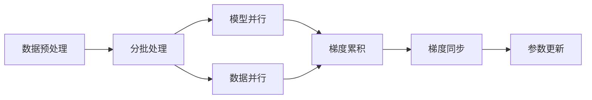

# Transformer大模型实战 以大批量的方式进行训练

## 1. 背景介绍

在过去的几年中，Transformer模型已经成为自然语言处理（NLP）领域的一个重要里程碑。自从“Attention Is All You Need”论文首次提出以来，Transformer模型以其高效的并行计算能力和优异的性能在各种任务中取得了突破性的成果。然而，随着模型规模的不断扩大，如何有效地训练大批量数据成为了一个挑战。本文将深入探讨Transformer模型的训练策略，特别是在大批量数据上的实战技巧。

## 2. 核心概念与联系

### 2.1 Transformer模型概述
### 2.2 大批量训练的必要性
### 2.3 分布式训练与并行化策略

## 3. 核心算法原理具体操作步骤

### 3.1 数据预处理与分批
### 3.2 模型并行与数据并行
### 3.3 梯度累积与同步



## 4. 数学模型和公式详细讲解举例说明

### 4.1 Attention机制的数学原理
### 4.2 大批量训练中的梯度下降
### 4.3 损失函数与正则化

$$
\text{Attention}(Q, K, V) = \text{softmax}\left(\frac{QK^T}{\sqrt{d_k}}\right)V
$$

## 5. 项目实践：代码实例和详细解释说明

### 5.1 环境搭建与依赖
### 5.2 数据加载与预处理
### 5.3 Transformer模型构建
### 5.4 大批量训练流程

```python
# 代码示例：Transformer模型训练伪代码
def train_transformer(data_loader, model, optimizer):
    model.train()
    for batch in data_loader:
        optimizer.zero_grad()
        input, target = batch
        output = model(input)
        loss = compute_loss(output, target)
        loss.backward()
        optimizer.step()
```

## 6. 实际应用场景

### 6.1 机器翻译
### 6.2 文本摘要
### 6.3 问答系统

## 7. 工具和资源推荐

### 7.1 深度学习框架
### 7.2 分布式训练工具
### 7.3 数据集与预训练模型

## 8. 总结：未来发展趋势与挑战

### 8.1 模型规模的增长趋势
### 8.2 训练效率的优化
### 8.3 环境与资源的可持续性

## 9. 附录：常见问题与解答

### 9.1 如何选择合适的批量大小？
### 9.2 分布式训练中的通信瓶颈如何解决？
### 9.3 如何平衡模型的规模与训练成本？

作者：禅与计算机程序设计艺术 / Zen and the Art of Computer Programming