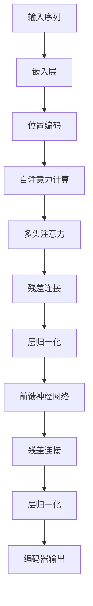

# Transformer大模型实战 编码器总览

## 1.背景介绍

在自然语言处理（NLP）领域，Transformer模型自2017年由Vaswani等人提出以来，迅速成为了主流的架构。其独特的自注意力机制和并行处理能力，使得它在处理长序列数据时表现出色。本文将深入探讨Transformer模型中的编码器部分，详细介绍其核心概念、算法原理、数学模型、实际应用以及未来发展趋势。

## 2.核心概念与联系

### 2.1 Transformer架构概述

Transformer模型由编码器和解码器两部分组成。编码器负责将输入序列转换为一组特征表示，解码器则根据这些特征生成输出序列。本文重点讨论编码器部分。

### 2.2 自注意力机制

自注意力机制是Transformer的核心创新之一。它允许模型在处理每个输入时，关注序列中的其他部分，从而捕捉到全局信息。

### 2.3 多头注意力

多头注意力机制通过并行计算多个自注意力，捕捉到不同的特征表示，提高了模型的表达能力。

### 2.4 残差连接和层归一化

残差连接和层归一化帮助模型在深层网络中保持稳定性和训练效率。

## 3.核心算法原理具体操作步骤

### 3.1 输入嵌入

首先，将输入序列通过嵌入层转换为固定维度的向量表示。

### 3.2 位置编码

由于Transformer模型不具备序列信息，位置编码通过加入位置信息，使模型能够识别序列顺序。

### 3.3 自注意力计算

自注意力计算包括三个步骤：计算查询（Q）、键（K）和值（V）矩阵；计算注意力权重；加权求和得到输出。



### 3.4 多头注意力

将自注意力计算结果分成多个头，每个头独立计算注意力，然后将结果拼接在一起。

### 3.5 前馈神经网络

前馈神经网络由两个全连接层组成，分别进行线性变换和激活函数操作。

### 3.6 编码器堆叠

多个编码器层堆叠在一起，形成深层网络，提高模型的表达能力。

## 4.数学模型和公式详细讲解举例说明

### 4.1 自注意力机制公式

自注意力机制的核心公式如下：

$$
\text{Attention}(Q, K, V) = \text{softmax}\left(\frac{QK^T}{\sqrt{d_k}}\right)V
$$

其中，$Q$、$K$、$V$分别是查询、键和值矩阵，$d_k$是键的维度。

### 4.2 多头注意力公式

多头注意力的计算公式如下：

$$
\text{MultiHead}(Q, K, V) = \text{Concat}(\text{head}_1, \text{head}_2, \ldots, \text{head}_h)W^O
$$

其中，每个头的计算为：

$$
\text{head}_i = \text{Attention}(QW_i^Q, KW_i^K, VW_i^V)
$$

### 4.3 前馈神经网络公式

前馈神经网络的计算公式如下：

$$
\text{FFN}(x) = \text{max}(0, xW_1 + b_1)W_2 + b_2
$$

## 5.项目实践：代码实例和详细解释说明

### 5.1 环境准备

首先，确保安装了必要的库，如TensorFlow或PyTorch。

```python
import torch
import torch.nn as nn
import torch.optim as optim
```

### 5.2 编码器实现

以下是一个简单的Transformer编码器实现示例：

```python
class TransformerEncoder(nn.Module):
    def __init__(self, d_model, nhead, num_layers, dim_feedforward):
        super(TransformerEncoder, self).__init__()
        self.encoder_layer = nn.TransformerEncoderLayer(d_model, nhead, dim_feedforward)
        self.transformer_encoder = nn.TransformerEncoder(self.encoder_layer, num_layers)

    def forward(self, src):
        return self.transformer_encoder(src)
```

### 5.3 训练和评估

定义训练和评估函数：

```python
def train(model, data_loader, criterion, optimizer):
    model.train()
    for src, tgt in data_loader:
        optimizer.zero_grad()
        output = model(src)
        loss = criterion(output, tgt)
        loss.backward()
        optimizer.step()

def evaluate(model, data_loader, criterion):
    model.eval()
    total_loss = 0
    with torch.no_grad():
        for src, tgt in data_loader:
            output = model(src)
            loss = criterion(output, tgt)
            total_loss += loss.item()
    return total_loss / len(data_loader)
```

## 6.实际应用场景

### 6.1 机器翻译

Transformer编码器在机器翻译任务中表现出色，能够处理长句子并捕捉到全局上下文信息。

### 6.2 文本分类

通过编码器提取文本特征，可以应用于情感分析、主题分类等任务。

### 6.3 问答系统

编码器能够理解问题和上下文，生成准确的答案。

## 7.工具和资源推荐

### 7.1 库和框架

- TensorFlow
- PyTorch
- Hugging Face Transformers

### 7.2 学习资源

- 《Attention is All You Need》论文
- Coursera和Udacity的NLP课程
- GitHub上的开源项目

## 8.总结：未来发展趋势与挑战

Transformer编码器在NLP领域取得了显著的成功，但仍面临一些挑战，如计算资源消耗大、训练时间长等。未来的发展趋势包括模型压缩、混合模型和更高效的训练算法。

## 9.附录：常见问题与解答

### 9.1 Transformer编码器与RNN的区别？

Transformer编码器采用自注意力机制，能够并行处理序列数据，而RNN则是顺序处理，效率较低。

### 9.2 如何选择超参数？

超参数选择依赖于具体任务和数据集，可以通过交叉验证和网格搜索等方法进行优化。

### 9.3 如何处理长序列数据？

可以采用分块处理、层次注意力等方法来处理长序列数据。

---

作者：禅与计算机程序设计艺术 / Zen and the Art of Computer Programming