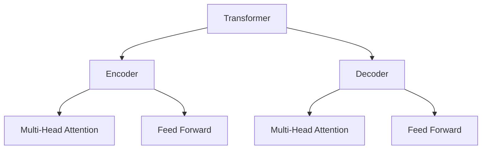
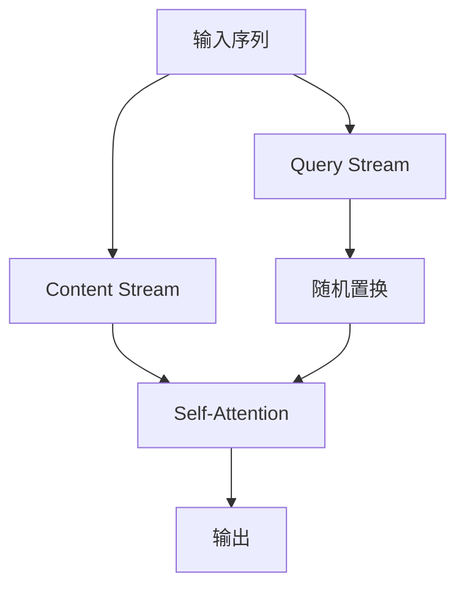

# XLNet原理与代码实例讲解

## 1.背景介绍

### 1.1 自然语言处理的重要性

随着人工智能技术的不断发展,自然语言处理(Natural Language Processing, NLP)已经成为了一个备受关注的热门领域。自然语言处理旨在使计算机能够理解和生成人类语言,从而实现人机自然交互。它在许多领域都有着广泛的应用,例如机器翻译、智能问答系统、文本分类和情感分析等。

### 1.2 预训练语言模型的兴起

传统的自然语言处理方法通常需要大量的人工标注数据,并且针对每个任务都需要设计特定的特征工程,这使得系统的构建和维护成本非常高。为了解决这个问题,预训练语言模型(Pre-trained Language Model, PLM)应运而生。预训练语言模型通过在大规模无标注语料库上进行预训练,学习通用的语言表示,然后将这些通用表示迁移到下游任务中,从而显著提高了自然语言处理系统的性能。

### 1.3 XLNet的重要性

XLNet是一种新型的预训练语言模型,由谷歌的AI团队和卡内基梅隆大学于2019年提出。它在BERT等先前的预训练语言模型的基础上进行了创新,提出了一种全新的自回归语言建模(Autoregressive Language Modeling)方法,旨在解决BERT中存在的一些缺陷和局限性。XLNet在多个自然语言处理任务上取得了state-of-the-art的表现,展现出了其强大的语言理解和生成能力。

## 2.核心概念与联系

### 2.1 Transformer

Transformer是一种全新的基于注意力机制(Attention Mechanism)的神经网络架构,它最初被提出用于机器翻译任务。与传统的基于RNN或CNN的序列模型不同,Transformer完全依赖于注意力机制来捕获输入序列中的长程依赖关系,从而避免了梯度消失和爆炸的问题。Transformer的核心组件包括编码器(Encoder)和解码器(Decoder),其中编码器用于处理输入序列,解码器用于生成输出序列。

XLNet作为一种预训练语言模型,其底层结构就是基于Transformer的。通过在大规模语料库上预训练Transformer模型,XLNet可以学习到通用的语言表示,为下游的各种自然语言处理任务提供强大的语义表示能力。

### 2.2 自回归语言建模

自回归语言建模(Autoregressive Language Modeling)是一种常见的语言模型方法,它通过最大化语料库中所有句子的条件概率来学习语言的概率分布。具体来说,对于一个句子$X=(x_1, x_2, ..., x_T)$,自回归语言模型需要最大化该句子的条件概率:

$$P(X) = \prod_{t=1}^T P(x_t | x_1, ..., x_{t-1})$$

传统的自回归语言模型通常是从左到右建模,即在预测当前单词时,只考虑了该单词之前的上下文信息。然而,这种做法存在一个明显的缺陷,即无法利用到右侧上下文的信息,这可能会导致预测的不准确。

### 2.3 XLNet的创新之处

XLNet提出了一种全新的自回归语言建模方法,它打破了传统的从左到右建模的局限性,允许在预测当前单词时同时利用到左右两侧的上下文信息。具体来说,XLNet采用了一种被称为Permutation Language Modeling的策略,即对输入序列进行随机置换,然后最大化置换后序列的条件概率。通过这种方式,XLNet可以在预测每个单词时,利用到完整的上下文信息,从而提高了语言理解和生成的准确性。

此外,XLNet还引入了两个全新的目标函数:Content Stream和Query Stream,用于更好地捕获序列中的依赖关系。这些创新使得XLNet在多个自然语言处理任务上取得了卓越的表现。

## 3.核心算法原理具体操作步骤

### 3.1 输入表示

与BERT类似,XLNet也采用了子词(Subword)嵌入的方式来表示输入文本。具体来说,XLNet首先使用一种基于字节对编码(Byte-Pair Encoding, BPE)的算法将输入文本分割成一系列子词,然后将每个子词映射到一个固定维度的向量空间中,作为该子词的嵌入表示。

不同于BERT,XLNet在输入表示中还引入了一个新的位置编码(Positional Encoding)方法。在BERT中,位置编码是通过预定义的正弦和余弦函数来实现的,这种方式存在一些局限性,比如无法很好地捕获长距离的位置信息。XLNet采用了一种基于相对位置的编码方式,它通过学习两个向量$u$和$v$,对于任意两个位置$i$和$j$,它们之间的相对位置编码可以表示为:

$$\text{RPE}(i, j) = u^\top \cdot \max(0, 1 + \text{pos}(i) - \text{pos}(j)) + v^\top \cdot \max(0, 1 + \text{pos}(j) - \text{pos}(i))$$

其中,`pos(i)`表示位置`i`的绝对位置编码。这种相对位置编码方式可以更好地捕获长距离的位置信息,从而提高了XLNet的语言理解能力。

### 3.2 Permutation Language Modeling

Permutation Language Modeling是XLNet的核心创新之一。具体来说,对于一个长度为`T`的输入序列`X=(x_1, x_2, ..., x_T)`XLNet首先生成一个随机的置换序列`perm=(perm_1, perm_2, ..., perm_T)`其中`perm_i`表示`x_i`在置换后的位置。然后,XLNet的目标是最大化置换后序列的条件概率:

$$\max_\theta \mathbb{E}_{perm \sim P_{perm}} \left[ \log P_\theta(X_{perm}) \right] = \max_\theta \mathbb{E}_{perm \sim P_{perm}} \left[ \sum_{t=1}^T \log P_\theta(x_{perm_t} | x_{perm_1}, ..., x_{perm_{t-1}}) \right]$$

其中,$\theta$表示XLNet的模型参数,`P_perm`是一个先验置换概率分布。通过这种方式,XLNet可以在预测每个单词时利用到完整的上下文信息,从而提高了语言理解和生成的准确性。

在实际实现中,XLNet采用了一种被称为双流自注意力(Two-Stream Self-Attention)的机制来实现Permutation Language Modeling。具体来说,XLNet将输入序列划分为两个独立的流:Content Stream和Query Stream。Content Stream包含了原始的输入序列,而Query Stream则是对原始序列进行了随机置换。在计算注意力时,XLNet使用Query Stream中的单词来查询Content Stream中的上下文信息,从而实现了利用完整上下文的目标。

### 3.3 目标函数

除了Permutation Language Modeling之外,XLNet还引入了两个全新的目标函数:Content Stream Loss和Query Stream Loss。

Content Stream Loss是一个传统的自回归语言建模目标,它最大化Content Stream中每个单词的条件概率:

$$\mathcal{L}_{content} = \sum_{t=1}^T \log P(x_t | x_1, ..., x_{t-1})$$

Query Stream Loss则是一个新引入的目标函数,它最大化Query Stream中每个单词的条件概率,同时利用到了Content Stream中的上下文信息:

$$\mathcal{L}_{query} = \sum_{t=1}^T \log P(x_{perm_t} | x_{perm_1}, ..., x_{perm_{t-1}}, C)$$

其中,`C`表示Content Stream中的上下文信息。

XLNet的最终目标函数是Content Stream Loss和Query Stream Loss的线性组合:

$$\mathcal{L} = \mathcal{L}_{content} + \lambda \mathcal{L}_{query}$$

其中,$\lambda$是一个超参数,用于平衡两个损失函数的贡献。通过同时优化这两个目标函数,XLNet可以更好地捕获序列中的依赖关系,从而提高语言理解和生成的准确性。

## 4.数学模型和公式详细讲解举例说明

在XLNet的论文中,作者们提出了一种新颖的自回归语言建模方法,称为Permutation Language Modeling。与传统的自回归语言模型不同,Permutation Language Modeling允许模型在预测每个单词时利用到完整的上下文信息,而不仅仅是单向的上下文。

### 4.1 传统自回归语言模型

传统的自回归语言模型通常是从左到右建模,即在预测当前单词时,只考虑了该单词之前的上下文信息。具体来说,对于一个句子$X=(x_1, x_2, ..., x_T)$,传统的自回归语言模型需要最大化该句子的条件概率:

$$P(X) = \prod_{t=1}^T P(x_t | x_1, ..., x_{t-1})$$

这种做法存在一个明显的缺陷,即无法利用到右侧上下文的信息,这可能会导致预测的不准确。例如,在预测句子"我昨天去了公园"中的"公园"一词时,传统的自回归语言模型只能利用到"我昨天去了"这部分上下文信息,而无法利用到"公园"右侧的上下文信息。

### 4.2 Permutation Language Modeling

为了解决传统自回归语言模型的这一缺陷,XLNet提出了一种全新的自回归语言建模方法,称为Permutation Language Modeling。具体来说,对于一个长度为`T`的输入序列`X=(x_1, x_2, ..., x_T)`XLNet首先生成一个随机的置换序列`perm=(perm_1, perm_2, ..., perm_T)`其中`perm_i`表示`x_i`在置换后的位置。然后,XLNet的目标是最大化置换后序列的条件概率:

$$\max_\theta \mathbb{E}_{perm \sim P_{perm}} \left[ \log P_\theta(X_{perm}) \right] = \max_\theta \mathbb{E}_{perm \sim P_{perm}} \left[ \sum_{t=1}^T \log P_\theta(x_{perm_t} | x_{perm_1}, ..., x_{perm_{t-1}}) \right]$$

其中,$\theta$表示XLNet的模型参数,`P_perm`是一个先验置换概率分布。通过这种方式,XLNet可以在预测每个单词时利用到完整的上下文信息,从而提高了语言理解和生成的准确性。

让我们以句子"我昨天去了公园"为例,假设置换序列为`perm=(4, 2, 3, 1)`那么置换后的序列就是"公园去了昨天我"。在预测"公园"这个单词时,XLNet可以利用到"去了昨天我"这部分上下文信息,而不仅仅是"我昨天去了"。

### 4.3 双流自注意力机制

在实际实现中,XLNet采用了一种被称为双流自注意力(Two-Stream Self-Attention)的机制来实现Permutation Language Modeling。具体来说,XLNet将输入序列划分为两个独立的流:Content Stream和Query Stream。Content Stream包含了原始的输入序列,而Query Stream则是对原始序列进行了随机置换。

在计算注意力时,XLNet使用Query Stream中的单词来查询Content Stream中的上下文信息。具体来说,对于Query Stream中的第`t`个单词`x_{perm_t}`XLNet计算其对Content Stream中所有单词的注意力权重:

$$\alpha_{t, j} = \frac{\exp(e_{t, j})}{\sum_{k=1}^T \exp(e_{t, k})}$$

其中,`e_{t, j}`是一个分数函数,用于衡量`x_{perm_t}`与Content Stream中第`j`个单词`x_j`的相关性。然后,XLNet使用这些注意力权重对Content Stream中的单词进行加权求和,得到一个上下文向量`c_t`:

$$c_t = \sum_{j=1}^T \alpha_{