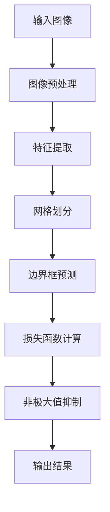

# YOLOv1原理与代码实例讲解

## 1.背景介绍

在计算机视觉领域，目标检测一直是一个重要且具有挑战性的任务。传统的目标检测方法通常需要先进行区域提议（Region Proposal），然后再进行分类和定位，这种方法不仅复杂，而且计算开销大。YOLO（You Only Look Once）系列算法的出现，彻底改变了这一现状。YOLOv1作为该系列的开山之作，以其高效、实时的目标检测能力迅速引起了广泛关注。

YOLOv1的核心思想是将目标检测问题转化为一个单一的回归问题，通过一个神经网络直接预测图像中的目标类别和位置。这种方法不仅简化了目标检测的流程，还显著提高了检测速度。

## 2.核心概念与联系

### 2.1 单阶段检测器

YOLOv1属于单阶段检测器，与传统的两阶段检测器（如R-CNN系列）不同，单阶段检测器直接从输入图像生成目标的类别和位置预测。其主要优点是速度快，适合实时应用。

### 2.2 网格划分

YOLOv1将输入图像划分为 $S \times S$ 的网格，每个网格负责预测一个或多个目标。每个网格单元预测固定数量的边界框（Bounding Box）及其置信度和类别概率。

### 2.3 预测输出

每个网格单元的预测输出包括：
- 边界框的坐标（$x, y, w, h$）
- 置信度（Confidence）
- 类别概率（Class Probability）

### 2.4 损失函数

YOLOv1的损失函数由三部分组成：定位损失、置信度损失和分类损失。通过优化这个损失函数，网络能够同时学习到目标的定位和分类信息。

## 3.核心算法原理具体操作步骤

### 3.1 输入图像预处理

将输入图像调整为固定大小（如 $448 \times 448$），并进行归一化处理。

### 3.2 特征提取

使用卷积神经网络（CNN）提取图像特征。YOLOv1采用了一个自定义的网络架构，类似于VGG网络，但进行了简化和优化。

### 3.3 网格划分与预测

将特征图划分为 $S \times S$ 的网格，每个网格单元预测 $B$ 个边界框及其置信度和类别概率。

### 3.4 损失函数计算

计算定位损失、置信度损失和分类损失，并进行反向传播和参数更新。

### 3.5 非极大值抑制（NMS）

对预测结果进行非极大值抑制，去除冗余的边界框，保留置信度最高的预测结果。



## 4.数学模型和公式详细讲解举例说明

### 4.1 边界框预测

每个网格单元预测 $B$ 个边界框，每个边界框由5个参数表示：$x, y, w, h, c$，其中 $x, y$ 是边界框中心相对于网格单元的偏移，$w, h$ 是边界框的宽度和高度，$c$ 是置信度。

### 4.2 置信度计算

置信度表示边界框包含目标的概率以及边界框的准确性，定义为：
$$
c = P(Object) \times IOU_{pred}^{truth}
$$
其中 $P(Object)$ 是边界框包含目标的概率，$IOU_{pred}^{truth}$ 是预测边界框与真实边界框的交并比（Intersection over Union）。

### 4.3 类别概率

每个网格单元预测 $C$ 个类别的概率，表示为：
$$
P(Class_i | Object)
$$
最终的类别概率为：
$$
P(Class_i) = P(Class_i | Object) \times P(Object)
$$

### 4.4 损失函数

YOLOv1的损失函数由三部分组成：

1. 定位损失（Localization Loss）：
$$
\text{Loss}_{loc} = \sum_{i=0}^{S^2} \sum_{j=0}^{B} \mathbb{1}_{ij}^{obj} \left[ (x_i - \hat{x}_i)^2 + (y_i - \hat{y}_i)^2 + (w_i - \hat{w}_i)^2 + (h_i - \hat{h}_i)^2 \right]
$$

2. 置信度损失（Confidence Loss）：
$$
\text{Loss}_{conf} = \sum_{i=0}^{S^2} \sum_{j=0}^{B} \mathbb{1}_{ij}^{obj} (C_i - \hat{C}_i)^2 + \lambda_{noobj} \sum_{i=0}^{S^2} \sum_{j=0}^{B} \mathbb{1}_{ij}^{noobj} (C_i - \hat{C}_i)^2
$$

3. 分类损失（Classification Loss）：
$$
\text{Loss}_{class} = \sum_{i=0}^{S^2} \mathbb{1}_{i}^{obj} \sum_{c \in classes} (p_i(c) - \hat{p}_i(c))^2
$$

总损失函数为：
$$
\text{Loss} = \text{Loss}_{loc} + \text{Loss}_{conf} + \text{Loss}_{class}
$$

## 5.项目实践：代码实例和详细解释说明

### 5.1 环境准备

首先，确保你已经安装了必要的库，如 TensorFlow 或 PyTorch。以下示例将使用 PyTorch。

```python
import torch
import torch.nn as nn
import torch.optim as optim
from torchvision import datasets, transforms
```

### 5.2 数据预处理

将数据集（如 COCO 或 Pascal VOC）进行预处理，包括图像缩放和归一化。

```python
transform = transforms.Compose([
    transforms.Resize((448, 448)),
    transforms.ToTensor(),
    transforms.Normalize(mean=[0.485, 0.456, 0.406], std=[0.229, 0.224, 0.225])
])

train_dataset = datasets.VOCDetection(root='data', year='2012', image_set='train', download=True, transform=transform)
train_loader = torch.utils.data.DataLoader(train_dataset, batch_size=32, shuffle=True)
```

### 5.3 模型定义

定义 YOLOv1 的网络结构。

```python
class YOLOv1(nn.Module):
    def __init__(self):
        super(YOLOv1, self).__init__()
        self.conv_layers = nn.Sequential(
            nn.Conv2d(3, 64, kernel_size=7, stride=2, padding=3),
            nn.ReLU(),
            nn.MaxPool2d(kernel_size=2, stride=2),
            # 继续添加卷积层和池化层
        )
        self.fc_layers = nn.Sequential(
            nn.Linear(1024 * 7 * 7, 4096),
            nn.ReLU(),
            nn.Linear(4096, S * S * (B * 5 + C))
        )

    def forward(self, x):
        x = self.conv_layers(x)
        x = x.view(x.size(0), -1)
        x = self.fc_layers(x)
        return x.view(-1, S, S, B * 5 + C)
```

### 5.4 损失函数定义

定义 YOLOv1 的损失函数。

```python
class YoloLoss(nn.Module):
    def __init__(self, S, B, C):
        super(YoloLoss, self).__init__()
        self.S = S
        self.B = B
        self.C = C

    def forward(self, predictions, target):
        # 计算定位损失、置信度损失和分类损失
        # 返回总损失
        pass
```

### 5.5 模型训练

定义训练过程，包括前向传播、损失计算和反向传播。

```python
model = YOLOv1()
criterion = YoloLoss(S=7, B=2, C=20)
optimizer = optim.Adam(model.parameters(), lr=0.001)

for epoch in range(num_epochs):
    for images, targets in train_loader:
        outputs = model(images)
        loss = criterion(outputs, targets)
        optimizer.zero_grad()
        loss.backward()
        optimizer.step()
    print(f'Epoch [{epoch+1}/{num_epochs}], Loss: {loss.item():.4f}')
```

### 5.6 模型评估

在验证集上评估模型性能。

```python
model.eval()
with torch.no_grad():
    for images, targets in val_loader:
        outputs = model(images)
        # 计算评估指标，如mAP
```

## 6.实际应用场景

YOLOv1在多个实际应用场景中表现出色，以下是一些典型的应用场景：

### 6.1 实时视频监控

YOLOv1的高效检测能力使其非常适合用于实时视频监控系统，可以快速识别和定位视频中的目标，如行人、车辆等。

### 6.2 自动驾驶

在自动驾驶领域，YOLOv1可以用于检测道路上的行人、车辆、交通标志等，为自动驾驶系统提供关键的环境感知信息。

### 6.3 安防系统

YOLOv1可以用于安防系统中的入侵检测、物品识别等，帮助提高安防系统的智能化水平。

### 6.4 医疗影像分析

在医疗影像分析中，YOLOv1可以用于检测和定位医学图像中的病灶，如肿瘤、病变等，辅助医生进行诊断。

## 7.工具和资源推荐

### 7.1 开源框架

- [Darknet](https://pjreddie.com/darknet/yolo/): YOLO的官方实现，基于C和CUDA。
- [PyTorch-YOLOv1](https://github.com/ayooshkathuria/pytorch-yolo-v1): 基于PyTorch的YOLOv1实现，适合快速上手和二次开发。

### 7.2 数据集

- [Pascal VOC](http://host.robots.ox.ac.uk/pascal/VOC/): 常用的目标检测数据集，包含多种类别的标注图像。
- [COCO](https://cocodataset.org/): 大规模目标检测数据集，包含丰富的类别和标注信息。

### 7.3 学习资源

- [YOLO论文](https://arxiv.org/abs/1506.02640): YOLOv1的原始论文，详细介绍了算法的设计和实现。
- [深度学习课程](https://www.coursera.org/learn/deep-learning): 提供全面的深度学习知识，适合初学者和进阶学习者。

## 8.总结：未来发展趋势与挑战

YOLOv1作为目标检测领域的开创性工作，极大地推动了实时目标检测的发展。然而，随着技术的进步，YOLOv1也面临一些挑战和改进空间。

### 8.1 未来发展趋势

- **更高效的网络架构**: 随着硬件性能的提升和网络架构的优化，未来的目标检测算法将更加高效，能够在更短的时间内处理更多的图像。
- **多任务学习**: 将目标检测与其他任务（如语义分割、姿态估计）结合，提升模型的综合能力。
- **自监督学习**: 利用大量未标注数据进行自监督学习，减少对标注数据的依赖，提高模型的泛化能力。

### 8.2 挑战

- **小目标检测**: YOLOv1在检测小目标时表现不佳，未来需要进一步优化算法，提高小目标的检测精度。
- **复杂场景处理**: 在复杂场景中，目标的遮挡、重叠等问题仍然是挑战，需要更智能的算法来解决。
- **模型轻量化**: 在保证检测精度的前提下，进一步减小模型的体积和计算开销，使其更适合嵌入式设备和移动端应用。

## 9.附录：常见问题与解答

### 9.1 YOLOv1与其他目标检测算法的区别是什么？

YOLOv1将目标检测问题转化为一个单一的回归问题，通过一个神经网络直接预测目标的类别和位置。相比于两阶段检测器（如R-CNN系列），YOLOv1具有更高的检测速度，但在检测精度上可能略有不足。

### 9.2 如何提高YOLOv1的检测精度？

可以通过以下几种方法提高YOLOv1的检测精度：
- 使用更高分辨率的输入图像。
- 增加网络的深度和宽度，提升特征提取能力。
- 采用数据增强技术，增加训练数据的多样性。

### 9.3 YOLOv1适合哪些应用场景？

YOLOv1适合需要实时目标检测的应用场景，如视频监控、自动驾驶、安防系统等。对于对检测速度要求较高的场景，YOLOv1是一个不错的选择。

### 9.4 YOLOv1的主要缺点是什么？

YOLOv1的主要缺点包括：
- 对小目标的检测效果不佳。
- 在复杂场景中容易出现误检和漏检。
- 需要大量标注数据进行训练。

### 9.5 如何进行YOLOv1的模型优化？

可以通过以下几种方法进行YOLOv1的模型优化：
- 调整网络结构，增加卷积层和池化层。
- 使用更高效的优化算法，如Adam、RMSprop等。
- 采用迁移学习，利用预训练模型进行微调。

---

作者：禅与计算机程序设计艺术 / Zen and the Art of Computer Programming