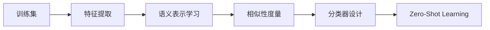

# Zero-Shot Learning原理与代码实例讲解

## 1. 背景介绍

在人工智能领域，机器学习模型的训练通常依赖于大量的标注数据。然而，在现实世界中，对于某些类别，获取充足的训练样本是困难甚至不可能的。Zero-Shot Learning（ZSL）应运而生，它旨在解决如何让模型识别在训练阶段未出现过的类别的问题。ZSL通过转移学习和知识图谱等技术，使得模型能够识别新的类别，极大地拓宽了机器学习的应用范围。

## 2. 核心概念与联系

### 2.1 Zero-Shot Learning定义
Zero-Shot Learning是一种学习策略，它允许模型在没有接触过任何标注样本的情况下，对新类别进行识别。

### 2.2 关键技术
- **知识迁移**：将已有类别的知识迁移到新类别上。
- **语义表示**：使用属性或词嵌入等方式，为类别构建可迁移的语义表示。
- **相似性度量**：计算未见类别与已知类别之间的相似性。

### 2.3 ZSL与传统机器学习的区别
ZSL的核心区别在于它不依赖于目标类别的标注数据，而是依赖于类别之间的语义联系。

## 3. 核心算法原理具体操作步骤

### 3.1 问题建模
在ZSL中，我们有一个训练集 $D_{train} = \{(x_i, y_i)\}$，其中 $y_i \in Y_{seen}$，$Y_{seen}$ 是已见类别集合。我们的目标是构建一个模型，使其能够识别 $Y_{unseen}$ 中的类别，$Y_{unseen}$ 是未见类别集合，且 $Y_{seen} \cap Y_{unseen} = \emptyset$。

### 3.2 算法流程


## 4. 数学模型和公式详细讲解举例说明

### 4.1 语义嵌入空间
假设我们有一个语义嵌入函数 $\phi: Y \rightarrow \mathbb{R}^d$，它将类别映射到一个 $d$ 维的向量空间。对于每个类别 $y$，我们有一个语义表示 $\phi(y)$。

### 4.2 相似性度量
我们定义一个相似性函数 $s: \mathbb{R}^d \times \mathbb{R}^d \rightarrow \mathbb{R}$，它度量两个语义表示之间的相似性。常用的相似性度量包括余弦相似性和欧氏距离。

### 4.3 分类器设计
分类器的目标是找到一个映射 $f: X \rightarrow Y_{unseen}$，对于任意输入 $x$，找到一个最相似的未见类别 $y^* = \arg\max_{y \in Y_{unseen}} s(\phi(y), f(x))$。

## 5. 项目实践：代码实例和详细解释说明

### 5.1 数据预处理
```python
# 假设我们有一个数据集和对应的类别标签
images, labels = load_dataset()
# 对数据进行预处理
processed_images = preprocess_images(images)
```

### 5.2 特征提取
```python
# 使用预训练的CNN模型提取特征
features = extract_features(processed_images)
```

### 5.3 语义表示学习
```python
# 假设我们有一个词嵌入模型来获取语义表示
semantic_representations = get_semantic_embeddings(labels)
```

### 5.4 相似性度量和分类
```python
# 定义相似性度量函数
def cosine_similarity(a, b):
    return np.dot(a, b) / (np.linalg.norm(a) * np.linalg.norm(b))

# 对于每个测试样本，找到最相似的未见类别
for test_feature in test_features:
    similarities = [cosine_similarity(test_feature, sr) for sr in semantic_representations]
    predicted_label = unseen_labels[np.argmax(similarities)]
    print(predicted_label)
```

## 6. 实际应用场景

Zero-Shot Learning在多个领域都有广泛的应用，包括但不限于：
- 图像识别：识别训练集中未出现过的物种或对象。
- 自然语言处理：理解和回答训练数据中未出现过的问题。
- 推荐系统：推荐用户未曾接触过的商品或内容。

## 7. 工具和资源推荐

- **数据集**：AWA2, CUB, ImageNet等。
- **预训练模型**：Word2Vec, GloVe, BERT等。
- **框架和库**：TensorFlow, PyTorch, scikit-learn等。

## 8. 总结：未来发展趋势与挑战

Zero-Shot Learning作为一种新兴的学习范式，其未来的发展趋势包括更加精细化的语义表示、跨模态学习以及更强的泛化能力。同时，ZSL面临的挑战包括如何处理类别间的不平衡、如何提高模型的鲁棒性以及如何减少对辅助信息的依赖。

## 9. 附录：常见问题与解答

- **Q: Zero-Shot Learning是否可以用于所有类型的数据？**
- **A:** ZSL理论上可以应用于任何类型的数据，但其效果受限于语义表示的质量和泛化能力。

- **Q: 如何选择合适的语义表示？**
- **A:** 语义表示的选择取决于具体的应用场景和可用的辅助信息，常用的有属性表示和词嵌入。

- **Q: Zero-Shot Learning和Few-Shot Learning有什么区别？**
- **A:** Few-Shot Learning依赖于少量的标注样本，而Zero-Shot Learning不依赖于任何目标类别的标注样本。

作者：禅与计算机程序设计艺术 / Zen and the Art of Computer Programming