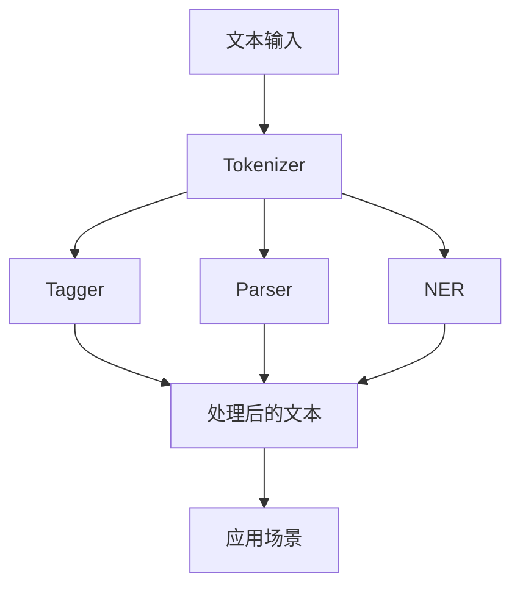

# spaCy 原理与代码实战案例讲解

## 1.背景介绍

在自然语言处理（NLP）领域，spaCy 是一个广受欢迎的开源库。它由 Explosion AI 开发，旨在提供高效、易用且功能强大的 NLP 工具。spaCy 的设计目标是为生产环境中的实际应用提供支持，而不仅仅是学术研究。它的高性能和易用性使其成为许多开发者和数据科学家的首选。

## 2.核心概念与联系

### 2.1 自然语言处理（NLP）

自然语言处理是计算机科学、人工智能和语言学的交叉领域，旨在使计算机能够理解、解释和生成人类语言。NLP 涉及的任务包括但不限于分词、词性标注、命名实体识别、依存解析和情感分析。

### 2.2 spaCy 的核心组件

spaCy 提供了一系列核心组件来处理 NLP 任务：

- **Tokenizer**：将文本分割成单词、标点符号等基本单位。
- **Tagger**：进行词性标注。
- **Parser**：进行依存解析。
- **NER（Named Entity Recognizer）**：进行命名实体识别。
- **TextCategorizer**：进行文本分类。

### 2.3 spaCy 的架构

spaCy 的架构设计非常模块化，每个组件都可以独立使用或与其他组件结合使用。以下是 spaCy 的基本架构图：



## 3.核心算法原理具体操作步骤

### 3.1 Tokenization

Tokenization 是 NLP 的第一步，它将文本分割成单词、标点符号等基本单位。spaCy 的 Tokenizer 使用正则表达式和词典来识别单词边界。

### 3.2 词性标注（POS Tagging）

词性标注是将每个单词标注为特定的词性（如名词、动词等）。spaCy 使用预训练的统计模型来进行词性标注。

### 3.3 依存解析（Dependency Parsing）

依存解析是识别句子中单词之间的语法关系。spaCy 使用基于神经网络的模型来进行依存解析。

### 3.4 命名实体识别（NER）

命名实体识别是识别文本中的命名实体（如人名、地名等）。spaCy 使用预训练的神经网络模型来进行命名实体识别。

### 3.5 文本分类（Text Categorization）

文本分类是将文本分为不同的类别。spaCy 提供了 TextCategorizer 组件，可以使用预训练模型或自定义模型进行文本分类。

## 4.数学模型和公式详细讲解举例说明

### 4.1 词性标注的数学模型

词性标注通常使用隐马尔可夫模型（HMM）或条件随机场（CRF）。假设我们有一个单词序列 $W = w_1, w_2, ..., w_n$ 和对应的词性序列 $T = t_1, t_2, ..., t_n$，HMM 的目标是找到使得 $P(T|W)$ 最大的词性序列。

$$
P(T|W) = \frac{P(W|T)P(T)}{P(W)}
$$

由于 $P(W)$ 是常数，我们只需最大化 $P(W|T)P(T)$。

### 4.2 依存解析的数学模型

依存解析通常使用图模型。给定一个句子 $S$，依存解析的目标是找到一个依存树 $T$，使得 $P(T|S)$ 最大。这个概率可以通过神经网络模型来估计。

### 4.3 命名实体识别的数学模型

命名实体识别通常使用 BiLSTM-CRF 模型。给定一个单词序列 $W$，模型的目标是找到最可能的实体标签序列 $E$。

$$
P(E|W) = \frac{e^{\sum_{i=1}^{n} \psi(e_i, e_{i-1}, w_i)}}{\sum_{E'} e^{\sum_{i=1}^{n} \psi(e_i', e_{i-1}', w_i)}}
$$

其中，$\psi$ 是特征函数，$e_i$ 是第 $i$ 个单词的实体标签。

## 5.项目实践：代码实例和详细解释说明

### 5.1 安装 spaCy

首先，我们需要安装 spaCy 和预训练模型：

```bash
pip install spacy
python -m spacy download en_core_web_sm
```

### 5.2 使用 Tokenizer

```python
import spacy

nlp = spacy.load("en_core_web_sm")
doc = nlp("spaCy is an open-source library for NLP.")
for token in doc:
    print(token.text)
```

### 5.3 词性标注

```python
for token in doc:
    print(token.text, token.pos_)
```

### 5.4 依存解析

```python
for token in doc:
    print(token.text, token.dep_, token.head.text)
```

### 5.5 命名实体识别

```python
for ent in doc.ents:
    print(ent.text, ent.label_)
```

### 5.6 文本分类

```python
textcat = nlp.create_pipe("textcat")
nlp.add_pipe(textcat, last=True)
textcat.add_label("POSITIVE")
textcat.add_label("NEGATIVE")

# 训练模型的代码略
```

## 6.实际应用场景

### 6.1 情感分析

情感分析是识别文本中的情感倾向（如正面、负面）。spaCy 可以通过文本分类组件来实现情感分析。

### 6.2 聊天机器人

聊天机器人需要理解用户输入并生成合适的回复。spaCy 的依存解析和命名实体识别可以帮助聊天机器人理解用户意图。

### 6.3 信息抽取

信息抽取是从文本中提取结构化信息（如人名、地名、日期等）。spaCy 的命名实体识别可以用于信息抽取。

## 7.工具和资源推荐

### 7.1 官方文档

spaCy 的官方文档非常详细，涵盖了所有核心组件和使用示例。访问 [spaCy 官方文档](https://spacy.io/usage) 获取更多信息。

### 7.2 预训练模型

spaCy 提供了多种预训练模型，适用于不同的语言和任务。访问 [spaCy 模型库](https://spacy.io/models) 下载适合的模型。

### 7.3 社区资源

spaCy 拥有活跃的社区，许多开发者分享了他们的经验和代码。访问 [spaCy 讨论区](https://github.com/explosion/spaCy/discussions) 参与讨论。

## 8.总结：未来发展趋势与挑战

### 8.1 未来发展趋势

随着 NLP 技术的不断进步，spaCy 也在不断更新和改进。未来，spaCy 可能会引入更多的预训练模型、更高效的算法和更友好的用户界面。

### 8.2 挑战

尽管 spaCy 功能强大，但在处理某些复杂的 NLP 任务时仍然存在挑战。例如，处理多语言文本、理解上下文语义等。开发者需要结合其他工具和技术来解决这些问题。

## 9.附录：常见问题与解答

### 9.1 如何提高 spaCy 的性能？

可以通过使用更高效的预训练模型、优化代码和硬件加速（如 GPU）来提高 spaCy 的性能。

### 9.2 spaCy 是否支持多语言？

是的，spaCy 支持多种语言。可以下载适合的预训练模型来处理不同语言的文本。

### 9.3 如何自定义 spaCy 的组件？

可以通过继承 spaCy 的组件类并重写相关方法来自定义组件。详细信息请参考官方文档。

---

作者：禅与计算机程序设计艺术 / Zen and the Art of Computer Programming