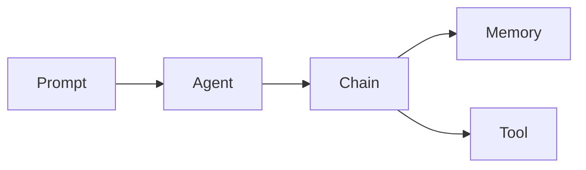

# 【LangChain编程：从入门到实践】变化与重构

## 1. 背景介绍
### 1.1 大语言模型的崛起
#### 1.1.1 GPT系列模型的发展历程
#### 1.1.2 ChatGPT的问世与影响力
#### 1.1.3 大语言模型的潜在应用领域

### 1.2 传统软件开发模式的局限性  
#### 1.2.1 开发效率瓶颈
#### 1.2.2 知识获取与应用的鸿沟
#### 1.2.3 人机交互体验有待提升

### 1.3 LangChain的诞生
#### 1.3.1 LangChain的起源与发展
#### 1.3.2 LangChain的核心理念
#### 1.3.3 LangChain生态系统概览

## 2. 核心概念与联系
### 2.1 Prompt工程
#### 2.1.1 Prompt的定义与作用
#### 2.1.2 Prompt设计的基本原则
#### 2.1.3 Few-shot Learning与In-context Learning

### 2.2 Agents：智能代理
#### 2.2.1 Agent的概念与特点
#### 2.2.2 不同类型的Agents及其应用场景
#### 2.2.3 Agent的决策与执行流程

### 2.3 Chains：任务链
#### 2.3.1 Chain的定义与组成
#### 2.3.2 常见的Chain类型及其功能
#### 2.3.3 自定义Chain的构建方法

### 2.4 Memory：记忆机制
#### 2.4.1 Memory的作用与分类
#### 2.4.2 ConversationBufferMemory的工作原理
#### 2.4.3 EntityMemory与Knowledge Base的结合

### 2.5 Tools：外部工具集成
#### 2.5.1 Tool的概念与接口规范
#### 2.5.2 常用的Tool类别及其功能
#### 2.5.3 自定义Tool的开发与集成



## 3. 核心算法原理具体操作步骤
### 3.1 Prompt的构建与优化
#### 3.1.1 Prompt模板的设计
#### 3.1.2 动态Prompt的生成
#### 3.1.3 Prompt优化技巧

### 3.2 Agent的选择与配置
#### 3.2.1 Zero-shot ReAct框架
#### 3.2.2 Self-ask-with-search策略
#### 3.2.3 MRKL（Modular Reasoning, Knowledge and Language）方法

### 3.3 Chain的组合与执行
#### 3.3.1 Sequential Chain的构建
#### 3.3.2 Router Chain的使用
#### 3.3.3 Map Reduce Chain的并行处理

### 3.4 Memory的管理与更新
#### 3.4.1 ConversationBufferMemory的初始化与调用
#### 3.4.2 EntityMemory的知识存储与检索
#### 3.4.3 Knowledge Base的构建与查询

### 3.5 Tool的调用与结果解析
#### 3.5.1 搜索引擎API的集成
#### 3.5.2 数据库查询Tool的实现
#### 3.5.3 第三方服务API的封装

## 4. 数学模型和公式详细讲解举例说明
### 4.1 语言模型的数学基础
#### 4.1.1 Transformer架构与自注意力机制
$Attention(Q,K,V) = softmax(\frac{QK^T}{\sqrt{d_k}})V$
#### 4.1.2 Masked Language Model的训练目标
$L(\theta) = -\frac{1}{N}\sum_{i=1}^{N}\log P(w_i|w_{<i},w_{>i};\theta)$
#### 4.1.3 Perplexity评估指标的计算
$PPL = \exp(-\frac{1}{N}\sum_{i=1}^{N}\log P(w_i|w_{<i}))$

### 4.2 Prompt工程的数学原理
#### 4.2.1 Few-shot Learning的数学表示
$P(y|x,D_{train}) = \frac{P(x,y,D_{train})}{P(x,D_{train})}$
#### 4.2.2 In-context Learning的优化目标
$\arg\max_{\theta}\prod_{i=1}^{N}P(y_i|x_i,D_{train};\theta)$
#### 4.2.3 Prompt模板的数学建模
$P(y|x,t) = \frac{P(y,t|x)}{P(t|x)}$

### 4.3 Agent决策的数学模型
#### 4.3.1 Markov Decision Process（MDP）
$V^{\pi}(s) = \mathbb{E}[\sum_{t=0}^{\infty}\gamma^tR(s_t,a_t)|s_0=s,\pi]$
#### 4.3.2 Q-Learning算法的更新规则
$Q(s,a) \leftarrow Q(s,a) + \alpha[r+\gamma\max_{a'}Q(s',a')-Q(s,a)]$
#### 4.3.3 Policy Gradient的优化目标
$J(\theta) = \mathbb{E}_{\tau\sim p_{\theta}(\tau)}[\sum_{t=0}^{T}R(s_t,a_t)]$

## 5. 项目实践：代码实例和详细解释说明
### 5.1 使用LangChain构建问答系统
#### 5.1.1 加载预训练语言模型
```python
from langchain.llms import OpenAI
llm = OpenAI(temperature=0.9)
```
#### 5.1.2 定义Prompt模板
```python
from langchain.prompts import PromptTemplate
prompt = PromptTemplate(
    input_variables=["question"],
    template="Q: {question}\nA:",
)
```
#### 5.1.3 创建问答Chain
```python
from langchain.chains import LLMChain
qa_chain = LLMChain(llm=llm, prompt=prompt)
```
#### 5.1.4 执行问答
```python
question = "What is the capital of France?"
answer = qa_chain.run(question)
print(answer)
```

### 5.2 使用Agent完成复杂任务
#### 5.2.1 定义Tools
```python
from langchain.agents import load_tools
tools = load_tools(["serpapi", "llm-math"], llm=llm)
```
#### 5.2.2 初始化Agent
```python
from langchain.agents import initialize_agent
agent = initialize_agent(tools, llm, agent="zero-shot-react-description", verbose=True)
```
#### 5.2.3 执行任务
```python
result = agent.run("What is the population of Berlin? Divide that number by 2.")
print(result)
```

### 5.3 使用Memory实现多轮对话
#### 5.3.1 创建ConversationBufferMemory
```python
from langchain.memory import ConversationBufferMemory
memory = ConversationBufferMemory()
```
#### 5.3.2 构建对话Chain
```python
from langchain.chains import ConversationChain
conversation = ConversationChain(llm=llm, memory=memory)
```
#### 5.3.3 进行多轮对话
```python
while True:
    user_input = input("User: ")
    if user_input.lower() == 'exit':
        break
    response = conversation.predict(input=user_input)
    print(f"Assistant: {response}")
```

## 6. 实际应用场景
### 6.1 智能客服系统
#### 6.1.1 构建知识库与检索系统
#### 6.1.2 设计多轮对话流程
#### 6.1.3 集成客服工单管理工具

### 6.2 个性化推荐引擎
#### 6.2.1 用户画像与兴趣建模
#### 6.2.2 基于知识图谱的推荐算法
#### 6.2.3 实时反馈与推荐优化

### 6.3 智能代码助手
#### 6.3.1 代码理解与生成
#### 6.3.2 错误诊断与修复建议
#### 6.3.3 代码优化与重构方案

### 6.4 金融风险分析
#### 6.4.1 金融知识库的构建
#### 6.4.2 风险因素识别与量化
#### 6.4.3 投资决策支持与风险预警

## 7. 工具和资源推荐
### 7.1 LangChain官方文档与示例
#### 7.1.1 安装与快速入门指南
#### 7.1.2 API参考与用法详解
#### 7.1.3 最佳实践与应用案例

### 7.2 相关开源项目
#### 7.2.1 GPT-Index：语义索引与检索工具
#### 7.2.2 FAISS：高效的向量搜索库
#### 7.2.3 Hugging Face Transformers：预训练模型集合

### 7.3 数据集与语料库
#### 7.3.1 Common Crawl：网页数据集
#### 7.3.2 Wikipedia：结构化百科知识
#### 7.3.3 专业领域语料库（如医疗、法律等）

### 7.4 开发工具与框架
#### 7.4.1 Visual Studio Code：集成开发环境
#### 7.4.2 Jupyter Notebook：交互式编程笔记本
#### 7.4.3 FastAPI：高性能Web框架

## 8. 总结：未来发展趋势与挑战
### 8.1 大语言模型的持续进化
#### 8.1.1 模型规模与性能的提升
#### 8.1.2 多模态融合与交互能力增强
#### 8.1.3 领域适应与知识融合

### 8.2 Prompt工程的自动化与优化
#### 8.2.1 自动Prompt生成与筛选
#### 8.2.2 动态Prompt适应与更新
#### 8.2.3 Prompt共享与迁移学习

### 8.3 Agent的自主学习与决策
#### 8.3.1 元学习与自适应能力
#### 8.3.2 多Agent协作与分布式决策
#### 8.3.3 安全性与可解释性问题

### 8.4 LangChain生态的扩展与集成
#### 8.4.1 与主流开发框架的无缝对接
#### 8.4.2 支持更多数据源与外部服务
#### 8.4.3 可视化开发与部署工具链

## 9. 附录：常见问题与解答
### 9.1 如何选择合适的语言模型？
### 9.2 Prompt设计有哪些技巧和注意事项？
### 9.3 Agent的决策过程是如何工作的？
### 9.4 如何有效管理和更新Conversation Memory？
### 9.5 集成外部工具时需要注意哪些问题？
### 9.6 如何平衡模型性能和计算资源消耗？
### 9.7 LangChain能否应用于移动端和边缘设备？
### 9.8 如何保证生成内容的安全性和合规性？
### 9.9 LangChain社区有哪些交流渠道和学习资源？

作者：禅与计算机程序设计艺术 / Zen and the Art of Computer Programming