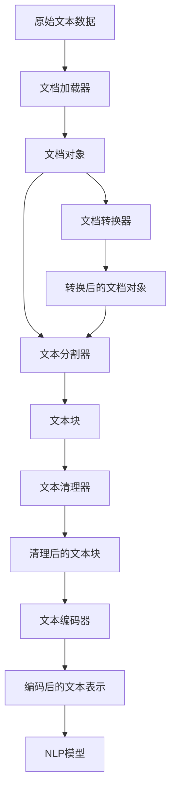

# 【LangChain编程：从入门到实践】文档预处理过程

## 1.背景介绍

在自然语言处理(NLP)和机器学习领域,数据预处理是一个至关重要的步骤。原始数据通常存在噪声、不一致性和冗余等问题,需要进行适当的清理和转换,以便为后续的模型训练和推理提供高质量的输入数据。LangChain是一个强大的Python库,旨在简化与大型语言模型(LLM)的交互,并提供了一系列工具和模块来处理各种类型的数据。其中,文档预处理模块就是专门用于处理文本数据的重要组成部分。

### 1.1 文档预处理的重要性

文档预处理对于NLP任务的成功至关重要,原因如下:

1. **提高数据质量**: 通过清理和规范化文本数据,可以减少噪声和不一致性,从而提高模型的准确性和性能。

2. **简化数据表示**: 将原始文本转换为适当的数值表示形式(如词向量或嵌入),使得机器学习模型能够更好地理解和处理文本数据。

3. **减少计算复杂度**: 通过删除无关词汇、停用词和标点符号等,可以减少数据的维度和大小,从而降低计算复杂度,提高模型训练和推理的效率。

4. **增强模型泛化能力**: 适当的文本清理和规范化有助于模型捕获数据中的关键模式和特征,从而提高模型的泛化能力,更好地应对新的、未见过的数据。

### 1.2 LangChain文档预处理模块概述

LangChain的文档预处理模块提供了一系列功能强大的工具和技术,用于处理各种类型的文本数据。主要包括以下几个方面:

1. **文本分割器(Text Splitters)**: 将长文本分割成多个较小的文本块,以便于模型处理和理解。

2. **文本清理器(Text Cleaners)**: 删除无关词汇、停用词、标点符号等,规范化文本格式。

3. **文本编码器(Text Encoders)**: 将文本转换为适当的数值表示形式,如词向量或嵌入。

4. **文档加载器(Document Loaders)**: 从各种来源(如本地文件、网页、PDF等)加载文本数据。

5. **文档转换器(Document Transformers)**: 对文档进行进一步的转换和处理,如合并、拆分或过滤等操作。

通过合理利用这些工具和技术,我们可以有效地处理各种类型的文本数据,为后续的NLP任务奠定坚实的基础。

## 2.核心概念与联系

在LangChain的文档预处理模块中,有几个核心概念和对象需要理解,它们之间存在紧密的联系和依赖关系。

### 2.1 文本分割器(Text Splitters)

文本分割器的作用是将长文本分割成多个较小的文本块,以便于模型处理和理解。LangChain提供了几种常用的文本分割策略:

1. **字符分割器(CharacterTextSplitter)**: 根据字符数量将文本分割成固定长度的块。
2. **令牌分割器(TokenTextSplitter)**: 根据令牌(通常是单词或子词)数量将文本分割成固定长度的块。
3. **句子分割器(SentenceTextSplitter)**: 根据句子边界将文本分割成句子块。
4. **递归分割器(RecursiveCharacterTextSplitter)**: 使用递归方式,根据字符数量和语义连贯性将文本分割成块。

这些分割器可以根据具体需求和数据特征进行选择和配置,以获得最佳的分割效果。

### 2.2 文本清理器(Text Cleaners)

文本清理器的作用是删除无关词汇、停用词、标点符号等,并规范化文本格式。LangChain提供了一些常用的文本清理功能:

1. **删除HTML标签**: 移除文本中的HTML标签。
2. **删除无关词汇**: 移除指定的无关词汇列表。
3. **删除停用词**: 移除常见的停用词(如"the"、"a"等)。
4. **规范化大小写**: 将文本转换为全部小写或大写。
5. **删除标点符号**: 移除文本中的标点符号。
6. **删除换行符**: 移除文本中的换行符。

这些清理功能可以根据需要进行组合和自定义,以获得更干净、更规范的文本数据。

### 2.3 文本编码器(Text Encoders)

文本编码器的作用是将文本转换为适当的数值表示形式,如词向量或嵌入,以便于机器学习模型进行处理和理解。LangChain支持多种流行的编码器:

1. **TF-IDF编码器**: 基于TF-IDF(Term Frequency-Inverse Document Frequency)算法,将文本表示为稀疏向量。
2. **Word2Vec编码器**: 使用Word2Vec模型将单词映射到低维密集向量空间。
3. **BERT编码器**: 使用BERT(Bidirectional Encoder Representations from Transformers)模型将文本编码为上下文敏感的向量表示。
4. **GPT编码器**: 使用GPT(Generative Pre-trained Transformer)模型将文本编码为上下文敏感的向量表示。

选择合适的编码器对于后续的NLP任务至关重要,因为它决定了模型输入的表示形式和质量。

### 2.4 文档加载器(Document Loaders)

文档加载器的作用是从各种来源(如本地文件、网页、PDF等)加载文本数据。LangChain提供了多种文档加载器,支持加载不同格式的文件:

1. **文本文件加载器(TextFileLoader)**: 加载本地文本文件(.txt)。
2. **PDF文件加载器(PDFFileLoader)**: 加载PDF文件。
3. **网页加载器(WebLoader)**: 加载网页内容。
4. **CSV文件加载器(CSVLoader)**: 加载CSV文件。
5. **PowerPoint文件加载器(PowerPointLoader)**: 加载PowerPoint文件。

这些加载器可以根据需要进行组合和自定义,以支持更多的文件格式和数据源。

### 2.5 文档转换器(Document Transformers)

文档转换器的作用是对已加载的文档进行进一步的转换和处理,如合并、拆分或过滤等操作。LangChain提供了一些常用的文档转换器:

1. **文档合并器(DocumentMerger)**: 将多个文档合并为一个文档。
2. **文档拆分器(DocumentSplitter)**: 将一个文档拆分为多个文档。
3. **文档过滤器(DocumentFilter)**: 根据指定条件过滤文档。

这些转换器可以与文档加载器和其他预处理工具结合使用,以实现更加灵活和强大的文本处理功能。

### 2.6 核心概念关系图

以下是LangChain文档预处理模块中核心概念之间的关系图:

从上图可以看出,原始文本数据首先通过文档加载器加载为文档对象,然后经过文本分割器、文本清理器、文本编码器等一系列预处理步骤,最终得到适合NLP模型输入的文本表示。在这个过程中,文档转换器可以对文档对象进行进一步的转换和处理,以满足不同的需求。

通过理解这些核心概念及其关系,我们可以更好地利用LangChain的文档预处理模块,为NLP任务提供高质量的数据输入。

## 3.核心算法原理具体操作步骤

在LangChain的文档预处理模块中,有几个核心算法和操作步骤值得深入探讨。

### 3.1 文本分割算法

文本分割是文档预处理的关键步骤之一,它将长文本分割成多个较小的文本块,以便于模型处理和理解。LangChain提供了几种常用的文本分割算法,每种算法都有其特点和适用场景。

#### 3.1.1 字符分割算法

字符分割算法(CharacterTextSplitter)根据字符数量将文本分割成固定长度的块。具体操作步骤如下:

1. 设置分割块的最大字符数量阈值`chunk_size`。
2. 遍历文本,每次将`chunk_size`个字符作为一个块进行分割。
3. 如果遇到句子边界,则优先在句子边界处进行分割,以保持语义连贯性。
4. 将分割后的文本块存储在列表中。

该算法的优点是简单高效,但缺点是可能会在中间断开句子或语义单元,影响语义连贯性。

#### 3.1.2 令牌分割算法

令牌分割算法(TokenTextSplitter)根据令牌(通常是单词或子词)数量将文本分割成固定长度的块。具体操作步骤如下:

1. 设置分割块的最大令牌数量阈值`chunk_size`。
2. 使用tokenizer(如BERT或GPT的tokenizer)将文本分词为令牌序列。
3. 遍历令牌序列,每次将`chunk_size`个令牌作为一个块进行分割。
4. 如果遇到句子边界,则优先在句子边界处进行分割,以保持语义连贯性。
5. 将分割后的文本块存储在列表中。

该算法相比字符分割算法更加语义化,但需要依赖tokenizer,计算开销也更大。

#### 3.1.3 句子分割算法

句子分割算法(SentenceTextSplitter)根据句子边界将文本分割成句子块。具体操作步骤如下:

1. 使用句子边界检测器(如NLTK或spaCy的句子分割器)将文本分割成句子列表。
2. 遍历句子列表,将每个句子作为一个文本块。
3. 将分割后的文本块存储在列表中。

该算法能够很好地保持语义连贯性,但对于长句子可能会导致文本块过长,无法有效利用模型的上下文窗口。

#### 3.1.4 递归分割算法

递归分割算法(RecursiveCharacterTextSplitter)使用递归方式,根据字符数量和语义连贯性将文本分割成块。具体操作步骤如下:

1. 设置分割块的最大字符数量阈值`chunk_size`和最大块数量阈值`chunk_overlap`。
2. 将文本作为初始块进行处理。
3. 如果当前块的字符数量超过`chunk_size`,则尝试在句子边界处将其分割成两个子块。
4. 如果无法在句子边界处分割,则在`chunk_overlap`范围内找到最佳分割点,将当前块分割成两个子块。
5. 对两个子块递归执行步骤3和4,直到所有块的字符数量都小于`chunk_size`。
6. 将分割后的文本块存储在列表中。

该算法综合了字符分割和句子分割的优点,能够在保持语义连贯性的同时控制块的大小,但计算开销较大。

### 3.2 文本清理算法

文本清理是另一个重要的预处理步骤,它删除无关词汇、停用词、标点符号等,并规范化文本格式。LangChain提供了多种文本清理功能,可以根据需要进行组合和自定义。

#### 3.2.1 删除HTML标签

删除HTML标签的操作步骤如下:

1. 导入正则表达式模块`re`。
2. 定义HTML标签的正则表达式模式`pattern = r'<[^>]+>'`。
3. 使用`re.sub(pattern, '', text)`将文本中的HTML标签替换为空字符串。

#### 3.2.2 删除无关词汇

删除无关词汇的操作步骤如下:

1. 定义一个无关词汇列表`stopwords`。
2. 将文本分词为词汇列表`tokens`。
3. 使用列表推导式`cleaned_tokens = [token for token in tokens if token not in stopwords]`过滤掉无关词汇。
4. 将清理后的词汇列表重新连接为字符串。

#### 3.2.3 删除停用词

删