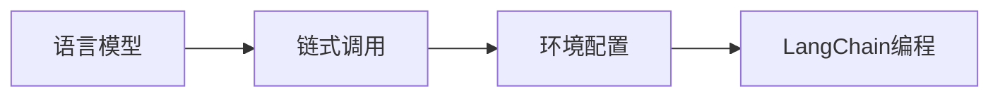

## 1. 背景介绍

在当今快速发展的人工智能领域，LangChain作为一种新兴的编程范式，正逐渐受到开发者的关注。LangChain是一种以语言模型为核心，通过链式调用实现复杂功能的编程方法。它的出现，为处理自然语言处理（NLP）任务提供了一种新的、更加高效和灵活的方式。然而，要充分发挥LangChain的潜力，首先需要掌握其管理工具的安装与配置。本文将详细介绍LangChain编程环境的搭建过程，帮助读者从入门到实践。

## 2. 核心概念与联系

LangChain编程涉及到多个核心概念，包括语言模型、链式调用、环境配置等。语言模型是LangChain编程的基石，它能够理解和生成自然语言。链式调用则是一种编程技巧，允许我们将多个操作连接起来，形成一个处理流程。环境配置是确保LangChain能够顺利运行的前提，涉及到软件安装、依赖管理等。



## 3. 核心算法原理具体操作步骤

LangChain的核心算法原理基于语言模型，如Transformer和BERT等。这些模型通过大量的文本数据学习，能够捕捉语言的深层次结构。在LangChain中，我们通常会执行以下操作步骤：

1. 选择合适的语言模型。
2. 配置模型参数，如层数、隐藏单元数等。
3. 训练模型，使其适应特定的应用场景。
4. 将训练好的模型部署到LangChain环境中。
5. 通过链式调用实现复杂的语言处理任务。

## 4. 数学模型和公式详细讲解举例说明

以Transformer模型为例，其核心数学公式可以表示为：

$$
\text{Attention}(Q, K, V) = \text{softmax}\left(\frac{QK^T}{\sqrt{d_k}}\right)V
$$

其中，$Q$、$K$、$V$分别代表查询（Query）、键（Key）和值（Value），$d_k$是键的维度。这个公式描述了如何计算注意力权重，并用它来加权值。

举例来说，假设我们有一个简单的句子：“The cat sat on the mat。”我们可以将这个句子输入到Transformer模型中，模型会计算每个词与其他词之间的注意力权重，从而捕捉词与词之间的关系。

## 5. 项目实践：代码实例和详细解释说明

为了实践LangChain编程，我们可以使用Python语言进行示例。以下是一个简单的代码片段，展示了如何使用LangChain进行编程：

```python
from langchain.chains import Chain
from langchain.processors import *

# 初始化一个LangChain对象
chain = Chain()

# 添加处理器
chain.add_processor(OpenAIProcessor(api_key='your-api-key'))
chain.add_processor(TranslationProcessor(target_language='zh'))

# 使用链式调用处理文本
result = chain.process("Hello, world!")

print(result)
```

在这个例子中，我们首先导入了`langchain`库中的`Chain`类和一些处理器。然后，我们创建了一个`Chain`对象，并添加了两个处理器：`OpenAIProcessor`用于调用OpenAI的语言模型，`TranslationProcessor`用于将文本翻译成中文。最后，我们通过`process`方法处理了一段文本，并打印了结果。

## 6. 实际应用场景

LangChain编程可以应用于多种场景，包括但不限于：

- 自动文本摘要
- 智能聊天机器人
- 语言翻译
- 情感分析
- 文本分类

在每个应用场景中，LangChain都能通过其灵活的链式调用机制，结合不同的语言模型和处理器，实现复杂的语言处理任务。

## 7. 工具和资源推荐

为了更好地进行LangChain编程，以下是一些推荐的工具和资源：

- OpenAI API：提供强大的语言模型服务。
- Hugging Face Transformers：一个广泛使用的NLP库，包含多种预训练模型。
- LangChain GitHub仓库：包含LangChain的源代码和文档。
- Google Colab：一个免费的在线Jupyter笔记本环境，适合进行机器学习实验。

## 8. 总结：未来发展趋势与挑战

LangChain编程作为一种新兴的编程范式，其未来的发展趋势将更加注重模型的可解释性、安全性和效率。同时，随着模型的不断进化，如何有效地管理和维护这些模型，也将成为一个挑战。开发者需要不断学习最新的技术，以适应这些变化。

## 9. 附录：常见问题与解答

Q1: LangChain编程适合初学者吗？
A1: 是的，只要有一定的编程基础和对NLP的基本了解，初学者也可以通过学习和实践来掌握LangChain编程。

Q2: 如何选择合适的语言模型？
A2: 选择语言模型时，需要考虑模型的性能、训练数据的质量和适用场景。通常，可以从一些流行的预训练模型开始尝试。

Q3: LangChain编程的性能瓶颈在哪里？
A3: 性能瓶颈通常与模型的复杂度和处理器的计算能力有关。优化模型结构和使用更强大的计算资源可以缓解这一问题。

作者：禅与计算机程序设计艺术 / Zen and the Art of Computer Programming